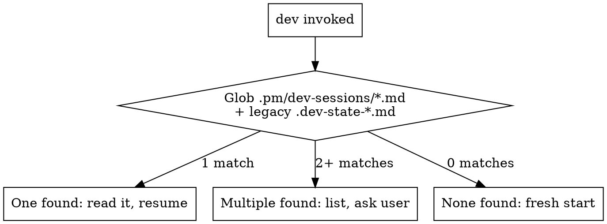

# PM-049: Unify dev state files into .pm/ directory

**Date:** 2026-03-21
**Parent issue:** PM-044 (Merge PM and Dev plugins)

## Problem

Dev state files (`.dev-state-{slug}.md`, `.dev-epic-state-{parent-slug}.md`) live at the project root, cluttering it and diverging from the PM plugin's `.pm/` directory convention. After the merge, all lifecycle state — groom sessions, PM sessions, and dev implementation state — should live under `.pm/`.

## Path Mappings

| Old path | New path |
|----------|----------|
| `.dev-state-{slug}.md` | `.pm/dev-sessions/{slug}.md` |
| `.dev-epic-state-{parent-slug}.md` | `.pm/dev-sessions/epic-{parent-slug}.md` |
| Glob `.dev-state-*.md` | Glob `.pm/dev-sessions/*.md` (exclude `epic-*`) |
| Glob `.dev-epic-state-*.md` | Glob `.pm/dev-sessions/epic-*.md` |

## Graceful Migration Logic

Every state file read (resume detection, mode detection, context reads) must check both locations:

```
1. Check new path: .pm/dev-sessions/{slug}.md
2. If not found, check legacy path: .dev-state-{slug}.md
3. If legacy found → read from legacy (existing session)
4. New writes ALWAYS go to .pm/dev-sessions/
5. No one-time migration script — legacy sessions complete at old path, new sessions use new path
```

For glob-based reads (resume detection), combine results:
```
Glob .pm/dev-sessions/*.md  +  Glob .dev-state-*.md  +  Glob .dev-epic-state-*.md
Deduplicate by slug (new path takes precedence over legacy)
```

## Conflict Avoidance with PM-050

PM-050 modifies these specific sections (must NOT be touched by PM-049):
- **dev/SKILL.md:** Lines 246-255 (source detection → replaced with groom session reading), lines 172-173 (stage routing table rows), new Stage 2.5 insertion before line 236, lines 382-384 (PM + Competitive Strategist guard)
- **dev-epic/SKILL.md:** Lines 66-73 (Stage 1.2 source detection → replaced with groom session reading)
- **writing-plans/SKILL.md:** New "Upstream Context" section added

PM-049 changes are to **state file path references** scattered throughout these files, which are in different sections from PM-050's groom detection changes. The only overlap area is the state logging format in PM-050's new groom detection sections — PM-050 writes `.dev-state-{slug}.md` in its new Stage 2.5 and updated Stage 1.2. These paths will need updating by PM-049, but since PM-050 runs first, PM-049 edits the PM-050-written text (not the original text). This is safe because PM-049 is a mechanical find-and-replace of path strings, not a logic change.

---

## Changes

### Task 1: Create .pm/dev-sessions/ directory convention

No directory creation needed (`.pm/` is created on demand by PM skills). Add a note to dev/SKILL.md State File Naming section that the directory is created on first write if it doesn't exist.

**File:** `dev/SKILL.md` (post-colocation: `skills/dev/SKILL.md`)

**Section:** "State File Naming" (lines 67-75)

**Old text (lines 67-75):**
```markdown
## State File Naming

State files are namespaced by feature slug to allow concurrent sessions:

- **`/dev`:** `.dev-state-{slug}.md` — where `{slug}` is derived from the branch name by stripping the type prefix (`feat/`, `fix/`, `chore/`). Example: branch `feat/add-auth` → `.dev-state-add-auth.md`. For XS tasks (no branch), use the topic slug from intake.
- **`/dev-epic`:** `.dev-epic-state-{parent-slug}.md`
- **`.gitignore`:** Use patterns: `.dev-state-*.md`, `.dev-epic-state-*.md`

When referencing the state file in subsequent sections, `.dev-state.md` means `.dev-state-{slug}.md` — the slug is determined at intake.
```

**New text:**
```markdown
## State File Naming

State files live under `.pm/dev-sessions/`, namespaced by feature slug to allow concurrent sessions:

- **`/dev`:** `.pm/dev-sessions/{slug}.md` — where `{slug}` is derived from the branch name by stripping the type prefix (`feat/`, `fix/`, `chore/`). Example: branch `feat/add-auth` → `.pm/dev-sessions/add-auth.md`. For XS tasks (no branch), use the topic slug from intake.
- **`/dev-epic`:** `.pm/dev-sessions/epic-{parent-slug}.md`
- **`.gitignore`:** `.pm/` covers all state files (no separate pattern needed).

When referencing the state file in subsequent sections, `.dev-state.md` means `.pm/dev-sessions/{slug}.md` — the slug is determined at intake.

**Directory creation:** If `.pm/dev-sessions/` does not exist, create it (`mkdir -p .pm/dev-sessions`) before the first write.

**Legacy migration:** On resume detection or any state file read, also check the legacy path (`.dev-state-{slug}.md` at repo root). If found at legacy path but not at new path, read from legacy. New writes always go to `.pm/dev-sessions/`.
```

### Task 2: Update dev/SKILL.md — all state path references

**File:** `dev/SKILL.md` (post-colocation: `skills/dev/SKILL.md`)

Mechanical replacement across the entire file. Every occurrence of `.dev-state-{slug}.md` or `.dev-state.md` or `.dev-state-*.md` becomes the corresponding `.pm/dev-sessions/` path. This covers ~30 references across these sections:

| Line(s) | Section | Old reference | New reference |
|---------|---------|---------------|---------------|
| 45 | Context Discovery | `.dev-state.md` | `.pm/dev-sessions/{slug}.md` |
| 65 | Context Discovery | `.dev-state.md` | `.pm/dev-sessions/{slug}.md` |
| 82-90 | Resume Detection (dot graph) | `Glob .dev-state-*.md` | `Glob .pm/dev-sessions/*.md` (+ legacy fallback) |
| 108 | Workspace | `.dev-state.md` | `.pm/dev-sessions/{slug}.md` |
| 119 | Stage transitions | `.dev-state.md` | `.pm/dev-sessions/{slug}.md` |
| 164 | Intake — Create state file | `.dev-state-{slug}.md` | `.pm/dev-sessions/{slug}.md` |
| 200 | Workspace — Record final paths | `.dev-state.md` | `.pm/dev-sessions/{slug}.md` |
| 252 | Source detection log | `.dev-state.md` | `.pm/dev-sessions/{slug}.md` |
| 458 | Spec review passed | `.dev-state.md` | `.pm/dev-sessions/{slug}.md` |
| 604 | Plan review passed | `.dev-state.md` | `.pm/dev-sessions/{slug}.md` |
| 664 | Implementation log | `.dev-state.md` | `.pm/dev-sessions/{slug}.md` |
| 748 | Simplify skip | `.dev-state.md` | `.pm/dev-sessions/{slug}.md` |
| 770 | Design critique skip | `.dev-state.md` | `.pm/dev-sessions/{slug}.md` |
| 802 | QA skip | `.dev-state.md` | `.pm/dev-sessions/{slug}.md` |
| 811 | QA dev server skip | `.dev-state.md` | `.pm/dev-sessions/{slug}.md` |
| 842-853 | QA result table | `.dev-state.md` | `.pm/dev-sessions/{slug}.md` |
| 857 | QA update | `.dev-state.md` | `.pm/dev-sessions/{slug}.md` |
| 977-999 | Review gate enforcement (dot graph) | `.dev-state.md` | `.pm/dev-sessions/{slug}.md` |
| 1006-1021 | Review agents — conditional skip | `.dev-state.md` | `.pm/dev-sessions/{slug}.md` |
| 1099 | State File section header | `.dev-state-{slug}.md` | `.pm/dev-sessions/{slug}.md` |

**Also update the resume detection dot graph** (lines 82-90) to include legacy fallback:


**Note on PM-050 overlap:** PM-050 adds a Stage 2.5 and rewrites lines 246-255. Those new sections reference `.dev-state-{slug}.md` for logging. PM-049 updates those PM-050-written references to `.pm/dev-sessions/{slug}.md` as part of this mechanical replacement. No logic conflict — just path string updates.

### Task 3: Update dev-epic/SKILL.md — all state path references

**File:** `dev-epic/SKILL.md` (post-colocation: `skills/dev-epic/SKILL.md`)

| Line(s) | Section | Old reference | New reference |
|---------|---------|---------------|---------------|
| 34 | State File Naming | `.dev-epic-state-{parent-slug}.md` | `.pm/dev-sessions/epic-{parent-slug}.md` |
| 36 | State File Naming | `.dev-epic-state.md` means `.dev-epic-state-{parent-slug}.md` | `.pm/dev-sessions/epic-{parent-slug}.md` |
| 42 | Resume Detection | `Glob .dev-epic-state-*.md` in repo root | `Glob .pm/dev-sessions/epic-*.md` + legacy `.dev-epic-state-*.md` |
| 97 | Write initial state | `Write .dev-epic-state.md` | `Write .pm/dev-sessions/epic-{parent-slug}.md` (mkdir -p first) |
| 161 | Context discovery | `.dev-epic-state.md` | `.pm/dev-sessions/epic-{parent-slug}.md` |
| 255 | Size reclassification | `.dev-epic-state.md` | `.pm/dev-sessions/epic-{parent-slug}.md` |
| 259 | Plan agent return | `.dev-epic-state.md` | `.pm/dev-sessions/epic-{parent-slug}.md` |

**Note on PM-050 overlap:** PM-050 rewrites lines 66-73 (Stage 1.2 source detection). The new text references state file for logging groomed status. PM-049 updates those paths mechanically.

### Task 4: Update dev-epic cleanup loop (lines 507-516)

**File:** `dev-epic/SKILL.md` (post-colocation: `skills/dev-epic/SKILL.md`)

**Old text (lines 507-516):**
```markdown
**5.3.2 Remove state files:**
```bash
# Remove this epic's state file
rm -f .dev-epic-state-{parent-slug}.md

# Also scan for any OTHER stale state files from completed epics/sessions
for f in .dev-epic-state-*.md .dev-state-*.md; do
  [ -f "$f" ] && echo "WARN: Found stale state file: $f" && rm -f "$f"
done
```
```

**New text:**
```markdown
**5.3.2 Remove state files:**
```bash
# Remove this epic's state file
rm -f .pm/dev-sessions/epic-{parent-slug}.md

# Also scan for any OTHER stale state files from completed epics/sessions
for f in .pm/dev-sessions/*.md; do
  [ -f "$f" ] && echo "WARN: Found stale state file: $f" && rm -f "$f"
done

# Clean up any legacy state files at repo root
for f in .dev-epic-state-*.md .dev-state-*.md; do
  [ -f "$f" ] && echo "WARN: Removing legacy state file: $f" && rm -f "$f"
done
```
```

### Task 5: Update dev-epic/references/state-template.md

**File:** `dev-epic/references/state-template.md` (post-colocation: `skills/dev-epic/references/state-template.md`)

**Old text (line 1):**
```markdown
# State File Template (.dev-epic-state-{parent-slug}.md)
```

**New text:**
```markdown
# State File Template (.pm/dev-sessions/epic-{parent-slug}.md)
```

Also update line 3:
**Old:** `Single source of truth for session state. Updated at every stage transition. Deleted after retro. Namespaced by parent slug to allow concurrent epics.`
**New:** `Single source of truth for session state. Lives under .pm/dev-sessions/. Updated at every stage transition. Deleted after retro. Namespaced by parent slug to allow concurrent epics.`

### Task 6: Update dev/context-discovery.md

**File:** `dev/context-discovery.md` (post-colocation: `skills/dev/context-discovery.md`)

**Old text (line 101):**
```markdown
Store the full context block in the session state file (`.dev-state-{slug}.md`) under `## Project Context`:
```

**New text:**
```markdown
Store the full context block in the session state file (`.pm/dev-sessions/{slug}.md`) under `## Project Context`:
```

### Task 7: Update dev/references/custom-instructions.md

**File:** `dev/references/custom-instructions.md` (post-colocation: `skills/dev/references/custom-instructions.md`)

**Old text (line 53):**
```markdown
Store active overrides in the session state file (`.dev-state-{slug}.md`) under `## Custom Instructions`:
```

**New text:**
```markdown
Store active overrides in the session state file (`.pm/dev-sessions/{slug}.md`) under `## Custom Instructions`:
```

### Task 8: Update review/SKILL.md, pr/SKILL.md, merge-watch/SKILL.md

All three files have an identical **state file convention** block at the top. Update each.

**review/SKILL.md (line 8):**

Old:
```
**State file convention:** The session state file is `.dev-state-{slug}.md` where `{slug}` comes from the current branch name (e.g., `feat/add-auth` → `.dev-state-add-auth.md`). To find it: derive slug from `git branch --show-current`, stripping the `feat/`/`fix/`/`chore/` prefix. If no state file matches, proceed without upstream gate data (all agents run). References to `.dev-state.md` below mean `.dev-state-{slug}.md`.
```

New:
```
**State file convention:** The session state file is `.pm/dev-sessions/{slug}.md` where `{slug}` comes from the current branch name (e.g., `feat/add-auth` → `.pm/dev-sessions/add-auth.md`). To find it: derive slug from `git branch --show-current`, stripping the `feat/`/`fix/`/`chore/` prefix. If no state file matches, check legacy path `.dev-state-{slug}.md`. If neither exists, proceed without upstream gate data (all agents run). References to `.dev-state.md` below mean `.pm/dev-sessions/{slug}.md`.
```

Also update all interior references in review/SKILL.md:
- Line 40: `.dev-state.md` → `.pm/dev-sessions/{slug}.md`
- Line 71: `.dev-state.md` → `.pm/dev-sessions/{slug}.md`
- Line 131: `.dev-state.md` contains `Spec review: passed` → same but new path
- Line 172: `.dev-state.md` contains `Design critique:` → same but new path
- Line 302: `.dev-state.md` → `.pm/dev-sessions/{slug}.md`

**pr/SKILL.md (line 8):**

Old:
```
**State file convention:** The session state file is `.dev-state-{slug}.md` where `{slug}` comes from the current branch name (e.g., `feat/add-auth` → `.dev-state-add-auth.md`). To find it: derive slug from `git branch --show-current`, stripping the `feat/`/`fix/`/`chore/` prefix. References to `.dev-state.md` below mean `.dev-state-{slug}.md`.
```

New:
```
**State file convention:** The session state file is `.pm/dev-sessions/{slug}.md` where `{slug}` comes from the current branch name (e.g., `feat/add-auth` → `.pm/dev-sessions/add-auth.md`). To find it: derive slug from `git branch --show-current`, stripping the `feat/`/`fix/`/`chore/` prefix. If not found, check legacy path `.dev-state-{slug}.md`. References to `.dev-state.md` below mean `.pm/dev-sessions/{slug}.md`.
```

Also update interior references:
- Line 221: `Update .dev-state.md` → `Update .pm/dev-sessions/{slug}.md`
- Line 239: `If .dev-state.md does not exist` → `If .pm/dev-sessions/{slug}.md does not exist`

**merge-watch/SKILL.md (line 8):**

Old:
```
**State file convention:** The session state file is `.dev-state-{slug}.md` where `{slug}` comes from the current branch name (e.g., `feat/add-auth` → `.dev-state-add-auth.md`). To find it: derive slug from `git branch --show-current`, stripping the `feat/`/`fix/`/`chore/` prefix. If no branch (detached HEAD), glob `.dev-state-*.md` and use the most recently modified. References to `.dev-state.md` below mean `.dev-state-{slug}.md`.
```

New:
```
**State file convention:** The session state file is `.pm/dev-sessions/{slug}.md` where `{slug}` comes from the current branch name (e.g., `feat/add-auth` → `.pm/dev-sessions/add-auth.md`). To find it: derive slug from `git branch --show-current`, stripping the `feat/`/`fix/`/`chore/` prefix. If no branch (detached HEAD), glob `.pm/dev-sessions/*.md` (+ legacy `.dev-state-*.md`) and use the most recently modified. References to `.dev-state.md` below mean `.pm/dev-sessions/{slug}.md`.
```

Also update interior references:
- Line 88: `Update .dev-state.md` → `Update .pm/dev-sessions/{slug}.md`
- Line 236: `.dev-state.md must include` → `.pm/dev-sessions/{slug}.md must include`
- Line 263: `Update .dev-state.md` → `Update .pm/dev-sessions/{slug}.md`

### Task 9: Update design-critique/SKILL.md

**File:** `design-critique/SKILL.md` (post-colocation: `skills/design-critique/SKILL.md`)

**Mode detection (lines 34-35):**

Old:
```
  .dev-state-*.md exists in repo root  ->  "embedded"
```

New:
```
  .pm/dev-sessions/*.md exists (or legacy .dev-state-*.md at repo root)  ->  "embedded"
```

**Embedded mode flow (lines 61, 67):**

Line 61 old: `page context from .dev-state-*.md.`
Line 61 new: `page context from .pm/dev-sessions/{slug}.md.`

Line 67 old: `Read page context from .dev-state-*.md in the repo root.`
Line 67 new: `Read page context from .pm/dev-sessions/{slug}.md (or legacy .dev-state-*.md).`

### Task 10: Update .gitignore

**File:** `.gitignore` (repo root)

**Old lines 5-9:**
```
.pm/
pm/*.local.md
.worktrees/
.dev-epic-state-*.md
.dev-state-*.md
```

**New lines 5-9:**
```
.pm/
pm/*.local.md
.worktrees/
dev/instructions.local.md
```

**Rationale:** `.pm/` already covers `.pm/dev-sessions/`, so the separate `.dev-state-*` and `.dev-epic-state-*` patterns are no longer needed. The legacy patterns are removed because legacy files should no longer be created. Add `dev/instructions.local.md` per AC #4.

**Wait — AC #7 says state files in `.pm/dev-sessions/` are version-controlled.** This conflicts with `.pm/` being in `.gitignore`. Resolution: split `.pm/` gitignore to be more granular:

**Revised new .gitignore:**
```
.pm/sessions/
.pm/groom-sessions/
.pm/evidence/
.pm/config.json
pm/*.local.md
.worktrees/
dev/instructions.local.md
```

This keeps `.pm/dev-sessions/` **tracked** (version-controlled per AC #7) while still ignoring PM runtime state. The `.pm/dev-sessions/` directory is intentionally NOT in .gitignore so dev state is committed alongside code.

**Important:** This requires auditing what other `.pm/` contents should remain gitignored. Current `.pm/` structure includes: `sessions/`, `groom-sessions/`, `evidence/`, `config.json`, `dev-sessions/` (new). Per AC #7, `dev-sessions/` is tracked. Per AGENTS.md line 44, `.pm/` is gitignored for "private runtime state like groom sessions and config." So the split is:
- **Gitignored:** `.pm/sessions/`, `.pm/groom-sessions/`, `.pm/evidence/`, `.pm/config.json`
- **Tracked:** `.pm/dev-sessions/`

### Task 11: Update PM-050's state logging references

PM-050 (Change 3, Change 5, Change 6, State Logging Format section) writes new text that references `.dev-state-{slug}.md` and `.dev-epic-state-{slug}.md` for logging. Since PM-050 runs before PM-049, these will exist in the files when PM-049 executes. PM-049 must update these PM-050-written references too.

Specific PM-050-written text to update:
- **dev/SKILL.md Stage 2.5** (inserted by PM-050): `Log in state file:` references → update path
- **dev/SKILL.md Source detection** (rewritten by PM-050): `Log the decision in .dev-state-{slug}.md` → `.pm/dev-sessions/{slug}.md`
- **dev-epic/SKILL.md Stage 1.2** (rewritten by PM-050): state file logging → update path
- **State Logging Format** section in PM-050 plan references `.dev-state-{slug}.md` and `.dev-epic-state-{parent-slug}.md` → these are in the plan doc, not runtime files, so no change needed

This is handled as part of Tasks 2 and 3 (mechanical find-replace), but called out explicitly to ensure implementers don't skip PM-050-written sections.

---

## Verification Checklist

| AC | How to verify |
|----|--------------|
| 1. Dev state writes to `.pm/dev-sessions/{slug}.md` | grep for `.pm/dev-sessions/{slug}.md` in dev/SKILL.md — present in state file naming, intake, and all logging |
| 2. Epic state writes to `.pm/dev-sessions/epic-{slug}.md` | grep for `.pm/dev-sessions/epic-` in dev-epic/SKILL.md — present in state file naming, init, cleanup |
| 3. All 9 files updated | grep for `.dev-state-` and `.dev-epic-state-` across all 9 files — 0 matches (except legacy migration fallback text) |
| 4. .gitignore updated | `.pm/dev-sessions/` NOT in .gitignore; `dev/instructions.local.md` IS in .gitignore |
| 5. Graceful migration | dev/SKILL.md and dev-epic/SKILL.md resume detection checks both new and legacy paths |
| 6. .pm/config.json unchanged | config.json path not modified in any file |
| 7. State files version-controlled | `.pm/dev-sessions/` not covered by any .gitignore pattern |

---

## Summary of File Changes

| # | File (post-colocation path) | Change |
|---|---|---|
| 1 | `skills/dev/SKILL.md` | Rewrite State File Naming section with new paths + migration logic |
| 2 | `skills/dev/SKILL.md` | Replace ~30 `.dev-state` path references throughout |
| 3 | `skills/dev-epic/SKILL.md` | Replace ~10 `.dev-epic-state` path references throughout |
| 4 | `skills/dev-epic/SKILL.md` | Rewrite cleanup loop to target `.pm/dev-sessions/` + legacy cleanup |
| 5 | `skills/dev-epic/references/state-template.md` | Update header and description |
| 6 | `skills/dev/context-discovery.md` | Update state file storage path |
| 7 | `skills/dev/references/custom-instructions.md` | Update state file storage path |
| 8 | `skills/review/SKILL.md`, `skills/pr/SKILL.md`, `skills/merge-watch/SKILL.md` | Update state file convention + interior references |
| 9 | `skills/design-critique/SKILL.md` | Update mode detection + embedded flow paths |
| 10 | `.gitignore` | Split `.pm/` into granular ignores; remove `.dev-state-*` patterns; add `dev/instructions.local.md` |
| 11 | `skills/dev/SKILL.md`, `skills/dev-epic/SKILL.md` | Update PM-050-written groom detection paths (part of Tasks 2-3) |

## Task Count: 10 tasks
