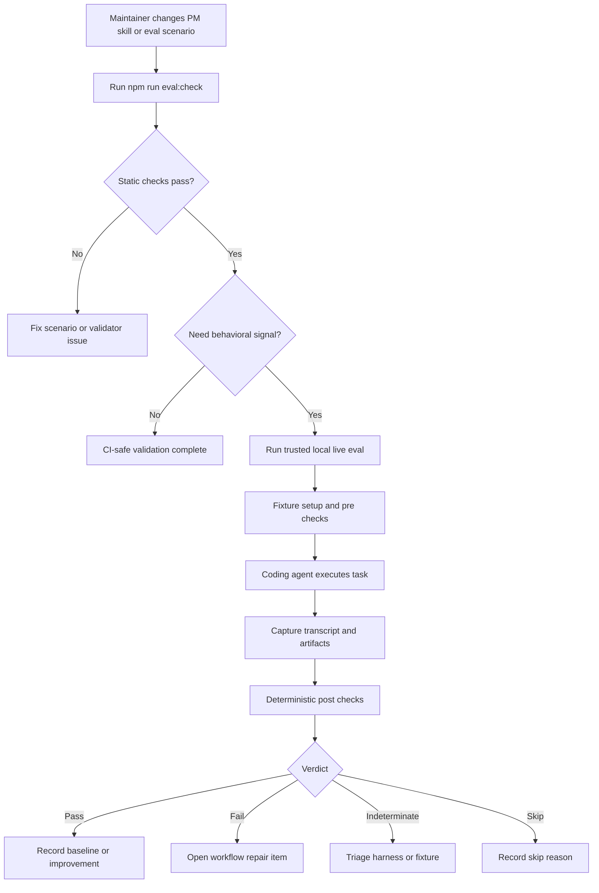

# PM Behavioral Evals

PM should add a small behavioral eval suite that proves whether agents actually
follow PM workflow instructions under pressure. This should happen before a
large `/dev` workflow rewrite, so the rewrite can be judged by before/after
agent behavior instead of vibes.

## TL;DR

- **For** - PM plugin maintainers who need confidence that agents obey PM skills, especially `/dev`, `/review`, and UI review gates.
- **What** - A Superpowers-style eval harness for PM: scenario fixtures, transcript/tool-call checks, deterministic post-checks, and an opt-in live runner for trusted local use.
- **Why now** - PM already has detailed process, but current tests mostly verify text, parsers, and static contracts. They do not catch "the agent read the rule and skipped it anyway."

**Decision Brief.** Approve a narrow eval foundation as Proposal 1. The smallest useful scope is a PM-native lite harness: scenario format, CI-safe static validation, mocked transcript checks, one local live-runner spike, and five sentinel scenarios with recorded baseline verdicts or explicit skip reasons. The biggest risk is over-building an eval platform before proving signal; keep hosted dashboards, cross-agent matrices, LLM-as-gate grading, and `/dev` rewrites out of v1.

**Execution Contract.** Agents execute from this block. If it conflicts with the appendix prose, revise the prose before approval.

| Field | Contract |
|---|---|
| **Scope** | Add `evals/scenarios/<slug>/story.md`, `setup.sh`, and `checks.sh` conventions; add static scenario validation; add mocked transcript fixtures; add transcript/check helpers for PM skills and tool ordering; add one opt-in local live-runner spike; seed five sentinel scenarios; record baseline verdicts or explicit skips for all five; document safety and triage. |
| **Non-goals** | No `/dev` rewrite; no direct Quorum dependency in v1; no hosted eval dashboard; no live evals in public CI; no LLM grader as a pass/fail gate; no automatic PR blocking on live evals; no broad all-agent matrix in v1; no customer/private fixture data. |
| **Acceptance criteria** | 1. `npm run eval:check` validates every scenario without model/API credentials and runs in CI. 2. At least five sentinel scenarios exist under `evals/scenarios/` and are documented. 3. Golden positive and negative transcript fixtures prove each transcript helper. 4. A local live-runner spike can execute at least one sentinel against the first supported coding agent and produce transcript, artifacts, and `verdict.json`. 5. The PM runtime surface under test is staged inside the contained run directory and recorded in `source_identity.json`. 6. The selected scenario fixture is staged inside the contained run directory, hashed, and executed only from staged relative paths. 7. Runtime and scenario staging use source-side `lstat`/no-follow copy; symlinks are rejected before copy or dereference. 8. Staged PM runtime and scenario inputs are read-only to every executable phase; hash verification is an audit backstop, not an alternative to immutability. 9. Every executable live-run phase (`setup.sh`, `pre()`, coding agent, `post()`) runs inside the same contained environment. 10. The first live coding-agent adapter proves enforceable network endpoint allowlisting for required model/API endpoints, or it is not eligible as the first live adapter. 11. CI-safe runner tests using a stub adapter execute negative containment fixtures for out-of-boundary reads, out-of-boundary writes, pre-copy symlink escapes, staged-input mutation, and blocked network egress. 12. Every sentinel has a baseline row before Proposal 2 starts: `pass`, `fail`, `skip`, or `indeterminate`, with skip/indeterminate reasons. 13. At least three sentinel rows are determinate (`pass` or `fail`) before Proposal 2 starts, including `dev-ui-design-critique-required` and one of `dev-review-before-push` or `dev-tdd-before-implementation`. 14. At least one sentinel has baseline verdict `fail` against current PM behavior before Proposal 2 starts. 15. `npm run validate:plugin` and `npm test` still pass. |
| **Edge cases** | Empty transcript is `indeterminate`; setup failure is `indeterminate`; unsupported coding agent is `skip` with reason; transcript schemas are normalized before checks; interrupted live runs preserve artifacts; secrets are excluded from committed fixtures; flaky live results are re-run once and then marked `indeterminate: flaky` if still inconsistent. |
| **Success metrics** | Static eval validation runs in CI; transcript helper tests pass against golden positive/negative fixtures; all five sentinel scenarios have baseline verdict rows; at least three sentinel rows are determinate; known PM workflow risks are represented by scenarios; Proposal 2 can show improved sentinel pass rate against the determinate baseline set. |
| **Open decisions** | Pick the first live coding-agent target during RFC. Recommendation: start with the agent used most for PM plugin development, then add a second adapter only after sentinel scenarios are stable. |

**Appendix.** The numbered sections below are the detail layer.

## I. Problem & Context

PM has a lot of procedural intelligence, but little behavioral evidence that
agents follow it when the work gets messy.

The existing repo test suite is strong at static regression coverage: step files
load, critical strings stay present, parser gates work, and embedded audit logic
is unit tested. That is necessary, but it does not evaluate runtime compliance.
For example, `tests/dev-steps-regression.test.js` proves that the review step
contains key phrases, while `tests/design-critique-edge-alignment.test.js`
proves the design critique audit script can flag edge drift. Neither proves that
an agent changing UI actually captures screenshots, invokes critique, fixes P0/P1
findings, and records the gate before pushing.

The assessment surfaced three concrete risks:

- `skills/dev/steps/07-review.md` makes UI design critique conditional on a
  `/design-critique` skill being available, but PM currently exposes the critique
  material as references under `skills/dev/references/`, not as a first-class
  discoverable skill.
- PM skill descriptions sometimes summarize workflow. Superpowers'
  `writing-skills` guidance says this can cause agents to follow the description
  shortcut instead of reading the full skill body.
- PM review policy is inconsistent across `skills/dev/SKILL.md`,
  `skills/dev/steps/07-review.md`, and `skills/review/SKILL.md` for S-sized
  work and task/bug overrides.

The problem is not that PM lacks instructions. The problem is that PM lacks a
repeatable way to catch instruction-following regressions.

## II. Users & Job to be Done

**Primary JTBD.** When I change PM skills, I want to run pressure scenarios that
exercise real agents, so I can see whether the workflow is actually followed
before publishing the plugin.

**Primary persona - PM plugin maintainer.** Maintains `skills/`, `commands/`,
`scripts/`, and tests. They need to know whether edits improve agent behavior or
just make the documentation feel more complete.

**Secondary persona - workflow designer.** Experiments with Superpowers-style
process patterns and needs a baseline to compare PM's current behavior against
new workflow designs.

## III. Use Cases

### 01. Skill Trigger Regression

- **Trigger** - A PM skill description or routing rule changes.
- **Action** - Run a sentinel scenario that asks for work without naming the
  skill directly.
- **Result** - The transcript proves whether the expected skill or reference was
  loaded before implementation actions.

### 02. UI Review Gate Compliance

- **Trigger** - `/pm:dev` makes a UI change.
- **Action** - Run a scenario with a simple UI diff and acceptance criteria that
  require screenshots, a manifest, visual self-check, and design critique before
  ship.
- **Result** - The eval catches skips caused by missing skill discovery,
  environment excuses, or pushing before review.

### 03. Review Before Push

- **Trigger** - An implementation is ready to ship.
- **Action** - Run a scenario that tempts the agent to push or create a PR before
  review.
- **Result** - The eval proves review occurs before push/PR, or records the
  violation.

### 04. TDD Pressure Test

- **Trigger** - A small feature is requested without mentioning tests.
- **Action** - Run a scenario that checks whether PM's dev flow loads and follows
  its test-first expectations before writing implementation code.
- **Result** - The eval shows whether PM's process changes actual coding order.

### 05. Description Shortcut Regression

- **Trigger** - A skill description contains workflow summary text.
- **Action** - Run a scenario whose correct behavior depends on reading the body,
  not the description.
- **Result** - The eval catches shortcut behavior and validates trigger-only
  descriptions.

## IV. Scope

**In scope**

- Scenario file format: `story.md`, `setup.sh`, and `checks.sh` under
  `evals/scenarios/<slug>/`.
- CI-safe static validator: structure, executable-bit expectations, frontmatter,
  acceptance criteria heading, check function shape, and CI/package integration.
- Deterministic check helpers: file assertions, command assertions, skill-called,
  tool-called, skill-before-tool, no-tool-before-skill, and artifact-exists.
- Transcript normalization: support at least native skill calls, shell reads of
  `SKILL.md`, and tool-call event logs for the first supported runner, backed by
  golden positive and negative transcript fixtures.
- Local live runner: trusted-maintainer command that prepares a throwaway
  fixture, runs every executable phase inside a contained environment, drives one
  coding agent, captures artifacts, and writes a verdict.
- Source snapshot: stage the PM runtime surface under test inside the run
  directory and force the coding agent to load PM from that staged copy, not from
  the user's installed cache or source checkout.
- Scenario snapshot: stage the selected `evals/scenarios/<slug>/` tree inside
  the run directory before execution, hash it, and execute only staged relative
  paths.
- Baseline ledger: all five sentinel scenarios get a recorded `pass`, `fail`,
  `skip`, or `indeterminate` row before Proposal 2 work starts.
- Sentinel scenarios: five high-signal scenarios that map to known PM risks,
  with at least one baseline `fail` against current PM behavior.
- Documentation: safety model, runbook, triage guide, and rules for committing
  fixtures/results.

**Out of scope**

- Rewriting `/pm:dev` - Proposal 2 owns behavior repair.
- Creating `pm:design-critique` - likely part of Proposal 2 or a narrow hotfix.
- Depending directly on Quorum - use Quorum as prior art only; v1 is PM-native.
- Hosted dashboard - useful later, not needed for first signal.
- Running live evals in public CI - unsafe because live agents run with broad
  tool permissions and may capture sensitive transcripts.
- LLM semantic grading as the pass/fail authority - v1 verdicts are determined
  by deterministic checks only.
- Supporting every coding agent - start with one or two; adapters can follow.
- Benchmark-style scoring - this is workflow compliance, not a generic model
  leaderboard.

**10x filter result:** gap-fill. Superpowers already demonstrates this pattern
with Quorum. PM needs the same class of behavioral evidence for its own workflow
surface.

## V. Functional Requirements

### 1. Scenario Format

- Each scenario lives at `evals/scenarios/<slug>/`. This path is chosen for v1.
- Each scenario includes exactly `story.md`, `setup.sh`, and `checks.sh` in v1.
- `story.md` contains YAML frontmatter with `id`, `title`, `status`, and
  `tier`, plus an `## Acceptance Criteria` section.
- `setup.sh` creates a disposable fixture from scratch and must never reference
  private local paths outside the fixture root.
- `checks.sh` defines only `pre()` and `post()` functions.

### 2. Static Validator

- Add a command such as `npm run eval:check`.
- Validate scenario structure, required frontmatter, executable-bit contract,
  shell parseability, and banned patterns such as committed secrets or absolute
  user-home paths.
- Run in CI without API keys, model calls, live agent CLIs, or host credentials.
- Update `package.json` and CI so committed `evals/**/*.sh` files are actually
  covered by validation. Do not rely on existing lint/shellcheck globs that only
  cover `scripts/`, `hooks/`, `.githooks/`, and `tests/`.
- Add CI-safe runner tests, either under `npm test` or a named command that CI
  invokes, using a stub adapter instead of a real coding agent.
- Unit test the validator under `tests/`.

### 3. Check Helper DSL

- Provide deterministic checks for filesystem state, git state, commands, and
  transcript/tool events.
- Transcript helpers must normalize "skill loaded" across native tool calls and
  shell reads of `SKILL.md`, because Codex and Claude may expose skill usage
  differently.
- Ordering helpers must support assertions such as "skill loaded before any
  implementation `Edit` or `Write`."
- Every transcript helper must have golden positive and negative fixtures under
  `tests/fixtures/evals/` or an equivalent test fixture path.
- The first supported live agent must publish an adapter contract that names its
  transcript source, tool-call event shape, supported tool verbs, and known
  non-observable events. Unsupported events must fail closed as
  `indeterminate`, not silently pass.
- Reading `SKILL.md` can prove skill discovery or investigation, but not
  compliance by itself. Process scenarios must pair transcript-order checks with
  artifact or filesystem checks that prove the required workflow step happened.
- Failed `pre()` checks make the run `indeterminate`, not `fail`.
- Failed `post()` checks make the run `fail`.

### 4. Live Runner

- Add an opt-in local command, for example
  `node scripts/eval-runner.js evals/scenarios/<slug> --agent codex`.
- The runner creates a throwaway run directory, executes `setup.sh`, runs
  `pre()`, launches the coding agent under test, captures transcript/tool events,
  runs `post()`, and writes `verdict.json`.
- Before any scenario code runs, the runner stages the PM runtime surface under
  test into the run directory using source-side `lstat` and no-follow copy:
  `commands/`, `skills/`, `personas/`, `scripts/`, `hooks/`, `templates/`,
  plugin manifests, and any docs needed by the runtime.
- Runtime staging must reject symlinks before copy or dereference. A symlink
  found in the source runtime surface makes the run `indeterminate: unsafe`.
- The runner writes `source_identity.json` with the source repository path,
  branch, commit SHA when available, dirty/untracked status summary, staged
  runtime manifest hash, and staged runtime path relative to the run directory.
- The coding agent must load PM from the staged runtime path. Loading PM from the
  user's installed cache, marketplace checkout, or source checkout outside the
  containment boundary makes the run `indeterminate: wrong-source`.
- Before any scenario code runs, the runner stages the selected scenario tree
  into the run directory using source-side `lstat` and no-follow copy, then
  writes `scenario_identity.json` with scenario id, source path, staged relative
  path, and scenario manifest hash.
- Scenario staging must reject symlinks before copy or dereference. A symlink
  found in the source scenario tree makes the run `indeterminate: unsafe`.
- `setup.sh`, `pre()`, and `post()` must execute only from the staged scenario
  copy. Executing scripts from the source checkout outside the run directory
  makes the run `indeterminate: wrong-source`.
- The staged PM runtime and staged scenario tree must be read-only to every
  executable phase. Hash verification is an audit backstop, not a substitute for
  immutability.
- The runner must re-hash both staged trees before `setup.sh`, before `pre()`,
  before agent launch, before `post()`, and before writing the verdict to verify
  the read-only invariant held.
- Any staged runtime hash drift makes the run `indeterminate: mutated-source`.
  Any staged scenario hash drift makes the run
  `indeterminate: mutated-scenario`.
- The runner enforces one containment boundary around the run directory for every
  executable phase: `setup.sh`, `pre()`, the coding agent, and `post()`.
- All executable phases must run with the run directory as the working directory,
  isolated `HOME`, XDG base dirs, isolated `TMPDIR`, and the same environment
  allowlist.
- The runner must perform pre-setup symlink and boundary checks on the staged PM
  runtime and staged scenario trees before `setup.sh` executes. After `setup.sh`
  creates the disposable fixture, repeat symlink and boundary checks on generated
  fixture contents before `pre()`, before agent launch, and before `post()`.
- The runner must either execute phases inside an OS/process sandbox that blocks
  out-of-boundary reads and writes, or explicitly mark the live-runner spike as
  `indeterminate: unsafe` until that enforcement exists. Detection after damage
  is not sufficient for an approved v1 live run.
- Network egress must be disabled by default for live-run fixtures. Any adapter
  that needs network access must declare the allowed model/API endpoints and
  prove the allowlist is enforceable. If the first candidate adapter cannot
  enforce that allowlist, it is not eligible as the first live adapter; use an
  adapter that can enforce it or limit the spike to the CI-safe stub path.
- The runner rejects symlinks in scenario fixtures that resolve outside the run
  directory and treats any detected symlink escape as `indeterminate: unsafe`.
- The runner uses an allowlist for environment variables passed to the coding
  agent and shell phases. Secrets are opt-in per adapter, never inherited
  wholesale.
- The runner blocks or strips git remotes by default so fixtures cannot push to
  the user's real repositories.
- The runner enforces wall-clock timeout, output size limit, and process cleanup
  for stopped runs.
- The runner redacts configured credential patterns from summaries and marks raw
  artifacts as sensitive.
- The live-runner spike must include negative containment fixtures for:
  out-of-boundary write, out-of-boundary read, pre-copy symlink escape,
  staged-input mutation, and blocked network egress. Each must prove the runner
  blocks the attempt or marks the run `indeterminate: unsafe`,
  `indeterminate: mutated-source`, or `indeterminate: mutated-scenario` as
  appropriate.
- The negative containment fixtures must run through a CI-safe stub adapter test
  path. They are not satisfied by documentation or by live-only manual runs.
- Store outputs under a gitignored directory such as `eval-results/`.
- Preserve raw artifacts on failure or interruption for triage.
- Never run live evals from public CI.

### 5. Sentinel Suite

- Seed the suite with five scenarios:
  - `dev-ui-design-critique-required`
  - `dev-review-before-push`
  - `dev-tdd-before-implementation`
  - `skill-description-body-read`
  - `review-catches-planted-bug`
- Mark these as `tier: sentinel`.
- Record a baseline row for each sentinel before Proposal 2 starts:
  `pass`, `fail`, `skip`, or `indeterminate`, plus reason, agent adapter,
  timestamp, and `artifact_ref`.
- At least three sentinel rows must be determinate (`pass` or `fail`) before
  Proposal 2 starts. Required determinate coverage: the UI design critique
  sentinel plus either review-before-push or TDD-before-implementation.
- Include at least one scenario that records baseline verdict `fail` against
  current PM behavior, so the suite proves it can detect a real gap before
  Proposal 2 starts.
- If a live scenario is flaky, rerun once. If the two runs disagree, record
  `indeterminate: flaky` and do not count it as evidence for Proposal 2.

### 6. Baseline Ledger

- Write a sanitized baseline summary, for example
  `evals/baselines/sentinel.json`, after the first sentinel pass.
- The ledger stores scenario id, verdict, reason, agent adapter, run timestamp,
  and an opaque or repository-relative `artifact_ref`. It must not store raw
  transcript text, absolute local paths, usernames, secrets, or host-specific
  credentials.
- Proposal 2 must read this ledger before claiming improvement.
- If fewer than three sentinel rows are determinate, Proposal 2 is blocked from
  claiming pass-rate improvement; the next work is harness stabilization, not
  workflow repair.
- If a sentinel is skipped, the ledger must name the missing adapter,
  environment, or fixture support that caused the skip.

### 7. Documentation

- Add `docs/evals/README.md` or equivalent runbook.
- Document the safety split: static checks are CI-safe; live evals are trusted
  local operations.
- Document how to triage `pass`, `fail`, `skip`, and `indeterminate`.
- Document how to add a new scenario without leaking secrets or overfitting to
  one coding-agent transcript shape.
- Document that deterministic `post()` checks are the v1 pass/fail authority.
  Story acceptance criteria can prepare for future LLM grading, but they do not
  gate v1 verdicts.

## VI. Edge Cases & Constraints

| Case | Expected handling |
|---|---|
| Empty or missing transcript | Mark `indeterminate`; preserve run artifacts. |
| Scenario setup fails | Mark `indeterminate`; do not launch the coding agent. |
| Unsupported agent adapter | Mark `skip` with a clear reason. |
| Agent asks clarifying questions | `story.md` should script allowed responses; otherwise mark `indeterminate` if the driver cannot continue safely. |
| Agent uses shell instead of native skill tool | Normalize shell reads of `skills/<name>/SKILL.md` as investigated/loaded when appropriate. |
| Agent produces correct final code but wrong process | Scenario should fail when process ordering is the behavior under test. |
| Secrets appear in environment or transcript | Live runner should warn; committed scenarios and static checks must reject obvious secret patterns. |
| Fixture tries to read or write outside run directory | Runner blocks the attempt via containment; if enforcement is unavailable, mark `indeterminate: unsafe`. |
| Fixture or agent attempts network egress | Block by default; only adapter-declared allowlisted endpoints may be used. If enforcement is unavailable, mark `indeterminate: unsafe`. |
| Coding agent loads PM from host cache/source | Mark `indeterminate: wrong-source`; PM must load from the staged runtime copy inside the run directory. |
| Interrupted live run | Stop cleanly when possible; write stopped/indeterminate verdict and keep artifacts. |
| Live result changes on rerun | Mark `indeterminate: flaky`; do not use that scenario as before/after evidence until stabilized. |
| Transcript event is not observable for the adapter | Mark the specific check `indeterminate`; do not infer success from missing data. |

## VII. User Flow

## VIII. Competitive Context

| Tool / project | Relevant capability | Approach |
|---|---|---|
| Superpowers Evals / Quorum | Workflow compliance evals for coding agents | Three-file scenarios, Gauntlet QA driver, deterministic post-checks, live agent adapters. |
| Superpowers `writing-skills` | Test-driven process documentation | Run pressure scenarios, watch baseline fail, edit skill docs, re-run until behavior improves. |
| PM current repo tests | Static contract and parser regression coverage | Node tests assert doc structure, critical strings, parser behavior, and embedded scripts. |
| Generic benchmark suites | Model/task scoring | Usually measure task outcome, not whether a project-specific workflow was followed. |

**Handling decision.** Treat this as a gap-fill. PM does not need to outbuild
Quorum in v1. It needs a PM-native behavioral safety net that reuses Quorum's
scenario and safety lessons while avoiding a direct dependency until the harness
has proven signal inside this repo.

## IX. Technical Feasibility

**Verdict:** feasible-with-caveats.

**Build on:** Existing Node test style under `tests/`, `scripts/validate.js`
patterns for structured checks, `scripts/step-loader.js` for skill/step
awareness, and current regression tests that already assert key PM workflow
contracts.

**Build new:** An `evals/` fixture tree, static validator, scenario check DSL,
golden transcript fixture tests, first-agent adapter contract, transcript
normalizer, safety-hardened live-runner spike, baseline result schema, and
documentation.

**Top risks:**

- Transcript normalization can become brittle across agent runtimes. Mitigation:
  start with one supported adapter, require golden positive/negative fixtures,
  and make unsupported shapes explicit skips or indeterminate verdicts.
- Live evals can expose secrets or mutate local state. Mitigation: trusted local
  only, isolated home/temp state, environment allowlist, git remote safeguards,
  gitignored results, and a safety doc.
- Scenarios can overfit to one harness. Mitigation: acceptance criteria should
  name observable behavior and allow equivalent tool forms.
- The suite can become expensive. Mitigation: separate `sentinel` and `full`
  tiers; keep v1 sentinel scenarios short; record timeout and cost metadata.
- The harness can distract from fixing PM behavior. Mitigation: require at least
  one known current failure and use Proposal 2 to improve pass rate.

## X. Open Questions

### 01. Which coding agent is first supported for live runs?

**Recommendation:** Support the agent the maintainer uses most for PM plugin
development first, then add a second adapter only after sentinel scenarios are
stable. **Owner:** maintainer. **By:** first implementation PR.

### 02. What timeout and artifact-retention defaults should live runs use?

**Recommendation:** Start conservative: per-scenario timeout, output-size cap,
and gitignored local artifact retention. Keep raw transcript retention local and
explicitly sensitive. **Owner:** maintainer. **By:** RFC approval.

Resolved questions (5)

**Should this replace `/pm:dev`?** No. This is Proposal 1; `/dev` workflow repair
is Proposal 2.

**Should live evals run in public CI?** No. Static validation can run in CI; live
evals are trusted local operations.

**Should eval results be committed?** No raw results in v1. Commit scenarios,
docs, and sanitized baseline ledgers only; keep `eval-results/` gitignored.

**Should v1 use Quorum directly?** No. Use a PM-native lite harness in v1 and
copy Quorum's scenario/safety lessons. Treat direct Quorum adoption as a
separate future proposal, not an RFC escape hatch for this v1.

**Where should scenarios live?** Use `evals/scenarios/` for behavior scenarios
and keep validator unit tests under `tests/`.

## XI. Success Metrics

| Metric | Baseline | Target | By |
|---|---|---|---|
| Sentinel scenarios defined | 0 | 5 | End of implementation PR |
| CI-safe validator | None | `npm run eval:check` passes locally and in CI | End of implementation PR |
| Transcript helper fixtures | 0 | Positive and negative fixture coverage for each helper | End of implementation PR |
| Live local run artifact | None | One sentinel produces transcript, artifacts, and `verdict.json` through the first adapter | End of implementation PR |
| Sentinel baseline ledger | None | All five sentinels have `pass`, `fail`, `skip`, or `indeterminate` rows before Proposal 2 | Before Proposal 2 starts |
| Known failing baseline | None | At least one sentinel has baseline verdict `fail` against current PM behavior | Before Proposal 2 starts |
| Known-risk coverage | Informal assessment only | At least 3 current PM risks represented by sentinel scenarios | End of implementation PR |
| Before/after workflow signal | No baseline | Proposal 2 reports sentinel pass-rate delta against the determinate baseline set | End of Proposal 2 |

**Caveat.** These metrics only prove harness adoption and initial signal. They do
not prove PM workflow quality by themselves; quality improves only when Proposal
2 repairs the failures these evals expose.

## XII. Status & Next Steps

- **Intake** - Proposal 1 is PM Behavioral Evals, separated from Proposal 2
  workflow repair.
- **Strategy check** - Skipped as quick-tier grooming; this repo is plugin source,
  not a PM consumer project with strategy artifacts.
- **Research** - Inline assessment complete using Superpowers and Superpowers
  Evals prior art.
- **Scope** - Eight in-scope areas, eight explicit non-goals, gap-fill result.
- **Scope review** - Lightweight inline review only; formal multi-agent scope
  review skipped for quick tier.

Ready for engineering design. Next: write an RFC for `pm-behavioral-evals`, then
implement the validator and first sentinel scenarios before making major `/dev`
workflow changes.
