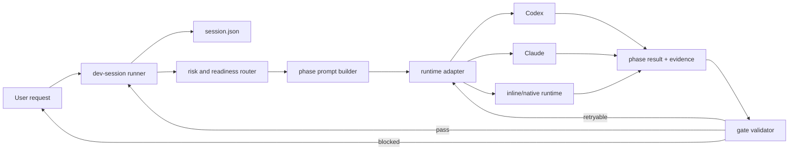

# PM dev v2: model-adaptive execution harness

## Decision

Rebuild `/pm:dev` around a deterministic, phase-local execution harness while preserving its product lifecycle: intake, isolated workspace, readiness, implementation, review, ship, and retro.

The harness, not the model prompt, will own session transitions, risk routing, model/runtime selection, retries, evidence validation, and recovery. A model will receive only the current phase contract, the relevant project/task context, explicit authority, and a structured result schema.

The first supported workhorse profiles are:

| Profile | Runtime | Intended model | Reasoning | Role |
|---|---|---|---|---|
| `codex-workhorse` | Codex | GPT-5.6 Sol | `high` | implementation and evaluation |
| `claude-workhorse` | Claude | Opus 4.8 | `xhigh` | implementation and evaluation |

Model identifiers and reasoning values are configuration, not workflow prose. Runtime adapters pass them through only after capability detection, so renamed provider identifiers do not require edits across the skill.

This is a staged replacement. Existing Markdown dev sessions, user step overrides, the current shell dispatcher, and legacy RFCs remain usable during migration.

## Problem

The current workflow has the right safety goals but assigns too much deterministic work to language-model interpretation.

Current behavior has five structural weaknesses:

1. `scripts/step-loader.js` builds one prompt by concatenating every enabled step. The model receives intake, implementation, shipping, cleanup, and retro rules even when only one phase is active.
2. Workflow policy and runtime mechanics are mixed. Step and reference files contain CLI flags, polling loops, model pins, result sentinels, and retry rules.
3. Routing is split across prose and tests. `kind`, size, UI impact, RFC presence, and runtime capability can conflict without a single executable precedence rule.
4. `scripts/dispatch-issue.sh` hard-codes provider behavior and model choices. Its result contract is only partially validated and cannot express capability downgrades, evidence, or resumable runtime identity.
5. Regression tests protect the presence of prompt keywords more strongly than workflow outcomes. Removing duplicated instructions can fail tests even when behavior improves.

The result is costly context, inconsistent execution across models, fragile recovery, and a workflow that becomes stale when provider CLIs or model generations change.

## Goals

- Load only the contract for the active phase.
- Store canonical session state in schema-validated JSON using atomic writes.
- Make routing and gate decisions executable and inspectable.
- Treat model names, reasoning effort, and provider flags as configuration.
- Give GPT-5.6 Sol High and Opus 4.8 xHigh the same provider-neutral worker contract.
- Keep the root session responsible for integration and external side effects.
- Use delegation only when work is independent and the runtime supports it.
- Validate every phase result and evidence record before advancing.
- Reduce default prompt volume by at least 60% without reducing task success.
- Preserve safe resume and compatibility with current projects during rollout.

## Non-goals

- Rewriting `pm:groom`, `pm:rfc`, `pm:review`, or `pm:ship` as part of this change.
- Building a general workflow engine for every PM skill.
- Requiring either Codex or Claude for all users.
- Making live model evals part of the default offline test suite.
- Auto-merging without the authority and gates already required by the plugin.
- Moving consumer-project data into this plugin repository.

## Architecture

### Components



The design has six boundaries:

1. **Session runner** — the only writer of lifecycle state and the only component allowed to advance a phase.
2. **Risk/readiness router** — a pure function that returns required phases and gates from task facts.
3. **Prompt builder** — constructs a bounded phase prompt from canonical state and referenced source files.
4. **Runtime adapters** — translate a provider-neutral run request into Codex, Claude, or inline execution.
5. **Result/evidence validator** — rejects incomplete or stale results before state advances.
6. **Workflow documents** — explain phase-specific judgment and domain rules; they no longer implement state machines or provider CLIs in prose.

### Session runner CLI

Add `scripts/dev-session.js` with these commands:

```text
dev-session init --slug <slug> --source-dir <path> [--task <path-or-id>]
dev-session status --session <path> [--json]
dev-session next --session <path> [--json]
dev-session prompt --session <path> --output <path>
dev-session record --session <path> --result <path>
dev-session validate --session <path>
dev-session migrate --legacy <path> [--output <path>]
dev-session project --session <path>
```

`next` is a read-only decision. It returns the current phase, required capabilities, applicable gate names, input paths, and whether execution may be inline, delegated, or headless. `record` validates a phase result, updates the session by atomic rename, and emits the next decision. It must never infer success from process exit code alone.

The runner uses exit codes consistently:

| Code | Meaning |
|---:|---|
| 0 | command succeeded |
| 2 | invalid arguments or schema |
| 3 | precondition/capability missing |
| 4 | result invalid or evidence incomplete |
| 5 | session blocked on a user/external decision |
| 6 | retry budget exhausted |

### Canonical session schema

Store v2 sessions at `{source_dir}/.pm/dev-sessions/{slug}/session.json`. Related prompts, results, logs, and evidence live in that directory. The directory remains ephemeral and gitignored in consumer projects.

Minimum schema:

```json
{
  "schema_version": 2,
  "run_id": "dev_01J...",
  "slug": "model-adaptive-dev",
  "status": "active",
  "phase": "implementation",
  "phase_attempt": 1,
  "created_at": "2026-07-11T00:00:00.000Z",
  "updated_at": "2026-07-11T00:00:00.000Z",
  "source": {
    "repo_root": "/absolute/path",
    "worktree": "/absolute/path/.worktrees/branch",
    "branch": "codex/model-adaptive-dev",
    "default_branch": "main",
    "base_commit": "<sha>"
  },
  "task": {
    "kind": "proposal",
    "size": "L",
    "risk": {
      "behavioral": 3,
      "security": 1,
      "data": 0,
      "external_contract": 2,
      "operational": 1,
      "ui": 0,
      "reversibility": 1,
      "cross_module": 3
    },
    "risk_tier": "high",
    "acceptance_criteria": [],
    "work_units": []
  },
  "execution": {
    "profile": "codex-workhorse",
    "runtime": "codex",
    "model": "gpt-5.6-sol",
    "reasoning": "high",
    "mode": "inline",
    "capabilities": {
      "structured_output": true,
      "resume": true,
      "native_subagents": true,
      "background": true
    },
    "runtime_session_id": null
  },
  "authority": {
    "local_writes": true,
    "commit": true,
    "push_feature_branch": true,
    "create_pr": true,
    "merge": false,
    "tracker_updates": true
  },
  "routing": {
    "required_phases": [],
    "required_gates": [],
    "decision_version": 1,
    "reasons": []
  },
  "evidence": {},
  "attempts": [],
  "blockers": [],
  "history": []
}
```

Schema rules:

- Reject unknown top-level fields to catch misspellings.
- Store absolute paths in state but never include them in committed artifacts.
- Every transition appends a history record containing prior phase, next phase, decision reason, result hash, timestamp, and runner version.
- Evidence records include the commit SHA they validate. A later commit makes the record stale.
- Authority can only stay the same or become narrower inside a worker. A worker result cannot grant itself authority.
- `phase_attempt` increments only for a validated retry of the same phase.
- A session reaches `complete` only after all required gates pass against the final commit.

Add a dependency-free schema validator in `scripts/lib/dev-session-schema.js`; this repository intentionally has no runtime package dependencies. Use temporary-file-plus-rename writes with file mode `0600`.

### Phase result schema

Every inline, native-agent, or headless run returns the same JSON envelope:

```json
{
  "schema_version": 1,
  "run_id": "dev_01J...",
  "phase": "implementation",
  "attempt": 1,
  "status": "passed",
  "summary": "Implemented phase-local prompt assembly.",
  "commit": "<sha-or-null>",
  "files_changed": ["scripts/dev-prompt.js"],
  "evidence": [
    {
      "kind": "test",
      "command": "node --test tests/dev-prompt.test.js",
      "exit_code": 0,
      "artifact": null
    }
  ],
  "blocker": null,
  "runtime": {
    "provider": "codex",
    "model": "gpt-5.6-sol",
    "reasoning": "high",
    "session_id": "<optional>"
  }
}
```

Allowed statuses are `passed`, `failed`, `blocked`, and `noop`. A result is invalid if its run, phase, or attempt does not match the session; if required evidence is absent; or if a claimed commit is not reachable from the session branch.

### Risk routing

Keep size as an estimate, but stop allowing `kind` or size alone to erase safety gates. Add `scripts/lib/dev-risk.js` as a pure routing module.

Each dimension is scored `0`–`3`. The router derives `low`, `medium`, `high`, or `critical` from the maximum dimension plus aggregate/cross-cutting rules. Security, destructive data changes, auth, public contract breaks, and irreversible operations force at least `high`.

Routing output is an explicit decision record:

```json
{
  "decision_version": 1,
  "risk_tier": "high",
  "required_phases": ["workspace", "readiness", "implementation", "review", "ship", "retro"],
  "required_gates": ["tdd", "review", "verification"],
  "reasons": [
    "cross_module=3 requires full review",
    "behavioral=3 requires regression evidence"
  ]
}
```

Compatibility defaults preserve current outcomes where safe:

- XS/S low-risk changes keep the lightweight route.
- M/L/XL proposals continue to require groom/RFC readiness.
- Tasks and bugs may skip groom/RFC when scope and ACs are already sufficient, but high-risk tasks and bugs retain full review and verification.
- UI impact adds design critique and QA gates.
- Non-behavioral docs/config/generated changes may skip TDD only with a validated reason; verification remains required.

### Model profiles and capabilities

Extend `.pm/config.json` consumption without requiring a config migration:

```json
{
  "workflows": {
    "dev": {
      "default_profile": "codex-workhorse",
      "profiles": {
        "codex-workhorse": {
          "runtime": "codex",
          "model": "gpt-5.6-sol",
          "reasoning": "high",
          "sandbox": "workspace-write"
        },
        "claude-workhorse": {
          "runtime": "claude",
          "model": "opus-4.8",
          "reasoning": "xhigh",
          "permission_mode": "auto"
        }
      },
      "phase_profiles": {
        "implementation": ["codex-workhorse", "claude-workhorse"],
        "review": ["claude-workhorse", "codex-workhorse"]
      }
    }
  }
}
```

Exact provider model identifiers remain user-configurable because availability and aliases vary by account and CLI release. Environment overrides (`PM_DEV_CODEX_MODEL`, `PM_DEV_CODEX_REASONING`, `PM_DEV_CLAUDE_MODEL`, `PM_DEV_CLAUDE_REASONING`) take precedence for CI and eval runs without rewriting project config.

Capability discovery records CLI presence/version and support for structured output, JSONL, resume, background runs, native delegation, and the requested reasoning option. Unsupported optional features produce a recorded downgrade. Unsupported required features block before mutation.

### Phase-local prompt contract

Add `scripts/dev-prompt.js` and `skills/dev/references/worker-contract.md`. A prompt contains these sections exactly once:

1. Outcome.
2. Scope and exclusions.
3. Input paths and compact project context.
4. Acceptance criteria.
5. Applicable repository rules.
6. Authorized actions.
7. Required evidence.
8. Stop conditions.
9. Result schema and output path.

The builder loads only:

- The active step.
- References declared by that step.
- Task/RFC execution contract.
- Relevant repository instructions.
- The compact state projection required by the phase.

It must not inline future phases. The target is under 3,000 words for the root phase prompt and under 1,200 words of workflow instruction for a worker prompt, excluding source artifacts such as an RFC.

Extend step frontmatter with optional machine-readable metadata:

```yaml
phase: implementation
requires:
  - worker-contract.md
gates:
  - tdd
result_schema: phase-result-v1
```

Existing step files without these fields continue to load. User overrides still replace same-named defaults. `buildPrompt(steps)` stays available for non-dev skills and compatibility tests; `/pm:dev` uses `buildPhasePrompt()`.

### Execution and delegation

Default to inline execution on the root model for one ordered work unit. Use delegation only when a dependency graph has at least two ready, disjoint units or an independent read-only review is useful.

Workers may inspect, edit, test, and commit within their assigned worktree and authority. They may not push, open PRs, merge, or update trackers unless the session explicitly grants that action. The root owns aggregate verification and all external integration by default.

Represent work-unit dependencies in session state:

```json
{
  "id": "issue-2",
  "title": "Add runtime adapters",
  "depends_on": ["issue-1"],
  "owns": ["scripts/dev-runtime/**", "tests/dev-runtime*.test.js"],
  "status": "pending",
  "result_path": null
}
```

Parallel dispatch is allowed only when `depends_on` is satisfied and `owns` patterns do not overlap. Ambiguous ownership serializes the work.

### Runtime adapters

Create Node adapters under `scripts/dev-runtime/`:

- `index.js` — provider-neutral request validation and selection.
- `codex.js` — Codex argument construction, JSONL capture, structured result handling, session ID capture/resume.
- `claude.js` — Claude stream JSON capture, permission selection, result extraction, session ID capture/resume when supported.
- `inline.js` — emits the phase package for the current interactive agent rather than spawning a process.
- `capabilities.js` — CLI/version and feature detection.

Keep `scripts/dispatch-issue.sh` as a compatibility shim for one release cycle. It should translate legacy flags into the Node adapter request and print a deprecation warning. Remove hard-coded model pins and unsafe permission defaults from the shell layer.

Codex defaults to `workspace-write`. Claude defaults to its managed/auto permission mode when supported. Broader access requires explicit config plus a recorded capability/authority decision.

### Evidence and gates

Extend `scripts/dev-gate-check.js` to read v2 evidence directly while retaining current `current.gates.json` support.

Evidence kinds:

- `test`: command, exit status, output artifact, commit.
- `tdd`: red command/result, green command/result, exception reason if applicable.
- `review`: reviewer identity/profile, findings artifact, disposition, commit.
- `design`: screenshots/critique artifact and commit.
- `qa`: assertion artifact and commit.
- `verification`: command set, status, final commit.

A passed gate is valid only for its recorded commit. `record` marks earlier evidence stale after a new commit unless that gate explicitly permits ancestor evidence. `review` and final `verification` remain never-skippable on routes that require them.

## File-level changes

| File | Change |
|---|---|
| `scripts/dev-session.js` | New runner CLI and transition owner. |
| `scripts/lib/dev-session-schema.js` | New validators, migrations, atomic persistence. |
| `scripts/lib/dev-risk.js` | New pure risk scoring and phase/gate routing. |
| `scripts/dev-prompt.js` | New phase-local prompt assembly and token/word metrics. |
| `scripts/dev-runtime/{index,codex,claude,inline,capabilities}.js` | New provider adapters and capability discovery. |
| `scripts/dispatch-issue.sh` | Convert to compatibility shim; remove provider policy and model pins. |
| `scripts/dev-gate-check.js` | Validate v2 evidence, commit freshness, and legacy gates. |
| `scripts/step-loader.js` | Parse phase metadata; add single-phase loading without changing existing callers. |
| `skills/dev/SKILL.md` | Reduce to lifecycle contract, Iron Law, routing entry, and phase-loading directive. |
| `skills/dev/steps/*.md` | Remove duplicated runtime/state mechanics; add phase metadata and explicit result expectations. |
| `skills/dev/references/state-schema.md` | Document v2 JSON plus legacy migration. |
| `skills/dev/references/worker-contract.md` | New provider-neutral nine-part worker prompt contract. |
| `skills/dev/references/risk-routing.md` | New risk dimension and precedence documentation. |
| `skills/dev/references/agent-runtime.md` | Point to adapters; retain only selection and recovery guidance. |
| `skills/dev/references/subagent-dev.md` | Replace mandatory model/delegation rules with DAG and ownership criteria. |
| `skills/dev/references/implementer.md` | Align stop conditions and structured result requirements. |
| `skills/dev/references/tdd.md` | Align test exceptions with evidence schema. |
| `skills/dev/steps/02-intake.md` | Replace kind-wins routing with risk input collection and runner decision. |
| `skills/dev/steps/05-implementation.md` | Remove CLI/poll loops; consume the runner execution package. |
| `skills/dev/steps/07-review.md` | Consume explicit required gates and structured reviewer evidence. |
| `skills/dev/steps/08-ship.md` | Assert root authority and final-commit evidence before external effects. |
| `tests/dev-session*.test.js` | New state, transition, migration, stale-evidence, and recovery tests. |
| `tests/dev-risk.test.js` | New exhaustive decision-table tests. |
| `tests/dev-prompt.test.js` | New phase isolation, override, authority, and prompt-budget tests. |
| `tests/dev-runtime-*.test.js` | New CLI argument, capability downgrade, JSONL, result, and resume tests. |
| `tests/dev-gate-check.test.js` | Add v2 evidence and commit-freshness cases. |
| `tests/dev-steps-regression.test.js` | Replace concatenated-keyword assertions with phase contract checks. |
| `evals/scenarios/dev-v2-*` | Add behavioral scenarios for routing, authority, recovery, and evidence. |
| `scripts/evals/adapters/{codex,claude}.js` | Reuse model/reasoning profile overrides and record resolved settings. |
| `README.md` and `.codex/INSTALL.md` | Document model profiles and migration after behavior stabilizes. |

## Compatibility and migration

### Phase 1: dual read, v2 write

- New sessions use the v2 directory and JSON schema.
- Resume detects an existing `{slug}.md` session and runs `dev-session migrate`.
- Migration preserves the original Markdown file and writes `migration.json` containing source hash, warnings, and mapped fields.
- Unknown or ambiguous legacy values are recorded as blockers rather than guessed.
- `dev-gate-check.js` accepts both legacy gate manifests and v2 evidence.
- `dispatch-issue.sh` remains callable by existing prompts.

### Phase 2: phase-local default

- `/pm:dev` uses `dev-session next` and `dev-session prompt` by default.
- Set `PM_DEV_LEGACY_PROMPT=1` to restore concatenated steps for one release while diagnosing regressions.
- Emit one concise migration warning per session, not per phase.

### Phase 3: legacy removal

- Remove the shell implementation after live eval parity and one released deprecation window.
- Remove Markdown session writes only after resume fixtures cover every supported legacy state.
- Retain the Markdown human projection as an optional `dev-session project` output; it is never canonical state.

User workflow overrides remain compatible. Overrides with no v2 metadata are loaded as prose for their matching phase. If a custom override cannot be assigned to a phase, the runner blocks with a migration message instead of concatenating it globally.

## Test strategy

### Offline unit and contract tests

1. **State/schema** — valid states, unknown fields, atomic-write failure, permissions, mismatched run/phase/attempt, transition history, and legacy migrations.
2. **Routing** — table-driven coverage for every kind, size, risk dimension, UI impact, RFC/readiness state, and non-behavioral exception.
3. **Prompt isolation** — implementation prompts must not contain ship/retro instructions; ship prompts must not contain implementation mechanics; required authority/result sections appear exactly once.
4. **Prompt budgets** — fail when default root workflow prose exceeds 3,000 words or worker workflow prose exceeds 1,200 words. Report bytes and words for diagnosis.
5. **Adapters** — stub provider CLIs and assert exact argument arrays, sandbox/permission defaults, environment isolation, JSONL parsing, result validation, runtime session ID capture, resume, quota classification, and missing-result recovery.
6. **Evidence** — stale commit, missing red/green evidence, skipped TDD reason, review disposition, and final verification against the branch head.
7. **Compatibility** — legacy state, legacy gate manifest, legacy dispatcher flags, user step overrides, and pre-sidecar RFC intake.
8. **Plugin contract** — `npm run validate:plugin`, full `npm test`, lint, and formatting.

### Behavioral eval matrix

Add at least these scenario classes:

| Scenario | Expected behavior |
|---|---|
| XS docs-only | TDD skipped with reason; verification required; no RFC ceremony. |
| S behavioral bug | Regression evidence required even though work is small. |
| M proposal with RFC | Phase-local implementation prompt; RFC execution contract used. |
| L task with auth impact | Risk overrides lightweight kind path; full review required. |
| UI change | Design critique and QA added. |
| Two independent units | Parallel-capable decision with disjoint ownership. |
| Two overlapping units | Serialized despite available subagents. |
| Missing runtime capability | Recorded downgrade or early block before writes. |
| Interrupted subprocess | Runtime session ID retained and resume attempted. |
| Worker attempts merge | Authority violation fails the result. |
| Commit after review | Review evidence becomes stale and reruns. |
| Legacy session resume | Deterministic migration then correct next phase. |

Run the same corpus against:

- GPT-5.6 Sol with reasoning `high`.
- Opus 4.8 with reasoning `xhigh`.

Use environment overrides for the exact account-visible model identifiers. Each scenario/model pair runs at least three times for the initial comparison. Live runs remain opt-in and contained using the existing eval staging infrastructure.

Capture:

- Acceptance-criteria completion.
- Gate correctness and evidence validity.
- Wrong branch/worktree or authority violations.
- Avoidable user pauses.
- Recovery success.
- Prompt input bytes/words and total model tokens when available.
- Wall time and runtime retries.
- Review finding duplication.
- Final result status and failure taxonomy.

Release gates:

- At least 60% reduction in default `/pm:dev` workflow prompt words.
- No statistically meaningful regression in acceptance-criteria completion across the two workhorse models.
- Zero uncontained writes or worker-initiated merges in the eval corpus.
- Zero missing/malformed phase results counted as success.
- 100% deterministic routing agreement in offline fixtures.
- Resume succeeds for all supported legacy fixtures.

### Ablations

Run these comparisons before deleting legacy paths:

1. Concatenated prompt vs. phase-local prompt.
2. Mandatory headless dispatch vs. capability-based inline/delegated execution.
3. Kind/size routing vs. risk routing.
4. Markdown state vs. JSON state with validated results.
5. Current review prose vs. structured evidence and commit freshness.

## Observability and privacy

Write local run metrics under the session directory. Do not include source contents, credentials, full prompts, or raw provider auth data in telemetry. Allowed diagnostic fields include phase, profile name, resolved model string, runtime version, duration, prompt byte/word counts, status, retry classification, gate names, and hashes.

Raw provider logs stay local with mode `0600`. Eval staging continues to use isolated homes and source markers. The runner redacts known secret-shaped environment values from error summaries before they reach state history.

## Failure handling

- Invalid state: stop before mutation and print the schema path plus exact field errors.
- Unsupported requested model/reasoning: block before dispatch and show the resolved CLI/version and override path.
- Optional capability absent: record a downgrade and select an allowed fallback.
- Missing result: create a validated `blocked` envelope tied to the attempt and retain the raw log.
- Repeated root cause: after three evidence-backed attempts, mark the phase blocked and require new user input or an external-state change.
- Resume unavailable: start a fresh attempt only if the prior attempt made no uncommitted changes; otherwise block for reconciliation.
- Dirty or wrong worktree: never auto-reset; report the state and require an explicit recovery decision.

## Issue breakdown

### Issue 1 — State, schema, and deterministic transitions (L)

**Files:** `scripts/dev-session.js`, `scripts/lib/dev-session-schema.js`, `skills/dev/references/state-schema.md`, `tests/dev-session*.test.js`.

**Work:** Implement v2 state validation, atomic persistence, transition history, result envelopes, migration from Markdown sessions, and the `init/status/next/record/validate/project` commands. Start with a fixed phase sequence; route injection lands in Issue 2.

**Acceptance criteria:**

- Invalid or stale results cannot advance a session.
- Session writes are atomic and mode `0600`.
- Legacy fixtures migrate without deleting source files.
- A cold process can determine the next action from `session.json` alone.

**Test hooks:** State/schema, compatibility, failure handling.

### Issue 2 — Risk router and executable gate decisions (M)

**Depends on:** Issue 1.

**Files:** `scripts/lib/dev-risk.js`, `skills/dev/references/risk-routing.md`, `skills/dev/steps/02-intake.md`, `tests/dev-risk.test.js`, existing routing tests.

**Work:** Implement risk dimensions, tier derivation, phase/gate decision records, and compatibility defaults. Replace prose-only kind/size precedence while retaining kind and size as inputs.

**Acceptance criteria:**

- Identical facts always produce identical routing JSON.
- High-risk task/bug work cannot bypass review and verification.
- Low-risk XS/S behavior remains lightweight.
- Every decision contains user-readable reasons.

**Test hooks:** Routing decision table and legacy parity cases.

### Issue 3 — Phase-local workflow and prompt builder (L)

**Depends on:** Issues 1–2.

**Files:** `scripts/step-loader.js`, `scripts/dev-prompt.js`, `skills/dev/SKILL.md`, `skills/dev/steps/*.md`, `skills/dev/references/worker-contract.md`, `tests/dev-prompt.test.js`, `tests/step-loader.test.js`, `tests/dev-steps-regression.test.js`.

**Work:** Add phase metadata, single-phase loading, compact context projection, the nine-part worker contract, and prompt budget reporting. Remove duplicated state/runtime instructions from dev steps without changing other skills' loader behavior.

**Acceptance criteria:**

- Only the active phase and declared references enter a prompt.
- User overrides still win by filename.
- Authority and result schema appear exactly once.
- Default prompt budgets meet the stated limits.
- Existing non-dev `buildPrompt()` callers remain compatible.

**Test hooks:** Prompt isolation, override compatibility, prompt budgets.

### Issue 4 — Model profiles, capabilities, and runtime adapters (L)

**Depends on:** Issues 1 and 3.

**Files:** `scripts/dev-runtime/*`, `scripts/dispatch-issue.sh`, `skills/dev/references/agent-runtime.md`, `skills/dev/references/execution-defaults.md`, adapter tests.

**Work:** Implement provider-neutral requests, Codex/Claude/inline adapters, model and reasoning configuration, safe permission defaults, JSONL capture, result validation, and resumable session identity. Keep the shell command as a compatibility shim.

**Acceptance criteria:**

- GPT-5.6 Sol High and Opus 4.8 xHigh can be selected without editing skill text.
- Exact model identifiers can be overridden by config or environment.
- Provider flags are built and tested as arrays, not shell-interpolated strings.
- Missing or malformed results cannot be reported as success.
- Broad permissions are never the default.

**Test hooks:** Runtime stubs, capability downgrade, containment, resume.

### Issue 5 — Work-unit DAG and root-owned integration (M)

**Depends on:** Issues 1–4.

**Files:** `skills/dev/references/subagent-dev.md`, `skills/dev/references/implementer.md`, `skills/dev/steps/05-implementation.md`, `scripts/lib/dev-work-units.js`, tests.

**Work:** Implement dependency/ownership readiness, selective delegation, structured worker results, and root-only external integration. Remove mandatory Opus pins and nested full-lifecycle dispatch.

**Acceptance criteria:**

- Independent, non-overlapping units may run concurrently when supported.
- Shared ownership forces serialization.
- Inline execution is always available where capability rules allow it.
- Workers cannot expand their authority or merge by default.

**Test hooks:** DAG ordering, ownership overlap, authority enforcement.

### Issue 6 — Evidence freshness and gate integration (M)

**Depends on:** Issues 1–5.

**Files:** `scripts/dev-gate-check.js`, `skills/dev/references/tdd.md`, `skills/dev/steps/07-review.md`, `skills/dev/steps/08-ship.md`, gate tests.

**Work:** Map TDD, review, design, QA, and verification outputs into v2 evidence; validate evidence against commits; keep legacy manifests readable; require final aggregate verification before shipping.

**Acceptance criteria:**

- A new commit invalidates stale review/verification evidence as specified.
- Non-behavioral TDD exceptions require a recorded reason.
- Final shipping checks the branch head, authority, and all required gates.
- Legacy gate fixtures continue to pass unchanged.

**Test hooks:** Evidence schema, stale commits, skip policy, ship gate.

### Issue 7 — Behavioral evals and two-model comparison (L)

**Depends on:** Issues 1–6.

**Files:** `evals/scenarios/dev-v2-*`, `scripts/evals/adapters/codex.js`, `scripts/evals/adapters/claude.js`, eval checks/scoring/tests, current score artifact if applicable.

**Work:** Add the scenario matrix, prompt metrics, model/reasoning metadata, repeated-run aggregation, ablation controls, and comparison reporting for GPT-5.6 Sol High and Opus 4.8 xHigh.

**Acceptance criteria:**

- Offline eval checks remain deterministic and network-free.
- Live adapters record the exact resolved model and reasoning setting.
- Reports separate hard failures, indeterminate infrastructure failures, and model behavior failures.
- Release gates can be evaluated from generated artifacts.

**Test hooks:** Adapter tests, scoring tests, containment, live opt-in preflight.

### Issue 8 — Documentation, deprecation, and release (S)

**Depends on:** Issue 7 and release gates passing.

**Files:** `README.md`, `.codex/INSTALL.md`, relevant command/skill examples, changelog/release manifests through the bump script.

**Work:** Document profiles, overrides, v2 state, recovery, and the legacy escape hatch. Run the full plugin contract suite, sync source to cache for runtime testing, then run `npm run bump patch` as the final branch commit per repository policy.

**Acceptance criteria:**

- Runtime behavior and public documentation agree.
- All plugin validation, unit, eval-check, lint, and format gates pass.
- The patch bump is the final commit before PR creation.
- Version tags are reattached to the main merge commit after merge according to `AGENTS.md`.

## Dependency order

```text
Issue 1 ─┬─> Issue 2 ─> Issue 3 ─┬─> Issue 5 ─> Issue 6 ─> Issue 7 ─> Issue 8
         └───────────────────────> Issue 4 ─┘
```

Issues 2 and the initial adapter scaffolding in Issue 4 can proceed in parallel after the schema types in Issue 1 stabilize. All mutating work should remain serialized when files overlap.

## Rollout and rollback

1. Land Issues 1–2 behind `PM_DEV_V2=1`.
2. Land phase-local prompting and adapters, then make v2 the default only in live eval staging.
3. Compare both workhorse models against the legacy baseline.
4. Make v2 the product default after release gates pass. Keep `PM_DEV_LEGACY_PROMPT=1` for one release.
5. Remove the legacy dispatcher implementation in the following release if no blocker-class regressions appear.

Rollback does not rewrite sessions. The runner's Markdown projection and preserved legacy source allow the old workflow to resume manually. A v2 session that has performed external effects must not be silently replayed through v1; report the completed effects and require an explicit recovery decision.

## Resolved decisions

- The harness is scoped to `/pm:dev`; it is not a general PM workflow engine.
- JSON is canonical state; Markdown is a human projection.
- Root execution is the default for ordered work; delegation is selective.
- The root owns push, PR, merge, and tracker updates unless authority explicitly says otherwise.
- GPT-5.6 Sol High and Opus 4.8 xHigh are initial profiles, not hard-coded workflow dependencies.
- Provider model names remain configurable because account-visible identifiers can differ.
- Live model testing is opt-in, contained, repeated, and compared with offline deterministic gates.

## Approval boundary

This RFC reflects the approved product direction from the `/pm:dev` v2 proposal. Implementation may begin with Issue 1. Any change that broadens external authority, removes the legacy escape hatch before the eval gates pass, or turns live evals on by default requires renewed approval.
