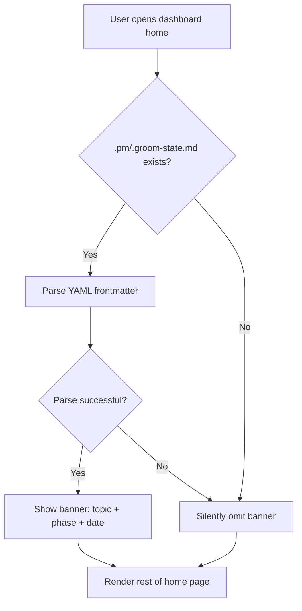

## Outcome

When a user has an active groom session (`.pm/.groom-state.md` exists), the dashboard home page displays a prominent banner showing three fields: topic name, human-readable phase name, and start date. This is the highest-value item in the redesign — it answers "where was I?" instantly.

Before: users must remember what they were grooming or manually check `.pm/.groom-state.md`. After: the dashboard shows it front and center.

## Acceptance Criteria

1. `server.js` reads `.pm/.groom-state.md` via the shared `readGroomState()` helper (defined in PM-026) using `path.resolve(pmDir, '..', '.pm', '.groom-state.md')`.
2. When groom state exists: home page shows a banner with exactly three fields: (a) topic name, (b) phase displayed as a human-readable label (e.g., "Competitive Review" not raw `research`), (c) start date. Research location is not displayed (deferred to future iteration).
3. When groom state does not exist: no banner shown, home page renders the proposal gallery directly with no empty space where the banner would be.
4. Banner is visually prominent — positioned at the very top of the home page content, above the proposal gallery.
5. If the groom state file is corrupted/unparseable, the banner is silently omitted (no error page). The `parseFrontmatter()` helper only needs flat fields (`topic`, `phase`, `started`) which it already handles correctly.
6. The banner is read-only — no actions, no controls, no links. All text is plain text.
7. Phase name mapping: `intake` → "Intake", `strategy-check` → "Strategy Check", `research` → "Research", `scope` → "Scoping", `scope-review` → "Scope Review", `groom` → "Drafting Issues", `team-review` → "Team Review", `bar-raiser` → "Bar Raiser", `present` → "Presentation", `link` → "Linking Issues".

## User Flows

## Wireframes

[Wireframe preview](pm/backlog/wireframes/dashboard-proposal-hero.html) — see Screen 1, "Currently Grooming" section.

## Competitor Context

No competitor shows "what's actively being reasoned about" in a dashboard. Productboard Spark runs jobs in isolated chat sessions with no persistent status. ChatPRD has no equivalent. This is a unique differentiator that reinforces PM's "doing the thinking" positioning.

## Technical Feasibility

**Build-on:** `parseFrontmatter()` already exists in `server.js` for YAML extraction. The existing dashboard CSS has `.stat-card` and badge patterns that can be adapted.

**Build-new:** Banner HTML injection into `handleDashboardHome()`. The `readGroomState()` helper is defined in PM-026 and shared.

**Risk:** Path resolution when `pmDir` is symlinked or `--dir` flag points to non-standard path. Use `path.resolve(pmDir, '..', '.pm', '.groom-state.md')` and fail gracefully. Also: `.pm/` is outside the file watcher's root (`pm/`), so groom state changes during a live session will not trigger a dashboard reload. This is a known limitation — document it, do not try to solve it.

## Dependencies

- **PM-026** (Proposal Metadata Sidecar) — provides the shared `readGroomState()` helper.

## Research Links

- [Dashboard Proposal-Centric Redesign](pm/research/dashboard-proposal-centric/findings.md)

## Notes

- Both scope reviewers (PM and Competitive) flagged this as the highest-value, most differentiating item.
- Future iteration: richer session display showing which knowledge base sources are actively informing the groom.
