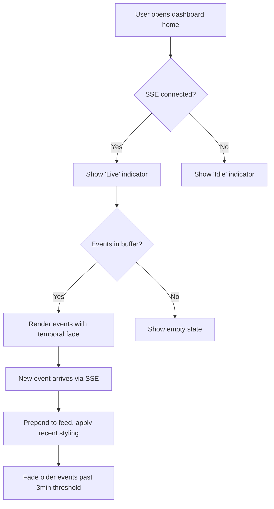

## Outcome

When the product engineer opens the dashboard home page, they see a right-sidebar panel showing live events from all connected terminal sessions. Recent events have full contrast; older events fade. The feed updates in real-time without page refresh.

## Acceptance Criteria

1. The dashboard home page renders a 260px right sidebar panel alongside the existing main content (stat cards, sessions, proposals).
2. The panel header shows "Activity" label and a pulsing green "Live" indicator when SSE is connected.
3. Events render in reverse chronological order with: colored dot (by event type), source label, event description, relative timestamp.
4. Events from the last 3 minutes render at full contrast. Older events fade to muted text and dimmer dots.
5. An "Earlier" time separator visually groups older events.
6. The panel background is slightly darker than the main content area (#12141a in dark mode) to create visual recession.
7. The browser-side JavaScript creates an `EventSource('/events')` connection and appends new events to the feed DOM in real-time.
8. On SSE reconnect, the feed reconciles state from the ring buffer replay (via `Last-Event-ID`).
9. When no events exist, the panel shows an empty state: "No events yet. Activity appears here when terminal sessions are running." with the Live indicator showing "Idle" instead.
10. On screens narrower than 1024px, the feed panel is hidden (responsive breakpoint).
11. The `dashboardPage()` function in `scripts/server.js` is extended with a conditional sidebar slot so the feed panel renders inside the existing `app-layout > main-content` structure. This layout change is tested across all pages (Backlog, KB, Competitors) to prevent regression — non-Home pages render without the sidebar slot.
12. On WebSocket-triggered page reload, the feed is rebuilt from SSE replay via `Last-Event-ID` — no separate state persistence needed.

## User Flows

## Wireframes

[Wireframe preview](pm/backlog/wireframes/sse-event-bus.html)

## Competitor Context

Linear Pulse is the closest UX precedent — a personalized real-time feed scoped by user subscriptions. PM's feed is simpler: one chronological list from terminal sessions in the same project. No cross-org scoping needed. No competitor in the AI PM space offers a real-time activity feed alongside the working environment.

## Technical Feasibility

**Build-on:**
- `scripts/server.js` line 1980: `handleDashboardHome` composes stat cards, session banners, and proposals. Activity feed panel is a new section in this composition.
- `scripts/server.js` line 428-466: `DASHBOARD_CSS` defines all CSS variables (--bg, --surface, --border, --text, --text-muted, --accent, --success, --warning, --info). Feed panel CSS uses these.
- `scripts/server.js` line 1126-1128: existing WebSocket client injection point. EventSource client goes alongside.

**Build-new:** Feed panel HTML in `handleDashboardHome`, CSS for the right sidebar layout + temporal fade + responsive breakpoint, EventSource JavaScript for real-time updates + reconnection state reconciliation.

**Depends on:** PM-090 (SSE Event Bus Core) — needs `GET /events` endpoint.

## Scope Note

Covers in-scope item: "Activity feed panel on dashboard home — right sidebar, quiet design."

## Decomposition Rationale

Workflow Steps pattern: this is the rendering stage. Events arrive via SSE (PM-090) and need a UI to display them.

## Research Links

- [SSE Event Bus + Activity Feed Patterns](pm/research/sse-event-bus/findings.md)

## Notes

- Feed panel is Home page only in v1. Extending to Backlog/Research pages is deferred.
- No filtering or search UI in v1. Linear Pulse offers event grouping, type filtering, and read/unread indicators — all explicitly deferred. Temporal fade (AC4) partially substitutes for read/unread. Grouping and filtering are v2 candidates if event volume warrants them.
- Color-coded dots by event type: success (green), info (blue), warning (orange), accent (purple for lifecycle events).
- Fade classification re-evaluated on each new event arrival (not on a timer).
