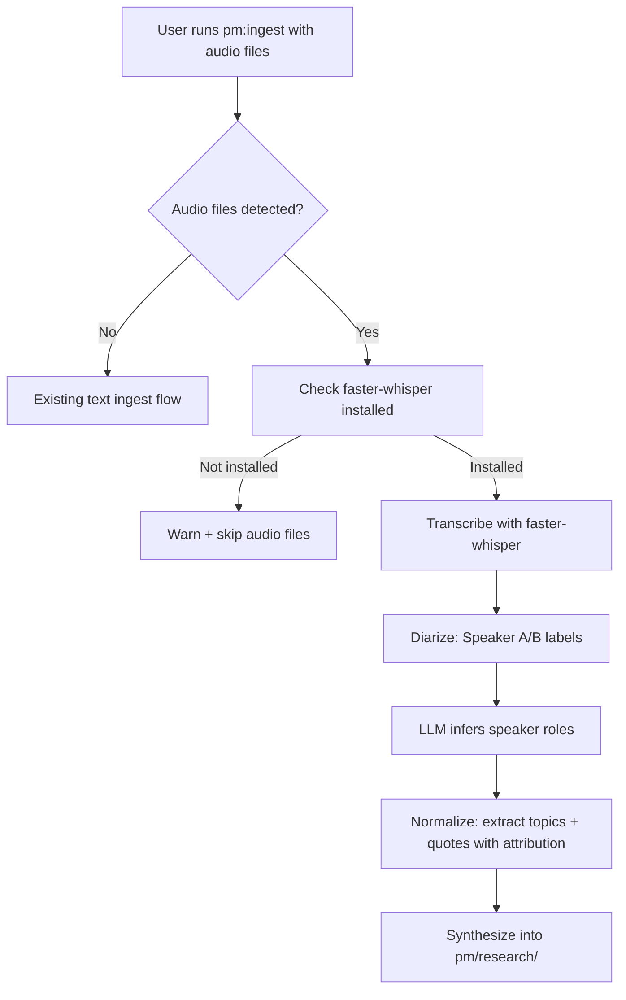

## Outcome

Users with audio recordings of customer interviews or sales calls can run `pm:ingest ~/recordings/` and get structured evidence — attributed quotes, pain points, and themes — without a separate transcription step. Speaker roles (interviewer vs. customer) are inferred automatically so quotes are correctly attributed.

## Acceptance Criteria

1. `pm:ingest` detects `.mp3`, `.wav`, `.m4a`, `.ogg`, `.flac`, `.webm` files during intake scan.
2. Audio files are transcribed locally via faster-whisper — no API keys or cloud calls.
3. Transcripts include Speaker A/B labels via pyannote.audio diarization.
4. LLM infers speaker roles (interviewer, customer, unknown) from transcript context.
5. LLM redacts PII (names → `[Interviewer]`, `[Customer A]`; companies → `[Company A]`).
6. Redacted transcripts stored in `pm/evidence/transcripts/` — safe to commit.
7. Normalized evidence records include `source_format: audio` and `speaker_role` on quotes.
8. Existing text-based ingest flows (.md, .txt, .csv, .json) are unaffected.
9. If faster-whisper is not installed, ingest warns and skips audio files gracefully.

## User Flows

## Wireframes

N/A — no user-facing UI for this feature type.

## Technical Feasibility

- **New runtime dependency:** Python 3.8+ with faster-whisper and pyannote.audio. First Python dependency in the plugin.
- **Script location:** `scripts/transcribe.py` bundled with plugin.
- **Model download:** faster-whisper downloads models on first run (~1-3GB for medium). Users need disk space and initial internet.
- **pyannote.audio:** Requires accepting HuggingFace license terms for speaker diarization model.
- **Integration point:** Ingest Phase 1 (intake) calls the script, gets back a transcript .txt, then processes as text.

## Notes

- faster-whisper uses CTranslate2 — 4x faster than OpenAI Whisper, lower memory.
- pyannote.audio HuggingFace license acceptance is a one-time setup step — document in prerequisites.
- Consider shipping a `requirements.txt` in `scripts/` for pip install.
