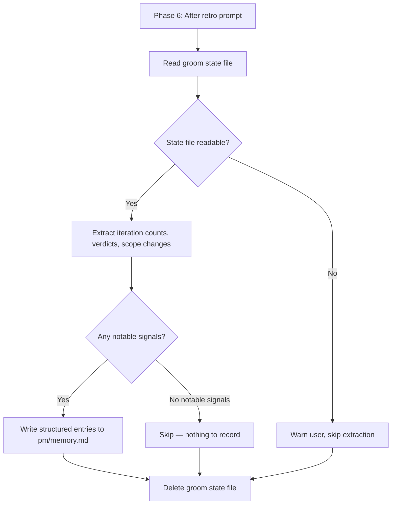

## Outcome

After shipping, Phase 6 reads the groom state file before deletion and extracts structured learnings from its data: how many review iterations were needed, which reviewers flagged blocking issues, whether scope changed during review, and what the bar raiser verdict was. These are written to `pm/memory.md` as factual entries alongside the retro prompt's qualitative entries.

## Acceptance Criteria

1. `skills/groom/phases/phase-6-link.md` is modified: an extraction step is inserted after the retro prompt step (PM-040) but before state file deletion.
2. Extraction produces memory entries only when notable signals exist. Thresholds:
   - Scope review iterations >1: "Scope needed {N} iterations — blocking issues: {list}" (`category: scope`)
   - Team review has at least one condition: "Team review required: {conditions}" (`category: review`)
   - Bar raiser verdict is `send-back`: "Bar raiser sent back: {reason}" (`category: review`)
   - Scope items moved from in-scope to out-of-scope during review: "Scope tightened: {items moved}" (`category: scope`)
   - Clean session marker: when scope_review.iterations == 1 AND bar_raiser.verdict is `ready`, write: "Clean session — scope and reviews passed first iteration" (`category: quality`). This captures positive reinforcement, not just failure signals.
3. Sessions with no signals above threshold produce no extraction entries.
4. Each extracted entry follows the `pm/memory.md` schema (PM-039) with `source: {session-slug}`, date, and category as specified in AC2.
5. Extraction is silent — no user interaction required. Entries are appended after the retro prompt entries.
6. If the state file is missing or corrupted, extraction is skipped with a warning (no crash).
7. Extraction runs before state file deletion — ordering enforced by the modified `phase-6-link.md`.
8. The relevant SKILL.md table is updated to reflect the new Phase 6 step.

## User Flows

## Wireframes

N/A — no user-facing workflow for this feature type.

## Competitor Context

GitHub Copilot's memory system stores facts with citations and justification. The trajectory-informed memory research (arXiv 2603.10600) extracts tips from execution traces automatically — strategy tips from clean executions, recovery tips from failure handling. PM's approach is simpler: extract factual signals from structured state data rather than analyzing unstructured traces. This is feasible because groom state files are already structured YAML.

## Technical Feasibility

Medium effort. Key considerations from EM review:
- The groom state file (`.pm/groom-sessions/{slug}.md`) already contains all needed fields: `scope_review.iterations`, `team_review.blocking_issues_fixed`, `bar_raiser.verdict`, `scope.in_scope/out_of_scope`
- `parseFrontmatter()` in `scripts/server.js` (lines 136-215) already parses this format
- Deletion ordering is the main risk — extraction must happen before the state file delete step
- The extraction logic lives in the Phase 6 skill instructions, not in a separate script

## Research Links

- [Memory System and Improvement Loop](pm/research/memory-improvement-loop/findings.md) — Finding 4: trajectory-informed extraction shows +14.3pp on scenario completion

## Notes

- Depends on PM-039 (memory file schema) being implemented first.
- Depends on PM-040 (retro prompt) being implemented first — PM-041 appends its extraction step after the retro step in `phase-6-link.md`. Both modify the same file and must be sequenced.
- The extraction is deliberately conservative for v1 — only extract clear, factual signals from structured state data. No AI inference.
- Clean session markers (AC2, last bullet) are critical: the trajectory-informed memory research shows that learning from successes (strategy tips) is as important as learning from failures (recovery tips). Without positive signals, the memory file becomes a catalog of problems.
- Future enhancement (v2): aggregate extraction data across sessions into `.pm/metrics/` for pattern detection.
