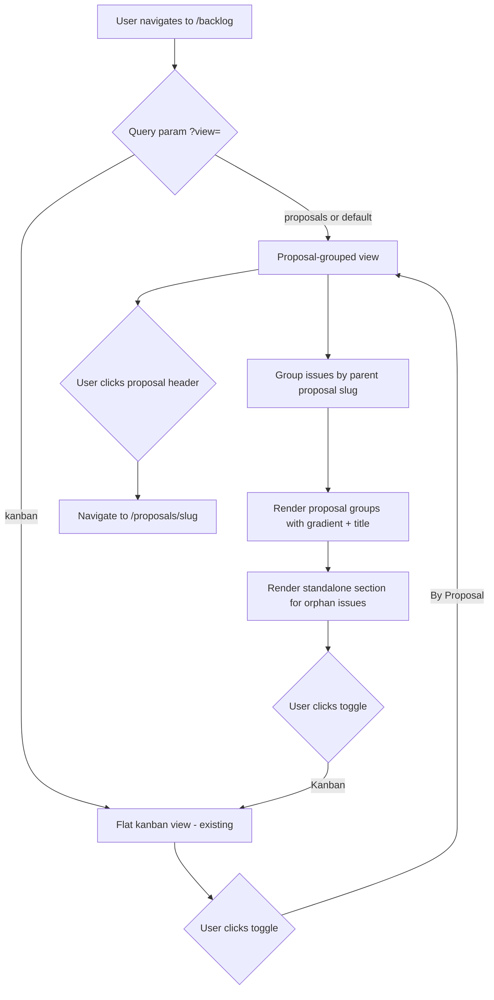

## Outcome

The backlog page defaults to a proposal-grouped view: issues are organized under collapsible proposal headers (with the proposal's gradient swatch and title). Each group shows parent and child issues with status badges. Issues without a parent proposal appear in a "Standalone" section at the bottom. A toggle switches between proposal-grouped (default) and flat kanban (existing view).

Before: all backlog issues shown in a flat kanban regardless of origin. After: issues are contextualized by the proposal that created them.

## Acceptance Criteria

1. Backlog page default view is "By Proposal" — issues grouped under their parent proposal.
2. **Grouping rule:** An issue belongs to a proposal group if its frontmatter `parent` field matches a slug that has a corresponding file at `pm/backlog/proposals/{slug}.meta.json`. If `parent` points to another backlog issue (not a proposal), walk up the parent chain until a proposal-level parent is found or the chain ends. Issues with no proposal ancestor go to "Standalone Issues."
3. Each proposal group shows: gradient swatch (from `readProposalMeta()`), proposal title, issue count with status breakdown (e.g., "5 issues — 2 done, 3 in progress").
4. Issues within a group show: PM-ID, title, status badge. Child issues are indented under their parent issue using the existing `.issue-children` CSS pattern (`margin-left: 1.25rem`).
5. Issues with no proposal parent appear in a "Standalone Issues" section at the bottom with a neutral gray header.
6. If a `parent` points to a proposal that no longer exists (no `.meta.json`), show the slug as plain text with no gradient and no clickable link.
7. View toggle ("By Proposal" | "Kanban") switches between grouped and flat views.
8. Toggle state persists via URL query parameter (`?view=proposals` or `?view=kanban`).
9. Flat kanban view renders identically to current implementation — no regression.
10. Proposal group headers link to the proposal detail page (`/proposals/{slug}`).

## User Flows

## Wireframes

[Wireframe preview](pm/backlog/wireframes/dashboard-proposal-hero.html) — see Screen 2.

## Competitor Context

Productboard groups features under initiatives. Linear groups issues under projects/cycles. The proposal-grouped view adds a unique layer: each group represents a research-backed, multi-reviewed product decision — not just a project label. The traceability from proposal → issues is PM's defensible advantage.

## Technical Feasibility

**Build-on:** `handleBacklog()` (server.js lines 2125-2152) already reads every `.md` file's frontmatter including `parent` field and builds `slugLookup`. Grouping by parent is a reorganization of existing scan output. `.view-toggle` UI can use existing `.tab` CSS.

**Build-new:** Grouping logic that matches `parent` slugs to proposal metadata. A `readProposalMeta()` helper (shared with PM-028) to get gradient + title for each group header. Toggle UI with query parameter handling.

**Risk:** Backlog items whose `parent` points to a proposal that no longer exists (deleted HTML). Handle gracefully — show the parent slug as plain text with no gradient. Also: items can have `parent` pointing to another backlog item (not a proposal) — the grouping logic must distinguish proposal parents from issue parents.

## Research Links

- [Dashboard Proposal-Centric Redesign](pm/research/dashboard-proposal-centric/findings.md)

## Notes

- The competitive reviewer noted: proposal cards should surface "N issues shipped" — this grouping is the data source for that count.
- The PM reviewer cautioned that status columns lose meaning within a proposal group. Status badges on individual items replace column headers.

## Dependencies

- **PM-026** (Proposal Metadata Sidecar) — provides `readProposalMeta()` helper for gradient swatch and title in group headers.
- **PM-028** (Proposal Gallery Page) — should ship first so the `/proposals/{slug}` route exists for group header links.
