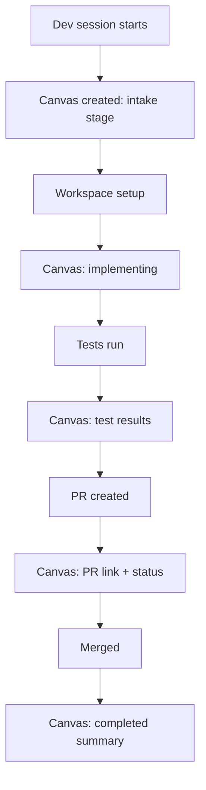

## Outcome

After this ships, running `/pm:dev` creates a canvas that updates as the dev session progresses. The user sees: current stage (intake, workspace, implement, review, ship), test pass/fail counts, PR link when created, merge status. For epics, the canvas shows a sub-issue progress table. The dashboard becomes the build monitor.

## Acceptance Criteria

1. The dev skill (single-issue flow) writes `current.html` to `.pm/sessions/dev-{slug}/` at each stage transition.
2. The canvas HTML shows: issue title, current stage, test results (pass/fail count from last run), and PR link (when available).
3. The epic flow writes `current.html` to `.pm/sessions/epic-{parent-slug}/` with a sub-issue progress table showing status per sub-issue.
4. Each write emits a `canvas_update` SSE event with the session slug.
5. The dev canvas HTML follows the same structure as groom companion (uses `dashboardPage()` shell, same CSS variables, phase stepper adapted for dev stages).
6. At session completion, the canvas shows a summary card (files changed, tests passed, PR link, merge status) and the `.state` file is set to `completed`.

## User Flows

## Wireframes

N/A — follows groom companion layout pattern with dev-specific content.

## Technical Feasibility

- **Build on:** PM-104 canvas infra. Groom companion HTML template pattern. Dev state file already tracks stage, branch, PR number.
- **Build new:** HTML template function for dev canvas (~40 lines), canvas writes at each dev stage transition (~5 lines per stage), epic canvas variant with sub-issue table.
- **Risk:** Dev flow has many sub-flows (single, epic, bugfix). Start with single-issue + epic only. Bugfix canvas is future scope.

## Decomposition Rationale

Workflow Steps — step 3. Extends canvas from groom-only to dev, proving the multi-skill pattern.
