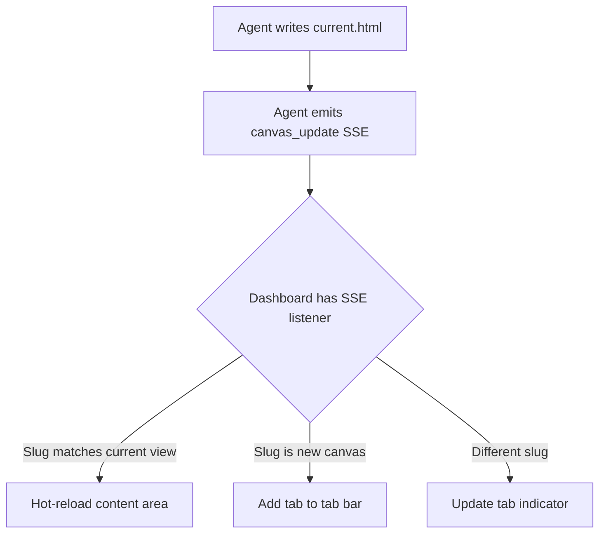

## Outcome

After this ships, the dashboard has a canvas navigation system. Active groom and dev sessions appear in a sidebar or tab bar. Clicking one loads its `current.html` in the main content area. When the file updates (agent writes new content), the canvas hot-reloads via SSE. The existing groom companion becomes the first canvas — no behavior change for groom, but now it's part of a system that dev and other skills can plug into.

## Acceptance Criteria

1. A new `canvas_update` SSE event type is added to the event bus. Payload: `{ type: "canvas_update", slug: "{type}-{slug}", label: "{display name}" }`.
2. The dashboard detects active canvases by scanning `.pm/sessions/` for directories containing `current.html`. Each directory name is the canvas ID (e.g., `groom-my-feature`, `dev-add-auth`).
3. When one or more canvases exist, a canvas tab bar appears below the page header on the home page. Each tab shows the canvas label (derived from directory name: strip prefix, humanize slug).
4. Clicking a canvas tab navigates to `/session/{slug}` which renders `current.html` in the main content area (existing route, already works for groom companion).
5. When a `canvas_update` SSE event fires for the currently viewed canvas, the content area reloads automatically without full page refresh. Implementation: listen for `canvas_update` events, if slug matches current view, fetch and replace the content area innerHTML.
6. When no canvases exist, the tab bar is hidden. Home page looks unchanged.
7. The canvas tab bar indicates the currently active canvas with a highlighted style (bottom border accent color).
8. Canvas tabs are ordered by last-modified time (most recently updated first).

## User Flows

## Wireframes

N/A — the tab bar is a simple horizontal strip. Too small for a standalone wireframe.

## Technical Feasibility

- **Build on:** `/session/{slug}` route already serves groom companion HTML. SSE event bus exists with ring buffer and broadcast. `readAllActiveSessions()` discovers groom + dev sessions. File watcher triggers reload.
- **Build new:** (1) Canvas tab bar HTML/CSS in `dashboardPage()` shell (~30 lines), (2) `canvas_update` event emission from skills (~5 lines per skill), (3) Client-side SSE listener for hot-reload (~20 lines JS), (4) Canvas discovery scan in dashboard home handler.
- **Risk:** Hot-reload via innerHTML replacement may flash. Mitigation: fade transition (150ms opacity).

## Decomposition Rationale

Workflow Steps — this is step 1. Delivers the foundation: sidebar + hot-reload. All subsequent issues build on this.

## Research Links

- [Groom Visual Companion Patterns](pm/research/groom-visual-companion/findings.md)
- [SSE Event Bus Patterns](pm/research/sse-event-bus/findings.md)
