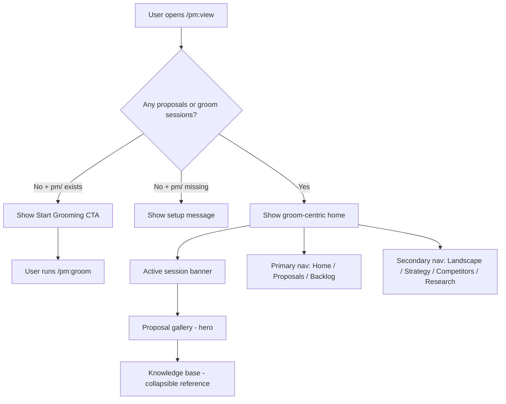

## Outcome

The PM dashboard fully orbits groom. When a user opens `/pm:view`:

- **Empty state (no proposals, no sessions):** A prominent "Start Grooming" CTA with a brief explanation of what groom does. Not a blank page, not a knowledge-base overview with empty badges.
- **Active state (sessions/proposals exist):** Active groom sessions at the top. Proposal gallery as the centerpiece. Backlog grouped by proposal. Research, strategy, and competitors in a collapsible "Knowledge Base" reference section — visible but not primary.
- **Navigation:** Groom/proposals and backlog are primary nav. Knowledge base (landscape, strategy, competitors, research) is secondary nav.

## Acceptance Criteria

1. Dashboard home page (`/` or `/home`) shows a prominent "Start Grooming" CTA when no proposals exist and no groom sessions are active. CTA includes brief copy explaining what `/pm:groom` does.
2. The empty-state CTA only appears when `pm/` directory exists but `pm/backlog/proposals/` is empty and no active groom sessions exist in `.pm/groom-sessions/`. When `pm/` does not exist at all, the existing setup-oriented message is preserved.
3. `suggestedNext` priority chain reordered: `/pm:groom` is surfaced first (above `/pm:strategy`), reflecting the groom-centric hierarchy.
4. Navigation restructured into two tiers: Primary (Home, Proposals, Backlog) and Secondary/Reference (Landscape, Strategy, Competitors, Research).
5. Home page layout: (a) active groom session banner (existing, from PM-025), (b) proposal gallery as hero (existing), (c) knowledge base summary as collapsible reference section (new — replaces the current card-grid of landscape/strategy/competitors badges).
6. The knowledge base reference section shows status badges (landscape: exists/missing, strategy: exists/missing, competitors: N profiled) with links to their respective pages — not full content inline.
7. Test coverage: `tests/server.test.js` updated with tests for (a) empty-state CTA rendering, (b) `suggestedNext` ordering with groom first, (c) navigation tier structure.
8. Existing dashboard functionality (proposal gallery, backlog kanban, competitor profiles, wireframe embeds, positioning map) is preserved — no regressions.

## User Flows

## Wireframes

To be generated during implementation planning — the dashboard is the primary UI surface and warrants a wireframe at plan time.

## Competitor Context

Productboard pivoted its entire homepage to make Spark the hero, demoting the core platform to secondary navigation — a commitment that validates the pattern but also shows the cost of half-measures. PM-025 moved proposals to hero but left the knowledge-base card grid as primary navigation, creating a split signal. This issue completes the pivot: research/strategy/competitors become reference material, groom becomes the unambiguous center. No other editor-native competitor (Compound Engineering, gstack, Superpowers) has a dashboard at all — the dashboard is a PM-unique surface and a direct competitive advantage for retention once a user has sessions/proposals.

## Technical Feasibility

- **Build-on:** `scripts/server.js` `handleDashboardHome()` (lines 1573-1731) already renders groom session banner, proposal gallery, and `suggestedNext`. `readGroomState()` (lines 1224-1256) reads session state. PM-025 already did the heavy restructuring — this is incremental on top of that foundation.
- **Build-new:** (a) Empty-state CTA branch in `handleDashboardHome()` for the proposals-zero + sessions-zero case, (b) Navigation restructuring (primary vs secondary tier) — this is a global change: `dashboardPage()` at line 843 is the shell called by ALL route handlers, so the nav tier change touches every page. New CSS needed for secondary nav tier (existing CSS at line 456 has a single `nav` style). Active-link highlight logic must work for both tiers. (c) Collapsible knowledge base reference section replacing the current card-grid, (d) Test updates in `tests/server.test.js` — note: existing test at line 147 asserts `/pm:strategy` in no-strategy case; must replace with `/pm:groom` assertion, not just add alongside.
- **Risk:** Dashboard has two distinct empty states (no `pm/` dir vs `pm/` with no content) — CTA targets only the latter. The `suggestedNext` ordering change affects onboarding flow guidance with no existing test coverage for the edge case. `server.js` is 3500+ lines — changes need surgical precision.
- **Sequencing:** Can run parallel with PM-055 after PM-053/054 are done. Dashboard changes are runtime code (server.js) while messaging changes are static content.

## Research Links

- [Groom-Centric Entry Point](pm/research/groom-hero/findings.md)

## Notes

- Decomposition rationale: Workflow Steps pattern — this is the visual/dashboard layer that reinforces the groom-centric hierarchy. Split from messaging because this is runtime server.js code with test requirements, while messaging is static content.
- PM-025 (Dashboard Proposal-Centric Redesign, done) already moved proposals to hero. This issue builds on that foundation — it's not a from-scratch rewrite.
- The competitive strategist noted the dashboard should surface "your first groom session creates a knowledge base that grows with every session" — the persistence narrative.
