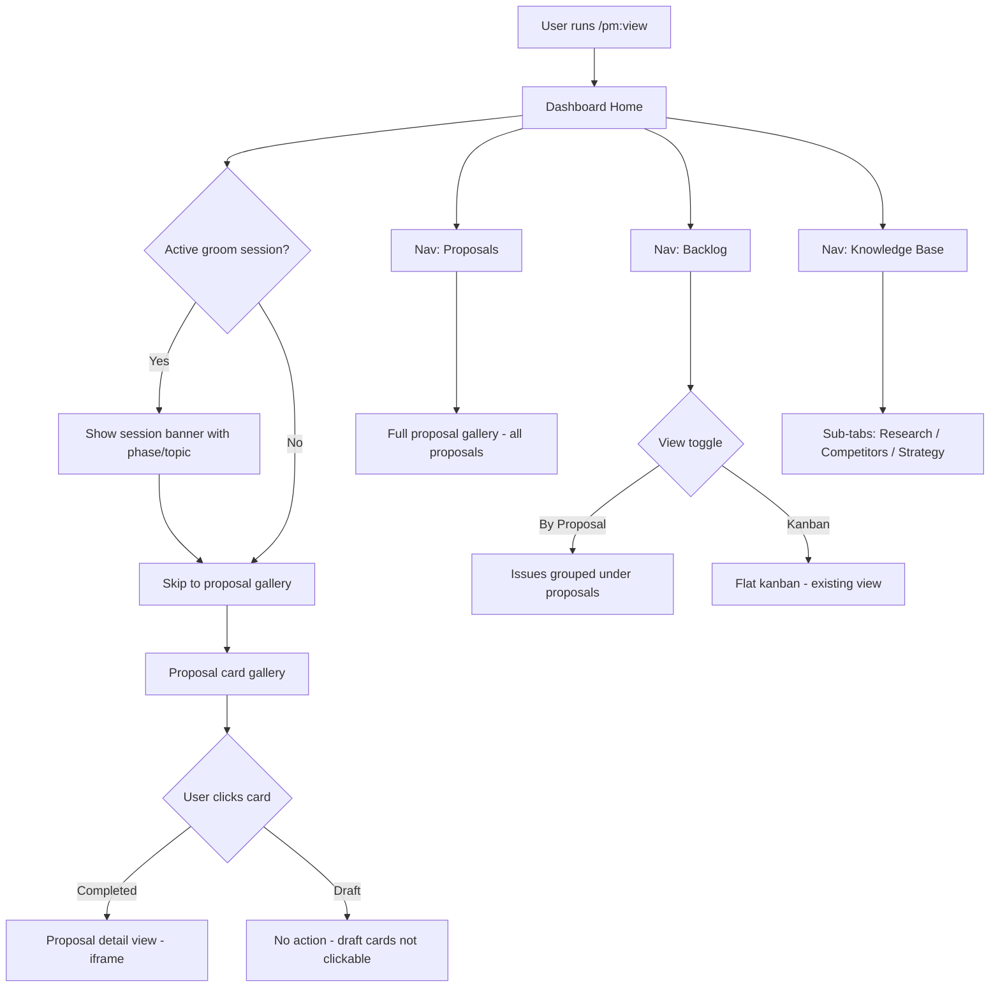

## Outcome

Users open `/pm:view` and the dashboard reflects PM's actual workflow hierarchy: groom/proposals as the hero, everything else as supporting context. The active groom session is prominently displayed at top. Completed and in-progress proposals are shown as a card gallery. Backlog issues are grouped by their parent proposal so users see *why* each issue exists. Research, competitors, and strategy move into a Knowledge Base reference shelf.

Before this ships, the dashboard treats all sections (research, strategy, backlog) as equal peers — burying the proposal artifact that represents PM's highest-quality output. After this ships, the dashboard becomes a natural visual companion to the groom workflow.

## Acceptance Criteria

1. Home page shows active groom session indicator when `.pm/.groom-state.md` exists.
2. Home page displays proposal card gallery with completed and draft proposals.
3. Navigation restructured to Home → Proposals → Backlog → Knowledge Base.
4. Knowledge Base contains Research, Competitors, and Strategy as sub-tabs.
5. Backlog default view groups issues by parent proposal with toggle to flat kanban.
6. Proposal detail view embeds proposal HTML within dashboard frame via iframe.
7. `phase-5.8` writes `proposal-meta.json` sidecar alongside each proposal HTML.
8. All existing dashboard URLs (`/research`, `/strategy`, `/backlog`, `/competitors/*`) continue to resolve (redirects acceptable).
9. Empty states render gracefully when no proposals or groom session exist.

## User Flows

## Wireframes

[Wireframe preview](pm/backlog/wireframes/dashboard-proposal-hero.html)

## Competitor Context

Productboard places "initiatives" (equivalent to proposals) as the hero artifact between strategy and tasks. Their Document boards integrate discovery output with delivery planning. No editor-native PM tool has a proposal gallery — this is greenfield differentiation. ChatPRD has a document gallery (750K+ docs) but their documents are prompt-generated, not codebase-grounded or multi-phase-reviewed.

## Technical Feasibility

**Verdict: Feasible with caveats.**

**Build-on:** `scripts/server.js` has `dashboardPage()` with nav generation from `navLinks` array (line 720-725), existing `.card-grid` and `.card` CSS (lines 430-438), badge system (lines 510-523), wireframe iframe embed pattern (lines 2102-2123), backlog scanner with parent/child resolution (lines 2125-2152), and recursive file watcher (lines 2405-2453).

**Key risk:** Proposal HTML files have no structured metadata — a sidecar convention must be established before gallery work starts. Also, `server.js` currently never reads outside `pmDir` (`pm/`), but `.pm/.groom-state.md` lives one level up. Path resolution needs care.

**Sequencing:** Metadata sidecar first → gallery page → detail view → active session → nav restructure → backlog grouping.

## Research Links

- [Dashboard Proposal-Centric Redesign](pm/research/dashboard-proposal-centric/findings.md)

## Notes

- The dashboard remains a read-only companion to the CLI — no actions are driven from the dashboard.
- Deferred: real-time WebSocket phase streaming, companion mode groom integration, proposal status workflow.
- Success metric: percentage of users who open `/pm:view` within the same session they run `/pm:groom`. This is aspirational — PM does not collect product analytics per strategy non-goal #3. **Validated assumption gap:** no empirical signal from actual PM users supports the current dashboard being a problem. Post-ship measurement: community survey in changelog, GitHub Discussions feedback thread, and tracking once PM-023 (public dashboard) ships and provides an analytics surface.
- **Backlog interactions:** PM-008 (dashboard action hints, done) adds "Suggested next" sections to the home page — these must survive the redesign and be repositioned within the new home page layout. PM-013 (pm:example, drafted) shares `dashboardPage()` and must account for the new nav structure after this initiative ships. PM-023 (public-hosted-demo-dashboard, idea) becomes more compelling with proposal gallery — undocumented sequencing synergy.
- **Empty state for new users:** A user who has never run `/pm:groom` sees no active session banner and no proposal cards. The empty state must be more welcoming than the current stats overview — explain what groom does, show the value proposition, and provide a clear CTA (`/pm:groom`). This is covered by PM-028 AC #7 but deserves design attention.
- **Multi-iteration proposals:** If a bar raiser returns "send-back" and the proposal is re-groomed, the sidecar is overwritten with updated verdict. The gallery always shows the latest state. Historical verdicts are not tracked (deferred with proposal status workflow).

## Dependencies & Sequencing

Implementation order (each step depends on the previous):
1. **PM-026** (Metadata Sidecar) — foundation, defines shared helpers and JSON schema
2. **PM-027** (Active Session Indicator) — can start after PM-026 (uses `readGroomState()`)
3. **PM-028** (Proposal Gallery) — can start after PM-026 (uses `readProposalMeta()`)
4. **PM-029** (Nav Restructure) — independent, can parallel with PM-027/PM-028
5. **PM-031** (Proposal Detail) — after PM-028 (gallery provides navigation to detail)
6. **PM-030** (Backlog Grouping) — after PM-026 (uses `readProposalMeta()`), ideally after PM-028/PM-031 so group header links work
