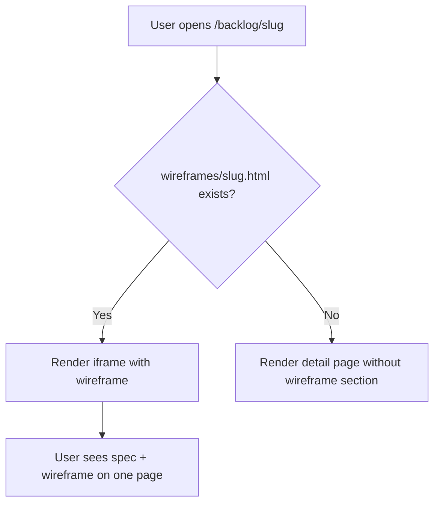

## Outcome

When viewing a backlog item in the PM dashboard, if a wireframe HTML file exists at `pm/backlog/wireframes/{slug}.html`, it is embedded inline via `<iframe>` on the detail page. Users see the full issue spec — outcome, acceptance criteria, user flows, competitor context — and the wireframe preview all on one page without navigating away.

## Acceptance Criteria

1. `handleBacklogItem()` in `server.js` checks for `pm/backlog/wireframes/{slug}.html` on each detail page load.
2. If wireframe exists, an `<iframe>` is rendered in the detail page below the `## Wireframes` heading.
3. The iframe has responsive height, a subtle border, and a label ("Wireframe Preview").
4. A new route `/backlog/wireframes/{slug}` serves the wireframe HTML file.
5. If no wireframe file exists, the section shows nothing (no broken iframe or placeholder).
6. The wireframe renders correctly within the iframe (CSS isolation from dashboard styles).
7. Edge case: slug contains special characters — path is sanitized.

## User Flows

## Competitor Context

No PM tool embeds visual wireframes inline with issue specs. Productboard, ChatPRD, and PM Skills Marketplace all produce text-only output. The closest analogue is CodeGuide, which generates wireframes alongside PRDs but as separate files in a project bootstrapping context, not inline in a persistent dashboard.

## Technical Feasibility

**Verdict: Feasible as scoped.**
- **Build-on:** `handleBacklogItem()` (server.js ~line 2071) already renders backlog detail pages. The server already serves static files and has route handling.
- **Build-new:** A new route for serving wireframe HTML files. An iframe embed block in the detail page HTML. CSS for the iframe container.
- **Risk:** Low. Iframe embedding is standard web pattern. CSS isolation is automatic with iframes. The main risk is iframe height — may need a fixed height or JS-based auto-resize.
- **Sequencing:** Depends on PM-015 (wireframe files must exist to embed). Can be built in parallel if a sample wireframe HTML file is created first for testing.

## Research Links

- [PRD-Grade Groomed Output](pm/research/prd-grade-output/findings.md)

## Notes

- Iframe approach chosen for CSS isolation — wireframe styles won't conflict with dashboard styles.
- Wireframe files are also standalone-viewable by opening directly in browser.
- Consider adding a "Open in new tab" link alongside the iframe for full-screen viewing.
