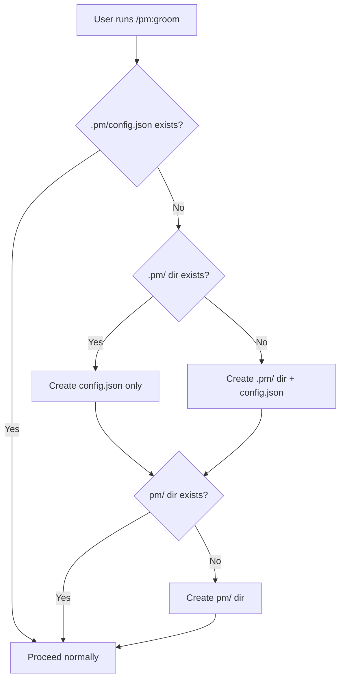

## Outcome

A user installs PM on a new project and runs `/pm:groom <idea>` or `/pm:research <topic>` as their very first command. Instead of hitting an error or being told to run `/pm:setup`, the system silently creates `.pm/config.json` with sensible defaults and proceeds. Setup becomes an optional advanced configuration command, not a prerequisite.

## Acceptance Criteria

1. When `/pm:groom` starts and `.pm/config.json` does not exist, groom Phase 1 creates `.pm/config.json` with the nested schema matching setup: `{ "config_schema": 1, "integrations": { "linear": { "enabled": false }, "seo": { "provider": "none" } }, "preferences": { "visual_companion": true, "backlog_format": "markdown" } }`. No `project_name` field (server.js `getProjectName()` already falls back to parent directory name).
2. When `/pm:research` starts and `.pm/config.json` does not exist, research creates the same default config before proceeding. Research's guard also creates `pm/` and `pm/research/` directories.
3. If `.pm/` directory exists but `config.json` does not (partial state), the bootstrap creates the file without clobbering existing `.pm/` contents (e.g., existing `groom-sessions/`).
4. If `.pm/config.json` already exists, the bootstrap is a no-op — no overwriting, no merging. If it exists but fails schema validation (malformed JSON), groom warns the user and proceeds with in-memory defaults.
5. The bootstrap creates `.pm/` directory if it doesn't exist. Groom's guard creates `.pm/` and `.pm/groom-sessions/`.
6. The `pm/` knowledge base directory is also created if it doesn't exist (needed for strategy.md, backlog/, etc.).
7. No error message, warning, or prompt to run `/pm:setup` is shown to a user whose first command is `/pm:groom` or `/pm:research` on a fresh project.

## User Flows

## Wireframes

N/A — no user-facing workflow for this feature type.

## Competitor Context

PM Skills Marketplace and Superpowers activate on install without a prerequisite setup command. cc-sdd's `/kiro:spec-init` bootstraps its environment on first use. Evil Martians (2026) identifies "works out of the box" as a primary trust signal for developer tool adoption — a user hitting a setup gate before their first real command is a trust failure, not just a friction point. PM is currently the only tool requiring a dedicated setup step before first use. This is also the moment PM's knowledge base starts — PM Skills Marketplace never has this moment; every session starts from nothing.

## Technical Feasibility

- **Build-on:** Groom Phase 1 (`phase-1-intake.md` line 64) already creates `.pm/groom-sessions/` — bootstrap inserts at the same step. Server.js `getProjectName()` (line 1014) already handles missing `project_name` in config.
- **Build-new:** Config bootstrap guard in groom Phase 1 and research SKILL.md. One guard each, identical logic.
- **Risk:** Idempotency — must check file absence before writing, not clobber partial state. One-line guard.
- **Sequencing:** This is the keystone. Issues 2-4 depend on this working.

## Research Links

- [Groom-Centric Entry Point](pm/research/groom-hero/findings.md)

## Notes

- Decomposition rationale: Workflow Steps pattern — this is the first step in the user journey (install → first command). Split from inline strategy because bootstrap is unconditional while strategy is conditional on Phase 2.
