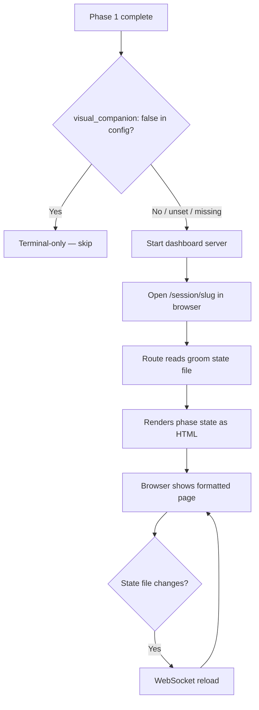

## Outcome

After this ships, any groom session can open a browser companion. The dashboard server serves a `/session/{slug}` route that renders the groom session's current phase state as a formatted HTML page. The page auto-updates via WebSocket when the session state changes. A placeholder screen ("Phase in progress...") is shown for early phases. This is the MVP vertical slice — it makes the companion functional before per-phase rich HTML is added.

## Acceptance Criteria

1. A new `/session/{slug}` route is added to `routeDashboard()` in `scripts/server.js`. The route reads `.pm/groom-sessions/{slug}.md`, renders the current phase state (topic, phase, scope, verdicts) as formatted HTML using the existing `dashboardPage()` shell, and returns it.
2. If `.pm/sessions/groom-{slug}/current.html` exists, the route serves that file instead of the rendered state file. This allows per-phase HTML (PM-061) to override the default view without changes to the route handler.
3. If the slug doesn't match any groom session, the route returns a "Session not found" page with a link back to the dashboard home.
4. The dashboard server watches `.pm/sessions/` for file changes using the same `watchDirectoryTree()` pattern as `pmDir`. The sessions path is resolved as `path.resolve(pmDir, '..', '.pm', 'sessions')` — the same traversal pattern used by `readGroomState()`. When the server shuts down, no file watchers remain open on the `.pm/sessions/` directory.
5. After Phase 1 completes in the groom skill (`phase-1-intake.md`), the dashboard opens automatically. If `.pm/config.json` exists and has `visual_companion: false`, the dashboard is skipped silently. In all other cases (key unset, file missing, or `true`), the dashboard opens — dashboard-first is the default, no prompt needed.
6. When `visual_companion` is true, the skill ensures the dashboard server is running (using the existing `start-server.sh --mode dashboard`), reads the `url` field from the server's JSON output, and opens `{url}/session/{slug}` in the default browser.
7. `.pm/sessions/` is added to `.gitignore` if not already present.
8. Multiple concurrent groom sessions are supported — each writes to `.pm/sessions/groom-{slug}/` and is served at `/session/{slug}`. The route handler does not assume a single active session.
9. The server binds to `127.0.0.1` only (not `0.0.0.0`) — matching the existing dashboard server behavior.

## User Flows

## Wireframes

N/A — the session page renders groom state dynamically, not from a static wireframe.

## Competitor Context

No AI PM competitor offers a live session view during product grooming. ChatPRD, Productboard Spark, and Kiro are single-surface tools (browser-only or IDE-only). MetaGPT X comes closest with agent workflow visualization, but targets orchestration dashboards, not per-phase product grooming output. Playwright's `--ui` flag is the closest UX precedent outside the PM space — an opt-in browser mode alongside terminal execution. PM adopts this pattern for product grooming rather than test debugging.

## Technical Feasibility

**Verdict: Feasible as scoped.**

**Build-on:**
- `scripts/server.js:1026` — `routeDashboard()` URL dispatch chain. The `/session/{slug}` route follows the same `else if (urlPath.startsWith('/session/'))` pattern as `/proposals/`, `/backlog/`, `/research/`.
- `scripts/server.js:1224` — `readGroomState()` already reads `.pm/groom-sessions/*.md` and returns structured objects with `_slug`, `topic`, `phase`, `scope`, verdicts.
- `scripts/server.js:774-783` — `.groom-session` CSS classes already defined (dot, topic, meta, pulse animation).
- `scripts/server.js:1206` — `GROOM_PHASE_LABELS` map covers all 10 groom phases with human-readable labels.
- `scripts/server.js:284` — `renderMarkdown()` inline renderer for converting state content to HTML.
- `scripts/server.js:3196-3198` — `watchDirectoryTree()` pattern for adding a second watched root.

**Build-new:**
- `handleGroomSession(res, pmDir, slug)` function — reads groom state, checks for `current.html` override, renders default view.
- Second `watchDirectoryTree()` call for `.pm/sessions/` with cleanup in `server.close`.
- New step in `skills/groom/phases/phase-1-intake.md` for opt-in prompt and config persistence.

**Architectural note — WebSocket vs SSE:** Research recommended SSE for its simplicity and one-way fit. The implementation uses WebSocket instead because the dashboard server already has a proven WebSocket live-reload pipeline (`broadcastDashboard()` + `watchDirectoryTree()`). Building on existing infrastructure avoids adding a second real-time channel. The tradeoff: WebSocket broadcasts reload to all connected tabs (session A's update also reloads session B). Acceptable for v1 — targeted per-session SSE channels are a v2 optimization if concurrent usage warrants it.

**Namespace note:** Groom sessions use `.pm/sessions/groom-{slug}/` prefix to avoid collision with companion-mode's `.pm/sessions/{pid}-{timestamp}/` directories. The watcher on `.pm/sessions/` fires on both, but the `groom-` prefix makes the route handler's slug resolution unambiguous.

**Sequencing:**
1. Add `/session/{slug}` route handler to `routeDashboard()`
2. Extend file watcher to `.pm/sessions/`
3. Add opt-in step to Phase 1

## Research Links

- [Groom Visual Companion Patterns](pm/research/groom-visual-companion/findings.md)

## Notes

- The default rendered view (from groom state YAML) is a useful fallback even without per-phase HTML. It shows topic, current phase, scope items, and review verdicts in a clean layout.
- The `current.html` override (AC2) enables PM-061 to progressively enhance the view without touching the route handler.
- Decomposition rationale: Workflow Steps pattern — this is the first step in the pipeline (server can serve session pages). Independent of Child 2 (phase HTML) and Child 3 (dashboard integration).
