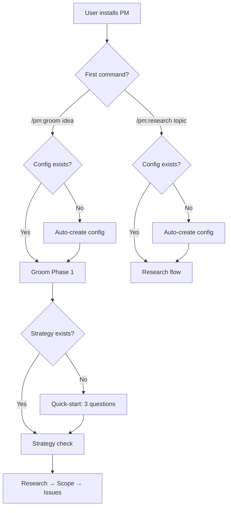

## Outcome

Users install PM and their first productive command is `/pm:groom <idea>`. Everything they need — config, strategy, research — bootstraps on-demand as part of the groom flow. `/pm:research` works the same way as a second hero entry point. Setup, strategy, ideate, and other commands still exist but serve the two heroes rather than gating them.

The dashboard reflects this: groom sessions and proposals are the primary view, research and strategy are reference material. A new user opening the dashboard sees a clear "Start Grooming" CTA, not a knowledge-base overview with empty badges.

## Acceptance Criteria

1. A brand new project with no `.pm/` directory can run `/pm:groom <idea>` and reach Phase 1 without errors — no setup-gate message or prompt to run `/pm:setup` is shown.
2. A brand new project can run `/pm:research <topic>` without prior setup — same zero-friction guarantee.
3. Users who have no strategy can unblock grooming inline without running the full strategy skill (see PM-054).
4. README "Get Started" section leads with `/pm:groom <idea>` as the first command.
5. `using-pm/SKILL.md` positions groom and research as primary entry points.
6. SessionStart hook setup check is a hint, not a warning.
7. Dashboard home page shows a prominent "Start Grooming" CTA when no proposals/sessions exist.
8. Dashboard restructured with proposals and groom sessions as primary, research/strategy as reference. Dashboard copy communicates that sessions accumulate knowledge (e.g., "X sessions, Y proposals, Z research topics").
Note: Parent ACs are met when all four children (PM-053 through PM-056) close — not independently testable.

## User Flows

## Wireframes

N/A — workflow feature. Dashboard sub-issue (PM-056) will have its own wireframe.

## Competitor Context

No competitor requires a linear setup pipeline. cc-sdd's `/kiro:spec-init` is the closest pattern — single command that bootstraps the full pipeline. Superpowers auto-activates skills contextually. gstack has independent role-based commands. PM is currently the only tool that requires 3 commands before doing real work.

## Technical Feasibility

Feasible with caveats. Key findings from EM review:
- Groom Phase 1 (`phase-1-intake.md` line 64) already creates `.pm/groom-sessions/` — config bootstrap inserts at same step
- Phase 2 (`phase-2-strategy.md` lines 8-14) already handles missing strategy — quick-start is additive to existing branch
- `check-setup.sh` warning is already non-blocking — softening is a text change
- Dashboard `handleDashboardHome()` already has `suggestedNext` logic promoting `/pm:groom`
- Caveat: Quick-start strategy writes only Sections 2/6/7, but scope review agents read Sections 3/4 — degraded (not broken) review for quick-start users

## Research Links

- [Groom-Centric Entry Point](pm/research/groom-hero/findings.md)
- [PM+Dev Plugin Merge](pm/research/pm-dev-merge/findings.md)

## Notes

- Success metrics: grooming rates (% of issues that go through groom), groomed issues entering dev with reduced ceremony
- The competitive strategist noted: surface strategy grounding in groomed output to make differentiation visible from first session
