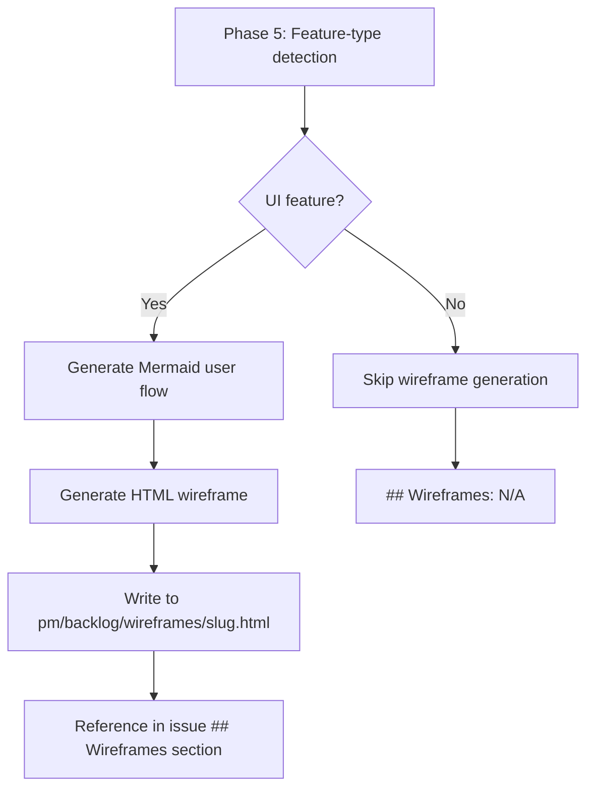

## Outcome

When a user grooms a UI feature with `/pm:groom`, Phase 5 detects the UI feature type and generates a standalone HTML wireframe file at `pm/backlog/wireframes/{slug}.html`. The wireframe uses lo-fi CSS (boxes, labels, placeholders — inspired by superpowers' Visual Companion `.mockup`, `.mock-nav`, `.mock-button` patterns) and is grounded in the feature scope and research, not a generic template. Engineers and coding agents can open the file in any browser to see the proposed layout.

## Acceptance Criteria

1. Phase 5 Step 1 confirms feature type with user before generating wireframe.
2. For UI features, a standalone HTML file is written to `pm/backlog/wireframes/{slug}.html`.
3. The HTML file includes a self-contained `<style>` block — no external dependencies.
4. The wireframe shows screen layout with labeled components (nav, sidebar, forms, buttons, tables, etc.).
5. The wireframe renders correctly when opened directly in a browser.
6. Non-UI features (API, data, infrastructure) skip wireframe generation entirely.
7. The SKILL.md Phase 5 Step 2 instructions guide the LLM to generate grounded wireframes citing scope and research.

## User Flows

## Competitor Context

No competitor generates visual wireframes as part of product grooming. CodeGuide generates wireframes but for project bootstrapping, not ongoing PM. UX Pilot, Figma AI, MockFlow generate wireframes standalone but disconnected from product strategy or research context. PM would be the first to produce strategy-grounded wireframes embedded in the grooming workflow.

## Technical Feasibility

**Verdict: Feasible as scoped.**
- **Build-on:** Phase 5 already has feature-type detection (Step 1) and Mermaid generation (Step 2). The wireframe generation is a new branch within Step 2.
- **Build-new:** LLM instruction block in SKILL.md defining the HTML wireframe format, lo-fi CSS vocabulary, and grounding requirements.
- **Risk:** LLM reliability for generating valid HTML layouts. Mitigated by using simple CSS (flexbox/grid with labeled divs) rather than pixel-precise positioning. Lo-fi fidelity is forgiving.
- **Sequencing:** This should be built first — the dashboard embed (PM-016) and template update (PM-017) depend on wireframe files existing.

## Research Links

- [PRD-Grade Groomed Output](pm/research/prd-grade-output/findings.md)

## Notes

- Lo-fi CSS vocabulary inspired by superpowers Visual Companion: `.mockup`, `.mock-nav`, `.mock-sidebar`, `.mock-button`, `.mock-input`, `.placeholder`
- HTML wireframe format chosen over structured HTML comments (simpler, no parser needed), Mermaid (can't do layouts), inline SVG (LLM unreliable), ASCII (too crude)
- Pencil MCP integration deferred to v2.5 as optional high-fidelity upgrade
