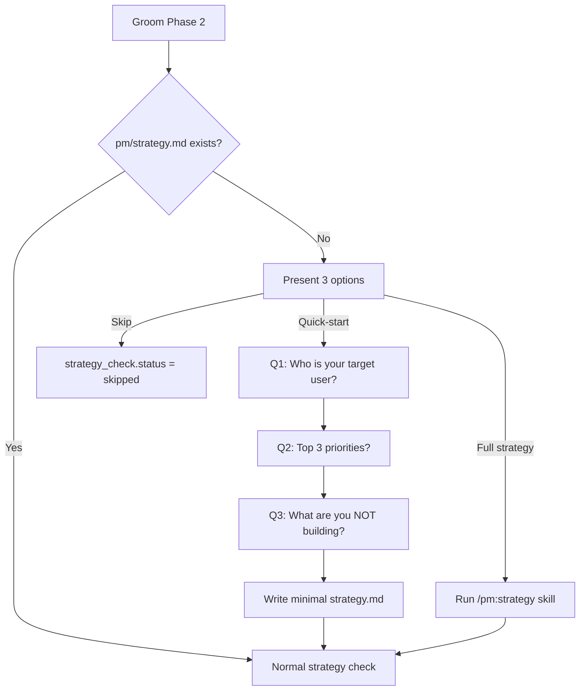

## Outcome

When groom Phase 2 detects no `pm/strategy.md`, it offers three options instead of two: (a) run full `/pm:strategy`, (b) quick-start strategy — answer 3 questions and get a minimal strategy that unblocks grooming, (c) skip at your own risk. The quick-start strategy asks for ICP, top 3 priorities, and explicit non-goals, then writes a minimal `pm/strategy.md` with Sections 2, 6, and 7 populated. This is enough to pass the strategy gate and ground the groom session in real product context.

## Acceptance Criteria

1. Groom Phase 2, when `pm/strategy.md` is missing, presents three options: (a) full strategy skill, (b) quick-start (3 questions), (c) skip.
2. Quick-start asks exactly 3 questions, one at a time: (1) "Who is your target user?" → populates Section 2 (ICP), (2) "What are your top 3 priorities right now?" → populates Section 6, (3) "What are you explicitly NOT building?" → populates Section 7 (non-goals).
3. Quick-start writes `pm/strategy.md` with frontmatter (`type: strategy`, `created`, `updated`) and Sections 1 (one-line product identity derived from answers), 2, 6, and 7.
4. Sections 3 (value prop) and 4 (competitive positioning) are written as explicit stubs: "Not yet defined — run `/pm:strategy` to expand." Sections 5 (GTM), 8 (success metrics), and 9 (backlog notes) are omitted entirely.
5. The minimal strategy passes the Phase 2 strategy gate: gate checks that `pm/strategy.md` exists, frontmatter has `type: strategy`, and Sections 2, 6, and 7 are present and non-empty. `strategy_check.status = passed`.
6. Scope review agents (Phase 4.5) that reference Sections 3/4 encounter the "Not yet defined" stubs and produce a review noting the sections are pending — no errors, review explicitly states competitive positioning was not evaluated. Update `phase-4.5-scope-review.md` Agent 1 and Agent 2 prompts to check for stub content before relying on those sections.
7. A groom session that used quick-start strategy produces a proposal that references the ICP answer from the quick-start in the target audience context — the strategy grounds the output, not just the gate.
8. The quick-start flow completes in under 2 minutes of user interaction time (3 questions, no follow-ups).

## User Flows

## Wireframes

N/A — no user-facing workflow for this feature type.

## Competitor Context

Martin Fowler's core observation about Kiro — "it assumes a developer would do all this analysis" — cuts both ways for PM. PM's answer is to do the analysis, but the old PM assumed you'd already done it (run setup, research, strategy). cc-sdd's `/kiro:spec-init` starts building immediately with no strategy step. Compound Engineering's `workflow:plan` has no strategy prerequisite. PM's differentiator: we do the analysis but remove the prerequisite assumption. The quick-start preserves strategy grounding while eliminating friction — the user gets ICP-aligned groomed issues from a 3-question inline flow, something neither cc-sdd nor Compound Engineering can produce.

## Technical Feasibility

- **Build-on:** Phase 2 (`phase-2-strategy.md` lines 8-14) already handles the missing-strategy case with a two-option branch. Adding a third option is additive.
- **Build-new:** Quick-start interaction flow (3 questions), minimal strategy.md template, and the write logic. No existing quick-start template exists anywhere in the codebase.
- **Risk:** Scope review agents in `phase-4.5-scope-review.md` prompt PM and Competitive agents to read Sections 3 and 4. With a minimal strategy, these sections don't exist — agents will produce degraded (not broken) reviews. This is a known caveat, not a blocker.
- **Sequencing:** Depends on PM-053 (config bootstrap) so the `.pm/` directory exists.

## Research Links

- [Groom-Centric Entry Point](pm/research/groom-hero/findings.md)

## Notes

- Decomposition rationale: Workflow Steps pattern — this is the second step (strategy creation) in the groom flow. Split from config bootstrap because strategy is conditional (only runs when strategy.md is missing) while bootstrap is unconditional.
- Open question from research: "Can we derive a minimal strategy from the first groom session's research?" — explicitly out of scope for this issue. User provides ICP/priorities explicitly.
