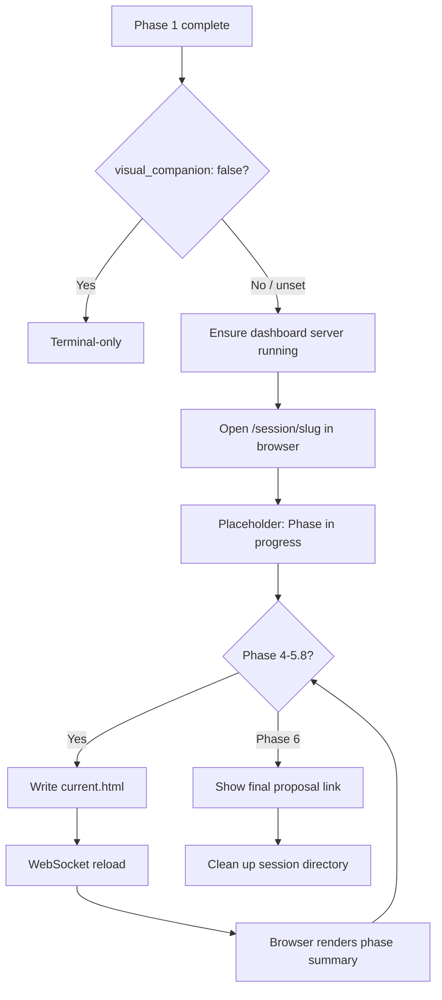

## Outcome

After this ships, every groom session opens the dashboard automatically. The browser shows a clean, formatted view of the current phase — scope grid, review verdicts, issue cards — that updates as the session progresses. The terminal becomes a lightweight channel for questions and approvals while the dashboard carries the rich content. Multiple concurrent groom sessions each get their own URL at `/session/{slug}`. Users can opt out via config, but dashboard-first is the default.

## Acceptance Criteria

1. At the start of a groom session (after Phase 1), the dashboard opens automatically. If `.pm/config.json` has `visual_companion: false`, the dashboard is skipped. Default is true (dashboard-first).
2. When enabled, the dashboard server serves a `/session/{slug}` route showing the current phase output as formatted HTML.
3. Phases 4, 4.5, 5, 5.5, 5.7, and 5.8 write a `current.html` file to `.pm/sessions/groom-{slug}/` summarizing that phase's key output.
4. Non-visual phases (1-3, 6) show a "Phase in progress..." placeholder in the browser.
5. Multiple concurrent groom sessions are supported — each at its own `/session/{slug}` URL.
6. Dashboard home shows active groom sessions with links to their companion pages.
7. Phase 6 cleans up `.pm/sessions/groom-{slug}/` after issue creation completes.
8. `.pm/sessions/` is gitignored.

## User Flows

## Wireframes

N/A — the companion screens are generated per-phase by the groom skill, not designed as static wireframes.

## Competitor Context

No competitor offers a live visual companion during product grooming. ChatPRD is browser-only. Productboard Spark is browser-only. Kiro is IDE-only. Compound Engineering is terminal-only. MetaGPT X has agent workflow visualization but targets orchestration, not product grooming output. PM's terminal-for-conversation, browser-for-substance approach is unique.

## Technical Feasibility

**Verdict: Feasible with caveats.**

**Build-on:**
- `scripts/server.js` — `routeDashboard()` URL dispatch pattern, `watchDirectoryTree()` + `broadcastDashboard()` WebSocket live-reload, `readGroomState()` already parses `.pm/groom-sessions/*.md`
- `scripts/server.js` — `GROOM_PHASE_LABELS` map for all 10 phases, `parseFrontmatter()` + `renderMarkdown()` inline renderer
- `.pm/config.json` — `visual_companion` key already referenced in Phase 4 scope grid

**Build-new:**
- `/session/{slug}` route handler in `routeDashboard()`
- `watchDirectoryTree()` extension to cover `.pm/sessions/`
- Per-phase HTML write steps in 6 phase files
- Opt-in prompt in Phase 1 intake

**Key risks:**
- File path convention must be resolved: phases write to `.pm/sessions/groom-{slug}/current.html`, watcher must cover `.pm/sessions/`
- WebSocket reload is broadcast to all clients — session A's update also reloads session B's tab. Acceptable for v1.
- Per-phase HTML quality depends on LLM output consistency. Mitigation: write step at top of each phase, not end.

## Research Links

- [Groom Visual Companion Patterns](pm/research/groom-visual-companion/findings.md)

## Notes

- Dashboard-first is the default. Users can opt out by setting `visual_companion: false` in `.pm/config.json`.
- Companion mode deprecation is a separate follow-on issue (not in this scope).
- Success criteria (directional — PM has no product analytics per non-goal #3): companion is the default choice for new users after first exposure (observable via `.pm/config.json` audits across community projects); no companion-related bug reports or friction complaints in the first 30 days post-ship.
