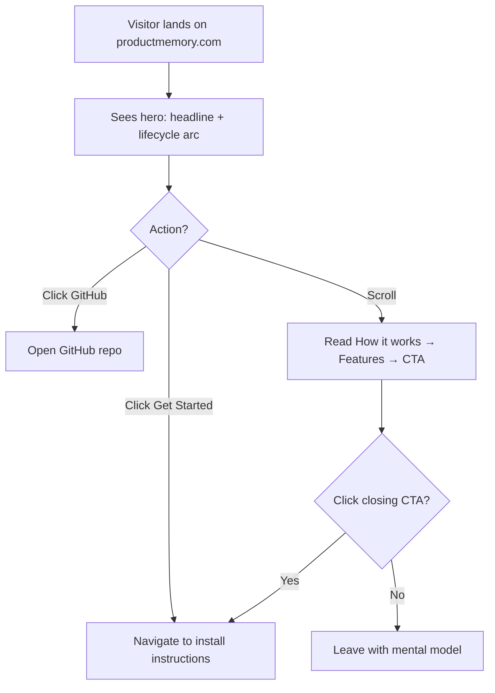

## Outcome

productmemory.com loads a polished marketing page. A visitor arriving from any source — search, social link, marketplace click-through — sees what PM does, how it works, which platforms it supports, and how to install it. The page exists, looks professional, and converts curiosity into action.

## Acceptance Criteria

1. `site/index.html` exists in the repo — single self-contained HTML file with Tailwind CDN, no external JS dependencies.
2. `site/CNAME` contains `productmemory.com`.
3. Cloudflare Pages project is configured to deploy from the `site/` directory on push to `main`.
4. productmemory.com resolves to the page with HTTPS.
5. Hero section contains: "Open Source · Free Forever" badge, "From idea to merged PR. One plugin." headline, subtitle, lifecycle arc with 4 SVG icon nodes (Research, Groom, Build, Ship) connected by gradient track, "Get Started" primary CTA, "Star on GitHub" secondary CTA, install command hint, platform bar (Claude Code, Cursor, Codex, Gemini CLI).
6. "How it works" section has 3 steps: (1) Start with an idea, (2) Build with context, (3) Ship with confidence — each with a one-sentence description.
7. Features grid shows 6 cards: Research, Strategy, Groom, Build, Review, Ship — each with an SVG icon and one-sentence description pulled from strategy.md value prop.
8. Social proof section displays a GitHub stars badge (dynamic via shields.io or similar).
9. Closing CTA section repeats install action with a compelling one-liner.
10. Footer includes: Product Memory, Open Source, MIT License, GitHub link.
11. Page is responsive: readable at 375px (mobile), 768px (tablet), 1280px (desktop).
12. `<head>` includes: `<title>`, `<meta name="description">`, Open Graph tags (`og:title`, `og:description`, `og:image`, `og:url`), favicon.
13. Visual style matches the approved hero mockup: white background, Inter font, indigo accent (#4f46e5), tight letter-spacing on headlines, soft shadows on icon containers, generous whitespace.
14. Dogfooding section placeholder exists (heading + empty grid) ready for PM-083 to populate with screenshots.

## User Flows

## Wireframes

[Wireframe preview](pm/backlog/wireframes/landing-page.html)

## Competitor Context

Cursor, Windsurf, Continue.dev all use centered hero with short headline + product visual + two CTAs. Continue.dev leads with "open-source" in headline — PM follows this pattern with the badge. No competitor landing page shows a lifecycle pipeline as the hero visual — this is differentiated.

## Technical Feasibility

- **Build-on:** `references/templates/proposal-reference.html` has hero gradient, grid layout, fade-up animation patterns. `plugin.config.json` has brand color, description, keywords. `pm/strategy.md` has all copy atoms.
- **Build-new:** `site/index.html` (the page), `site/CNAME` (domain), Cloudflare Pages project config (one-time web console setup).
- **Risk:** DNS propagation for custom domain — typically 24-48 hours. Cloudflare Pages setup is straightforward but requires account access.
- **Sequencing:** This ships first. PM-083 adds dogfooding screenshots after.

## Decomposition Rationale

Major Effort pattern: the page structure + content + deploy is the core effort (80% of value). Dogfooding showcase (PM-083) requires curating real screenshots — a different kind of work that ships independently. Each issue delivers end-to-end user value.

## Research Links

- [Landing Page Research](pm/research/landing-page/findings.md)

## Notes

- Keep it a single HTML file. Resist any temptation to add a build step or framework.
- Dogfooding section ships as a placeholder in this issue — PM-083 populates it with real screenshots.
- OG image: use an existing dashboard screenshot from repo root, or generate a simple branded card.
