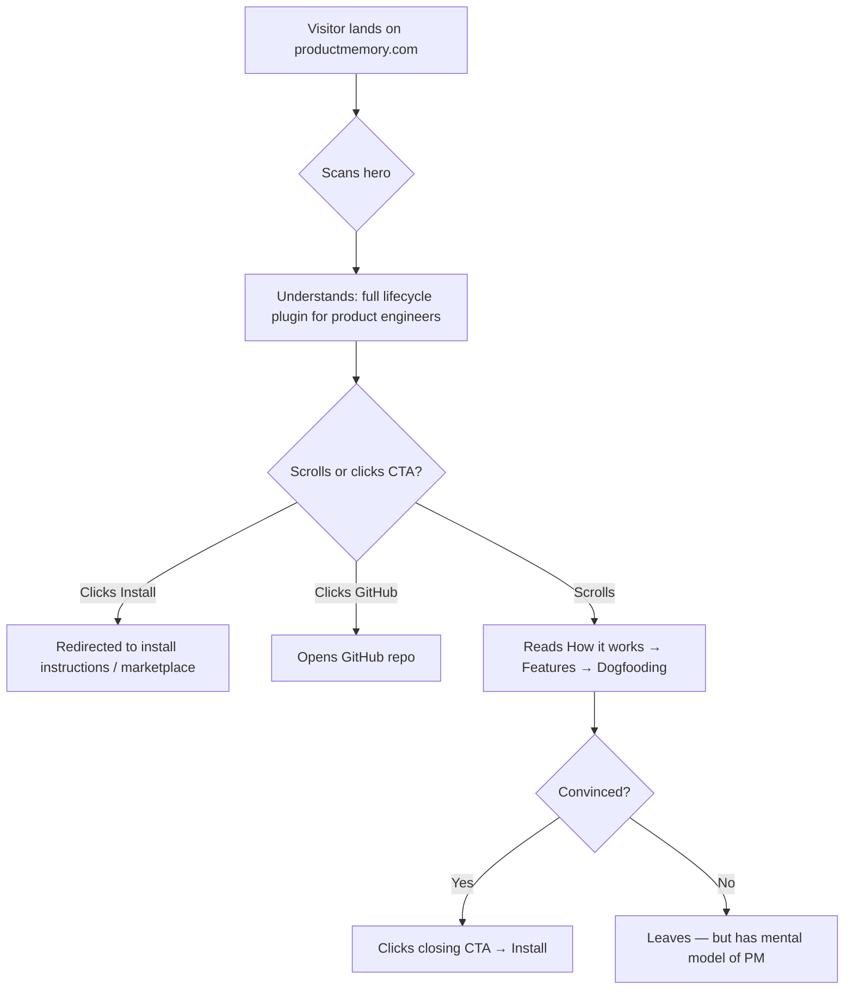

## Outcome

productmemory.com resolves to a polished, single-page marketing site that communicates PM's value in under 10 seconds. Visitors from plugin marketplaces, GitHub, word-of-mouth, or organic search land on a page that explains the full product lifecycle (research → groom → build → ship), shows real dogfooded artifacts, and provides a frictionless install path. The page serves as the canonical marketing surface for PM — the thing you link to when someone asks "what is Product Memory?"

## Acceptance Criteria

1. productmemory.com resolves to a live, HTTPS-secured page hosted on Cloudflare Pages.
2. Page loads in under 2 seconds on a 3G connection (static HTML + Tailwind CDN, no JS framework).
3. Hero section contains: "Open Source · Free Forever" badge, headline, subtitle, lifecycle arc (4 nodes with SVG icons), two CTAs (install + GitHub), install command hint, and platform compatibility bar.
4. "How it works" section explains the lifecycle in 3 steps with clear copy.
5. Features grid shows 6 capabilities (Research, Strategy, Groom, Build, Review, Ship) with icons and one-sentence descriptions.
6. Dogfooding showcase displays 3 static screenshots of real PM output with captions.
7. Social proof section shows GitHub stars badge and open-source identity.
8. Closing CTA repeats the install action.
9. Page is responsive — readable and functional on mobile (375px+).
10. Meta tags include title, description, and Open Graph tags for social sharing.
11. Clean minimal aesthetic: white background, Inter font, indigo accent (#4f46e5), generous whitespace.

## User Flows

## Wireframes

[Wireframe preview](pm/backlog/wireframes/landing-page.html)

## Competitor Context

- **Cursor:** Centered hero with product screenshot, short declarative headline, two CTAs. No feature list in hero — the UI speaks.
- **Continue.dev:** Leads with "open-source" identity in headline. Platform compatibility (VS Code, JetBrains) front and center.
- **ChatPRD:** Template library as top-of-funnel SEO. No live demo or dogfooding showcase.
- **No competitor shows their product managing its own lifecycle.** This is PM's unique angle.

## Technical Feasibility

- **Build-on:** Existing proposal templates (`references/templates/`) have reusable patterns — hero gradients, grid layouts, responsive behavior, CSS variable theming. Brand color (#1D4ED8) and copy atoms in `plugin.config.json`. All strategy copy exists in `pm/strategy.md`.
- **Build-new:** Single `index.html` in `site/` directory, CNAME file, Cloudflare Pages configuration.
- **Risk:** Low. Single static file, no build step, no dependencies. Cloudflare Pages setup is one-time config.
- **Sequencing:** MVP page first (PM-082), dogfooding screenshots second (PM-083).

## Research Links

- [Landing Page Research](pm/research/landing-page/findings.md)

## Notes

- Strategy check: override (off top-3 priority, strongly GTM-aligned per §5)
- 10x filter: gap-fill — productmemory.com currently resolves to nothing
- PM-023 (Public Hosted Demo Dashboard) is a separate initiative — when it ships, add a live dashboard link to the dogfooding section
- Structured data (FAQ schema) deferred until a content hub exists
