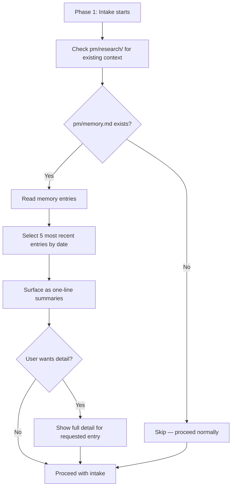

## Outcome

After shipping, Phase 1 (Intake) reads `pm/memory.md` if it exists and surfaces relevant past learnings as one-line summaries. The user sees what the plugin has learned from previous sessions on this project — scope patterns, review friction points, research that proved useful — before making decisions in the current session. This closes the memory loop: capture (PM-040, PM-041) → store (PM-039) → surface (this issue).

## Acceptance Criteria

1. `skills/groom/phases/phase-1-intake.md` is modified: a memory injection step is added as step 3.5, after the existing `pm/research/` check (step 3) and before the codebase scan (step 4).
2. If `pm/memory.md` exists and has entries, surface the 5 most recent entries by date (descending). No relevance ranking for v1 — deterministic selection by recency.
3. Memory is surfaced before the user provides their first scope input — not as a preamble that gets scrolled past, but as context for the intake decision. Format: `> "From past sessions:\n> - {learning 1}\n> - {learning 2}\n> ...\n> Want detail on any of these before we proceed?"`
4. If the user asks for detail, show the full `detail` field as a fenced blockquote immediately below the summary line. Then prompt: "Ready to proceed with intake?"
5. If `pm/memory.md` doesn't exist or has no entries, skip silently (no "no memories found" noise).
6. Token budget: injected memory context stays under ~500 tokens (summaries only, ~100 tokens each x 5 max). Full detail is on-demand only.
7. The relevant SKILL.md table is updated to reflect the new Phase 1 step.

## User Flows

## Wireframes

N/A — no user-facing workflow for this feature type.

## Competitor Context

No PM tool surfaces learnings from past sessions at the start of new ones. Claude-Mem injects session context but without structure — raw observations, not extracted learnings. GitHub Copilot's memory injection is automatic but focuses on code patterns, not product decisions. PM's injection is differentiated by being structured (categorized entries), progressive (summaries first), and domain-specific (scope patterns, review learnings, research quality).

## Technical Feasibility

Low effort. Key considerations from EM review:
- Phase 1 already reads `pm/research/` for existing context and surfaces a citation — same read-and-surface pattern applies
- The existing pattern in `phase-1-intake.md` step 3 is the direct template for this feature
- Token budget constraint is enforced by design: one-line summaries at ~100 tokens each, max 5 entries = ~500 tokens
- No new infrastructure — reads a markdown file that already follows frontmatter conventions

## Research Links

- [Memory System and Improvement Loop](pm/research/memory-improvement-loop/findings.md) — Finding 8: context bloat is a top failure mode; progressive disclosure is the mitigation

## Notes

- Depends on PM-039 (schema) and at least one capture mechanism (PM-040 or PM-041) having produced entries.
- v1 uses recency-based selection (most recent 5 entries). Category-filtered retrieval (e.g., groom session → prioritize scope/review learnings) is deferred to v2 but should be promoted if token budget cannot be met reliably after the memory file grows past 15 entries.
- Future enhancement (v2): inject at additional phase gates (Phase 4 scope, Phase 5.5 team review) with phase-specific filtering.
- The deferral trap risk (research Finding 8): memory must be surfaced at a decision point, not as ambient context. AC3 enforces this by positioning injection before the first scope input.
