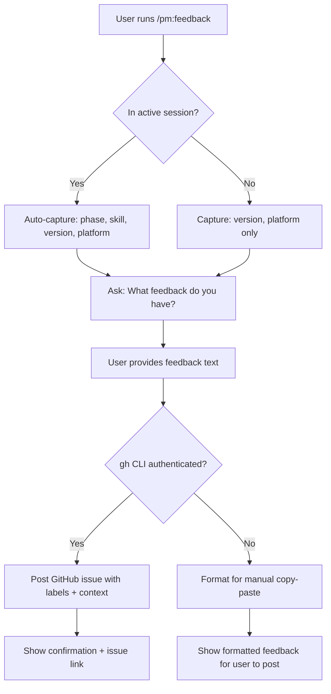

## Outcome

After shipping, users can run `/pm:feedback` during or after any session to report what worked, what didn't, or suggest improvements. The skill captures context automatically (current phase, session state, plugin version) and posts a structured GitHub issue or discussion to the plugin repo. This creates a community-driven improvement signal that complements the automated project memory system — instead of only learning from one user's sessions, the plugin team gets aggregated friction reports from the entire user base.

## Acceptance Criteria

1. `/pm:feedback` skill exists and is invocable from any point in a session.
2. Skill captures context automatically: current skill/phase (if in a session), plugin version, platform (Claude Code/Cursor/Gemini).
3. Skill asks the user a single question: "What feedback do you have?" (free-form text).
4. Skill posts a GitHub issue or discussion via `gh` CLI with structured labels (e.g., `feedback`, `phase:{phase-name}`).
5. Skill confirms submission with a link to the created issue.
6. No sensitive project data (strategy, research, backlog content) is included in the post — only structural context (phase name, iteration count, verdict).
7. Works without GitHub authentication gracefully — if `gh` is not authenticated, shows the feedback formatted for manual copy-paste.

## User Flows

## Wireframes

N/A — no user-facing workflow for this feature type (terminal-only interaction).

## Competitor Context

No competing PM plugin offers in-context feedback submission. Productboard Spark collects feedback through its SaaS platform but from end-users, not from the PM tool's own users about the tool itself. This is a meta-feedback loop — the tool improving itself through its user community.

## Technical Feasibility

Lightweight implementation. Requires a new skill file in `skills/feedback/SKILL.md`, a `gh issue create` call, and structured label conventions. No new infrastructure, no database, no API keys beyond existing `gh` auth. The `gh` CLI fallback (copy-paste mode) handles the unauthenticated case gracefully.

## Research Links

- [Memory System and Improvement Loop](pm/research/memory-improvement-loop/findings.md) — Finding 5: structured triggers beat continuous vigilance; Finding 9: no PM tool has a structured improvement loop

## Notes

- This is the community-facing complement to the automated project memory system (separate initiative).
- Consider whether feedback should go to GitHub Issues (trackable, public) or GitHub Discussions (lower friction, conversational).
- Future enhancement: aggregate feedback themes automatically and surface them in the plugin's development backlog.
- Privacy: must never include project-specific content (strategy text, research findings, backlog items) — only structural metadata.
