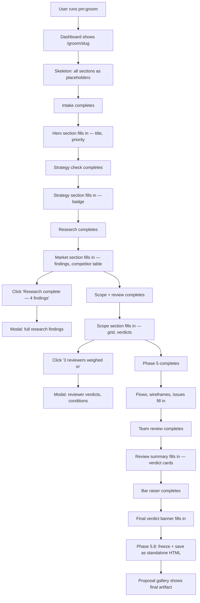

## Outcome

When a user starts grooming with the dashboard open, they see a single proposal document that starts as a skeleton of empty sections. As each groom phase completes and the state file updates, the corresponding section fills in with real content. The proposal structure itself communicates progress — scroll down and see where content stops and placeholders begin.

Filled sections have a clickable detail trigger (e.g., "3 reviewers weighed in") that opens a modal with the full discussion content: reviewer verdicts, research findings, scope review reasoning. The modal appears when there's something worth showing and dismisses when done — no persistent second column competing for attention.

At phase 5.8 completion, the progressive proposal is frozen and saved as the final standalone HTML artifact. No separate "generate proposal" step — the proposal was being built the whole time.

## Acceptance Criteria

1. New dashboard route `/groom/{slug}` renders a progressive proposal page by reading `.pm/groom-sessions/{slug}.md` state file.
2. Proposal has a section for each groom phase, following this mapping:

   | Groom phase | Proposal section | Content when filled |
   |---|---|---|
   | Intake | Hero (title, priority, ICP) | Feature name, priority badge, ICP segment |
   | Strategy Check | Strategy Alignment | Pass/conflict/override badge with one-line reasoning |
   | Research | Market & Competitive | Key findings, competitor comparison table |
   | Scope + Scope Review | Scope Overview | In/out grid, 10x filter badge, reviewer verdict badges |
   | Groom (Phase 5) | User Flows | Mermaid diagrams with source citations |
   | Groom (Phase 5) | Wireframes | Embedded wireframe iframes |
   | Groom (Phase 5) | Issue Breakdown | Issue cards with titles, outcomes, collapsible ACs |
   | Team Review | Review Summary | Verdict cards (PM, competitive, EM, design) |
   | Bar Raiser | Final Verdict | Verdict banner with conditions |

3. Unfilled sections render as muted placeholders with the section name and a subtle "pending" visual treatment (dimmed text, dashed border or similar). Not invisible — intentionally "not yet."
4. A progress indicator at the top of the page shows overall completion derived from filled vs. total sections. Tier-aware: quick tier shows only its applicable sections (intake, scope, issues, verdict), not all 9.
5. Filled sections that have associated discussion content display a clickable trigger (e.g., "3 reviewers weighed in", "Research complete — 4 findings"). Clicking opens a modal with the full detail (reviewer verdicts and reasoning, research findings, scope review conditions).
6. Sections without discussion content (e.g., intake, simple strategy pass) have no modal trigger — just filled content.
7. The page auto-refreshes when the groom state file changes (using the existing WebSocket file-watch broadcast mechanism).
8. Phase 5.8 ("Present") saves the progressive proposal as the final standalone HTML artifact at `pm/backlog/proposals/{slug}.html` instead of generating a new document from scratch. The frozen version matches the proposal-reference.html styling for standalone reading.
9. The groom skill's companion screen writes (`.pm/sessions/groom-{slug}/current.html`) are replaced by state file updates that the dashboard reads directly. Companion template remains available as fallback for non-dashboard use.
10. Existing dashboard functionality (proposal gallery, backlog kanban, home page) is not affected. The `/groom/{slug}` route is additive.

## User Flows

## Wireframes

N/A — to be generated during implementation planning. The progressive proposal page is the primary design surface and warrants a wireframe at plan time.

## Competitor Context

No editor-native competitor has a live dashboard during workflow execution. Compound Engineering, gstack, and Superpowers are terminal-only. Productboard Spark shows conversational output but not a building artifact. The progressive proposal is a unique visual feedback mechanism that makes the grooming process tangible.

## Technical Feasibility

- **Build-on:** `scripts/server.js` already reads groom state via `readGroomState()` (lines 2092-2124), serves proposals via iframe embed, and has WebSocket file-watch auto-reload. The companion template CSS provides the visual language (dark mode, cards, badges, verdict rows, scope grids). The proposal reference template provides the final artifact structure.
- **Build-new:** (a) New route handler for `/groom/{slug}` that reads state and renders progressive sections server-side, (b) placeholder/filled section styling with transition states, (c) modal component for detail expansion, (d) progress indicator component, (e) tier-aware section filtering, (f) phase 5.8 freeze-and-save logic that converts the progressive view to standalone HTML matching proposal-reference.html styling.
- **Risk:** The progressive proposal merges two currently separate systems (companion screen = phase-by-phase status, proposal = final artifact). If the mapping between phase data and proposal sections is lossy, the frozen artifact at 5.8 may be lower quality than a purpose-built proposal generation. Mitigation: the freeze step should enrich with any data that the progressive view summarized (e.g., expand collapsed ACs, add full competitor table).
- **Sequencing:** Independent of all current backlog items. Touches server.js (dashboard route), groom phase files (companion write steps), and phase 5.8 (proposal generation). No dependency on other issues.
- **Verdict:** feasible

## Research Links

None — derived from product discussion in conversation.

## Notes

- The companion screen system (`.pm/sessions/groom-{slug}/current.html`) is not deleted — it remains as a fallback for users not running the dashboard. But the dashboard progressive view becomes the primary visual experience.
- Quick tier (3-4 phases) will have a shorter proposal with fewer sections. The progress indicator must reflect the tier's actual phase count, not the full 9-phase sequence.
- The modal content reuses the companion template's CSS vocabulary (verdict-row, verdict-card, scope-grid, badge classes) inside a modal wrapper. No new design language needed.
- Open question: should the `/groom/{slug}` URL auto-open when grooming starts (if dashboard is running), or should the user navigate to it manually? Recommend auto-open via the visual companion offer in dev Stage 1 / groom Phase 1.
