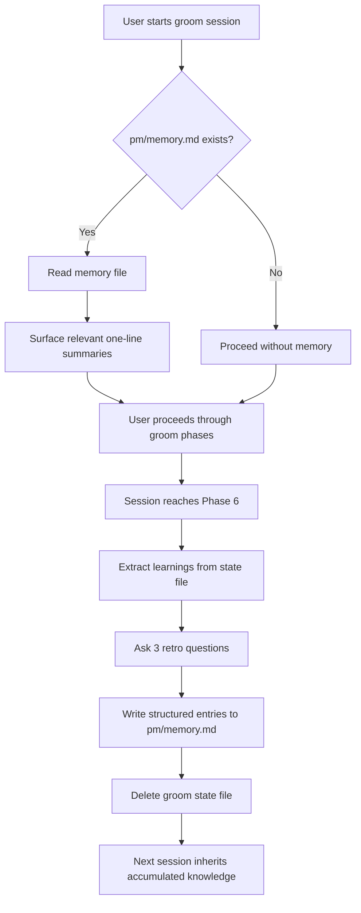

## Outcome

After shipping, every completed groom session leaves behind structured learnings in `pm/memory.md`. The next time a user starts a groom, research, or ideate session on the same project, the plugin reads past learnings and surfaces relevant context — what research was useful, what scope decisions got challenged, what mistakes to avoid. The tool compounds knowledge over time instead of starting cold every session.

## Acceptance Criteria

1. `pm/memory.md` is created and populated when the first groom session completes Phase 6.
2. Subsequent sessions read `pm/memory.md` at Phase 1 and surface relevant one-line summaries.
3. Users can see and edit `pm/memory.md` directly — it's a plain markdown file in the project repo, version-controlled alongside the codebase. Memory never leaves the user's repository.
4. The retro prompt at session end captures qualitative learnings the automated extraction misses.
5. Memory entries have dates and source citations (which session, which phase).
6. Phase 6 completion always results in at least one memory entry being written to `pm/memory.md`, or a logged warning if writing fails.
7. Users can manually add entries to `pm/memory.md` following the schema — the format supports hand-written learnings outside of groom sessions.

## User Flows

## Wireframes

N/A — no user-facing workflow for this feature type.

## Competitor Context

No PM tool has a structured project memory system. Productboard Spark claims "organizational memory" but operates at the org level in standalone SaaS, not at the individual project workflow level. Claude-Mem and Supermemory solve session recall but not behavior change. GitHub Copilot's citation-based memory is the closest analog — agents memorize patterns with code citations and verify before applying. PM's advantage: the groom lifecycle creates natural extraction points (phase gates) that general-purpose memory systems lack.

## Technical Feasibility

Feasible with caveats (EM review, Phase 4.5). Key findings:
- Phase 6 (`skills/groom/phases/phase-6-link.md`) has a natural hook point before state file deletion
- Phase 1 already reads `pm/research/` for context — same pattern applies for `pm/memory.md`
- `parseFrontmatter()` in `scripts/server.js` already handles the file format
- Main risk: must extract learnings before deleting the groom state file — if extraction errors, raw data is lost
- Recommended sequence: retro + write first → injection second → automated extraction third

## Research Links

- [Memory System and Improvement Loop](pm/research/memory-improvement-loop/findings.md)

## Notes

- v1 focuses on project memory only. Plugin-level improvement (quality metrics, cross-project patterns, improvement suggestions) deferred to v2.
- PM-037 (Plugin Feedback Skill) is the community-facing complement — captures improvement signals from all users, not just automated session data.
- Success criteria: pm/memory.md populated in 100% of Phase 6 completions, retro prompt completion >70%, at least one memory entry written per completed session with >1 scope review iteration.
- Implementation sequence: PM-039 (schema) → PM-040 (retro) + PM-041 (extraction) sequentially on phase-6-link.md → PM-042 (injection).
- Pruning guideline: entries older than 6 months or contradicted by newer entries are candidates for manual pruning. Automated pruning deferred to v2.
