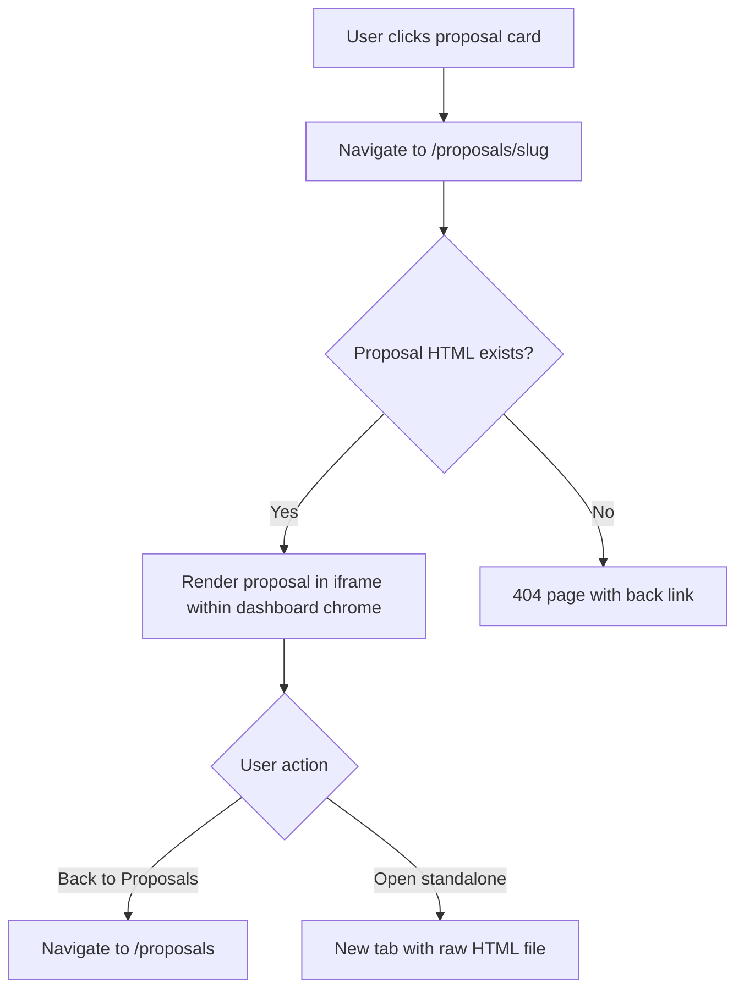

## Outcome

A new `/proposals/{slug}` route renders the proposal HTML inside the dashboard chrome via iframe. The page includes a "Back to Proposals" breadcrumb and an "Open standalone" link. Users stay within the dashboard context while viewing a full proposal.

Before: proposals are standalone HTML files that open outside the dashboard. After: proposals are accessible from within the dashboard navigation flow, with a fallback to standalone viewing.

## Acceptance Criteria

1. New `/proposals/{slug}` route added to `routeDashboard()`.
2. Route validates slug with two-step path traversal prevention: (a) reject slugs containing `..` or `/`, (b) after `path.resolve()`, assert the resolved path `startsWith(proposalsDir + path.sep)` — matching the existing `handleWireframe()` containment pattern.
3. Proposal HTML rendered in an iframe using the existing wireframe-embed pattern. Embed header label reads "Proposal" (not "Wireframe" as in the copied pattern).
4. Iframe height is fixed at 800px. Dynamic sizing via `postMessage` is deferred to a follow-on issue.
5. "Back to Proposals" breadcrumb links to `/proposals`.
6. "Open standalone" link opens the raw `pm/backlog/proposals/{slug}.html` in a new tab.
7. If the proposal file doesn't exist, shows a 404 with a link back to `/proposals`.
8. Proposal's own CSS and mermaid.js render correctly inside the iframe (full browsing context). Sticky TOC within the iframe must not overlap dashboard chrome or extend beyond iframe bounds — test with a real proposal before shipping.

## User Flows

## Wireframes

[Wireframe preview](pm/backlog/wireframes/dashboard-proposal-hero.html) — see Screen 3b.

## Competitor Context

Productboard's Document boards embed initiative documentation within the product UI but require a Productboard account, are cloud-hosted, and cannot be shared as standalone URLs. PM's proposal HTML files work offline, are Git-versioned, and open in any browser with no authentication. The "Open standalone" link makes this property explicit — the proposal is a shareable, self-contained artifact that lives in the codebase, a property no SaaS competitor can replicate.

## Technical Feasibility

**Build-on:** `handleWireframe()` (server.js lines 2102-2123) already serves HTML files via iframe with path security validation. The `.wireframe-embed`, `.wireframe-header`, `.wireframe-iframe` CSS classes exist.

**Build-new:** `/proposals/{slug}` route handler. Copy `handleWireframe()` pattern but point to `pm/backlog/proposals/` directory. Adjust iframe height from 500px to 800px+ or implement dynamic height via `postMessage`.

**Risk:** Proposal HTML includes its own `<style>` block, sticky TOC, and mermaid.js CDN script. These render correctly in an iframe (full browsing context) but the sticky TOC may behave unexpectedly within a constrained iframe height. Test with a real proposal before shipping.

## Research Links

- [Dashboard Proposal-Centric Redesign](pm/research/dashboard-proposal-centric/findings.md)

## Notes

- The EM noted that dynamic iframe height via `postMessage` is more robust than a fixed value. Tracked as a fast follow if 800px fixed height causes issues.
- This depends on proposals existing at `pm/backlog/proposals/` — which requires at least one completed groom session.

## Dependencies

- **PM-026** (Proposal Metadata Sidecar) — proposals must exist at `pm/backlog/proposals/` with HTML files.
- **PM-028** (Proposal Gallery Page) — the gallery provides the navigation context (card click → detail view).
