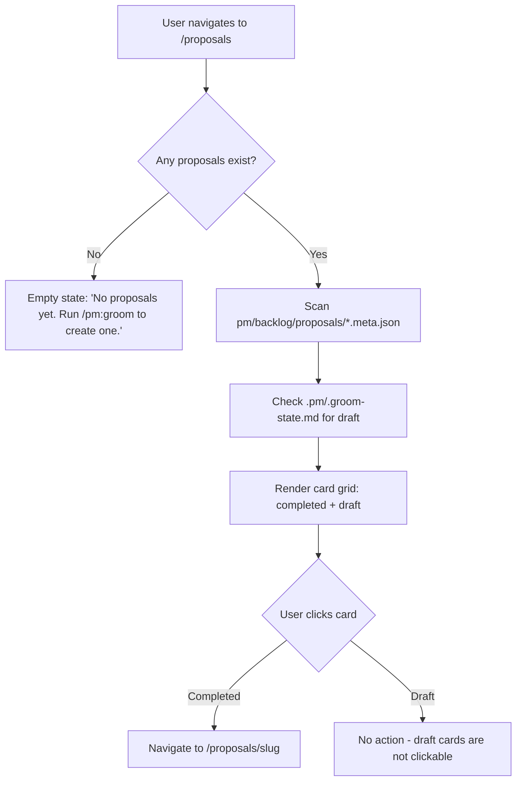

## Outcome

A new `/proposals` route in the dashboard shows all proposals as a card grid. Each card displays the proposal's hero gradient, title, verdict badges, issue count, and date. Draft proposals (from active groom state) appear with a dashed border and "Draft" badge showing the current phase. The home page shows the most recent proposals; the `/proposals` page shows all.

Before: proposals are hidden files at `pm/backlog/proposals/`. After: they're the centerpiece of the dashboard.

## Acceptance Criteria

1. New `/proposals` route added to `routeDashboard()` in `server.js`.
2. `handleProposalsPage()` scans `pm/backlog/proposals/` for `*.meta.json` files (from PM-026).
3. Cards use existing `.card-grid` and `.card` CSS patterns with proposal-specific additions (hero gradient strip, verdict badge, issue count).
4. Cards are sorted by date (newest first).
5. Draft proposals detected from `.pm/.groom-state.md` (via shared `readGroomState()` from PM-026) appear as cards with dashed border and current phase badge. Draft cards are **not clickable** — they are display-only status indicators.
6. Completed proposal card data is read from `*.meta.json` files (PM-026). Draft card data is read from `.pm/.groom-state.md` fields: `topic` → title, `phase` → badge label (human-readable), `started` → date. These are the only two data paths for card rendering.
7. Empty state: when no proposals and no active groom session exist, show a helpful message with `/pm:groom` hint.
8. Clicking a **completed** card navigates to `/proposals/{slug}` detail view (PM-031). Draft cards are not clickable.
9. Home page (`handleDashboardHome()`) shows the 6 most recent proposals; `/proposals` page shows all. This requires modifying `handleDashboardHome()` to call `readProposalMeta()`.
10. Proposal cards show "N issues" count from the metadata sidecar.
11. If `pm/backlog/proposals/` directory does not exist, handle gracefully with `fs.existsSync()` check per request — do not assume directory exists at startup.

## User Flows

## Wireframes

[Wireframe preview](pm/backlog/wireframes/dashboard-proposal-hero.html) — see Screen 1, "Recent Proposals" section.

## Competitor Context

Productboard surfaces initiative briefs prominently — not individual features. ChatPRD has a document gallery with 750K+ docs but those are prompt-generated, not codebase-grounded. PM's proposals are structurally unique: they embed research, competitive context, multi-layer review verdicts, and codebase-aware technical feasibility. The gallery makes this visible.

## Technical Feasibility

**Build-on:** `.card-grid` and `.card` CSS (server.js lines 430-438), `.badge-*` system (lines 510-523), `handleWireframe()` iframe pattern (lines 2102-2123), `watchDirectoryTree()` auto-picks up new directories (lines 2405-2453).

**Build-new:** `handleProposalsPage()` route handler that reads `*.meta.json` files, constructs card HTML, and renders via `dashboardPage()`. Also needs proposal-specific CSS additions: hero gradient strip on cards, draft card dashed border.

**Risk:** `pm/backlog/proposals/` directory may not exist at server startup. Handle with graceful empty state and check directory existence on each request (not just at startup).

## Research Links

- [Dashboard Proposal-Centric Redesign](pm/research/dashboard-proposal-centric/findings.md)

## Notes

- Hero gradients on cards provide visual identity per proposal — gradient is assigned by PM-026 at write time (deterministic based on slug hash).

## Dependencies

- **PM-026** (Proposal Metadata Sidecar) — provides `readProposalMeta()` and `readGroomState()` helpers, and the `*.meta.json` files that power card rendering.
