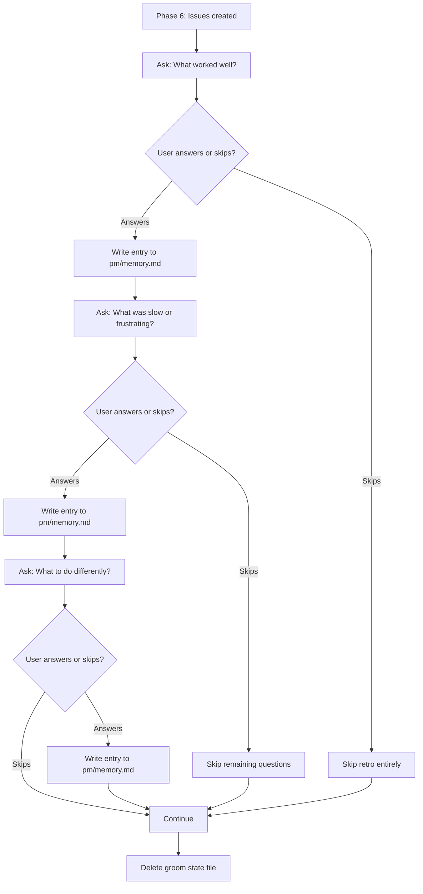

## Outcome

After shipping, every groom session that reaches Phase 6 includes a structured 3-question reflection before cleanup. The user's answers are extracted into structured memory entries and appended to `pm/memory.md`. This captures qualitative learnings that automated extraction misses — the "why" behind what went well or poorly.

## Acceptance Criteria

1. `skills/groom/phases/phase-6-link.md` is modified: a retro step is inserted after issue creation but before state file deletion. The deletion instruction is moved to after both retro and extraction steps.
2. The retro asks exactly 3 questions, one at a time (per skill pacing rules):
   - "What worked well in this session?" → written with `category: quality`
   - "What was slow or frustrating?" → written with `category: process`
   - "What should we do differently next time?" → written with `category: process`
3. Each answer is written to `pm/memory.md` as a structured entry with `source: "retro"`, `date`, and the fixed category from AC2. No AI inference — each question maps to a predetermined category.
4. If the user skips any question (says "skip" or equivalent), that question and all remaining questions are bypassed. Answered questions before the skip are still written. No error, no empty entries.
5. Each retro question is asked individually with no follow-up prompt (single question, single answer, next question). No parsing, no clarifying sub-questions.
6. The groom state file is NOT deleted until after the retro completes (or is skipped). This ordering is enforced by the modified `phase-6-link.md`.
7. The relevant SKILL.md table is updated to reflect the new Phase 6 step.

## User Flows

## Wireframes

N/A — no user-facing workflow for this feature type.

## Competitor Context

The ngrok BMO agent validated that a 3-question reflection template at session end succeeded where continuous learning-event-capture failed. No PM tool offers end-of-session reflection. This is borrowed from engineering retrospective practice, applied to individual PM workflows.

## Technical Feasibility

Low-medium effort. Key considerations from EM review:
- Phase 6 (`skills/groom/phases/phase-6-link.md`) has a natural insertion point before the state file deletion step
- Deletion ordering is critical: retro must complete before state file is deleted
- The skill pacing rule (one question at a time) already governs interaction — retro follows the same pattern
- Risk: retro adds friction at the moment user attention is dropping. The skip mechanism mitigates this.

## Research Links

- [Memory System and Improvement Loop](pm/research/memory-improvement-loop/findings.md) — Finding 5: structured triggers beat continuous vigilance

## Notes

- Depends on PM-039 (memory file schema) being implemented first.
- PM-040 and PM-041 both modify `phase-6-link.md`. PM-040 should be implemented first — PM-041 appends its extraction step after the retro step.
- If retro completion drops below 70%, consider making it opt-in rather than default, or reducing to 1 question.
- The retro prompt is the primary capture mechanism for v1 — not a fallback for automated extraction, but the preferred UX pattern. Productboard's own user research validates that users prefer guided capture over full automation.
- Future enhancement: detect patterns across retro answers (e.g., "research was slow" appears in 3/5 sessions → surface as improvement suggestion in v2).
