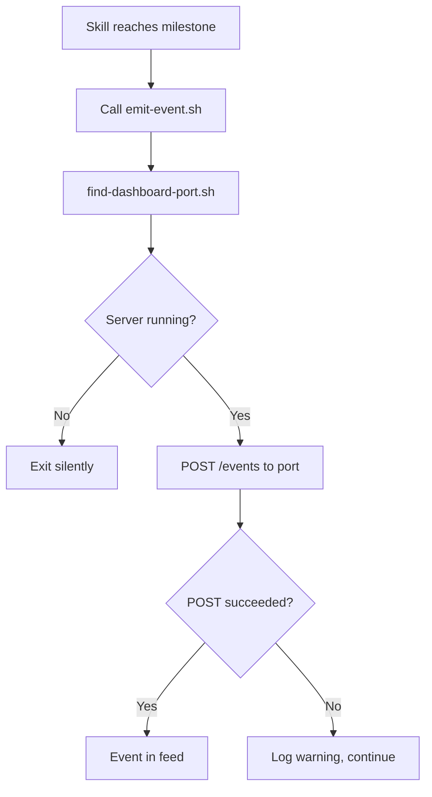

## Outcome

The activity feed has real content on day one. When the product engineer runs pm:ship, pm:dev, or pm:groom, milestone events appear live in the dashboard feed. The event bus is no longer empty plumbing — it reflects the actual product lifecycle.

## Acceptance Criteria

1. pm:ship emits events for: `pr_created`, `review_done` (with score), `tests_passed`/`tests_failed`, `merged`.
2. pm:dev emits events for: `dev_started` (with issue title), `tests_passed`/`tests_failed`, `phase_started` (implement, review, etc.).
3. pm:groom emits events for: `groom_started` (with topic), `phase_started` (intake, research, scope, etc.), `groom_complete` (with issue count).
4. Each event uses the schema from PM-090: `type`, `source`, `timestamp`, `detail`, `source_type: "terminal"`.
5. The `source` field uses the session slug when available (from `.pm/dev-sessions/{slug}.md` or `.pm/groom-sessions/{slug}.md`), otherwise falls back to `"{skill}-{PID}"`.
6. Events are sent via the port discovery utility from PM-090 (`scripts/find-dashboard-port.sh`). If no server is running, the event is silently dropped — no error, no retry.
7. Event emission is non-blocking — skill execution is never delayed by a failed POST.
8. A shared helper script (`scripts/emit-event.sh`) wraps port discovery + POST in one call. This is an implementation detail of the instrumentation scope item, not a separately tracked deliverable.
9. Instrumentation is added as explicit Bash tool calls in SKILL.md instructions at specific milestone points (e.g., after `gh pr create` in pm:ship, after phase transitions in pm:groom). The Bash call invokes `emit-event.sh` with event type and detail as arguments.

## User Flows

## Wireframes

N/A — no new UI. Events render in the existing feed panel (PM-091).

## Competitor Context

No competitor instruments product lifecycle skills to emit real-time events. This makes the activity feed unique — it doesn't just show generic terminal output, it shows structured lifecycle milestones (groom phase transitions, dev stage changes, ship pipeline progress).

## Technical Feasibility

**Build-on:**
- `scripts/pm-log.sh` already emits structured JSONL events for analytics. The emit-event.sh pattern follows the same structure but POSTs to the dashboard instead of appending to a file.
- Skills already have natural milestone points (phase transitions, gate completions) where event emission can be added.

**Build-new:** `scripts/emit-event.sh` (port discovery + POST wrapper), Bash tool call instructions added to SKILL.md files for pm:ship (skills/ship/SKILL.md), pm:dev (skills/dev/SKILL.md), pm:groom (skills/groom/SKILL.md) at specific milestone points.

**Depends on:** PM-090 (SSE Event Bus Core) — needs POST endpoint and port discovery utility.

**Can partially parallelize with:** PM-091 and PM-092 (different code areas).

## Scope Note

Covers in-scope item: "Instrument pm:ship, pm:dev, pm:groom to emit milestone events via POST."

## Decomposition Rationale

Workflow Steps pattern: this is the producer stage. The pipeline (PM-090) and consumers (PM-091, PM-092) exist — this issue populates them with real data.

## Research Links

- [SSE Event Bus + Activity Feed Patterns](pm/research/sse-event-bus/findings.md)

## Notes

- Only 3 skills instrumented in v1. Other skills (pm:research, pm:review, pm:qa) can be added later.
- Fire-and-forget: if POST fails, the skill continues. No retries.
- The emit-event.sh script should be lightweight — measurable overhead must be under 100ms per call.
