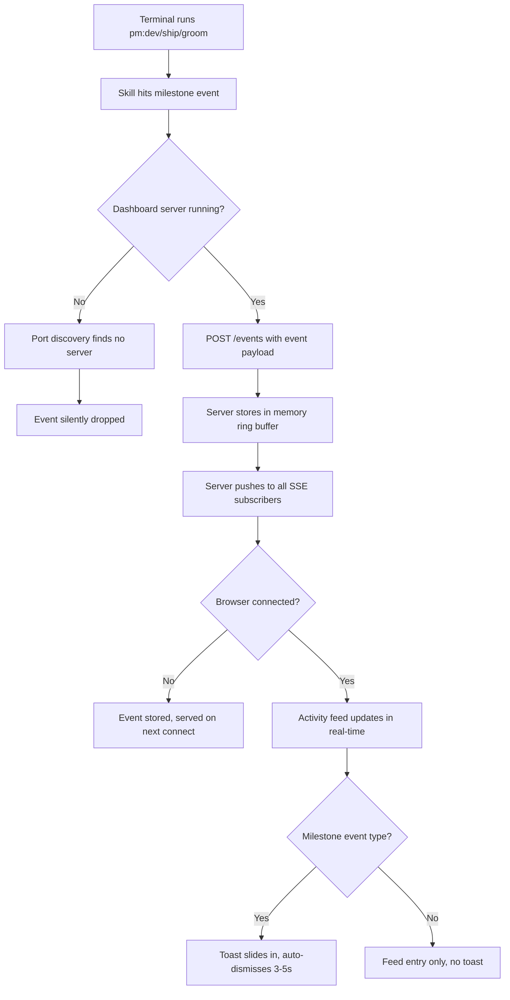

## Outcome

The product engineer running multiple terminal sessions (groom in one, dev in another, ship in a third) monitors all activity from a single dashboard screen. They stop alt-tabbing between terminals to check status. Key milestones are surfaced proactively so nothing is missed.

## Acceptance Criteria

1. Terminal sessions can POST events to the dashboard server via `POST /events`.
2. The dashboard browser tab receives events in real-time via SSE (`GET /events`).
3. The dashboard home page shows a right-sidebar activity feed panel with reverse-chronological events.
4. Milestone events trigger a toast notification that auto-dismisses after 3-5 seconds.
5. A port discovery utility lets skills find the running dashboard server port.
6. pm:ship, pm:dev, and pm:groom emit milestone events during their workflows.
7. The feed shows an empty state when no events have been received.

## User Flows

## Wireframes

[Wireframe preview](pm/backlog/wireframes/sse-event-bus.html)

## Competitor Context

No profiled competitor has a real-time multi-terminal activity feed. ChatPRD is browser-only with no terminal awareness. PM Skills Marketplace is stateless per session. Productboard Spark runs isolated Jobs with no cross-session visibility. OpenCode has the SSE bus architecture but no activity feed UI. This is a defensible differentiator — replicating it requires editor-native presence + server-side event bus + lifecycle awareness.

## Technical Feasibility

Feasible as scoped. scripts/server.js already has the dashboard HTTP server, WebSocket broadcast pattern, stable port hashing, and the HTML shell template. SSE is native HTTP — no new dependencies. The main risk is server.js monolith size (4,155 lines, will grow ~400 more). Build order: POST+store → SSE → port discovery → feed panel → toasts → skill instrumentation.

## Research Links

- [SSE Event Bus + Activity Feed Patterns](pm/research/sse-event-bus/findings.md)
- [Groom Visual Companion Patterns](pm/research/groom-visual-companion/findings.md)

## Notes

- In-memory event storage only for v1 — events lost on server restart. Disk persistence deferred.
- Feed panel shown on Home page only. Backlog/Research pages deferred.
- Cross-project event aggregation is a non-goal (PM scopes to one project).
- Success criteria: activity feed renders real events during dogfooding sessions. Qualitative signal — analytics instrumentation deferred.
- **Server restart limitation:** events in the ring buffer are lost on server restart. The feed goes empty. Skills won't re-emit past events. Acceptable for v1 — disk persistence is a deferred follow-on.
- **Two real-time channels:** SSE for event streaming (unidirectional, auto-reconnect), WebSocket for page reload (existing). Different lifecycles, different semantics. Consolidation to SSE-only is a future optimization.
- **server.js growth:** This epic adds ~400 lines to a 4,155-line file. If server.js exceeds 5,000 lines, SSE concerns should be extracted into a separate module before shipping the next feature.
- **Backlog overlap:** PM-089 (dev-passive-status) depends on this epic — acknowledge as downstream consumer. PM-060 (groom-companion-session-route) chose WebSocket; this epic adds SSE for a different use case (event streaming vs reload notification). PM-027 (active-session-indicator) shows a static session banner — minor UX redundancy with feed's `groom_started` event, acceptable.
