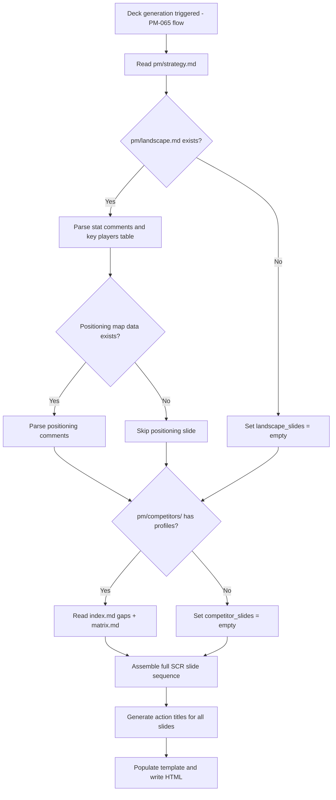

## Outcome

The strategy deck becomes a high-quality, consulting-grade presentation by synthesizing the full PM knowledge base. Market stats from landscape.md appear as headline numbers. The key players table shows where competitors sit. The positioning map visualizes strategic whitespace. Competitive gaps are called out with evidence from competitor profiles. When any of these sources are missing, the deck gracefully skips those slides and remains coherent.

## Acceptance Criteria

1. When `pm/landscape.md` exists, the deck includes additional slides:
   - Market stats slide: headline numbers extracted from `<!-- stat: {value}, {label} -->` comments (two-part, comma-delimited format as established by the landscape skill). If landscape.md exists but contains no `<!-- stat: -->` comments, skip the stats slide without error.
   - Key players slide: table of competitors from the Key Players section, displaying a maximum of 6 rows. If the Key Players table contains more than 6 entries, the first 6 rows as ordered in landscape.md are used (order reflects the researcher's priority judgment).
2. When `pm/competitors/` contains profiled competitors, the deck includes:
   - Competitive landscape slide: summary of key gaps no competitor fills (from `pm/competitors/index.md` Market Gaps section or `pm/competitors/matrix.md`)
3. When `pm/landscape.md` contains positioning map data (`<!-- positioning: ... -->` comments as established by the landscape skill), the deck includes:
   - Positioning map slide: visual 2x2 plot with competitor dots and the product's position highlighted. Reproduces the positioning map CSS from `templates/strategy-canvas.html`, omitting interactive click behavior (no `data-choice` attributes, no `toggleSelect` event listeners) since the deck is a static read-only artifact. If landscape.md exists but contains no `<!-- positioning: -->` comments, skip the positioning map slide without error.
4. The full deck with all sources follows the SCR arc (~10 slides):
   - SITUATION: Title → Market landscape (stats) → Key players → Who we serve (ICP)
   - COMPLICATION: The problem → Competitive gaps → The whitespace (positioning map)
   - RESOLUTION: What we do differently → Where we're going (priorities + non-goals) → How we'll know (metrics)
5. When `pm/landscape.md` is missing, the deck skips market-context slides and remains a coherent ~7-slide presentation (PM-065 baseline).
6. When `pm/competitors/` is missing or empty, the deck skips competitive-analysis slides.
7. When both are missing, the deck falls back to strategy.md-only content (PM-065 baseline).
8. Slide numbering and progress dots dynamically adjust to the actual slide count.
9. Action titles on data-enriched slides reference specific numbers or findings (e.g., "No tool covers the full lifecycle — a gap PM fills" rather than generic "Our competitive advantage").
10. Data provenance is visible on each slide that uses landscape or competitor data: a small footer line states the source and count (e.g., "Based on 3 competitor profiles" or "From landscape research, 14 sources"). The date is pulled from the `updated:` frontmatter field of the source file. Slides derived solely from strategy.md do not show provenance (they are the user's own input, not synthesized research).

## User Flows

## Wireframes

N/A — no user-facing workflow for this feature type.

## Competitor Context

This is the defensible differentiator. Standalone presentation tools (Gamma, Beautiful.ai, Chronicle) can generate decks but have no access to structured research, landscape data, or competitor profiles. PM Skills Marketplace is stateless — even if it added a `/deck` command, it would generate from conversation context only, not from a persisted knowledge base. Productboard Spark does agentic competitive research but produces zero visual output — no positioning maps, no slide decks — and a full PRD costs 85-95 credits against a 250/month allowance (~4-5 initiatives/month before paywall). PM's deck regenerates on demand at zero cost from a compounding knowledge base. ChatPRD has an MCP bridge but no equivalent data store. The deck's value scales with knowledge base depth, which is PM's core moat.

## Technical Feasibility

- **Build-on:** PM-065 template with placeholder slots, existing `<!-- stat: ... -->` and `<!-- positioning: ... -->` comment formats in landscape.md, competitor profile structure in pm/competitors/
- **Build-new:** Data extraction logic for landscape stats, key players table parsing, positioning map comment parsing, competitor gap synthesis, dynamic slide count adjustment
- **Risk:** Competitor count is variable (0 to 15+) — key players table slide caps at 6 rows per AC1. Landscape stat format is informal — must handle inconsistent user formatting gracefully.
- **Sequencing:** Depends on PM-065 (template must exist first). Can be built immediately after.

Splitting pattern: Major Effort. This issue is the enrichment layer — adds the data depth that makes the deck consulting-grade.

## Research Links

- [Strategy Slide Deck](pm/research/strategy-slide-deck/findings.md)

## Notes

- The competitive reviewer emphasized: "the moat is real" when the deck synthesizes the full knowledge base. This issue is where that moat lives.
- Data provenance on slides (AC10) addresses the competitive reviewer's suggestion to show "based on 3 competitor profiles, 14 landscape sources" — reinforcing trust and the knowledge-base story.
