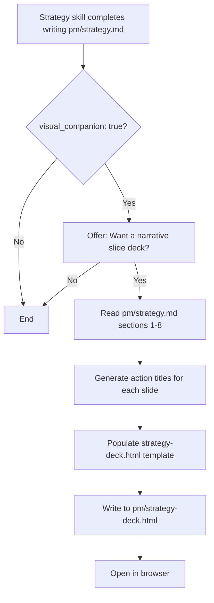

## Outcome

After writing or updating their strategy, the product engineer is offered a narrative slide deck. The deck is generated from strategy.md as a self-contained HTML file with ~7 slides following the SCR arc: who the product serves (Situation), why it matters (Complication), and how it wins (Resolution). The engineer opens the deck in their browser, navigates with arrow keys, and can go full-screen to present or read through it.

## Acceptance Criteria

1. A new template file exists at `templates/strategy-deck.html` with placeholder slots for each slide's content.
2. Each slide occupies exactly one viewport height (`100vh`). No scrolling within slides.
3. Left/right arrow keys navigate between slides. Current slide index and total count are visible (e.g., "3 / 7").
4. A full-screen button is present and functional (uses Fullscreen API).
5. Progress dots at the bottom indicate current position.
6. Dark/light mode adapts to system preference using the CSS variables from `scripts/frame-template.html`.
7. The slide deck follows an SCR narrative using only strategy.md data:
   - Slide 1: Title slide (product name, one-line identity)
   - Slide 2: Who we serve (ICP from §2)
   - Slide 3: The problem we solve (value prop setup from §3)
   - Slide 4: What we do differently (differentiation from §3)
   - Slide 5: How we position (competitive positioning from §4, go-to-market from §5)
   - Slide 6: Where we're going (priorities from §6, non-goals from §7)
   - Slide 7: How we'll know (success metrics from §8)
8. Each slide has an action title — a complete sentence that asserts a specific claim (e.g., "No tool covers the full lifecycle from research to merge"). Titles that name a topic without asserting a claim fail (e.g., "Our competitive advantage" or "Market overview"). The SKILL.md update must include this distinction as prompting guidance.
9. `skills/strategy/SKILL.md` is updated with a new "Slide Deck" section after the existing "Visual Companion" section. Deck generation is offered when `visual_companion: true` in `.pm/config.json`, as a second offer following the existing positioning-map offer. The section also supports on-demand regeneration: when the user runs `/pm:strategy` with argument `deck`, the skill skips the interview and goes directly to deck generation from current data sources. If `pm/strategy.md` does not exist when `/pm:strategy deck` is invoked, the skill tells the user "No strategy doc found. Run /pm:strategy first to create one." and exits without generating a deck.
10. The template defines named placeholder tokens for each slide slot (e.g., `{{SLIDE_TITLE_1}}`, `{{SLIDE_BODY_1}}`). These tokens are the interface contract between PM-065 and PM-066 — PM-066 extends the template by populating additional slide slots when landscape/competitor data is available.
11. The generated file is written to `pm/strategy-deck.html` and opened in the browser automatically.
12. The HTML file is fully self-contained — no external dependencies, works offline.

## User Flows

## Wireframes

N/A — the visual output is defined entirely through the HTML template, which is the deliverable itself. The slide deck has user-facing interaction (keyboard nav, fullscreen, progress dots) but these are specified in the ACs rather than wireframed separately.

## Competitor Context

No competitor generates a narrative slide deck from structured strategy data. The gap is structural, not a missing feature: Gamma and Beautiful.ai generate decks but have zero access to PM workflow data — no ICP, no priorities, no non-goals. ChatPRD has an MCP bridge into IDEs but no persistent knowledge base to draw from — it generates from conversation context, not from accumulated research. PM Skills Marketplace is stateless by design — a `/deck` command would have no data sources to synthesize. The action-title pattern (each title is a narrative sentence, not a label) is a quality differentiator: no AI presentation tool enforces the McKinsey Pyramid Principle constraint. This issue delivers the foundation; PM-066 enriches it with landscape and competitor data to create the full consulting-grade synthesis.

## Technical Feasibility

- **Build-on:** `templates/strategy-canvas.html` CSS variables, `scripts/frame-template.html` shared frame, `{{placeholder}}` injection pattern
- **Build-new:** `templates/strategy-deck.html` (~300-450 lines), keyboard nav JS, fullscreen API integration, slide-based viewport layout
- **Risk:** Slide layout (`100vh`, `overflow: hidden`) is structurally different from existing scroll-based templates. Positioning map CSS cannot be imported as a component — must be reproduced if needed.
- **Sequencing:** Design placeholder schema first → build static template → replace with placeholders → update SKILL.md

Splitting pattern: Major Effort. This issue is the core (80% of value) — delivers a working deck from strategy.md alone.

## Research Links

- [Strategy Slide Deck](pm/research/strategy-slide-deck/findings.md)

## Notes

- This is the MVP slice. Ships a functional deck even before PM-066 adds landscape/competitor data.
- Action title quality is a prompting concern — the SKILL.md update must include guidance on writing narrative titles from structured data.
