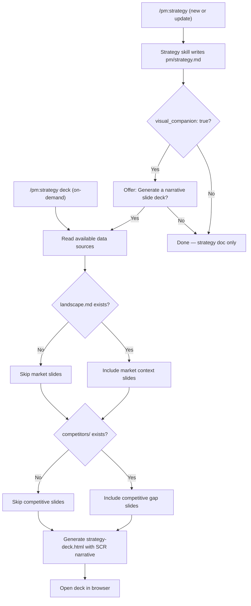

## Outcome

Product engineers can explain their strategy to anyone — a co-founder, friend, advisor, or first hire — by generating a narrative slide deck directly from their PM knowledge base. The deck tells a coherent story using the McKinsey SCR framework (Situation → Complication → Resolution), synthesizing data from strategy.md, landscape.md, and competitor profiles into a polished, full-screen HTML presentation. No manual deck creation, no context loss from copy-pasting into Keynote or Google Slides.

## Acceptance Criteria

1. Running the strategy skill with `visual_companion: true` offers to generate a narrative slide deck after writing strategy.md. Running `/pm:strategy deck` regenerates the deck on demand from current data sources without re-running the strategy interview — enabling regeneration after landscape or competitor updates.
2. The generated deck is a self-contained HTML file at `pm/strategy-deck.html` — opens in any browser, no dependencies.
3. The deck follows an SCR narrative arc with action titles that tell the full story when read in sequence.
4. Arrow keys navigate between slides. A full-screen button and slide counter are present.
5. Dark/light mode adapts to system preference using existing CSS variables.
6. The deck synthesizes data from all available sources: strategy.md (always), landscape.md (if exists), competitors/ (if exists).
7. When landscape.md or competitors/ are missing, the deck gracefully produces a shorter but coherent presentation from strategy.md alone.

## User Flows

## Wireframes

N/A — the visual output is defined entirely through the HTML template, which is the deliverable itself.

## Competitor Context

No PM tool generates strategy as a narrative slide deck. Standalone presentation tools (Gamma, Beautiful.ai, Chronicle) generate decks but have no PM workflow integration — they can't access research, landscape, or competitor data. The PM plugin is uniquely positioned because it has all three data sources in one place. The defensible value is the data synthesis, not the HTML format.

## Technical Feasibility

Feasible as scoped (EM verdict). Key findings:
- `templates/strategy-canvas.html` provides CSS variables, dark/light mode, and positioning map CSS to build on
- `scripts/frame-template.html` provides canonical shared CSS frame
- Slide-based layout (100vh per slide, no scroll) is structurally different from existing templates — cannot extend canvas, must be new template
- Placeholder injection pattern (`{{...}}`) is established and reusable
- Net-new: keyboard navigation JS, slide switching logic, action title generation prompting
- Risk: action title quality depends on prompting, not template — quality is a skill concern

## Research Links

- [Strategy Slide Deck](pm/research/strategy-slide-deck/findings.md)

## Notes

- Strategy check: off-priority (user override). Justified as a low-cost quick win: the template infrastructure already exists (CSS variables, placeholder injection, self-contained HTML pattern are all proven in strategy-canvas.html), and the timing is natural because it ships alongside the groom visual companion work (PM-036) that exercises the same `visual_companion` config flag. Does not cannibalize Priority 1-3 bandwidth — PM-065 is one template + one SKILL.md update leveraging established patterns.
- Scope review blockers fixed: (1) JTBD reframed for ICP — sharing with friends/advisors, not boardroom executives, (2) Anchored on data synthesis as core capability, not HTML template format.
- Decomposed using Major Effort pattern: core template (PM-065) delivers 80% value, knowledge synthesis (PM-066) enriches.
