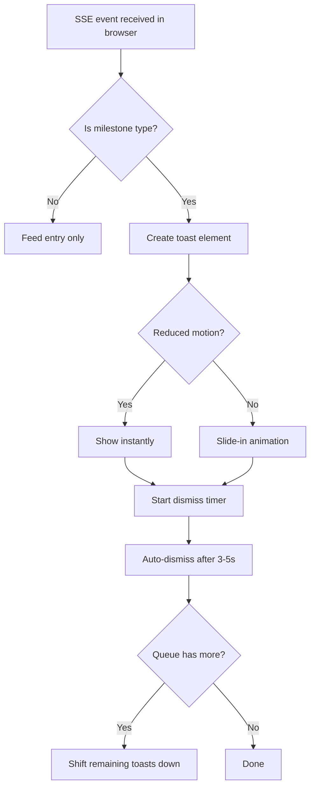

## Outcome

Milestone events surface as brief, non-intrusive toast notifications on the dashboard. The product engineer gets a quick visual confirmation ("Tests passed", "PR created") without switching context. The feed logs the event; the toast celebrates it.

## Acceptance Criteria

1. Toast notifications appear in the bottom-right of the main content area (not over the feed panel).
2. Toasts trigger only for milestone event types: `tests_passed`, `pr_created`, `review_done`, `merged`.
3. Each toast shows: a status icon (checkmark for success, arrow for PR, etc.) and a one-line message (max 10 words).
4. Toasts auto-dismiss after a duration calculated as 500ms per word + 1000ms buffer (minimum 3 seconds, maximum 5 seconds).
5. Toasts slide in from the bottom with a subtle animation (translateY 8px → 0, 300ms ease-out).
6. When `prefers-reduced-motion` is active, the toast appears instantly without animation.
7. Multiple toasts queue vertically — a new toast appears above the existing one, not replacing it. Maximum 3 visible toasts; oldest dismissed if a 4th arrives.
8. Toasts contain no interactive elements (no buttons, no links). They are pure confirmation.
9. Toast styling is neutral — `var(--surface)` background, `var(--border)` border, `var(--shadow-md)` shadow. No aggressive colors.
10. The toast JavaScript listens to the same EventSource connection used by the activity feed (PM-091), filtering for milestone event types.

## User Flows

## Wireframes

[Wireframe preview](pm/backlog/wireframes/sse-event-bus.html)

## Competitor Context

No competitor offers celebration moments for product lifecycle milestones. This creates positive reinforcement for the full-lifecycle workflow — a product engineer who sees "PM-088 merged" after starting from a groom session gets visceral feedback that the pipeline works end-to-end.

## Technical Feasibility

**Build-on:**
- `scripts/server.js` line 1126: existing WebSocket client injection point. EventSource client is a shared JS module injected alongside, independent of the feed panel DOM.
- `DASHBOARD_CSS` provides all needed variables for toast styling.

**Build-new:** Toast JavaScript (create element, position, animate, dismiss, queue management), toast CSS (position fixed, animation keyframes, stacking), milestone type filter list. The EventSource client can be a shared module used by both the feed panel (PM-091) and toasts.

**Depends on:** PM-090 (SSE Event Bus Core) — needs the `GET /events` SSE endpoint. Does NOT depend on PM-091 — the EventSource client is independent of the feed panel.

## Scope Note

Covers in-scope item: "Toast notifications — bottom-right of main content for milestone events."

## Decomposition Rationale

Workflow Steps pattern: toasts are the final rendering stage. Shares a common EventSource client module with the feed panel (PM-091) but can be implemented independently — both depend on PM-090, not on each other.

## Research Links

- [SSE Event Bus + Activity Feed Patterns](pm/research/sse-event-bus/findings.md)

## Notes

- WCAG compliance: no interactive elements in auto-dismissing toasts (per Carbon Design System guidance).
- Toast is cosmetic — if it fails to render, the event still appears in the feed.
