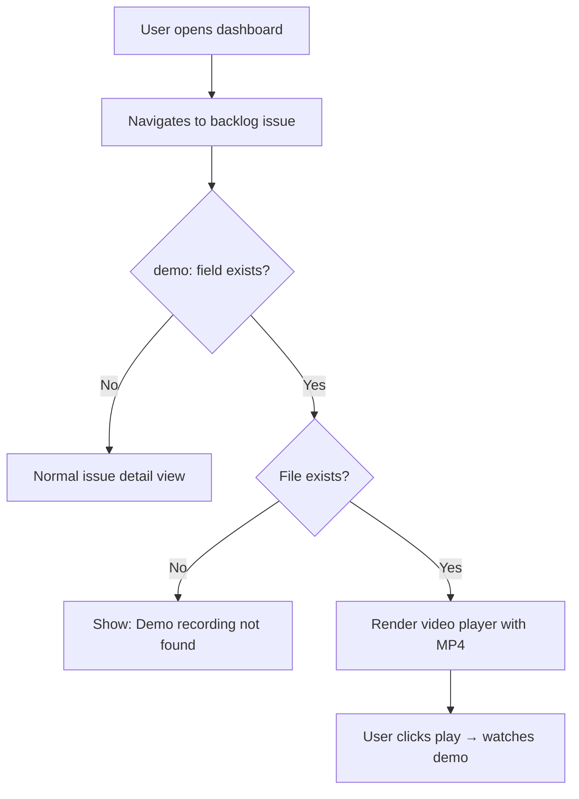

## Outcome

When viewing a backlog issue in the dashboard that has a `demo:` field, a video player appears showing the recorded demo. The product engineer or reviewer can watch the feature working without leaving the dashboard. For issues without a demo, nothing changes.

## Acceptance Criteria

1. Dashboard issue detail page detects the `demo:` frontmatter field.
2. If `demo:` exists and the file is found, a `<video>` element renders inline with playback controls (play/pause, scrub, fullscreen).
3. Video player appears below the issue outcome and above acceptance criteria.
4. If `demo:` exists but the file is missing (deleted, different machine), a placeholder message shows: "Demo recording not found at {path}."
5. Supported formats: MP4 (primary), WebM (future Playwright output).
6. Video player is responsive — scales to container width, maintains aspect ratio.
7. No autoplay — user must click play.
8. Dashboard server serves `.pm/demos/` directory as a static route for video files.

## User Flows

## Wireframes

N/A — simple `<video>` element addition to existing issue detail page. No layout redesign needed.

## Competitor Context

No PM tool or AI coding plugin has a dashboard with inline video playback of automated demos. This is a novel integration that makes PM's dashboard the single place to review an issue's full context: outcome, AC, research, wireframes, and now video proof.

## Technical Feasibility

- **Build-on:** Dashboard server (`tools/`) already serves static files and renders backlog issues. The issue detail page already reads frontmatter fields. Adding a `<video>` tag conditioned on the `demo:` field is a small template change.
- **Build-new:** Static route for `.pm/demos/` in the dashboard server, `<video>` element in issue detail template, fallback message for missing files.
- **Risk:** Minimal. HTML5 `<video>` with MP4 is universally supported. No transcoding, no streaming, no custom player needed.
- **Sequencing:** Last in the pipeline. Depends on PM-086 (the `demo:` field must exist in frontmatter).

## Decomposition Rationale

Workflow Steps pattern: step 3 of the pipeline (generate → store → **display**). The dashboard player is the user-facing payoff — where the demo becomes visible and useful.

## Research Links

- [Video Demo Recording Research](pm/research/video-demo-recording/findings.md)

## Notes

- Future enhancement: thumbnail preview from first frame of video, shown on the backlog card grid.
- Future enhancement: timestamp annotations linked to specific AC ("AC 1 verified at 0:12").
