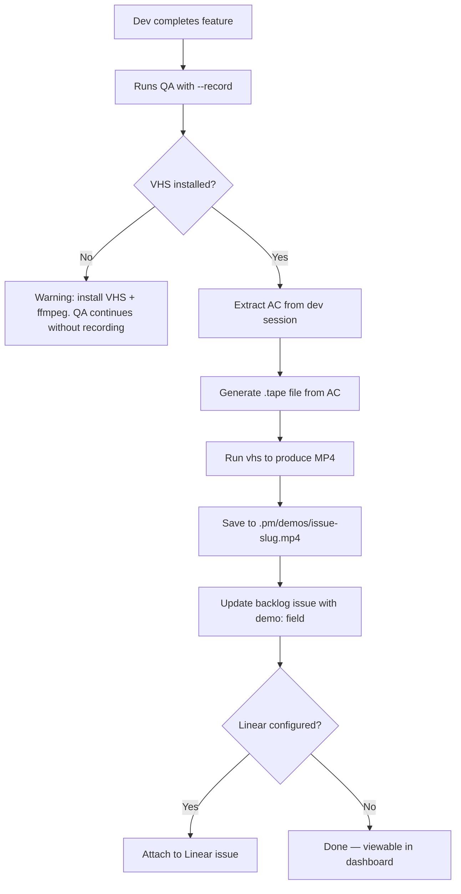

## Outcome

When a product engineer finishes implementing a feature and runs the QA gate with `--record`, PM generates a video demo of the feature working by translating acceptance criteria into a VHS tape script, executing it, and saving the MP4 locally. The demo is linked to the backlog issue and playable in the dashboard. Manual screen recording ("record a Loom and paste it") is replaced by automated, reproducible demos that are always available for async review.

## Acceptance Criteria

1. Running QA with `--record` flag produces an MP4 video at `.pm/demos/{issue-slug}.mp4`.
2. The video is generated from a VHS `.tape` file that translates the issue's acceptance criteria into terminal commands.
3. If VHS or ffmpeg is not installed, a clear error message with install instructions is shown and QA continues without recording.
4. The backlog issue frontmatter supports a `demo:` field pointing to the video path.
5. The dashboard issue detail page plays the video inline when a `demo:` field is present.
6. Video recording is opt-in: either `--record` flag per invocation or `video_demo: true` in project config.
7. `.pm/demos/` is added to `.gitignore` (videos are local artifacts, not committed).
8. If Linear is configured, the video is attached to the Linear issue as a file attachment.

## User Flows

## Wireframes

N/A — dashboard player is a simple `<video>` element on existing issue detail page.

## Competitor Context

No AI coding tool or PM plugin auto-generates video demos from acceptance criteria. Cypress records test videos but only for debugging, not feature demos. Arcade creates interactive demos but requires manual setup. This is a greenfield capability that closes the loop from groom (AC) to validation (video proof).

## Technical Feasibility

- **Build-on:** QA skill (`skills/qa/SKILL.md`) already reads AC from dev sessions and drives Playwright MCP. The `--record` flag extends the existing arguments table. Config pattern from `dev/instructions.md` supports `video_demo: true`. Dashboard server at `tools/` already serves HTML and static files.
- **Build-new:** VHS tape generator (AC → `.tape` syntax), demo storage directory + frontmatter field, dashboard video player component.
- **Risk:** VHS requires `ttyd` + `ffmpeg` as system dependencies. Clear dependency check with install instructions mitigates this. Phase 1 is CLI-only (VHS); Playwright browser recording deferred to Phase 2 when official MCP adds support.
- **Sequencing:** Tape generation (PM-085) → Storage + plumbing (PM-086) → Dashboard player (PM-087).

## Research Links

- [Video Demo Recording Research](pm/research/video-demo-recording/findings.md)

## Notes

- Strategy check: passed (supports priority #1, groom-to-dev handoff quality)
- 10x filter: 10x — no competitor connects groomed AC to automated video demos
- Phase 2 (future): Playwright browser recording for web UI features when official MCP adds recordVideo support
- Phase 3 (future): Mobile recording via Maestro YAML flows
- The user's own pain point ("one of the issues I have is manual validation") is the customer evidence for this feature
