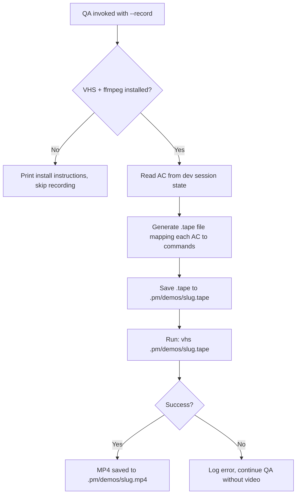

## Outcome

When `--record` is passed to the QA gate, PM reads the issue's acceptance criteria, generates a VHS `.tape` file that demonstrates each AC as terminal commands, runs `vhs` to produce an MP4, and saves it to `.pm/demos/`. The tape file is a reproducible demo script — it can be re-run to regenerate the video after changes.

## Acceptance Criteria

1. A new reference file `skills/qa/references/vhs-tape-generation.md` documents the AC-to-tape mapping rules.
2. Each testable AC is translated to a VHS tape sequence: `Type` (command), `Enter`, `Sleep` (wait for output), with appropriate timing.
3. The tape file includes VHS configuration: `Set FontSize 14`, `Set Width 1200`, `Set Height 600`, `Output .pm/demos/{slug}.mp4`.
4. Before generating, Phase 0 checks for `vhs` and `ffmpeg` binaries. If missing: print "Video recording requires VHS (brew install vhs) and ffmpeg (brew install ffmpeg). Skipping recording." and continue QA normally.
5. The generated `.tape` file is saved to `.pm/demos/{slug}.tape` alongside the MP4 for reproducibility.
6. The tape generation handles common CLI patterns: running commands, waiting for output, scrolling, typing input.
7. Recording completes within 60 seconds for a typical 3-5 AC issue. VHS `Sleep` durations are calibrated to avoid unnecessarily long videos.
8. If `vhs` execution fails (e.g., command errors), the error is logged, QA continues without a video, and the user is informed: "Recording failed: {error}. QA results are unaffected."

## User Flows

## Wireframes

N/A — CLI/terminal feature, no UI.

## Competitor Context

VHS by Charmbracelet is the standard for scripted terminal recordings. No AI tool auto-generates tape files from acceptance criteria. The closest pattern is Cypress recording test runs, but that is for debugging, not demo generation.

## Technical Feasibility

- **Build-on:** QA skill Phase 1 already extracts AC from `.pm/dev-sessions/{slug}.md`. The orient phase detects platform (web vs CLI). The `--record` flag extends the existing arguments table.
- **Build-new:** `skills/qa/references/vhs-tape-generation.md` (mapping rules), tape generation logic in QA SKILL.md (new step in Phase 0 or Phase 3), dependency check for vhs/ffmpeg.
- **Risk:** AC-to-tape translation is LLM-driven — quality depends on AC specificity. Well-groomed AC (which PM produces) maps cleanly; vague AC produces vague demos. Graceful fallback if generation fails.
- **Sequencing:** This ships first. PM-086 (storage/plumbing) and PM-087 (dashboard player) depend on having a video to store and play.

## Decomposition Rationale

Workflow Steps pattern: this is step 1 of the pipeline (generate → store → display). It delivers standalone value — the MP4 exists on disk even before dashboard integration. Can be tested by running `vhs` manually on the generated tape.

## Research Links

- [Video Demo Recording Research](pm/research/video-demo-recording/findings.md)

## Notes

- The tape file is both an artifact and documentation — it shows exactly what the demo does, and can be edited manually if the auto-generated version needs tweaking.
- Consider a `pm:demo` standalone command in the future that generates a demo from any backlog issue, not just during QA.
