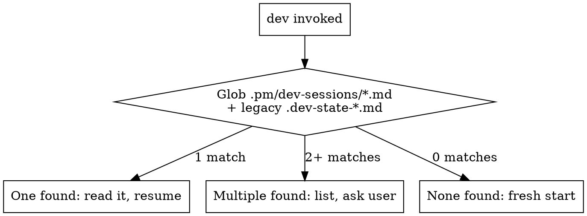

# Dev — Development Lifecycle

Unified orchestrator for all development work. Auto-detects scope and routes to one of three flows:

| Flow | When | Reference |
|------|------|-----------|
| **Single Issue** | Feature, bug fix, refactor, test backfill | `dev/references/single-issue-flow.md` |
| **Epic** | Parent issue with multiple sub-issues | `dev/references/epic-flow.md` |
| **Bug Fix** | Batch triage of cycle bugs | `dev/references/bug-fix-flow.md` |

**Read ONE flow reference, not all three.** The routing section below determines which.

**Hard rules (all flows):**
- **Protect the orchestrator's context window in epic flow.** Each sub-issue's planning and implementation worker MUST run as a **persistent agent with isolated context**. Use the host platform's worker primitives to create, resume, message, and close that worker without replaying its internal reasoning into the orchestrator. Short-lived review/code-scan agents can still return compact results directly. See ADR-0002.
- No frontend work without passing the contract sync gate (when project uses API contract tooling)
- No design critique or review without running `/simplify` first (all sizes)
- No PR or auto-merge without design critique for UI changes (S/M/L/XL with frontend work)
- No PR without passing the review gate (M/L/XL) — `/review` MUST run before push
- No auto-merge without passing the code scan gate (XS/S) — lightweight bug scan before merge
- XS/S auto-merge to the default branch after implementation — unless the repo requires PRs (branch protection), in which case use the PR flow
- M/L/XL gets full PR + review flow + auto-merge after readiness gates pass
- Learnings file MUST be read at intake before any work begins
- Never use destructive git recovery in `/dev` flows (`git reset --hard`, `git checkout --`, blind `git stash pop`)
- At every stage transition, emit a workspace checkpoint (cwd, branch, worktree, next action)
- Bug-fix: investigation AND fixes run in sub-agents — main context only sees summaries

## Route Detection

**Runs FIRST on every invocation.**

### Step 1: Resume Detection

Glob for active sessions in `.pm/dev-sessions/` (+ legacy `.dev-state-*.md`, `.dev-epic-state-*.md` at repo root):

| Pattern | Route |
|---------|-------|
| `epic-*.md` | Read `${CLAUDE_PLUGIN_ROOT}/skills/dev/references/epic-flow.md`, resume epic |
| `bugfix-*.md` | Read `${CLAUDE_PLUGIN_ROOT}/skills/dev/references/bug-fix-flow.md`, resume bug-fix |
| Other `*.md` | Read `${CLAUDE_PLUGIN_ROOT}/skills/dev/references/single-issue-flow.md`, resume single |
| Multiple types | List all with stage and last-modified, ask user which to resume |
| None found | Proceed to Step 2 |

**Staleness guard:** If a session file is older than 48 hours and the user didn't explicitly reference it, ask whether to resume or discard.

### Step 2: Fresh Start Classification

Parse `$ARGUMENTS` and user message:

| Signal | Route | Action |
|--------|-------|--------|
| Argument is an issue ID with sub-issues (check via MCP) | **Epic** | Read `${CLAUDE_PLUGIN_ROOT}/skills/dev/references/epic-flow.md` |
| Argument is a cycle name, or user says "fix bugs" / "bug triage" / "batch bugs" / "cycle bugs" | **Bug Fix** | Read `${CLAUDE_PLUGIN_ROOT}/skills/dev/references/bug-fix-flow.md` |
| Everything else (single issue, topic, "build X", "fix Y") | **Single Issue** | Read `${CLAUDE_PLUGIN_ROOT}/skills/dev/references/single-issue-flow.md` |

**Epic detection:** If `$ARGUMENTS` looks like an issue ID (e.g., `PM-036`, `CLE-1200`), fetch via MCP and check for sub-issues. If it has sub-issues → epic. If not → single issue.

After routing, read ONLY the selected flow reference file and follow it.

## Bundled Skills

All workflow skills are self-contained within this plugin. No external skill dependencies.

| Skill / Reference | Used in |
|-------------------|---------|
| `pm:groom` | Single: Groom readiness check (S/M/L/XL — auto-invoked when issue is ungroomed) |
| `groom/phases/phase-3.5-design.md` (reference) | Single: Design Exploration (M/L/XL) |
| `dev/references/writing-plans.md` (reference) | Single: Plan (M/L/XL) |
| `dev/references/epic-review-prompts.md` (reference) | Epic: Stage 3 review |
| `dev/references/epic-rfc-reviewer-prompts.md` (reference) | Epic: Stage 2 RFC review |
| `dev/references/epic-implementation-flow.md` (reference) | Epic: Stage 4 implementation |
| `pm:tdd` | Single: Implement (all) |
| `pm:subagent-dev` | Single: Implement (all) |
| `pm:debugging` | Single/Bug-fix: Debug |
| `pm:qa` | Single: QA ship gate (all sizes with UI) |
| `review/references/handling-feedback.md` (reference) | Single: Ship (M/L/XL) — handling PR feedback |

## Project Context Discovery

At intake, run the context discovery protocol defined in `context-discovery.md` (same directory).
This reads CLAUDE.md, AGENTS.md, package manifests, and MCP tools to build the project context.
Store results in `.pm/dev-sessions/{slug}.md` under `## Project Context`.

See `context-discovery.md` for the full discovery contract, fallback behavior, and context injection template.
All downstream agent prompts use the `{PROJECT_CONTEXT}` block from that contract.

### Context Quality Gate

At intake, verify CLAUDE.md contains the minimum context needed for review agents. Check for:

| Required for | What to look for in CLAUDE.md | If missing |
|-------------|-------------------------------|------------|
| UX Review | User personas with roles, contexts, constraints | Ask user: "Who are your users? What are their roles and constraints?" |
| UX Review | Scale expectations (user count, data volume, concurrency) | Ask user: "What's your expected scale? (users, records, concurrent ops)" |
| Design Critique | Design principles or aesthetic direction | Ask user: "Any design principles or aesthetic preferences?" |
| PM Review | Product positioning, ICP, strategic priorities | Check pm/strategy.md. If absent, ask user or skip PM agent. |
| Competitive Review | Competitive landscape, differentiators | Check pm/competitors/. If absent, ask user or skip Competitive agent. |

If CLAUDE.md is minimal (< 20 lines, no user/design sections), warn the user:
> "CLAUDE.md has limited product context. Review agents work best with user personas, scale expectations, and design principles documented. Want to add these now, or proceed with what's available?"

**Do not block on this.** Proceed with available context, but log the gap in `.pm/dev-sessions/{slug}.md`.

## State File Naming

State files live under `.pm/dev-sessions/`, namespaced by feature slug to allow concurrent sessions:

- **Single issue:** `.pm/dev-sessions/{slug}.md` — where `{slug}` is derived from the branch name by stripping the type prefix (`feat/`, `fix/`, `chore/`). Example: branch `feat/add-auth` → `.pm/dev-sessions/add-auth.md`. For XS tasks (no branch), use the topic slug from intake.
- **Epic:** `.pm/dev-sessions/epic-{parent-slug}.md`
- **Bug-fix:** `.pm/dev-sessions/bugfix-{cycle-slug}.md`
- **`.gitignore`:** `.pm/` covers all state files (no separate pattern needed).

When referencing the state file in subsequent sections, `.dev-state.md` means `.pm/dev-sessions/{slug}.md` — the slug is determined at intake.

**Directory creation:** If `.pm/dev-sessions/` does not exist, create it (`mkdir -p .pm/dev-sessions`) before the first write.

**Legacy migration:** On resume detection or any state file read, also check the legacy path (`.dev-state-{slug}.md` at repo root). If found at legacy path but not at new path, read from legacy. New writes always go to `.pm/dev-sessions/`.

## Resume Detection



On resume: read the state file, announce current stage and progress, continue from there.

If multiple state files exist: list them with their stage and last-updated time. Ask user which to resume or whether to start fresh.

**Context recovery:** At the start of every turn, if you're unsure which stage you're in or what decisions were made, read the state file first. The state file is the single source of truth — not conversation history.

## Execution Defaults (all flows)

### Workspace checkpoint format

At stage start/end, print this block and mirror the same fields in `.pm/dev-sessions/{slug}.md`:

```
Checkpoint
- Repo root: <path>
- CWD: <path>
- Branch: <branch>
- Worktree: <path or "none">
- Stage: <intake/workspace/...>
- Next: <single next action>
```

### Path and command preflight

Before running multi-step commands:
- Confirm target paths exist (`test -d`, `test -f`)
- Confirm branch/worktree context (`git branch --show-current`, `git worktree list`)
- Prefer idempotent commands (`pull --ff-only`, guarded `git branch -d`)

### Default branch detection (all flows)

Never hardcode `main` as the default branch. Detect it at intake:

```bash
DEFAULT_BRANCH=$(git symbolic-ref refs/remotes/origin/HEAD 2>/dev/null | sed 's@^refs/remotes/origin/@@')
[ -z "$DEFAULT_BRANCH" ] && DEFAULT_BRANCH=$(git remote show origin 2>/dev/null | grep 'HEAD branch' | awk '{print $NF}')
[ -z "$DEFAULT_BRANCH" ] && DEFAULT_BRANCH="main"  # fallback only
```

Store in the state file and use `{DEFAULT_BRANCH}` everywhere instead of literal `main`. Pass to subagents in their prompts.

### Pre-commit validation (all flows)

Before EVERY `git commit`:
1. Verify you're on the correct branch: `git branch --show-current` — must match the expected feature branch
2. Verify cwd is in the correct worktree: `git rev-parse --show-toplevel` — must match expected worktree path
3. Run the project test command (from AGENTS.md) on changed files — if tests fail, fix before committing
4. Check for untracked files that shouldn't be staged: `git status --porcelain` — review any `??` files

If any check fails, fix before committing. Do not commit broken code and hope the push hook catches it.

### Git state guard (all flows)

Before starting ANY implementation work:
1. Check for uncommitted changes: `git status --porcelain`
2. If dirty state from a prior failed attempt: read the state file to understand what happened, then decide whether to commit the partial work or reset it
3. Never start fresh work on a dirty worktree — resolve the state first

### Subagent git context (all flows)

Every subagent prompt MUST include:
- Explicit repo root path
- Current branch name
- Worktree path (if applicable)
- Instruction: "Verify you are on branch {branch} before making changes"

### Repeated error handling

If the same root-cause error repeats twice (path missing, branch exists, permission denied):
1. Stop repeating the same command
2. Run a short diagnosis (`pwd`, `git status -sb`, `git worktree list`)
3. Switch strategy (reuse existing worktree/branch, fix path, or ask user one focused question)
