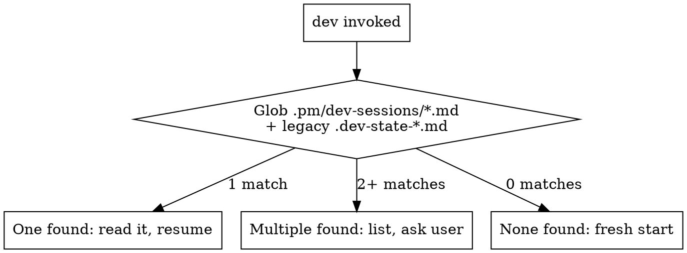

# Dev — Development Lifecycle

Unified orchestrator for all development work. Auto-detects scope and routes to one of three flows:

| Flow | When | Reference |
|------|------|-----------|
| **Single Issue** | Feature, bug fix, refactor, test backfill | `dev/references/single-issue-flow.md` |
| **Epic** | Parent issue with multiple sub-issues | `dev/references/epic-flow.md` |
| **Bug Fix** | Batch triage of cycle bugs | `dev/references/bug-fix-flow.md` |

**Read ONE flow reference, not all three.** The routing section below determines which.

Read `${CLAUDE_PLUGIN_ROOT}/skills/dev/references/agent-runtime.md` for runtime execution rules and `${CLAUDE_PLUGIN_ROOT}/references/capability-gates.md` for shared capability classification.

**Hard rules (all flows):**
- **Protect the orchestrator's context window in epic flow.** Each sub-issue's planning and implementation MUST run as a **fresh Agent() with isolated context**. Dispatch one fresh agent for RFC generation, and a separate fresh agent for implementation — the approved RFC is the handoff contract. Review/code-scan agents return compact results directly.
- No frontend work without passing the contract sync gate (when project uses API contract tooling)
- Before design critique or review, always run `pm:simplify` (it routes to Anthropic official simplify in Claude Code and normalizes output to PM-required fields)
- No PR or auto-merge without design critique for UI changes (S/M/L/XL with frontend work)
- No PR without passing the review gate (M/L/XL) — `/review` MUST run before push
- No auto-merge without passing the code scan gate (XS/S) — lightweight bug scan before merge
- All sizes use the PR flow — push branch, create PR, merge via `references/merge-loop.md`. The project's branch protection and CI dictate what's required.
- XS/S: code scan gate → PR → auto-merge
- M/L/XL: full review gate → PR → auto-merge after readiness gates pass
- Learnings file MUST be read at intake before any work begins
- Never use destructive git recovery in `/dev` flows (`git reset --hard`, `git checkout --`, blind `git stash pop`)
- At every stage transition, emit a workspace checkpoint (cwd, branch, worktree, next action)
- Bug-fix: investigation AND fixes run in delegated agents when available — main context only sees summaries

## Telemetry (opt-in)

If analytics are enabled, read `${CLAUDE_PLUGIN_ROOT}/references/telemetry.md`. Steps: `resume-detection`, `intake`, `workspace`, `groom-readiness`, `plan`, `implementation`, `qa`, `review`, `ship`, `retro`.

## Route Detection

**Runs FIRST on every invocation.**

### Step 1: Resume Detection

Glob for active sessions in `.pm/dev-sessions/` (+ legacy `.dev-state-*.md`, `.dev-epic-state-*.md` at repo root):

| Pattern | Route |
|---------|-------|
| `epic-*.md` | Read `${CLAUDE_PLUGIN_ROOT}/skills/dev/references/epic-flow.md`, resume epic |
| `bugfix-*.md` | Read `${CLAUDE_PLUGIN_ROOT}/skills/dev/references/bug-fix-flow.md`, resume bug-fix |
| Other `*.md` | Read `${CLAUDE_PLUGIN_ROOT}/skills/dev/references/single-issue-flow.md`, resume single |
| Multiple types | List all with stage and last-modified, ask user which to resume |
| None found | Proceed to Step 2 |

**Staleness guard:** If a session file is older than 48 hours and the user didn't explicitly reference it, ask whether to resume or discard.

### Step 2: Fresh Start Classification

Parse `$ARGUMENTS` and user message:

| Signal | Route | Action |
|--------|-------|--------|
| Argument is an issue ID with sub-issues (check via MCP) | **Epic** | Read `${CLAUDE_PLUGIN_ROOT}/skills/dev/references/epic-flow.md` |
| Argument is a cycle name, or user says "fix bugs" / "bug triage" / "batch bugs" / "cycle bugs" | **Bug Fix** | Read `${CLAUDE_PLUGIN_ROOT}/skills/dev/references/bug-fix-flow.md` |
| Everything else (single issue, topic, slug, "build X", "fix Y") | **Single Issue** | Read `${CLAUDE_PLUGIN_ROOT}/skills/dev/references/single-issue-flow.md` |

**Local backlog resolution (always runs first):** If `$ARGUMENTS` is a slug (e.g., `inspection-checklist-navigation`) or an issue ID (e.g., `PM-036`):
1. First, check `pm/backlog/{slug}.md` — if found, read frontmatter and use as task context. Route to Single Issue.
2. If the argument matches `PM-{NNN}` format, scan `pm/backlog/*.md` frontmatter for a matching `id:` field. If found, use that file's slug and content as task context. Route to Single Issue.
3. Only if no local backlog match: fall through to MCP lookup below.

**Epic detection (MCP fallback):** If `$ARGUMENTS` looks like an issue ID (e.g., `PM-036`, `CLE-1200`) and was NOT resolved from local backlog above, fetch via MCP and check for sub-issues. If it has sub-issues → epic. If not → single issue. If MCP returns nothing, route to Single Issue with the argument as the topic.

**Linear issue readiness check (after epic detection):** If the MCP fetch returned a single issue (no sub-issues), assess dev-readiness before routing:

1. **Fetch context:** Read the issue title, description, labels, and status from the `get_issue` response.
2. **Dev-readiness assessment:** Check three criteria:
   - **AC exist:** The description contains testable acceptance criteria (specific, verifiable statements — not just a vague description). Be generous: look for testable statements anywhere, not just under "AC:" headers.
   - **Scope is clear:** The description distinguishes what's in scope. It should be possible to determine what the issue does and doesn't cover.
   - **Size is inferrable:** Enough detail exists to classify as XS/S/M/L/XL.
3. **If all three pass:** Route to Single Issue. Store `linear_id`, `linear_title`, and `linear_description` in the session state file. Log: `Linear issue {ID}: dev-ready. Proceeding to RFC.`
4. **If any fail:** Also classify size (XS/S/M/L/XL) from the available context. Store `linear_id` and `linear_readiness: needs-groom` with the specific gaps (e.g., `gaps: [missing-ac, vague-scope]`) in the session state.
   - **XS/S:** Handle inline — confirm scope + ACs with the user conversationally (same as existing XS/S ungroomed path in Stage 2.5 Step 2). Do NOT invoke pm:groom.
   - **M/L/XL:** Announce gaps and invoke pm:groom within the same conversation. Pass Linear context as conversation text (not CLI flags). Specify the slug for groom: "Use slug: {slug}". Log: `Linear issue {ID}: needs grooming ({gaps}). Invoking pm:groom.`
5. **If MCP fetch fails:** Log `linear_fetch: failed` and `linear_error: {error message}`. Ask the user: "Could not fetch Linear issue {ID}. Can you paste the issue description?" Proceed with the pasted text as conversation-sourced task context.

After routing, read ONLY the selected flow reference file and follow it.

## Bundled Skills

All workflow skills are self-contained within this plugin. No external skill dependencies.

| Skill / Reference | Used in |
|-------------------|---------|
| `pm:groom` | Single: Auto-invoked when no proposal exists (M/L/XL) |
| `dev/references/writing-rfcs.md` (reference) | Single: RFC Generation (M/L/XL) |
| `dev/references/splitting-patterns.md` (reference) | Single: Issue splitting within RFC (M/L/XL) |
| `dev/references/epic-review-prompts.md` (reference) | Epic: Stage 3 review |
| `dev/references/epic-rfc-reviewer-prompts.md` (reference) | Epic: Stage 2 RFC review |
| `dev/references/implementation-flow.md` (reference) | Single: Stage 5, Epic: Stage 4 implementation |
| `pm:tdd` | Single: Implementation agent (all) |
| `pm:subagent-dev` | Single: Implementation agent (all) |
| `pm:debugging` | Single/Bug-fix: Debug |
| `pm:qa` | Single: QA ship gate (all UI changes) |
| `review/references/handling-feedback.md` (reference) | Single: Ship (M/L/XL) — handling PR feedback |

## Project Context Discovery

At intake, run the context discovery protocol defined in `context-discovery.md` (same directory).
This reads CLAUDE.md, AGENTS.md, package manifests, and MCP tools to build the project context.
Store results in `.pm/dev-sessions/{slug}.md` under `## Project Context`.

See `context-discovery.md` for the full discovery contract, fallback behavior, and context injection template.
All downstream agent prompts use the `{PROJECT_CONTEXT}` block from that contract.

## State File Naming

State files live under `.pm/dev-sessions/`, namespaced by feature slug to allow concurrent sessions:

- **Single issue:** `.pm/dev-sessions/{slug}.md` — where `{slug}` is derived from the branch name by stripping the type prefix (`feat/`, `fix/`, `chore/`). Example: branch `feat/add-auth` → `.pm/dev-sessions/add-auth.md`. For XS tasks (no branch), use the topic slug from intake.
- **Epic:** `.pm/dev-sessions/epic-{parent-slug}.md`
- **Bug-fix:** `.pm/dev-sessions/bugfix-{cycle-slug}.md`
- **`.gitignore`:** `.pm/` covers all state files (no separate pattern needed).

When referencing the state file in subsequent sections, `.dev-state.md` means `.pm/dev-sessions/{slug}.md` — the slug is determined at intake.

**Directory creation:** If `.pm/dev-sessions/` does not exist, create it (`mkdir -p .pm/dev-sessions`) before the first write.

**Legacy migration:** On resume detection or any state file read, also check the legacy path (`.dev-state-{slug}.md` at repo root). If found at legacy path but not at new path, read from legacy. New writes always go to `.pm/dev-sessions/`.

## Resume Detection



On resume: read the state file, announce current stage and progress, continue from there.

If multiple state files exist: list them with their stage and last-updated time. Ask user which to resume or whether to start fresh.

**Context recovery:** At the start of every turn, if you're unsure which stage you're in or what decisions were made, read the state file first. The state file is the single source of truth — not conversation history.

## Execution Defaults (all flows)

### Workspace checkpoint format

At stage start/end, print this block and mirror the same fields in `.pm/dev-sessions/{slug}.md`:

```
Checkpoint
- Repo root: <path>
- CWD: <path>
- Branch: <branch>
- Worktree: <path or "none">
- Stage: <intake/workspace/...>
- Next: <single next action>
```

### Path and command preflight

Before running multi-step commands:
- Confirm target paths exist (`test -d`, `test -f`)
- Confirm branch/worktree context (`git branch --show-current`, `git worktree list`)
- Prefer idempotent commands (`pull --ff-only`, guarded `git branch -d`)

### Default branch detection (all flows)

Never hardcode `main` as the default branch. Detect it at intake:

```bash
DEFAULT_BRANCH=$(git symbolic-ref refs/remotes/origin/HEAD 2>/dev/null | sed 's@^refs/remotes/origin/@@')
[ -z "$DEFAULT_BRANCH" ] && DEFAULT_BRANCH=$(git remote show origin 2>/dev/null | grep 'HEAD branch' | awk '{print $NF}')
[ -z "$DEFAULT_BRANCH" ] && DEFAULT_BRANCH="main"  # fallback only
```

Store in the state file and use `{DEFAULT_BRANCH}` everywhere instead of literal `main`. Pass to delegated workers and reviewers in their prompts when delegation is used.

### Pre-commit validation (all flows)

Before EVERY `git commit`:
1. Verify you're on the correct branch: `git branch --show-current` — must match the expected feature branch
2. Verify cwd is in the correct worktree: `git rev-parse --show-toplevel` — must match expected worktree path
3. Run the project test command (from AGENTS.md) on changed files — if tests fail, fix before committing
4. Check for untracked files that shouldn't be staged: `git status --porcelain` — review any `??` files

If any check fails, fix before committing. Do not commit broken code and hope the push hook catches it.

### Git state guard (all flows)

Before starting ANY implementation work:
1. Check for uncommitted changes: `git status --porcelain`
2. If dirty state from a prior failed attempt: read the state file to understand what happened, then decide whether to commit the partial work or reset it
3. Never start fresh work on a dirty worktree — resolve the state first

### Subagent git context (all flows)

Every delegated worker or reviewer prompt MUST include:
- Explicit repo root path
- Current branch name
- Worktree path (if applicable)
- Instruction: "Verify you are on branch {branch} before making changes"

### Repeated error handling

If the same root-cause error repeats twice (path missing, branch exists, permission denied):
1. Stop repeating the same command
2. Run a short diagnosis (`pwd`, `git status -sb`, `git worktree list`)
3. Switch strategy (reuse existing worktree/branch, fix path, or ask user one focused question)
