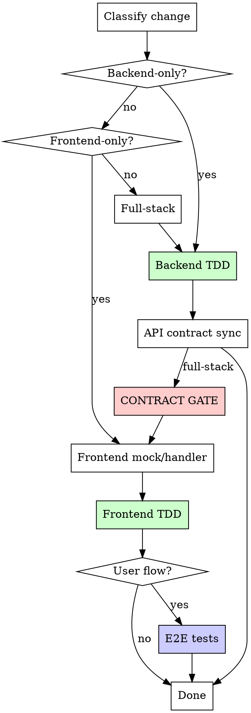
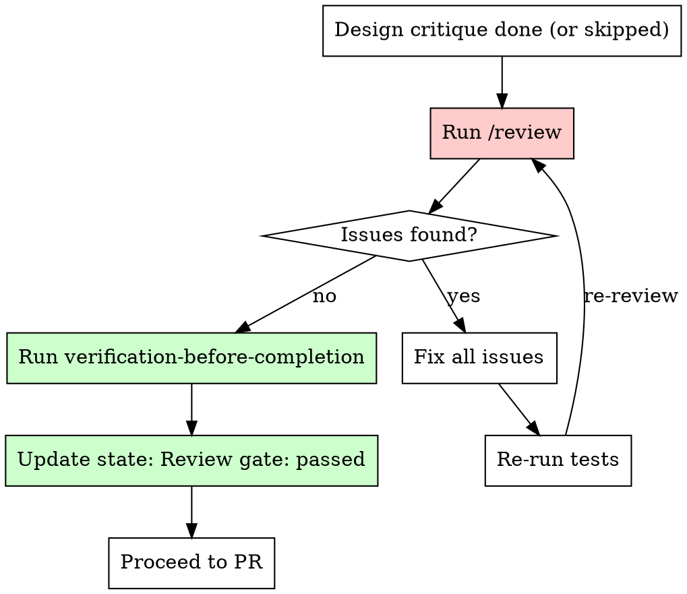

# Implementation Flow

Shared implementation lifecycle used by both single-issue dev and epic sub-issue workers. Everything from "plan approved" through "merged and cleaned up" lives here.

**Agent runtime:** Read `${CLAUDE_PLUGIN_ROOT}/skills/dev/references/agent-runtime.md` before dispatching QA or code-review workers. This file defines how `pm:*` worker intents map to Claude and Codex.

**Context:** This flow is invoked by persistent workers or inline execution:
- **Single-issue (M/L/XL):** The persistent `pm:developer` worker follows this after the orchestrator resumes it for implementation. The worker preserves codebase context from the planning phase.
- **Single-issue (XS/S):** The orchestrator follows this inline after intake (no planning phase, no persistent worker).
- **Epic sub-issue:** A persistent worker follows this after the orchestrator sends "go implement." The worker may be in sequential or parallel mode.

**Mode** (epic only — single-issue is always sequential):
- **Sequential mode:** You own the full lifecycle through merge and cleanup.
- **Parallel mode:** You stop after PR creation and report "Ready to merge." The orchestrator coordinates merges across parallel workers to avoid race conditions.

---

## Lifecycle

```
Setup -> Implement -> Simplify -> Design Critique (if UI) ->
  QA persistent worker (if UI, iterates on Fail) ->
  Review (M/L/XL) or Code Scan (XS/S) -> Verification -> Push + PR ->
  Merge -> Cleanup -> Done
  [epic parallel] STOP -> "Ready to merge." -> (wait for "Merge now") -> Merge -> Cleanup -> "Merged."
```

## Git Hygiene (HARD RULES)

These apply to every commit:
- NEVER use `git add -A` or `git add .` — always stage specific files by name
- NEVER commit to {DEFAULT_BRANCH} — verify you're on the correct branch: `git branch --show-current`
- NEVER commit without running tests first
- Commit often, commit small — one logical change per commit
- If you see untracked files you didn't create, leave them alone
- Before your first commit, verify: `git rev-parse --show-toplevel` matches your worktree path

---

## Step 1: Setup

```bash
cd {CWD}  # worktree path
git branch --show-current  # verify correct branch
```

Install dependencies using the project's install command (read from AGENTS.md, or infer: `pnpm install` if pnpm-lock.yaml exists, `npm install` if package-lock.json, `yarn` if yarn.lock, `bundle install` if Gemfile, `pip install` if requirements.txt).

**Worktree environment prep:** Read AGENTS.md for workspace setup commands. Common patterns:

| Pattern | Detection | Action |
|---------|-----------|--------|
| Dependency install | `package.json` exists, `node_modules` missing | `pnpm install` / `npm install` / `yarn` |
| Dependency install | `Gemfile` exists, gems missing | `bundle install` |
| Code generation | AGENTS.md lists codegen commands | Run them (API specs, types, schemas) |
| Shared package build | Monorepo with shared packages | Build shared packages before consuming apps |
| Database setup | AGENTS.md lists DB commands | Run migrations if needed |

If AGENTS.md doesn't specify workspace setup, fall back to: install dependencies + run the project's test command once.

Verify clean baseline: run the project test command (from AGENTS.md or convention detection). If tests fail, report as blocked (epic) or fix before proceeding (single-issue).

---

## Step 2: Implement

### Platform Detection (first step)

Before writing any code, detect which parts of the project are modified to auto-route gates:

```
Modified areas = check plan files, ticket scope, or `git diff --name-only {DEFAULT_BRANCH}...HEAD`

Classify the change:
  "backend-only"  → only backend/API files
  "frontend-only" → only frontend files (with or without backend)
  "mobile-only"   → only mobile/native app files (with or without backend)
  "full-stack"    → frontend + mobile (rare)
```

For monorepos, map to specific app directories. For single-app projects, classify by file type (controllers/models vs components/pages).

Log in `.pm/dev-sessions/{slug}.md`:
```
- Platform: <detected platform>
- Contract gate: <required | skipped (reason)>
```

This detection drives the contract gate and E2E routing below.



### Contract Sync Gate (hard gate when project uses API contracts)

**Auto-routed by Platform Detection above.** No manual decision needed.

**Detection:** Read AGENTS.md for contract sync tooling. Common patterns:
- OpenAPI/Swagger (rswag, swagger-codegen, etc.)
- GraphQL codegen
- tRPC (type-safe by default, may not need explicit sync)
- Manual types (no contract gate, validated at integration test time)

| Platform | Has contract tooling | Contract gate |
|----------|---------------------|---------------|
| backend-only | any | skip (no frontend consumer) |
| frontend | yes | **run** |
| frontend | no | skip (no contract tooling configured) |
| full-stack | yes | **run** |
| full-stack | no | skip |

Before any frontend work on a full-stack change with contract tooling:
- [ ] API spec regenerated (per AGENTS.md commands)
- [ ] Frontend mocks/handlers updated against spec
- [ ] Contract smoke test passes (per AGENTS.md test commands)

Fail -> fix before proceeding. No exceptions when contract tooling is configured.

### Component Pattern Scan (UI tasks only)

Before creating any new UI component (drawer, modal, dialog, sheet, card, panel, dropdown, popover, form layout, list/table), scan the codebase for existing instances of the same pattern:

```bash
# Example: about to build a drawer
grep -rl "drawer\|Drawer\|Sheet" apps/{app}/src/components/ apps/{app}/src/features/ --include="*.tsx" | head -20
```

**If an existing component exists:** Reuse it. Import and configure with props. Do not build a new one.

**If no existing component exists but you need multiple instances in this task:** Build the first instance as a reusable, prop-driven component in the appropriate components directory. Then import and configure it for each use case. Never copy-paste a component and tweak it.

**If you're building across multiple sub-issues in an epic:** Check what earlier sub-issues already built. Reuse their components. If the component needs extension, extend it with new props rather than creating a parallel implementation.

Log the scan result in `.pm/dev-sessions/{slug}.md`:
```
- Pattern scan: Reusing existing Drawer from src/components/ui/Drawer.tsx
  OR
- Pattern scan: No existing drawer. Creating shared Drawer component first.
  OR
- Pattern scan: Skipped (no new UI components)
```

### Write code

1. Read the plan file **end-to-end before writing code**. Plans may contain a "Revised" or "Updated" section that supersedes earlier code blocks. If you find contradictory implementations, the later revision is authoritative. When in doubt, check for epic review fix annotations (e.g., "Epic review fix:").
2. Use `dev:subagent-dev` for independent tasks
3. Use `dev:tdd` for each feature
4. Commit after each logical group of changes

#### Sub-agent parallelism budget

Dispatch one agent per independent problem domain. Let them work concurrently.

- Default max: **3 concurrent agents**
- Use **1 agent** when tasks touch shared files or shared state
- Do NOT parallelize when tasks have implicit dependencies (shared DB state, import chains, config files)
- Expand beyond 3 only when file ownership is clearly disjoint
- Every agent prompt must include: explicit cwd, target files, and done criteria
- **Don't use** when failures are related (fix one might fix others), need full system state, or agents would interfere
- After agents return: review summaries, check for conflicts, run full suite, spot check for systematic errors

See `test-layers.md` (same directory) for test layer routing principles.

### E2E Decision

**Web E2E (Playwright):**
- **Write E2E:** CRUD flow, multi-step journey, auth-dependent behavior
- **Skip E2E:** Purely visual, internal refactor, backend-only

**Mobile E2E (Maestro or project-specific):**
- **Write E2E:** CRUD flow, multi-step journey, auth flows, navigation-heavy flows
- **Skip E2E:** Purely visual change, internal refactor, backend-only, component-only change covered by component tests

Read AGENTS.md for E2E test locations, commands, and prerequisites.

---

## Step 3: Simplify — `pm:simplify`

Runs after every implement stage, all sizes. Invoke `pm:simplify` — it handles runtime routing (Anthropic official simplify in Claude Code, built-in 3-agent review in other runtimes) and returns structured findings.

1. Invoke `pm:simplify`
2. Fix all real findings, skip false positives
3. Run tests after fixes
4. Commit simplification changes before proceeding

**Why here (after implement, before design critique/QA):**
- Implementation is complete, so there's real code to simplify
- Cleaning up code before design critique and QA means those stages see cleaner code with fewer noise findings
- For XS/S, catches issues before the code scan gate (reducing code scan findings)
- For M/L/XL, reduces review churn

**Skip conditions (handled inside `pm:simplify`):**
- No code changes in the diff (config-only, docs-only)
- All agents find nothing to simplify (proceed immediately)

---

## Step 4: Design Critique — `/design-critique`

**Conditional availability:** `/design-critique` is a skill in the dev plugin. Before invoking, verify the skill exists via the Skill tool. If not available, log "Design critique: skipped (skill not available)" in `.pm/dev-sessions/{slug}.md` and proceed to QA.

**When compulsory:** Any task that changes UI files (tsx/jsx/css in diff). Skipped for XS, backend-only, config-only, pure refactor.

Check: `git diff {DEFAULT_BRANCH}...HEAD --name-only | grep -E '\.(tsx|jsx|css)$'`

Design Critique is the **single visual quality stage** for UI changes. Its designer agents evaluate UX quality, copy, resilience, accessibility, visual polish, and design system compliance against real app screenshots with real seed data.

- **S (UI):** 3 designers, 1 round
- **M/L/XL (UI):** 3 designers + Fresh Eyes, up to 3 rounds, PM bar-raiser

### Closed-loop visual verification

The implementing agent owns the full visual verification cycle:

1. **Create seed task**: `design:seed:{feature_slug}` rake task per `${CLAUDE_PLUGIN_ROOT}/skills/design-critique/references/seed-conventions.md`. Covers all visual states: happy path, empty, edge cases (long text, high volume, boundary values).
2. **Start servers**: Rails API + Vite (web) or Expo (mobile). Per `${CLAUDE_PLUGIN_ROOT}/skills/design-critique/references/capture-guide.md`.
3. **Run seed**: `cd apps/api && bin/rails design:seed:{feature_slug}`
4. **Capture screenshots**: Playwright CLI (web) or Maestro MCP (mobile). Max 10. Save to `/tmp/design-review/{feature}/`. Write manifest.
5. **Visual self-check**: Review own screenshots. Fix obvious issues before invoking critique.
6. **Invoke `/design-critique`** (embedded mode): Returns consolidated findings + Design Score + AI Slop Score.
7. **Fix findings**: Implement fixes from the consolidated findings list.
8. **Re-seed, re-capture, re-invoke**: Verify fixes. Max 3 rounds.
9. **Commit**: All design critique changes committed before proceeding to QA.

The seed task is committed alongside feature code. It becomes a reusable artifact for future QA and demos.

### Skip conditions
- XS tasks
- Backend-only, config-only, pure refactor (no tsx/jsx/css in diff)
- Skill not available

---

## Step 5: QA — Persistent QA Worker

Runs after simplify and design critique for any task that changes UI. Dispatch a **persistent QA worker** that retains servers, auth, design tokens, test charter, and previous findings across fix-and-retest iterations. The worker runs assertion-driven testing via Playwright MCP (web) or Maestro (mobile) and issues a ship verdict with health score.

**Why a persistent worker instead of skill re-invocation:** Each `pm:qa` skill invocation paid a full Phase 0 cold start (server startup, auth, design token discovery, seed verification) plus Phase 1-2 rebuild (orient, charter). On re-verify after fixing issues, that's ~60-70% wasted work. A persistent worker runs Phase 0-2 once and retains everything for subsequent iterations when the runtime supports it.

**Why here (after simplify and design critique, before review):** QA tests the final state of the code. Simplify and Design Critique both modify code and UI. Running QA after them means the verdict applies to what will actually ship, not an intermediate build.

### Skip conditions

- **Backend-only, config-only, docs-only:** skip
- **Dev servers can't start** (e.g. DB not running): skip, log reason in `.pm/dev-sessions/{slug}.md`

### Start the QA worker

Dispatch reviewer intent `pm:qa-tester` using `agent-runtime.md`. Persist and reuse the same worker when the runtime supports persistent workers. Otherwise run QA inline and re-run the same brief as needed.

**QA brief:**

```text
You are the QA worker for this dev session. Follow the pm:qa skill
in persistent mode when supported by the runtime.

**Session file:** .pm/dev-sessions/{slug}.md
**Feature:** {feature description from ticket/spec}
**Acceptance criteria:**
{acceptance criteria list}
**Affected routes:** {routes from plan or git diff}
**Platform:** {web | mobile}
**Tier:** {Quick | Focused | Full}
**DEFAULT_BRANCH:** {DEFAULT_BRANCH}

Run full QA (Phase 0-6). Report your verdict.
Stay resumable — I will ask for re-verification if fixes are needed.
```

| Size | Tier | What the agent does |
|------|------|---------------------|
| **XS** (UI) | Quick | Smoke: readiness gate, console errors, render check via DOM. ~1 min. |
| **S** (UI) | Focused | Diff-aware assertions for changed components + affected routes. ~2-3 min. |
| **M/L/XL** (UI) | Full | AC-driven assertions + interaction testing + 3 viewports. ~5-8 min. |

For mobile tasks, include `Platform: mobile` in the prompt.

### Gate behavior

The QA agent returns a structured verdict. This is a **ship gate**:

| QA Verdict | Action |
|------------|--------|
| **Pass** | Proceed to Review / Code Scan |
| **Pass with concerns** | Proceed to Review / Code Scan. Low/Medium issues noted in `.pm/dev-sessions/{slug}.md` for backlog. |
| **Fail** | Fix the issues, then send re-verify message to the same agent. |
| **Blocked** | Stop. Log reason in `.pm/dev-sessions/{slug}.md`. Ask user for guidance. |

**Shipping does not continue after QA Fail.** Fix issues and re-verify. No silent downgrades.

### Re-verify using the same QA worker

When the QA worker returns **Fail**, fix the issues, run tests, then resume the same worker using the runtime adapter:

```text
Fixed the following issues:
1. {finding-id}: {what was fixed}
2. {finding-id}: {what was fixed}

Re-verify these specific findings. Also smoke-check adjacent routes for regressions.
Do NOT re-run Phase 0 when the environment is still ready. Jump to Phase 3 re-verify.
```

**What the agent retains across iterations:**
- Running servers (no restart)
- Auth session (no re-login)
- Design token lookup (no re-discovery)
- Test charter (no rebuild)
- Previous findings (no re-parse from state file)
- Browser session (no new session)

**What the agent does on re-verify:**
- Re-runs the exact assertions from failed findings
- Marks each as **Fixed** or **Still present**
- Smoke-checks adjacent routes for regressions
- Recomputes health score
- Returns updated verdict

### Iteration limits

| Limit | Value | Action on exceed |
|-------|-------|-----------------|
| Max re-verify iterations | 3 | After 3 Fail cycles, ask user for guidance |
| Agent context saturation | ~3 iterations of verbose DOM results | Respawn fresh agent with state file context |
| Agent death (API overload, timeout) | Detected by no response | Respawn fresh agent, include previous findings from `.pm/dev-sessions/{slug}.md` |

**Respawn pattern** (when the worker dies or context saturates):

```text
You are a RESPAWNED QA worker. A previous QA worker ran but was terminated.

**Session file:** .pm/dev-sessions/{slug}.md
Read the ## QA section for previous findings and run history.

Previous verdict: {Fail}. Issues were fixed since last run.
Run in re-verify mode: re-check previous Critical/High findings,
smoke-check routes, recompute health score.

Start from Phase 0 (fresh environment setup needed after respawn).
```

### Handling issues found

- **Critical/High bugs:** Fix immediately, re-run tests, send re-verify to agent.
- **Medium bugs in core flow:** Fix before proceeding (likely a Fail verdict).
- **Medium bugs in edge flows:** Note in `.pm/dev-sessions/{slug}.md`, create backlog items after merge.
- **Low bugs:** Note in `.pm/dev-sessions/{slug}.md`, do not fix in this session.

### State file update

After QA completes (final verdict), update `.pm/dev-sessions/{slug}.md`:
```
## QA
- QA verdict: Pass | Pass with concerns | Fail | Blocked
- Ship recommendation: Ship | Ship with caution | Do not ship | Blocked
- Issues found: none | Critical: N, High: N, Medium: N, Low: N
- Issues fixed: [list of issues fixed across all iterations]
- Issues deferred: [list of issues for backlog]
- Confidence: High | Medium | Low
- Iterations: 1 | N (initial + re-verify rounds)
- Worker: qa-{slug} (persistent when supported)
```

---

## Step 6: Review + Verification

### Review Gate (M/L/XL — HARD GATE)

<HARD-GATE>
BEFORE pushing or creating a PR, you MUST run `/review` on the branch.
This runs up to 4 review agents (conditionally skipping PM and Design when upstream gates passed). This gate is NOT optional. Do NOT skip it.
If you are about to push and `.pm/dev-sessions/{slug}.md` does not show `Review gate: passed`,
STOP and run the review first.
</HARD-GATE>



**Fix ALL findings from ALL active agents.** `/review` runs up to 4 agents:
1. **Code Review** — finds ALL genuine bugs for auto-fix. Routes by runtime (Anthropic official in Claude Code, built-in `pm:code-reviewer` elsewhere). No confidence threshold filtering.
2. **PM Review** — JTBD alignment, feature completeness. **Conditionally skipped** when `.pm/dev-sessions/{slug}.md` shows `Spec review: passed`.
3. **Design Review** — design system compliance. **Conditionally skipped** when `.pm/dev-sessions/{slug}.md` shows Design Critique completed.
4. **Input Edge-Case Review** — untested edge cases

Agents 2 and 3 are skipped when upstream gates already covered their concerns. `/review` checks `.pm/dev-sessions/{slug}.md` automatically.

**Checklist (all must be true before PR):**
- [ ] `/review` invoked on the branch
- [ ] All real issues fixed from all active agents
- [ ] Tests still pass after fixes
- [ ] Verification gate passed (fresh test run, output read, 0 failures confirmed)
- [ ] `.pm/dev-sessions/{slug}.md` updated with `Review gate: passed (commit <sha>)`

| Rationalization | Reality |
|-----------------|---------|
| "Design critique already reviewed it" | Different concerns. Code Review and Input Edge-Case agents still run. |
| "It's a small change" | M/L/XL always get reviewed. Size was classified at intake. |
| "Tests pass so it's fine" | Tests don't catch convention violations, missing idempotency, manual types. |
| "I'll review after the PR" | Post-merge review can't block broken code. Review BEFORE push. |
| "I already ran tests" | `verification-before-completion` requires FRESH evidence, not recalled results. |

### Code Scan Gate (XS/S — HARD GATE)

<HARD-GATE>
BEFORE merging XS/S tasks, you MUST run a lightweight code scan.
This catches bugs that tests alone miss: silent no-ops, swallowed errors, race conditions, missing error feedback.
</HARD-GATE>

Dispatch reviewer intent `pm:code-reviewer` using `agent-runtime.md`. If delegation is unavailable, run the same brief inline.

```text
Scan for genuine bugs in this diff. Max 5 findings.

**Diff:** {git diff {DEFAULT_BRANCH}...HEAD}
**Changed files:** {list}

## Project Context
{PROJECT_CONTEXT}
```

**If findings exist:** fix them, run tests, commit fixes.

### Verification gate (mandatory for ALL sizes before merge)

Run the full test suite fresh. Read the output. Confirm 0 failures. Do not rely on recalled test results from earlier in the session. Evidence before claims, always. No "should pass" or "looks correct" — run it, read it, then merge.

---

## Step 7: Push + PR + Merge

### Push and create PR

```bash
# Merge latest {DEFAULT_BRANCH}
git fetch origin {DEFAULT_BRANCH} && git merge origin/{DEFAULT_BRANCH} --no-edit

# Push
git push origin {BRANCH}

# Create PR
gh pr create --title "feat({ISSUE_ID}): {TITLE}" --body "..." --base {DEFAULT_BRANCH}
```

### Epic parallel mode: STOP here

If `Mode` is `parallel`, reply now and wait:
```
Ready to merge. {ISSUE_ID} PR #{N}, {N} files changed.
```

The orchestrator will send a "Merge now" message when it's your turn. When you receive it:
1. Rebase on latest {DEFAULT_BRANCH}: `git fetch origin {DEFAULT_BRANCH} && git rebase origin/{DEFAULT_BRANCH} && git push --force-with-lease origin {BRANCH}`
2. Read and follow `${CLAUDE_PLUGIN_ROOT}/references/merge-loop.md` starting from Step 2 (Try Auto-Merge). This handles squash merge, CI self-healing, review thread resolution, and — critically — verifies `state == "MERGED"` before proceeding to cleanup.
3. Continue to Step 8 (Cleanup).

### PR flow (M/L/XL, or XS/S with branch protection)

**Single-issue:** Invoke `/ship` — it handles push, PR creation, code review, CI monitor, gate monitoring, and auto-merge via the merge loop. See `/ship` for the full lifecycle.

**Epic sub-issue (sequential mode):** Read and follow `${CLAUDE_PLUGIN_ROOT}/references/merge-loop.md` starting from Step 2 (Try Auto-Merge). The merge loop handles squash merge, CI failures, review threads, conflict resolution, and verifies `state == "MERGED"` before returning. Do NOT proceed to cleanup until the merge loop confirms MERGED.

### Direct merge (XS/S, no branch protection)

**Repo policy check:** If the repo requires PRs (branch protection detected at intake, or pre-push hooks reject direct pushes), use the PR flow above instead. Log: "XS/S: branch protection detected, using PR flow."

```bash
# 1. Verify tests in feature worktree (verification-before-completion)
cd <feature-worktree>
<project-test-command>

# 2. Commit only if there are real changes (stage specific files, never git add -A)
if ! git diff --quiet || ! git diff --cached --quiet; then
  git add <specific-files>
  git commit -m "<type>: <description>"
fi

# 3. Switch to main repo and update
cd <main-repo>
git fetch origin
git checkout {DEFAULT_BRANCH}
git pull --ff-only origin {DEFAULT_BRANCH}

# 4. Merge feature branch
if ! git merge-base --is-ancestor <feature-branch> {DEFAULT_BRANCH}; then
  git merge --no-ff <feature-branch>
fi

# 5. Verify on merged default branch
<project-test-command>

# 6. Push and verify (3 attempts, same as merge-loop)
LOCAL_SHA=$(git rev-parse HEAD)
for i in 1 2 3; do
  git push origin {DEFAULT_BRANCH} && PUSH_OK=true || PUSH_OK=false
  REMOTE_SHA=$(git ls-remote origin {DEFAULT_BRANCH} | awk '{print $1}')
  if [ "$PUSH_OK" = true ] && [ "$LOCAL_SHA" = "$REMOTE_SHA" ]; then
    break
  fi
  echo "Push attempt $i failed. Local: $LOCAL_SHA, Remote: $REMOTE_SHA"
  if [ "$i" -eq 3 ]; then
    echo "ERROR: Push failed after 3 attempts. Do NOT proceed to cleanup."
    # Stop and report to user (single-issue) or report Blocked (epic)
  fi
  sleep 5
done
```

If merge conflicts, test failures, or push verification failures occur, stop and report — don't force through.
Never "fix" merge issues with destructive resets.

### Handling review feedback

When review comments appear on the PR, use `review/references/handling-feedback.md` before acting:
1. Read the complete feedback before responding
2. Evaluate technical soundness. Push back if the suggestion is wrong or YAGNI.
3. Implement one item at a time, running tests after each fix
4. Do not performatively agree. If a suggestion conflicts with AGENTS.md or design decisions, explain why.

**CI verification:** `gh run watch` can exit with failure due to transient GitHub API 502s. Always verify actual CI status with `gh pr view --json statusCheckRollup` before treating a failure as real.

---

## Step 8: Cleanup

```bash
cd {REPO_ROOT}
git checkout -B {DEFAULT_BRANCH} origin/{DEFAULT_BRANCH}
git worktree remove {CWD} 2>/dev/null || \
  git worktree remove {CWD} --force 2>/dev/null || \
  echo "WARN: Could not remove worktree. Manual cleanup needed."
git branch -D {BRANCH} 2>/dev/null || true
git fetch --prune

# Kill orphaned test runners
pkill -f 'node.*vitest' 2>/dev/null || true
pkill -f 'node.*jest' 2>/dev/null || true
pkill -f 'node.*storybook' 2>/dev/null || true
pkill -f 'node.*playwright' 2>/dev/null || true
pkill -f 'pytest' 2>/dev/null || true
```

Update issue status to Done (if issue tracker available).

---

## Step 9: Report

### Single-issue context

Proceed to retro (Stage 9 in single-issue-flow.md).

### Epic sub-issue context

<HARD-RULE>
The only valid terminal messages are:
- **Sequential mode:** "Merged." (after squash-merge + cleanup) or "Blocked:"
- **Parallel mode:** "Ready to merge." (after PR creation) or "Blocked:"

In sequential mode, do NOT report until the PR is squash-merged and cleanup is complete. "PR created" is NOT a terminal state in sequential mode.

In parallel mode, "Ready to merge." is the correct terminal state. Wait for the orchestrator's "Merge now" message before merging.
</HARD-RULE>

You are a persistent worker. Reply directly in this worker thread so the orchestrator can collect the result or resume you later. Do NOT rely on runtime-specific teammate APIs beyond what `agent-runtime.md` explicitly provides.

**If merged (sequential mode, or after "Merge now" in parallel mode):**
```
Merged. {ISSUE_ID} PR #{N}, sha {abc123}, {N} files changed.
```

**If ready to merge (parallel mode only):**
```
Ready to merge. {ISSUE_ID} PR #{N}, {N} files changed.
```

**If blocked:**
```
Blocked: {ISSUE_ID} — {reason}
```

---

## Canvas Writes (Dashboard Live Canvas)

At each stage transition, write a canvas HTML file so the dashboard shows live progress. Read `${CLAUDE_PLUGIN_ROOT}/skills/dev/references/canvas-template.md` for the HTML template.

**When to write:**
- After Step 1 (Setup): canvas with issue title, branch, "Setting up"
- After Step 2 (Implement): update with task progress
- After Step 6 (Review): update with review verdict
- After Step 7 (PR): update with PR link
- After merge/completion: final summary, set state to `completed`

**How to write:**
```bash
CANVAS_ID="dev-{slug}"  # or "epic-{parent-slug}" for epics
CANVAS_DIR="${CLAUDE_PROJECT_DIR:-.}/.pm/sessions/${CANVAS_ID}"
mkdir -p "$CANVAS_DIR"
# Write the HTML (generate from canvas-template.md, substituting current values)
# Set lifecycle state
echo "active" > "$CANVAS_DIR/.state"
```

**State transitions:** `active` during work, `idle` when waiting for user input, `completed` after merge.

Canvas writes are best-effort. Never block implementation for a canvas write failure.

---

## Debugging

When tests fail or unexpected behavior occurs during implementation, invoke `dev:debugging` via the Skill tool.

## ADR Conventions

Architecture Decision Records capture the "why" behind non-obvious technical choices. They are separate from plans (which capture "how").

**Location:** `docs/decisions/NNNN-slug.md`
**Numbering:** Sequential, zero-padded (0001, 0002, ...). Scan existing files for the highest number before creating.
**Template:** `docs/decisions/TEMPLATE.md`

**When to write:**
- M/L/XL: After plan review, when the plan includes choices like library selection, architectural patterns, data modeling decisions, or tradeoff resolutions where alternatives were considered.
- XS/S: During retro, if a non-obvious technical decision was made during implementation.
- Skip if the task had no meaningful decision points (pure bug fixes, config changes, straightforward features).

**What qualifies as an ADR:**
- Chose library/tool X over Y
- Chose architectural pattern A over B
- Made a data modeling tradeoff
- Decided to NOT do something (and the reason isn't obvious)

**What does NOT qualify:**
- Implementation details derivable from the code
- Following established project conventions
- Standard framework patterns

**Lifecycle:** ADRs are immutable once accepted. To reverse a decision, write a new ADR with `Supersedes: ADR-NNNN` and update the old ADR's status to `Superseded by ADR-NNNN`.

## Process Cleanup

**Run after every implement stage and before retro.** Subagent test runs can orphan test runner processes when agents are terminated mid-run.

```bash
pkill -f 'node.*vitest' 2>/dev/null || true
pkill -f 'node.*jest' 2>/dev/null || true
pkill -f 'pytest' 2>/dev/null || true
```

This is a hard rule — always run cleanup, even if you think tests exited cleanly.
