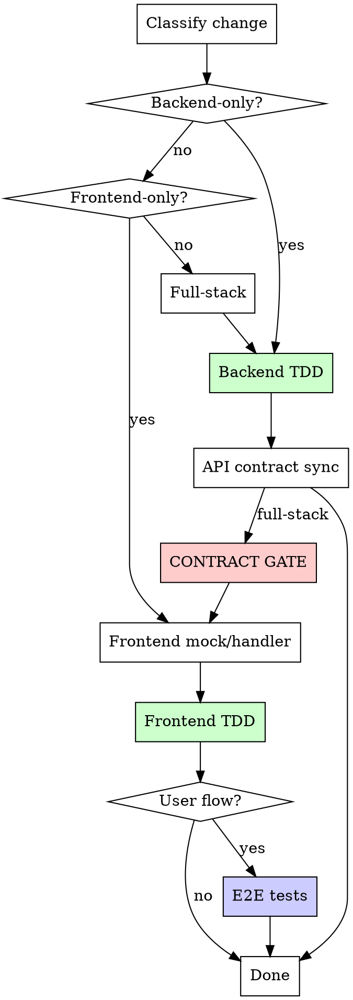

# Implementation Flow

Shared implementation lifecycle used by both single-issue dev and epic sub-issue agents. Everything from "plan approved" through "merged and cleaned up" lives here.

**Agent runtime:** Read `${CLAUDE_PLUGIN_ROOT}/skills/dev/references/agent-runtime.md` before dispatching QA or code-review agents. This file defines how `pm:*` agent intents map to Claude and Codex.

**Context:** This flow is invoked by fresh agents or inline execution:
- **Single-issue (M/L/XL):** A fresh `pm:developer` agent follows this after receiving the approved RFC.
- **Single-issue (XS/S):** The orchestrator follows this inline after intake (no planning phase).
- **Epic sub-issue:** A fresh agent follows this after the orchestrator dispatches it with the approved RFC. All epic sub-issues run sequentially.

---

## Lifecycle

```
Setup -> Implement -> Simplify (S+, skip XS) -> Design Critique (if UI) ->
  QA (if UI, iterates on Fail) ->
  Review (M/L/XL) or Code Scan (XS only) -> Verification -> Push + PR ->
  Merge -> Cleanup -> Done

```

## Git Hygiene (HARD RULES)

These apply to every commit:
- NEVER use `git add -A` or `git add .` — always stage specific files by name
- NEVER commit to {DEFAULT_BRANCH} — verify you're on the correct branch: `git branch --show-current`
- NEVER commit without running tests first
- Commit often, commit small — one logical change per commit
- If you see untracked files you didn't create, leave them alone
- Before your first commit, verify: `git rev-parse --show-toplevel` matches your worktree path

---

## Step 1: Setup

```bash
cd {CWD}  # worktree path
git branch --show-current  # verify correct branch
```

Install dependencies using the project's install command (read from AGENTS.md, or infer: `pnpm install` if pnpm-lock.yaml exists, `npm install` if package-lock.json, `yarn` if yarn.lock, `bundle install` if Gemfile, `pip install` if requirements.txt).

**Worktree environment prep:** Read AGENTS.md for workspace setup commands. Common patterns:

| Pattern | Detection | Action |
|---------|-----------|--------|
| Dependency install | `package.json` exists, `node_modules` missing | `pnpm install` / `npm install` / `yarn` |
| Dependency install | `Gemfile` exists, gems missing | `bundle install` |
| Code generation | AGENTS.md lists codegen commands | Run them (API specs, types, schemas) |
| Shared package build | Monorepo with shared packages | Build shared packages before consuming apps |
| Database setup | AGENTS.md lists DB commands | Run migrations if needed |

If AGENTS.md doesn't specify workspace setup, fall back to: install dependencies + run the project's test command once.

Verify clean baseline: run the project test command (from AGENTS.md or convention detection). If tests fail, report as blocked (epic) or fix before proceeding (single-issue).

---

## Step 2: Implement

### Platform Detection (first step)

Before writing any code, detect which parts of the project are modified to auto-route gates:

```
Modified areas = check plan files, ticket scope, or `git diff --name-only {DEFAULT_BRANCH}...HEAD`

Classify the change:
  "backend-only"  → only backend/API files
  "frontend-only" → only frontend files (with or without backend)
  "mobile-only"   → only mobile/native app files (with or without backend)
  "full-stack"    → frontend + mobile (rare)
```

For monorepos, map to specific app directories. For single-app projects, classify by file type (controllers/models vs components/pages).

Log in `.pm/dev-sessions/{slug}.md`:
```
- Platform: <detected platform>
- Contract gate: <required | skipped (reason)>
```

This detection drives the contract gate and E2E routing below.



### Contract Sync Gate (hard gate when project uses API contracts)

**Auto-routed by Platform Detection above.** No manual decision needed.

**Detection:** Read AGENTS.md for contract sync tooling. Common patterns:
- OpenAPI/Swagger (rswag, swagger-codegen, etc.)
- GraphQL codegen
- tRPC (type-safe by default, may not need explicit sync)
- Manual types (no contract gate, validated at integration test time)

| Platform | Has contract tooling | Contract gate |
|----------|---------------------|---------------|
| backend-only | any | skip (no frontend consumer) |
| frontend | yes | **run** |
| frontend | no | skip (no contract tooling configured) |
| full-stack | yes | **run** |
| full-stack | no | skip |

Before any frontend work on a full-stack change with contract tooling:
- [ ] API spec regenerated (per AGENTS.md commands)
- [ ] Frontend mocks/handlers updated against spec
- [ ] Contract smoke test passes (per AGENTS.md test commands)

Fail -> fix before proceeding. No exceptions when contract tooling is configured.

### Component Pattern Scan (UI tasks only)

Before creating any new UI component (drawer, modal, dialog, sheet, card, panel, dropdown, popover, form layout, list/table), scan the codebase for existing instances of the same pattern:

```bash
# Example: about to build a drawer
grep -rl "drawer\|Drawer\|Sheet" apps/{app}/src/components/ apps/{app}/src/features/ --include="*.tsx" | head -20
```

**If an existing component exists:** Reuse it. Import and configure with props. Do not build a new one.

**If no existing component exists but you need multiple instances in this task:** Build the first instance as a reusable, prop-driven component in the appropriate components directory. Then import and configure it for each use case. Never copy-paste a component and tweak it.

**If you're building across multiple sub-issues in an epic:** Check what earlier sub-issues already built. Reuse their components. If the component needs extension, extend it with new props rather than creating a parallel implementation.

Log the scan result in `.pm/dev-sessions/{slug}.md`:
```
- Pattern scan: Reusing existing Drawer from src/components/ui/Drawer.tsx
  OR
- Pattern scan: No existing drawer. Creating shared Drawer component first.
  OR
- Pattern scan: Skipped (no new UI components)
```

### Write code

1. Read the plan file **end-to-end before writing code**. Plans may contain a "Revised" or "Updated" section that supersedes earlier code blocks. If you find contradictory implementations, the later revision is authoritative. When in doubt, check for epic review fix annotations (e.g., "Epic review fix:").
2. Use `dev:subagent-dev` for independent tasks
3. Use `dev:tdd` for each feature
4. Commit after each logical group of changes

#### Sub-agent parallelism budget

Dispatch one agent per independent problem domain. Let them work concurrently.

- Default max: **3 concurrent agents**
- Use **1 agent** when tasks touch shared files or shared state
- Do NOT parallelize when tasks have implicit dependencies (shared DB state, import chains, config files)
- Expand beyond 3 only when file ownership is clearly disjoint
- Every agent prompt must include: explicit cwd, target files, and done criteria
- **Don't use** when failures are related (fix one might fix others), need full system state, or agents would interfere
- After agents return: review summaries, check for conflicts, run full suite, spot check for systematic errors

See `test-layers.md` (same directory) for test layer routing principles.

### E2E Decision

**Web E2E (Playwright):**
- **Write E2E:** CRUD flow, multi-step journey, auth-dependent behavior
- **Skip E2E:** Purely visual, internal refactor, backend-only

**Mobile E2E (Maestro or project-specific):**
- **Write E2E:** CRUD flow, multi-step journey, auth flows, navigation-heavy flows
- **Skip E2E:** Purely visual change, internal refactor, backend-only, component-only change covered by component tests

Read AGENTS.md for E2E test locations, commands, and prerequisites.

---

## Step 3: Simplify — `pm:simplify`

Runs after implement for S+ sizes. **Skip for XS** — the code scan gate is sufficient for one-line fixes.

1. Invoke `pm:simplify`
2. Fix all real findings, skip false positives
3. Run tests after fixes
4. Commit simplification changes before proceeding

**Why here (after implement, before design critique/QA):**
- Implementation is complete, so there's real code to simplify
- Cleaning up code before design critique and QA means those stages see cleaner code with fewer noise findings
- For S, this is the only code review gate (no separate code scan needed — simplify already catches what code scan catches)
- For M/L/XL, reduces review churn

**Skip conditions:**
- **XS size** — code scan gate handles it
- No code changes in the diff (config-only, docs-only)
- All agents find nothing to simplify (proceed immediately)

---

## Step 4: Design Critique — `/design-critique`

**Conditional availability:** `/design-critique` is a skill in the dev plugin. Before invoking, verify the skill exists via the Skill tool. If not available, log "Design critique: skipped (skill not available)" in `.pm/dev-sessions/{slug}.md` and proceed to QA.

**When compulsory:** Any task that changes UI files (tsx/jsx/css in diff). Skipped for XS, backend-only, config-only, pure refactor.

Check: `git diff {DEFAULT_BRANCH}...HEAD --name-only | grep -E '\.(tsx|jsx|css)$'`

Design Critique is the **single visual quality stage** for UI changes. A focused reviewer evaluates UX quality, accessibility, design system compliance, and interaction resilience against real app screenshots with enriched data (a11y snapshots, visual consistency audit).

### Closed-loop visual verification

The implementing agent owns the full visual verification cycle:

1. **Create seed task**: `design:seed:{feature_slug}` rake task per `${CLAUDE_PLUGIN_ROOT}/skills/design-critique/references/seed-conventions.md`. Covers all visual states: happy path, empty, edge cases (long text, high volume, boundary values).
2. **Start servers**: Rails API + Vite (web) or Expo (mobile). Per `${CLAUDE_PLUGIN_ROOT}/skills/design-critique/references/capture-guide.md`.
3. **Run seed**: `cd apps/api && bin/rails design:seed:{feature_slug}`
4. **Capture screenshots**: Playwright CLI (web) or Maestro MCP (mobile). Max 10. Save to `/tmp/design-review/{feature}/`. Write manifest.
5. **Capture enriched artifacts**: a11y snapshots, visual consistency audit per capture-guide.md.
6. **Visual self-check**: Review own screenshots. Fix obvious issues before invoking critique.
7. **Invoke `/design-critique`** (embedded mode): Returns prioritized findings (P0/P1/P2) with confidence tiers + verdict (Ship/Fix/Rethink).
8. **Fix findings**: Implement P0 and P1 fixes from the findings list.
9. **Re-seed, re-capture, re-invoke**: If P0s were found. Max 2 rounds total.
10. **Commit**: All design critique changes committed before proceeding to QA.

The seed task is committed alongside feature code. It becomes a reusable artifact for future QA and demos.

### Skip conditions
- XS tasks
- Backend-only, config-only, pure refactor (no tsx/jsx/css in diff)
- Skill not available

---

## Step 5: QA

Runs after simplify and design critique for any task that changes UI. The QA skill (`pm:qa`) handles all internal details — tiers, assertion strategies, re-verify cycles, and agent dispatch. This section covers only what the **orchestrator** needs to know.

### Skip conditions

- **Backend-only, config-only, docs-only:** skip
- **Dev servers can't start** (e.g. DB not running): skip, log reason in `.pm/dev-sessions/{slug}.md`

### Dispatch

Dispatch reviewer intent `pm:qa-tester` using `agent-runtime.md`.

**QA brief:**

```text
You are the QA agent for this dev session. Follow the pm:qa skill.

**Session file:** .pm/dev-sessions/{slug}.md
**Feature:** {feature description from ticket/spec}
**Acceptance criteria:**
{acceptance criteria list}
**Affected routes:** {routes from plan or git diff}
**Platform:** {web | mobile}
**Tier:** {Quick | Focused | Full}
**DEFAULT_BRANCH:** {DEFAULT_BRANCH}

Run full QA (Phase 0-6). Report your verdict.
```

### Gate behavior

| QA Verdict | Action |
|------------|--------|
| **Pass** | Proceed to Review / Code Scan |
| **Pass with concerns** | Proceed. Low/Medium issues noted in `.pm/dev-sessions/{slug}.md` for backlog. |
| **Fail** | Fix issues, then send re-verify to the same worker (see below). |
| **Blocked** | Stop. Log reason in `.pm/dev-sessions/{slug}.md`. Ask user for guidance. |

**Shipping does not continue after QA Fail.** Fix issues and re-verify. No silent downgrades.

### Re-verify

When QA returns **Fail**, fix the issues, run tests, then re-run QA:

```text
Fixed the following issues:
1. {finding-id}: {what was fixed}
2. {finding-id}: {what was fixed}

Re-verify these specific findings. Also smoke-check adjacent routes for regressions.
Do NOT re-run Phase 0 when the environment is still ready. Jump to Phase 3 re-verify.
```

### Handling issues found

- **Critical/High:** Fix immediately, re-verify.
- **Medium in core flow:** Fix before proceeding.
- **Medium in edge flows:** Note in state file, create backlog items after merge.
- **Low:** Note in state file, do not fix this session.

### State file update

After QA completes (final verdict), update `.pm/dev-sessions/{slug}.md`:
```
## QA
- QA verdict: Pass | Pass with concerns | Fail | Blocked
- Ship recommendation: Ship | Ship with caution | Do not ship | Blocked
- Issues found: none | Critical: N, High: N, Medium: N, Low: N
- Issues fixed: [list]
- Issues deferred: [list]
- Iterations: N
```

---

## Step 6: Review + Verification

### Review Gate (M/L/XL — HARD GATE)

<HARD-GATE>
BEFORE pushing or creating a PR, you MUST run `/review` on the branch.
This runs up to 4 review agents (conditionally skipping PM and Design when upstream gates passed). This gate is NOT optional. Do NOT skip it.
If you are about to push and `.pm/dev-sessions/{slug}.md` does not show `Review gate: passed`,
STOP and run the review first.
</HARD-GATE>

**Fix ALL findings from ALL active agents.** `/review` runs up to 4 agents:
1. **Code Review** — finds ALL genuine bugs for auto-fix. Routes by runtime (Anthropic official in Claude Code, built-in `pm:code-reviewer` elsewhere). No confidence threshold filtering.
2. **PM Review** — JTBD alignment, feature completeness. **Conditionally skipped** when `.pm/dev-sessions/{slug}.md` shows `Spec review: passed`.
3. **Design Review** — design system compliance. **Conditionally skipped** when `.pm/dev-sessions/{slug}.md` shows Design Critique completed.
4. **Input Edge-Case Review** — untested edge cases

Agents 2 and 3 are skipped when upstream gates already covered their concerns. `/review` checks `.pm/dev-sessions/{slug}.md` automatically.

**Checklist (all must be true before PR):**
- [ ] `/review` invoked on the branch
- [ ] All real issues fixed from all active agents
- [ ] Tests still pass after fixes
- [ ] Verification gate passed (fresh test run, output read, 0 failures confirmed)
- [ ] `.pm/dev-sessions/{slug}.md` updated with `Review gate: passed (commit <sha>)`

### Code Scan Gate (XS only — HARD GATE)

<HARD-GATE>
BEFORE merging XS tasks, you MUST run a lightweight code scan.
This catches bugs that tests alone miss: silent no-ops, swallowed errors, race conditions, missing error feedback.
S tasks skip this — `pm:simplify` (which runs for S+) already covers the same ground.
</HARD-GATE>

Dispatch reviewer intent `pm:code-reviewer` using `agent-runtime.md`. If delegation is unavailable, run the same brief inline.

```text
Scan for genuine bugs in this diff. Max 5 findings.

**Diff:** {git diff {DEFAULT_BRANCH}...HEAD}
**Changed files:** {list}

## Project Context
{PROJECT_CONTEXT}
```

**If findings exist:** fix them, run tests, commit fixes.

### Verification gate (mandatory for ALL sizes before merge)

Run the full test suite fresh. Read the output. Confirm 0 failures. Do not rely on recalled test results from earlier in the session. Evidence before claims, always. No "should pass" or "looks correct" — run it, read it, then merge.

---

## Step 7: Push + PR + Merge

### Push and create PR

```bash
# Merge latest {DEFAULT_BRANCH}
git fetch origin {DEFAULT_BRANCH} && git merge origin/{DEFAULT_BRANCH} --no-edit

# Push
git push origin {BRANCH}

# Create PR
gh pr create --title "feat({ISSUE_ID}): {TITLE}" --body "..." --base {DEFAULT_BRANCH}
```

### PR flow (all sizes)

**Single-issue:** Invoke `/ship` — it handles push, PR creation, CI monitor, gate monitoring, and auto-merge via the merge loop. See `/ship` for the full lifecycle.

**Epic sub-issue (sequential mode):** Read and follow `${CLAUDE_PLUGIN_ROOT}/references/merge-loop.md` starting from Step 2 (Try Auto-Merge). The merge loop handles squash merge, CI failures, review threads, conflict resolution, and verifies `state == "MERGED"` before returning. Do NOT proceed to cleanup until the merge loop confirms MERGED.

### Handling review feedback

When review comments appear on the PR, use `review/references/handling-feedback.md` before acting:
1. Read the complete feedback before responding
2. Evaluate technical soundness. Push back if the suggestion is wrong or YAGNI.
3. Implement one item at a time, running tests after each fix
4. Do not performatively agree. If a suggestion conflicts with AGENTS.md or design decisions, explain why.

**CI verification:** `gh run watch` can exit with failure due to transient GitHub API 502s. Always verify actual CI status with `gh pr view --json statusCheckRollup` before treating a failure as real.

---

## Step 8: Cleanup

```bash
cd {REPO_ROOT}
git checkout -B {DEFAULT_BRANCH} origin/{DEFAULT_BRANCH}
git worktree remove {CWD} 2>/dev/null || \
  git worktree remove {CWD} --force 2>/dev/null || \
  echo "WARN: Could not remove worktree. Manual cleanup needed."
git branch -D {BRANCH} 2>/dev/null || true
git fetch --prune

# Kill orphaned test runners
pkill -f 'node.*vitest' 2>/dev/null || true
pkill -f 'node.*jest' 2>/dev/null || true
pkill -f 'node.*storybook' 2>/dev/null || true
pkill -f 'node.*playwright' 2>/dev/null || true
pkill -f 'pytest' 2>/dev/null || true
```

**Update ALL statuses** (local backlog + issue tracker):

<HARD-RULE>
Both local backlog and issue tracker must be updated. Do not skip either. A merged PR with a backlog item still showing "in-progress" is a bug.
</HARD-RULE>

**Local backlog:**
- If `pm/backlog/{slug}.md` exists: set `status: done`, `updated: {today's date}` in frontmatter
- If `linear_id` is available and not in frontmatter, add it
- Log: `Backlog: pm/backlog/{slug}.md → done`

**Issue tracker** (if available):
- If this issue has child/sub-issues, close them ALL first:
  ```
  mcp__plugin_linear_linear__list_issues({ parentId: "{ISSUE_ID}" })
  # For EACH child:
  mcp__plugin_linear_linear__save_issue({ id: "{CHILD_ID}", state: "Done" })
  ```
- Then close the parent:
  ```
  mcp__plugin_linear_linear__save_issue({ id: "{ISSUE_ID}", state: "Done" })
  ```
- Log: `Linear: {ISSUE_ID} → Done`

---

## Step 9: Report

### Single-issue context

Proceed to retro (Stage 9 in single-issue-flow.md).

### Epic sub-issue context

<HARD-RULE>
The only valid terminal messages are:
- "Merged." (after squash-merge + cleanup) or "Blocked:"

Do NOT report until the PR is squash-merged and cleanup is complete. "PR created" is NOT a terminal state.
</HARD-RULE>

**If merged:**
```
Merged. {ISSUE_ID} PR #{N}, sha {abc123}, {N} files changed.
```

**If blocked:**
```
Blocked: {ISSUE_ID} — {reason}
```

---

## Debugging

When tests fail or unexpected behavior occurs during implementation, invoke `dev:debugging` via the Skill tool.

## Process Cleanup

**Run after every implement stage and before retro.** Subagent test runs can orphan test runner processes when agents are terminated mid-run.

```bash
pkill -f 'node.*vitest' 2>/dev/null || true
pkill -f 'node.*jest' 2>/dev/null || true
pkill -f 'pytest' 2>/dev/null || true
```

This is a hard rule — always run cleanup, even if you think tests exited cleanly.
