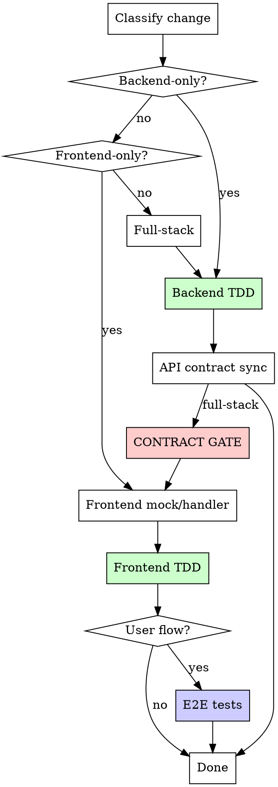

# Implementation Flow

Shared implementation lifecycle for all dev work. Everything from "plan approved" through "merged and cleaned up" lives here.

**Agent runtime:** Read `${CLAUDE_PLUGIN_ROOT}/skills/dev/references/agent-runtime.md` before dispatching QA or code-review agents. This file defines how persona intents map to Claude and Codex.

**Context:** This flow is invoked by fresh agents dispatched from Step 05 (Implementation):
- **Single-task:** A fresh @developer agent reads Steps 1–2 for setup and implementation. Steps 3+ (simplify, review, ship) are handled by the orchestrator via dev steps 06–09.
- **Multi-task:** A fresh agent follows the full lifecycle (Steps 1–8) for each task. The agent owns implement through merge and returns "Merged" or "Blocked."

## Agent Scope

The dispatching brief in Step 05 always specifies scope. This note is a cross-check:

| Mode | Steps to execute | Who handles the rest |
|------|-----------------|---------------------|
| Single-task | Steps 1–2 only | Orchestrator (dev steps 06–09) |
| Multi-task | Steps 1–8 (full lifecycle) | Agent is self-contained |

If you're a single-task agent and you've reached Step 3, **stop** — return "Implementation complete" and let the orchestrator proceed.

---

## Lifecycle

```
Setup -> Implement -> Simplify (S+, skip XS) -> Design Critique (if UI) ->
  QA (if UI, iterates on Fail) ->
  Review (M/L/XL) or Code Scan (XS only) -> Verification -> Push + PR ->
  Merge -> Cleanup -> Done

```

## Git Hygiene (HARD RULES)

These apply to every commit:
- NEVER use `git add -A` or `git add .` — always stage specific files by name
- NEVER commit to {DEFAULT_BRANCH} — verify you're on the correct branch: `git branch --show-current`
- NEVER commit without running tests first
- Commit often, commit small — one logical change per commit
- If you see untracked files you didn't create, leave them alone
- Before your first commit, verify: `git rev-parse --show-toplevel` matches your worktree path

---

## Step 1: Setup

```bash
cd {CWD}  # worktree path
git branch --show-current  # verify correct branch
```

Install dependencies using the project's install command (read from AGENTS.md, or infer: `pnpm install` if pnpm-lock.yaml exists, `npm install` if package-lock.json, `yarn` if yarn.lock, `bundle install` if Gemfile, `pip install` if requirements.txt).

**Worktree environment prep:** Read AGENTS.md for workspace setup commands. Common patterns:

| Pattern | Detection | Action |
|---------|-----------|--------|
| Dependency install | `package.json` exists, `node_modules` missing | `pnpm install` / `npm install` / `yarn` |
| Dependency install | `Gemfile` exists, gems missing | `bundle install` |
| Code generation | AGENTS.md lists codegen commands | Run them (API specs, types, schemas) |
| Shared package build | Monorepo with shared packages | Build shared packages before consuming apps |
| Database setup | AGENTS.md lists DB commands | Run migrations if needed |

If AGENTS.md doesn't specify workspace setup, fall back to: install dependencies + run the project's test command once.

Verify clean baseline: run the project test command (from AGENTS.md or convention detection). If tests fail, report as blocked (epic) or fix before proceeding (single-issue).

---

## Step 2: Implement

### Platform Detection (first step)

Before writing any code, detect which parts of the project are modified to auto-route gates:

```
Modified areas = check plan files, ticket scope, or `git diff --name-only {DEFAULT_BRANCH}...HEAD`

Classify the change:
  "backend-only"  → only backend/API files
  "frontend-only" → only frontend files (with or without backend)
  "mobile-only"   → only mobile/native app files (with or without backend)
  "full-stack"    → frontend + mobile (rare)
```

For monorepos, map to specific app directories. For single-app projects, classify by file type (controllers/models vs components/pages).

Log in `.pm/dev-sessions/{slug}.md`:
```
- Platform: <detected platform>
- Contract gate: <required | skipped (reason)>
```

This detection drives the contract gate and E2E routing below.



### Contract Sync Gate (hard gate when project uses API contracts)

**Auto-routed by Platform Detection above.** No manual decision needed.

**Detection:** Read AGENTS.md for contract sync tooling. Common patterns:
- OpenAPI/Swagger (rswag, swagger-codegen, etc.)
- GraphQL codegen
- tRPC (type-safe by default, may not need explicit sync)
- Manual types (no contract gate, validated at integration test time)

| Platform | Has contract tooling | Contract gate |
|----------|---------------------|---------------|
| backend-only | any | skip (no frontend consumer) |
| frontend | yes | **run** |
| frontend | no | skip (no contract tooling configured) |
| full-stack | yes | **run** |
| full-stack | no | skip |

Before any frontend work on a full-stack change with contract tooling:
- [ ] API spec regenerated (per AGENTS.md commands)
- [ ] Frontend mocks/handlers updated against spec
- [ ] Contract smoke test passes (per AGENTS.md test commands)

Fail -> fix before proceeding. No exceptions when contract tooling is configured.

### Component Pattern Scan (UI tasks only)

Before creating any new UI component (drawer, modal, dialog, sheet, card, panel, dropdown, popover, form layout, list/table), scan the codebase for existing instances of the same pattern:

```bash
# Example: about to build a drawer
grep -rl "drawer\|Drawer\|Sheet" apps/{app}/src/components/ apps/{app}/src/features/ --include="*.tsx" | head -20
```

**If an existing component exists:** Reuse it. Import and configure with props. Do not build a new one.

**If no existing component exists but you need multiple instances in this task:** Build the first instance as a reusable, prop-driven component in the appropriate components directory. Then import and configure it for each use case. Never copy-paste a component and tweak it.

**If you're building across multiple tasks in a multi-task RFC:** Check what earlier tasks already built. Reuse their components. If the component needs extension, extend it with new props rather than creating a parallel implementation.

Log the scan result in `.pm/dev-sessions/{slug}.md`:
```
- Pattern scan: Reusing existing Drawer from src/components/ui/Drawer.tsx
  OR
- Pattern scan: No existing drawer. Creating shared Drawer component first.
  OR
- Pattern scan: Skipped (no new UI components)
```

### Write code

1. Read the plan file **end-to-end before writing code**. Plans may contain a "Revised" or "Updated" section that supersedes earlier code blocks. If you find contradictory implementations, the later revision is authoritative. When in doubt, check for epic review fix annotations (e.g., "Epic review fix:").
2. Follow `subagent-dev.md` (in this directory) for independent tasks
3. Follow `tdd.md` (in this directory) for each feature
4. Commit after each logical group of changes

#### Sub-agent parallelism budget

Dispatch one agent per independent problem domain. Let them work concurrently.

- Default max: **3 concurrent agents**
- Use **1 agent** when tasks touch shared files or shared state
- Do NOT parallelize when tasks have implicit dependencies (shared DB state, import chains, config files)
- Expand beyond 3 only when file ownership is clearly disjoint
- Every agent prompt must include: explicit cwd, target files, and done criteria
- **Don't use** when failures are related (fix one might fix others), need full system state, or agents would interfere
- After agents return: review summaries, check for conflicts, run full suite, spot check for systematic errors

See `test-layers.md` (same directory) for test layer routing principles.

### E2E Decision

**Web E2E (Playwright):**
- **Write E2E:** CRUD flow, multi-step journey, auth-dependent behavior
- **Skip E2E:** Purely visual, internal refactor, backend-only

**Mobile E2E (Maestro or project-specific):**
- **Write E2E:** CRUD flow, multi-step journey, auth flows, navigation-heavy flows
- **Skip E2E:** Purely visual change, internal refactor, backend-only, component-only change covered by component tests

Read AGENTS.md for E2E test locations, commands, and prerequisites.

---

<!-- Steps 3-8: Quality gates and ship lifecycle.
     The authoritative source for quality gate logic is skills/dev/steps/07-review.md.
     The authoritative source for ship/status logic is skills/dev/steps/08-ship.md.
     This file only adds multi-task-specific orchestration on top. -->

## Step 3: Simplify — `pm:simplify`

Follow `${CLAUDE_PLUGIN_ROOT}/skills/dev/steps/06-simplify.md`. Same logic applies to multi-task agents.

---

## Step 4: Design Critique + Step 5: QA + Step 6: Review + Verification

Follow the quality gate sections in `${CLAUDE_PLUGIN_ROOT}/skills/dev/steps/07-review.md`. That file is the single source of truth for:
- Design critique process (10-step closed-loop, skip conditions, size routing)
- QA gate behavior (dispatch, verdict table, re-verify loop, state file update)
- Code review (M/L/XL HARD GATE, conditional Design Review skip, code scan for XS)
- Verification gate (mandatory for all sizes)

Multi-task agents execute these gates **per task** within their own worktree. The orchestrator does not re-run them.

---

## Step 7: Push + PR + Merge

### Push and create PR

```bash
git fetch origin {DEFAULT_BRANCH} && git merge origin/{DEFAULT_BRANCH} --no-edit
git push origin {BRANCH}
gh pr create --title "feat({ISSUE_ID}): {TITLE}" --body "..." --base {DEFAULT_BRANCH}
```

### PR flow

**Multi-task (sequential mode):** Read and follow `${CLAUDE_PLUGIN_ROOT}/references/merge-loop.md` starting from Step 2 (Try Auto-Merge). The merge loop handles squash merge, CI failures, review threads, conflict resolution, and verifies `state == "MERGED"` before returning. Do NOT proceed to cleanup until the merge loop confirms MERGED.

**Single-issue:** Invoke `/ship` — see `${CLAUDE_PLUGIN_ROOT}/skills/dev/steps/08-ship.md`.

### Handling review feedback

When review comments appear on the PR, use `ship/references/handling-feedback.md` before acting.

**CI verification:** `gh run watch` can exit with failure due to transient GitHub API 502s. Always verify actual CI status with `gh pr view --json statusCheckRollup` before treating a failure as real.

---

## Step 8: Cleanup + Status Updates

Follow the cleanup and status update logic in `${CLAUDE_PLUGIN_ROOT}/skills/dev/steps/08-ship.md`. That file is the authoritative source for:
- Worktree cleanup (removal, branch deletion)
- Process cleanup (kill orphaned test runners)
- Local backlog updates (create if missing, set done)
- Linear issue closure (children first, verify, then parent)
- User confirmation gate before Linear updates

Multi-task agents complete cleanup per task. After ALL tasks finish, the orchestrator runs parent-level status updates per 08-ship.md's multi-task skip section.

---

## Step 9: Report

### Multi-task context

<HARD-RULE>
The only valid terminal messages are:
- "Merged." (after squash-merge + cleanup) or "Blocked:"

Do NOT report until the PR is squash-merged and cleanup is complete. "PR created" is NOT a terminal state.
</HARD-RULE>

**If merged:**
```
Merged. {ISSUE_ID} PR #{N}, sha {abc123}, {N} files changed.
```

**If blocked:**
```
Blocked: {ISSUE_ID} — {reason}
```

### Single-issue context

Proceed to retro (`${CLAUDE_PLUGIN_ROOT}/skills/dev/steps/09-retro.md`).

---

## Debugging

When tests fail or unexpected behavior occurs during implementation, read `debugging.md` in this directory and follow its systematic debugging process.
