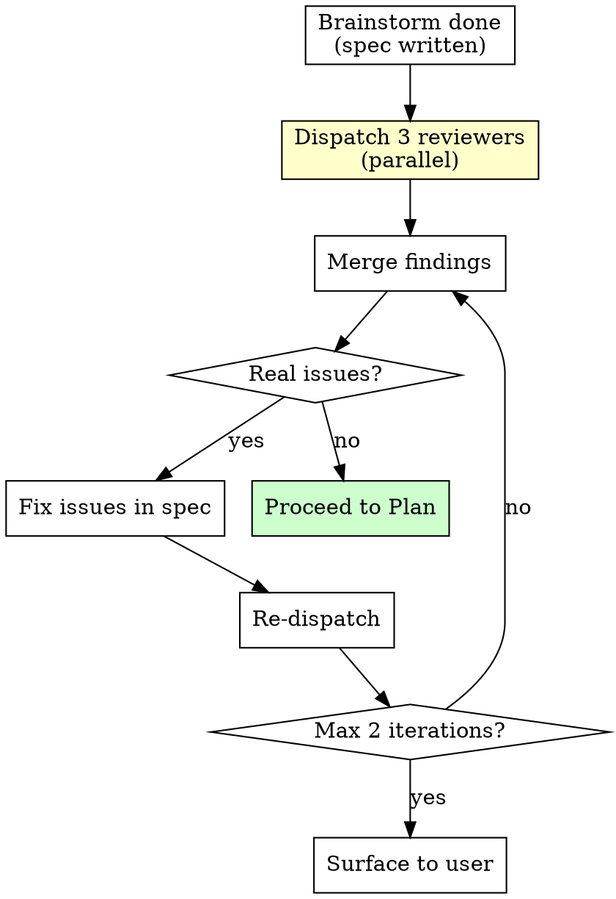
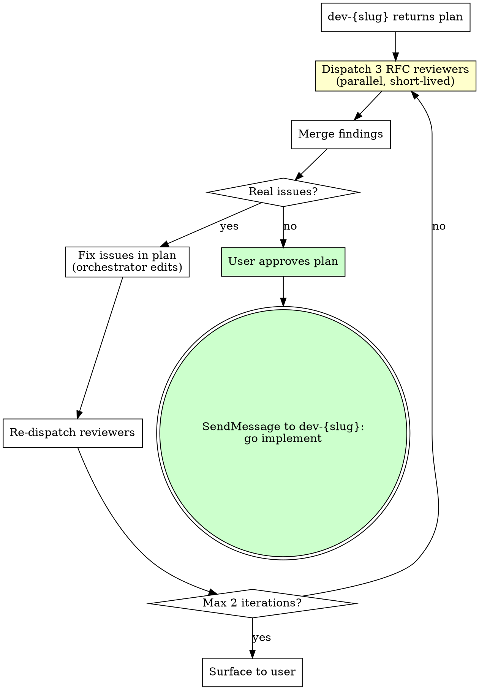

# Single Issue Flow

This reference is loaded on-demand by the dev skill router when handling a single issue (feature, bug fix, refactor, or test backfill).

**Agent runtime:** Read `${CLAUDE_PLUGIN_ROOT}/skills/dev/references/agent-runtime.md` for how to map the `Agent()` and `SendMessage()` pseudo-code in this file to your runtime's actual tool calls. This is critical for M/L/XL tasks that use named agents.

---

## Stage 0.5: Tool Check

For S+ tasks (which create branches and PRs), verify `gh` early:

```bash
command -v gh >/dev/null 2>&1 || echo "WARN: GitHub CLI (gh) not found. PR creation will fail. Install: https://cli.github.com"
```

This is a warning, not a blocker — XS tasks don't need `gh` (they push directly). For S+ tasks, if `gh` is missing, warn the user before starting work so they can install it rather than discovering at PR creation time.

---

## Stage 1: Intake

1. **Load learnings** — Read the learnings file. Default path: `learnings.md` at repo root. Configurable via `learnings_path` in `dev/instructions.md`. If the file doesn't exist, skip (first run). Surface entries relevant to the task domain.
2. **Discover project context** — Read CLAUDE.md + AGENTS.md. Detect issue tracker from MCP tools.
3. **Get task context** — Issue tracker ticket ID provided? Fetch via MCP. Conversation only? Use that.
4. **Classify size:**

| Size | Signal | Example |
|------|--------|---------|
| **XS** | One-line fix, typo, config tweak | Fix a typo in a label, bump a dep version |
| **S** | Single concern, clear scope, no design decisions needed | Add a column, remove a field, fix a bug in one component |
| **M** | Cross-layer or multi-concern, needs design thought | New API endpoint + frontend feature, remove a concept that touches many files |
| **L** | New domain/module, cross-cutting refactor | New domain module, redesign auth flow |
| **XL** | Multi-domain, multi-sprint, architectural overhaul | New billing system, full app rewrite |

5. **Confirm size with user** before proceeding.
6. **Dashboard session view offer (M/L/XL with UI changes):** If the task involves frontend/UI work:

   <HARD-GATE>You MUST offer the dashboard session view for M/L/XL tasks with UI changes. Do not skip.</HARD-GATE>

   > "I can show specs, wireframes, and review results in the browser. Open the dashboard?"
   - Yes: Open the dashboard session view. Read `${CLAUDE_PLUGIN_ROOT}/skills/groom/references/dashboard-session.md`.
   - No: Text-only. Do not ask again.
   - XS/S or backend-only: Skip this step entirely.
7. **Issue tracking (M/L/XL only):**
   - From ticket: set status "In Progress"
   - From conversation: create issue in current cycle/sprint
8. **Create state file.** Derive the slug from the task (becomes the branch name slug after workspace setup, e.g., `fix-typo`). Create `.pm/dev-sessions/{slug}.md` (run `mkdir -p .pm/dev-sessions` first) with initial state: stage, size, task context, project context from discovery, plus `run_id`, `started_at`, `stage_started_at`, and `completed_at: null`. This is the single source of truth for the session.

## Stage Routing by Size

|  | XS | S | M | L | XL |
|---|---|---|---|---|---|
| Issue tracking | — | — | Yes | Yes | Yes |
| Worktree | Stage 2 (below) | Stage 2 (below) | Stage 2 (below) | Stage 2 (below) | Stage 2 (below) |
| Groom readiness | Stage 2.5 (below) | Stage 2.5 (below) | Stage 2.5 (below) | Stage 2.5 (below) | Stage 2.5 (below) |
| Brainstorm | — | — | Skip (from groom) or design exploration | Skip (from groom) or design exploration | Skip (from groom) or design exploration |
| Spec review | — | — | Skip (from groom) or full (3 agents) | Skip (from groom) or full (3 agents) | Skip (from groom) or full (3 agents) |
| Plan (named agent) | — | — | `dev-{slug}` writes plan, stops | `dev-{slug}` writes plan, stops | `dev-{slug}` writes plan, stops |
| Plan review | — | — | Engineering RFC (3 agents) | Engineering RFC (3 agents) | Engineering RFC (3 agents) |
| Implement (named agent) | TDD | TDD | `dev-{slug}` resumes, inside-out TDD | `dev-{slug}` resumes, inside-out TDD | `dev-{slug}` resumes, inside-out TDD |
| Simplify | `/simplify` | `/simplify` | `/simplify` | `/simplify` | `/simplify` |
| Design critique | — | If UI (lite, 1 round) | If UI (full) | If UI (full) | If UI (full) |
| QA (named agent) | If UI (Quick, L1+3+4) | If UI (Focused, L1+3+4 or all 5) | If UI (Full, named agent, iterative) | If UI (Full, named agent, iterative) | If UI (Full, named agent, iterative) |
| Code scan | Code scan | Code scan | `/review` (full) | `/review` (full) | `/review` (full) |
| Verification | Verification gate (inline) | Verification gate (inline) | Verification gate (inline) | Verification gate (inline) | Verification gate (inline) |
| Finish | Direct merge (verified) | Direct merge (verified) | PR → merge-loop (self-healing) | PR → merge-loop (self-healing) | PR → merge-loop (self-healing) |
| Review feedback | — | — | `review/references/handling-feedback.md` | `review/references/handling-feedback.md` | `review/references/handling-feedback.md` |
| Retro | Yes | Yes | Yes | Yes | Yes |

## Stage 2: Workspace (all sizes)

Set up an isolated git worktree for every task — including XS. Worktree isolation prevents agents from mixing up branches, committing to the wrong branch, or stepping on parallel work. The overhead is seconds; the cost of a wrong-branch commit is much higher.

1. Resolve context:
   - `REPO_ROOT=$(git rev-parse --show-toplevel)`
   - `CURRENT_BRANCH=$(git branch --show-current)`
2. If already on a feature branch inside a worktree, reuse it.
3. **Preflight: ensure new branches are based on the default branch.**
   Before creating a new worktree, verify the starting point:
   ```bash
   git fetch origin
   # Create worktree from the default branch, not the current branch
   git worktree add ${REPO_ROOT}/.worktrees/<slug> -b <type>/<slug> origin/${DEFAULT_BRANCH}
   ```
   This prevents accidentally basing a new feature branch on another feature branch (e.g., if the user is currently on `feat/landing-page`, the new branch would carry over those unmerged commits). Always branch from `origin/${DEFAULT_BRANCH}` to get a clean starting point.
4. Else derive a slug from ticket/topic and propose:
   - branch: `<type>/<slug>` (`feat/`, `fix/`, `chore/`)
   - worktree: `${REPO_ROOT}/.worktrees/<slug>`
5. If branch/worktree already exists:
   - Reuse existing branch + worktree when valid
   - If occupied or ambiguous, suffix branch/worktree with `-v2`, `-v3`
6. Record final `repo root`, `cwd`, `branch`, and `worktree` in `.pm/dev-sessions/{slug}.md`.
7. **Update proposal status:** If `pm/backlog/{slug}.md` exists and has a `parent` field pointing to a proposal, or if `pm/backlog/proposals/{slug}.meta.json` exists, set `"status": "in-progress"` in the proposal's meta.json (only if current status is `"proposed"` or absent). This keeps the dashboard accurate from the moment work begins.

### Worktree environment prep

After worktree creation, prep the environment based on what the project needs.

**Read AGENTS.md** (and any app-specific AGENTS.md) for workspace setup commands. Common patterns:

| Pattern | Detection | Action |
|---------|-----------|--------|
| Dependency install | `package.json` exists, `node_modules` missing | `pnpm install` / `npm install` / `yarn` |
| Dependency install | `Gemfile` exists, gems missing | `bundle install` |
| Code generation | AGENTS.md lists codegen commands | Run them (API specs, types, schemas) |
| Shared package build | Monorepo with shared packages | Build shared packages before consuming apps |
| Database setup | AGENTS.md lists DB commands | Run migrations if needed |

If AGENTS.md doesn't specify workspace setup, fall back to: install dependencies + run the project's test command once to verify the worktree is functional.

### Workspace verification (mandatory)

After prep, run the project's test command (from AGENTS.md) to confirm the worktree is functional. If tests fail at this point, the worktree setup is broken. Fix before proceeding.

```bash
# Example: detect and run the right test command
if [ -f "package.json" ]; then
  # Check for test script in package.json
  npm test  # or pnpm test, yarn test
elif [ -f "Gemfile" ]; then
  bundle exec rails test
elif [ -f "pyproject.toml" ]; then
  pytest
fi
```

Never proceed to implementation without a clean workspace checkpoint.

## Stage 2.5: Groom Readiness Check (all sizes)

Before proceeding to design/planning/implementation, check whether this issue has been groomed — and if not, whether it needs grooming.

### Step 1: Check for existing groom session

1. Glob `.pm/groom-sessions/*.md` for a file whose slug matches the current issue slug or topic (normalize: lowercase, spaces to hyphens).
2. If found, parse YAML frontmatter. Read `effective_verdict` (or `bar_raiser.verdict` for legacy sessions without `effective_verdict`).
3. If verdict is `"ready"` or `"ready-if"`:
   - Log in state file: `Groom detection: groomed (session: {filename}, verdict: {verdict}, tier: {tier})`
   - Read `research_location` from the session frontmatter. Store the path for research injection in Stage 4.
   - **For M/L/XL:** Skip Stage 3 (design exploration) and Stage 3.5 (spec review). Proceed directly to Stage 4 (writing-plans).
   - **For XS/S:** Proceed directly to implementation.
   - **Done — skip Step 2.**
4. If verdict is `"send-back"`, `"pause"`, missing, or parse fails: continue to Step 2.

**Ambiguity fallback:** If the slug match is uncertain (multiple partial matches, no exact match), continue to Step 2. Never skip grooming on ambiguous detection.

### Step 2: Assess issue readiness

Inspect the issue content from Stage 1 intake (Linear issue body, user description, or conversation context). Check for these grooming signals:

| Signal | Where to look |
|--------|--------------|
| Acceptance criteria | Numbered list of testable conditions |
| Outcome statement | Description of what changes for the user |
| Scope boundary | Explicit in-scope / out-of-scope |
| User flows | Mermaid diagrams or step-by-step flow descriptions |

**Scoring:**

| Signals present | Readiness |
|----------------|-----------|
| 3-4 of 4 | **Groomed** — proceed without grooming |
| 1-2 of 4 | **Thin** — needs grooming |
| 0 of 4 | **Ungroomed** — needs grooming |

### Step 3: Route based on readiness

**If groomed (3-4 signals):** Proceed as normal. Log:
```
- Groom readiness: sufficient (signals: {list of present signals})
```

**If thin or ungroomed:** Determine the appropriate groom tier based on dev size, then invoke grooming.

| Dev size | Groom tier | What happens |
|----------|-----------|--------------|
| XS | Quick | Inline quick groom: confirm scope boundary + draft 1-3 acceptance criteria with the user. No skill invocation — just a focused exchange right here. |
| S | Quick | Invoke `pm:groom` with `groom_tier: quick, dev_size: S` and the issue context. Returns after intake → scope → groom → link. |
| M | Standard | Invoke `pm:groom` with `groom_tier: standard, dev_size: M` and the issue context. |
| L, XL | Full | Invoke `pm:groom` with `groom_tier: full, dev_size: {size}` and the issue context. |

**XS inline quick groom** (no skill invocation):

For XS issues, grooming is a single focused exchange — not a separate skill invocation:

1. State what you understand the fix/change to be (one sentence).
2. Ask: "Scope and acceptance criteria — does this look right?"
   - Scope: {in-scope item} / Out: {anything excluded}
   - AC1: {testable condition}
   - AC2: {testable condition if applicable}
3. User confirms or adjusts. Log the result in the state file.
4. Proceed to implementation.

**For S/M/L/XL skill invocation:**

1. Tell the user: "This issue hasn't been groomed. Running {tier} groom to fill in the gaps."
2. Invoke `pm:groom` with the issue context (title, description, any existing AC or scope).
3. After groom completes, read the groom session state to confirm `effective_verdict`.
4. Resume dev flow from Stage 3 (M/L/XL) or implementation (S).

**User can skip:** If the user says "skip grooming" or "I'll groom later," respect it. Log:
```
- Groom readiness: skipped-by-user (signals: {list of present signals})
```
Proceed with whatever context is available. Do not block.

### Logging

Log the decision in `.pm/dev-sessions/{slug}.md` under Decisions:
```
- Groom readiness: groomed (session: {slug}.md, verdict: {verdict}) | sufficient (signals: ...) | groomed-inline (XS) | invoked-groom (tier: {tier}) | skipped-by-user
- Skipped phases: design-exploration, spec-review | none
- Research location: {path} | none
```

## Stage 3: Design Exploration (M/L/XL)

Read and follow `${CLAUDE_PLUGIN_ROOT}/skills/groom/phases/phase-3.5-design.md`. This handles context discovery, clarifying questions, approach proposals, design presentation, spec writing, and the spec review loop.

After the design is approved and the spec is written, proceed to Stage 3.5.

## Stage 3.5: Spec Review (M/L/XL)

After design exploration writes the spec, review it. The scope depends on whether `/pm:groom` already ran for this work.

### Source detection

This stage only runs if Stage 2.5 determined the issue is **not groomed**. If groomed, both design exploration and spec review were skipped entirely.

Run **full review** (3 agents: PM + UX & User Flow + Competitive Strategist).

Log the decision in `.pm/dev-sessions/{slug}.md`:
```
- Spec review: full (3 agents) — not from groom
```



### Context injection for review agents

Before dispatching any review agent, the orchestrator (you) MUST:

1. Read CLAUDE.md and extract a **project context summary** (users, scale, design principles, domain concerns)
2. Read pm/strategy.md and pm/competitors/index.md (if they exist) and extract strategy context
3. Inject this summary directly into each agent prompt as `{PROJECT_CONTEXT}`

This avoids each agent independently reading and parsing the same files (saving time and context window), and ensures all agents work from the same extracted facts.

```
{PROJECT_CONTEXT} — use the full template from context-discovery.md:
**Product:** [one-line description]
**Users:** [list personas with contexts/constraints]
**Scale:** [expected numbers: users, records, concurrent ops]
**Design principles:** [list verbatim from CLAUDE.md]
**Domain concerns:** [what's business-critical]
**Stack:** [detected stack]
**Test command:** [test command]
**Monorepo apps:** [app list or "single-app"]
**Issue tracker:** [tracker type or "none"]
**Strategic pillars:** [2-4 priorities from pm/strategy.md or CLAUDE.md]
**Competitors:** [top 3 with positioning angle]
**Non-goals:** [explicit non-goals]
```

If any field can't be populated, write "Not documented" rather than omitting it. Review agents will flag undocumented fields as context gaps.

### UX & User Flow Reviewer (always runs)

Walks through every user flow end-to-end, then stress-tests with edge cases. Not just "is the UI nice?" but "does this actually work under real-world pressure?"

Dispatch as sub-agent:

```
Agent({
  description: "UX review {slug} spec",
  subagent_type: "pm:ux-designer",
  prompt: `Review this feature spec for UX and user flow completeness.

**Spec to review:** {SPEC_FILE_PATH}

## Project Context
{PROJECT_CONTEXT}`
})
```

### PM + Competitive Strategist (only when NOT from groom)

These only run when groom detection (Stage 2.5) determined the issue is NOT groomed. If groomed, both design exploration and spec review are skipped entirely — this section is never reached.

Dispatch all 3 as sub-agents **in parallel** (send all Agent calls in a single message):

**Product Manager**

```
Agent({
  description: "PM review {slug} spec",
  subagent_type: "pm:product-manager",
  prompt: `Review this feature spec for JTBD clarity, ICP fit, prioritization, scope creep, and competitive positioning.

**Spec to review:** {SPEC_FILE_PATH}

## Project Context
{PROJECT_CONTEXT}`
})
```

**Competitive Strategist**

```
Agent({
  description: "Strategy review {slug} spec",
  subagent_type: "pm:strategist",
  prompt: `Review this feature spec for differentiation, switching motivation, competitive response, and AI-native opportunities.

**Spec to review:** {SPEC_FILE_PATH}

## Project Context
{PROJECT_CONTEXT}`
})
```

### Handling findings

1. Merge all agent outputs. Deduplicate overlapping concerns.
3. Fix all **Blocking issues**. Non-blocking items are advisory: apply if clearly valuable, skip if YAGNI.
4. If blocking issues were fixed, re-dispatch reviewers on the updated spec (max 2 iterations).
5. If iteration 3 still has blocking issues, present to user for decision.
6. Commit spec updates before proceeding.
7. Update `.pm/dev-sessions/{slug}.md` with `Spec review: passed (commit <sha>)`.

## Stage 4: Plan via Named Developer Agent (M/L/XL)

Spawn a **named `pm:developer` agent** that writes the plan. This is the same agent that will later implement the feature — preserving all codebase context (file structure, patterns, conventions, test infrastructure) discovered during planning. No duplicate exploration.

**Why a named agent:** Planning requires deep codebase exploration. That context is expensive to build and immediately useful for implementation. Previously, the orchestrator planned inline, then started implementation from scratch. Now the developer agent keeps everything it learned.

### Spawn the developer agent

```
Agent({
  description: "Plan {ISSUE_ID} implementation",
  name: "dev-{slug}",
  subagent_type: "pm:developer",
  prompt: `Phase 1 — Planning for {ISSUE_ID}: {ISSUE_TITLE}.

## Project Context
{PROJECT_CONTEXT}

**CWD:** {WORKTREE_PATH}
**Branch:** {BRANCH}
**DEFAULT_BRANCH:** {DEFAULT_BRANCH}
**Session file:** .pm/dev-sessions/{slug}.md
**Spec:** {SPEC_FILE_PATH or "none — use ACs below"}

**Issue description + ACs:**
{ISSUE_DESCRIPTION_AND_ACS}

{GROOM_CONTEXT_IF_AVAILABLE}

Follow ${CLAUDE_PLUGIN_ROOT}/skills/dev/references/writing-plans.md.
Save plan to docs/plans/{DATE}-{SLUG}.md.
Commit the plan, then end your response with:

PLAN_COMPLETE
- issue: {ISSUE_ID}
- path: docs/plans/{file}
- summary: {3-line summary}
- tasks: {N}

Stop after sending the summary. You will be resumed for implementation after plan review.`
})
```

**If groomed (from Stage 2.5):** Append groom context to the prompt:

```
**Groom context:**
- Session: .pm/groom-sessions/{slug}.md
- Research location: {research_location from session frontmatter}
- Bar raiser verdict: {verdict}
- Conditions: {list of bar_raiser.conditions and team_review.conditions}
```

The writing-plans reference will use this to produce a `## Upstream Context` section in the plan.

### Orchestrator waits for plan

The orchestrator waits for the agent to return. Only the plan path + summary enters the orchestrator's context — not the agent's internal codebase exploration. The agent stops after planning.

After receiving `PLAN_COMPLETE`, update `.pm/dev-sessions/{slug}.md` with the plan path and proceed to Stage 4.5.

## Stage 4.5: Plan Review — Engineering RFC Review (M/L/XL)

The plan has been through the writing-plans review loop (inside the developer agent). This stage runs in the **orchestrator** — three senior engineers challenge architecture decisions, poke at risks, and push back on complexity. Their job is adversarial: find the problems before implementation discovers them the hard way.

This is the last human-interactive gate. After this passes, the named developer agent is resumed for continuous execution through implementation, review, PR, merge, and cleanup.



### The 3 RFC reviewers

Dispatch all 3 as **short-lived sub-agents** in parallel (same as before — these are NOT persistent):

Dispatch all 3 **in parallel** (send all Agent calls in a single message):

**Agent 1: Senior Engineer — Architecture & Risk**

```
Agent({
  description: "RFC architecture review",
  subagent_type: "pm:adversarial-engineer",
  prompt: `Review this implementation plan (RFC) for architecture soundness and risk.

**Plan to review:** {PLAN_FILE_PATH}
**Spec for reference:** {SPEC_FILE_PATH}

## Project Context
{PROJECT_CONTEXT}`
})
```

**Agent 2: Senior Engineer — Testing & Quality**

```
Agent({
  description: "RFC testing review",
  subagent_type: "pm:test-engineer",
  prompt: `Review this implementation plan (RFC) for testing strategy and coverage.

**Plan to review:** {PLAN_FILE_PATH}
**Spec for reference:** {SPEC_FILE_PATH}

## Project Context
{PROJECT_CONTEXT}`
})
```

**Agent 3: Staff Engineer — Complexity & Maintainability**

```
Agent({
  description: "RFC maintainability review",
  subagent_type: "pm:staff-engineer",
  prompt: `Review this implementation plan (RFC) for complexity and long-term maintainability.

**Plan to review:** {PLAN_FILE_PATH}
**Spec for reference:** {SPEC_FILE_PATH}

## Project Context
{PROJECT_CONTEXT}`
})
```

### Handling findings

1. Merge all 3 RFC reviewer outputs. Deduplicate.
3. Fix all **Blocking issues** in the plan file (orchestrator edits directly). Non-blocking items are advisory: apply if they reduce complexity, skip if YAGNI.
4. If blocking issues were fixed, re-dispatch reviewers on the updated plan (max 2 iterations).
5. Commit plan updates.
6. **ADR extraction (M/L/XL only).** Scan the approved plan for non-obvious technical choices (library selections, architectural patterns, data modeling decisions, tradeoff resolutions). For each, write an ADR to `docs/decisions/NNNN-slug.md`. See ADR conventions below. Commit ADRs with the plan.
7. Present the final plan to the user: "Plan reviewed by 3 RFC agents. [N] blocking issues found and fixed. Here's the final plan: `{PLAN_FILE_PATH}`. Approve to begin continuous execution through to merge?"
8. Wait for user approval. This is the **last interactive gate**.
9. Update `.pm/dev-sessions/{slug}.md` with `Plan review: passed (commit <sha>)` and `Continuous execution: authorized`.

## Stages 5–7: Implementation via Named Developer Agent

After user approval, resume the same `dev-{slug}` agent for implementation. The agent already has full codebase context from the planning phase — no duplicate exploration needed.

```
SendMessage({
  to: "dev-{slug}",
  content: `Phase 2 — Implementation approved. Go implement.

**CWD:** {WORKTREE_PATH}
**Branch:** {BRANCH}
**Plan:** {PLAN_FILE_PATH}
**Merge strategy:** {PR required | direct push allowed}
**DEFAULT_BRANCH:** {DEFAULT_BRANCH}

Read ${CLAUDE_PLUGIN_ROOT}/skills/dev/references/implementation-flow.md for the full
implementation lifecycle, then execute it.

Lifecycle:
1. cd {WORKTREE_PATH}
2. Install deps (read AGENTS.md), verify clean test baseline
3. Read the plan end-to-end and implement all tasks
4. Invoke /simplify — fix findings, run tests, commit
5. If UI changes: invoke /design-critique if available, else skip
6. If UI changes: QA runs as named agent (spawned by implementation-flow.md)
7. If SIZE is M/L/XL: invoke /review on the branch, fix all findings, commit
   If SIZE is XS/S: run code scan (single sub-agent per implementation-flow.md)
8. Run full test suite as final verification
9. Push branch, create PR, squash merge via merge-loop
10. Cleanup worktree and branch
11. Report: "Merged. PR #{N}, sha {abc}, {N} files changed."

If blocked, report: "Blocked: {reason}"
Do NOT pause for confirmation — the plan is the contract. Execute it.`
})
```

**What the agent retains from planning:**
- Codebase structure and file organization
- Existing patterns and conventions discovered during exploration
- Test infrastructure and runner details
- Module boundaries and import chains
- Understanding of which files need modification

### Continuous Execution

<HARD-RULE>
After the user approves the plan at the end of Stage 4.5, the developer agent proceeds through ALL remaining stages without pausing for user input. No "Ready to execute?" prompts, no confirmation dialogs, no options menus.

The rationale: by this point, the spec has been reviewed by 3 product/design agents, the plan has been reviewed by 3 engineering agents, and the user has explicitly approved. The plan is the contract. Execute it.

**Only stop for:**
- QA verdict of **Fail** (fix issues, re-run QA, then continue)
- QA verdict of **Blocked** (ask user for guidance)
- Test failures that can't be resolved after 3 attempts
- Merge conflicts
- CI failures that require human intervention
- Review feedback from human reviewers on the PR (use `review/references/handling-feedback.md`)
</HARD-RULE>

### Agent lifecycle

```
dev-{slug} spawned (Stage 4)
  → explores codebase, writes plan, commits
  → returns PLAN_COMPLETE summary
  → stops (idle, context preserved)

Orchestrator runs RFC review (Stage 4.5)
  → fixes blocking issues in plan
  → user approves

SendMessage to dev-{slug}: "go implement" (Stage 5-7)
  → agent resumes with full planning context
  → implements → simplify → design critique → QA → review → merge → cleanup
  → returns "Merged. PR #{N}, sha {abc}, {N} files changed."
```

### Agent death recovery

If the developer agent dies during implementation (API overload, timeout):

1. Check git state in the worktree: `git log --oneline -5`, `git status`, `git diff --stat`
2. Read `.pm/dev-sessions/{slug}.md` for progress
3. Spawn a **fresh** `dev-{slug}` agent with recovery context:

```
Agent({
  description: "Recovery: {ISSUE_ID} implementation",
  name: "dev-{slug}",
  subagent_type: "pm:developer",
  prompt: `You are a RECOVERY agent. The previous developer agent died during implementation.

**Session file:** .pm/dev-sessions/{slug}.md
**Plan:** {PLAN_FILE_PATH}
**CWD:** {WORKTREE_PATH}
**Branch:** {BRANCH}

Check what was already done before continuing:
- git log --oneline to see committed work
- git status for uncommitted changes
- Read the plan to identify remaining tasks

Continue from where the previous agent left off.
Follow ${CLAUDE_PLUGIN_ROOT}/skills/dev/references/implementation-flow.md.`
})
```

The recovery agent loses the codebase context from planning but has the committed plan and partial implementation to work from. This is the tradeoff — recovery is slightly less efficient than the original agent, but functional.

After the developer agent returns (merged or blocked), continue to Stage 9 below.

## Stage 9: Retro — Compound Learning

Runs after EVERY task regardless of size.

1. Review session: what was smooth, what was hard, any pitfalls or wasted cycles
2. **ADR check (all sizes).** If any non-obvious technical decisions were made during implementation that weren't captured during planning (XS/S skip planning, so this is their only ADR checkpoint), write ADRs to `docs/decisions/`. Skip if no meaningful decisions were made.
3. Write to the learnings file (default: `learnings.md`, configurable via `dev/instructions.md`) — flat table, each entry max 3 lines (one-liner preferred)

```markdown
| Date | Category | Learning |
|------|----------|----------|
| 2026-02-15 | Testing | Mock handlers for sideloaded resources must include related data |
```

3. If learnings suggest AGENTS.md or CLAUDE.md updates — flag to user, don't auto-modify
4. If a learning is a "review should catch this" anti-pattern, and a review checklist exists (e.g., `.claude/references/review-checklist.md`), append it under the appropriate section
5. Cap: 50 entries. Archive >3 months old to `docs/archive/learnings-archive.md`

## Issue Tracker Updates (ALL sizes)

<HARD-GATE>
When an issue tracker is detected (see Project Context Discovery) AND the task was started from a ticket, you MUST update the issue status to "Done" after merge. This applies to ALL sizes (XS/S/M/L/XL), not just M/L/XL. Do NOT proceed to retro until the tracker is updated. Do NOT consider the task complete without this step.
</HARD-GATE>

When an issue tracker is detected:

| Stage | Action | Sizes |
|-------|--------|-------|
| Intake (conversation) | Create issue in current cycle/sprint | M/L/XL |
| Intake (ticket) | Fetch context, set "In Progress" | ALL |
| Plan complete | Comment with plan summary | M/L/XL |
| PR created | Comment with PR link | M/L/XL |
| Merged | Set status "Done", comment with merge SHA. **Also close/complete all sub-issues.** | **ALL** |
| Retro | Comment with learnings summary | M/L/XL |

If no issue tracker is configured, skip these updates.

## Knowledge Base Updates (after merge)

After merge, update the local knowledge base to reflect shipped work:

1. **Backlog item:** If `pm/backlog/{slug}.md` exists, update its frontmatter `status` to `done` and set `updated` to today's date.

2. **Proposal status:** Proposals have two status dimensions — `verdict` (grooming outcome, never changed by dev) and `status` (implementation lifecycle). Dev only updates `status`. **Never overwrite `verdict` or `verdictLabel`** — those belong to the groom skill.

   After merge: if the backlog item has a `parent` field pointing to a proposal slug, check if **all** sibling issues (same parent) are now `done`. If so, update `pm/backlog/proposals/{parent}.meta.json` — set `"status": "shipped"`.

   Also check if a proposal meta.json exists matching the current issue's slug directly (for proposals that are single-issue). If it does and the issue is done, set `"status": "shipped"`.

These updates keep the dashboard accurate without manual bookkeeping.

## State File (.pm/dev-sessions/{slug}.md)

The state file is the **single source of truth** for session state. Updated at every stage transition and task completion. **Deleted after retro.**

After compaction or if context feels stale, read this file to recover full session state.

```markdown
# Dev Session State

| Field | Value |
|-------|-------|
| Run ID | {PM_RUN_ID} |
| Stage | implement |
| Size | M |
| Ticket | PROJ-456 |
| Repo root | /path/to/project |
| Active cwd | /path/to/project/.worktrees/feature-name |
| Plan | docs/plans/2026-02-15-feature.md |
| Branch | feat/feature-name |
| Worktree | .worktrees/feature-name |
| Started at | 2026-04-04T01:00:00Z |
| Stage started at | 2026-04-04T03:20:00Z |
| Completed at | null |

## Project Context
- Product: Example App — task management for teams
- Stack: Rails API + React frontend + React Native mobile
- Test command: pnpm test (inferred from package.json)
- Issue tracker: Linear (detected via MCP)
- Monorepo: yes (apps/api, apps/web-client, apps/mobile)
- CLAUDE.md: present
- AGENTS.md: present
- Strategy: present

## Decisions
- Platform: frontend (frontend + backend files modified)
- Spec review: passed (commit abc123)
- Plan review: passed (commit def456)
- Continuous execution: authorized
- Contract gate: passed (commit ghi789) — frontend detected, gate required
- Design critique: required (frontend files modified)
- E2E: yes (CRUD flow)

## Tasks
- [x] 1. Add migration
- [x] 2. Model + backend tests
- [ ] 3. Frontend mock + components

## Key Files
- backend/app/controllers/api/v1/features_controller.rb
- frontend/src/features/feature-name/FeatureList.tsx

## Design Critique
- Status: pending
- Size routing: S (lite, 1 round) | M/L/XL (full)
- Report: (not yet run)

## QA
- QA verdict: pending
- Ship recommendation: pending
- Issues found: pending
- Issues fixed: none
- Issues deferred: none
- Confidence: pending
- Re-runs: 0

## Review
- Review gate: pending

## Merge-Watch
- Stage: pending
- PR: (not yet created)
- Gate 1 (CI): pending
- Gate 2 (Claude review): pending
- Gate 3 (Codex review): pending
- Gate 4 (Comments): pending
- Gate 5 (Conflicts): pending

## Resume Instructions
- Stage: [current stage name]
- Next action: [single next action to take]
- Key context: [1-2 sentences a cold reader needs]
- Blockers: [any blocking issues, or "none"]
```

**Update rules:**
- Write the full file (not append) at each stage transition
- Keep `Stage started at` current at every stage transition and set `Completed at` when the session finishes
- Include all decisions made so far — a cold reader should understand the full context
- After design critique, add the report path
- Resume Instructions section must be populated at every stage transition. A cold reader should be able to continue the session from this section alone.
- After retro, delete the file
