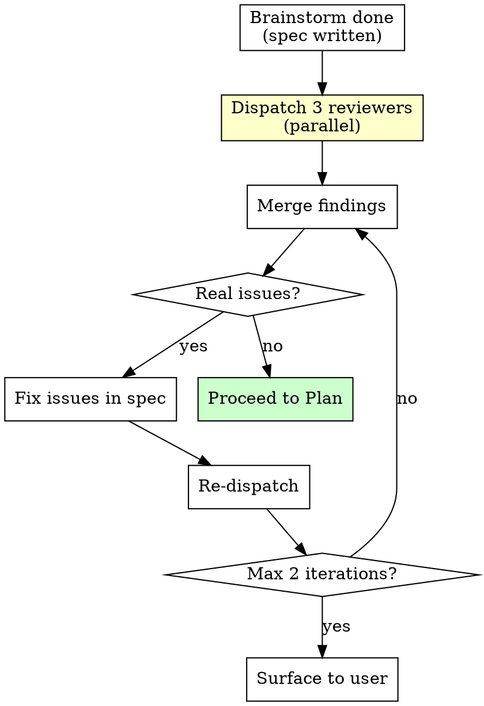
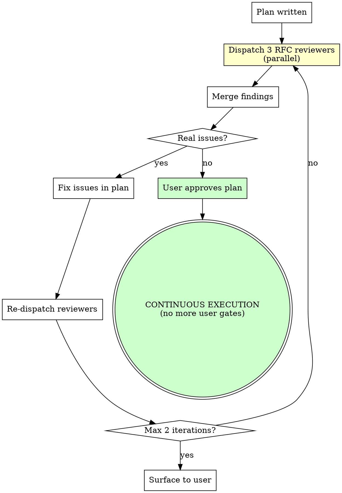
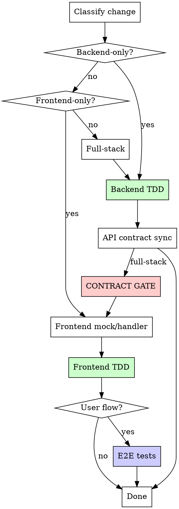
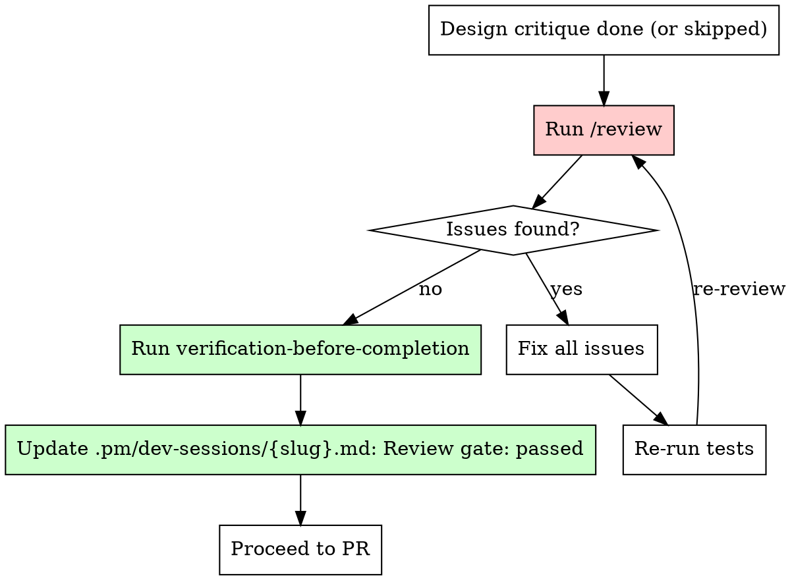

# Single Issue Flow

This reference is loaded on-demand by the dev skill router when handling a single issue (feature, bug fix, refactor, or test backfill).

---

## Stage 1: Intake

1. **Load learnings** — Read the learnings file. Default path: `learnings.md` at repo root. Configurable via `learnings_path` in `dev/instructions.md`. If the file doesn't exist, skip (first run). Surface entries relevant to the task domain.
2. **Discover project context** — Read CLAUDE.md + AGENTS.md. Detect issue tracker from MCP tools.
3. **Get task context** — Issue tracker ticket ID provided? Fetch via MCP. Conversation only? Use that.
4. **Classify size:**

| Size | Signal | Example |
|------|--------|---------|
| **XS** | One-line fix, typo, config tweak | Fix a typo in a label, bump a dep version |
| **S** | Single concern, clear scope, no design decisions needed | Add a column, remove a field, fix a bug in one component |
| **M** | Cross-layer or multi-concern, needs design thought | New API endpoint + frontend feature, remove a concept that touches many files |
| **L** | New domain/module, cross-cutting refactor | New domain module, redesign auth flow |
| **XL** | Multi-domain, multi-sprint, architectural overhaul | New billing system, full app rewrite |

5. **Confirm size with user** before proceeding.
6. **Visual companion offer (M/L/XL with UI changes):** If the task involves frontend/UI work:
   > "Want me to show specs, wireframes, and review results in the browser?"
   - Yes: Start the visual companion. Read `${CLAUDE_PLUGIN_ROOT}/skills/groom/references/visual-companion.md`.
   - No: Text-only. Do not ask again.
   - XS/S or backend-only: Skip this step entirely.
7. **Issue tracking (M/L/XL only):**
   - From ticket: set status "In Progress"
   - From conversation: create issue in current cycle/sprint
8. **Create state file.** Derive the slug from the task (for XS: topic slug like `fix-typo`; for S+: will become the branch name slug after workspace setup). Create `.pm/dev-sessions/{slug}.md` (run `mkdir -p .pm/dev-sessions` first) with initial state: stage, size, task context, project context from discovery. This is the single source of truth for the session.

## Stage Routing by Size

|  | XS | S | M | L | XL |
|---|---|---|---|---|---|
| Issue tracking | — | — | Yes | Yes | Yes |
| Worktree | — | Stage 2 (below) | Stage 2 (below) | Stage 2 (below) | Stage 2 (below) |
| Groom detection | — | — | Stage 2.5 (below) | Stage 2.5 (below) | Stage 2.5 (below) |
| Brainstorm | — | — | Skip (from groom) or design exploration | Skip (from groom) or design exploration | Skip (from groom) or design exploration |
| Spec review | — | — | Skip (from groom) or full (3 agents) | Skip (from groom) or full (3 agents) | Skip (from groom) or full (3 agents) |
| Written plan | — | — | `dev:writing-plans` | `dev:writing-plans` + design doc | `dev:writing-plans` + design doc |
| Plan review | — | — | Engineering RFC (3 agents) | Engineering RFC (3 agents) | Engineering RFC (3 agents) |
| Implement | TDD | TDD | Inside-out TDD | Inside-out TDD | Inside-out TDD |
| Simplify | `/simplify` | `/simplify` | `/simplify` | `/simplify` | `/simplify` |
| Design critique | — | If UI (lite, 1 round) | If UI (full) | If UI (full) | If UI (full) |
| QA (`/qa`) | If UI (`--quick`) | If UI (focused) | If UI (full, with charter + critique) | If UI (full, with charter + critique) | If UI (full, with charter + critique) |
| Code scan | Code scan | Code scan | `/review` (full) | `/review` (full) | `/review` (full) |
| Verification | Verification gate (inline) | Verification gate (inline) | Verification gate (inline) | Verification gate (inline) | Verification gate (inline) |
| Finish | Auto-merge | Auto-merge | PR → Merge-Watch → Auto-merge | PR → Merge-Watch → Auto-merge | PR → Merge-Watch → Auto-merge |
| Review feedback | — | — | `review/references/handling-feedback.md` | `review/references/handling-feedback.md` | `review/references/handling-feedback.md` |
| Retro | Yes | Yes | Yes | Yes | Yes |

## Stage 2: Workspace (S/M/L/XL)

Set up an isolated git worktree. Make setup idempotent:

1. Resolve context:
   - `REPO_ROOT=$(git rev-parse --show-toplevel)`
   - `CURRENT_BRANCH=$(git branch --show-current)`
2. If already on a feature branch inside a worktree, reuse it.
3. Else derive a slug from ticket/topic and propose:
   - branch: `<type>/<slug>` (`feat/`, `fix/`, `chore/`)
   - worktree: `${REPO_ROOT}/.worktrees/<slug>`
4. If branch/worktree already exists:
   - Reuse existing branch + worktree when valid
   - If occupied or ambiguous, suffix branch/worktree with `-v2`, `-v3`
5. Record final `repo root`, `cwd`, `branch`, and `worktree` in `.pm/dev-sessions/{slug}.md`.

### Worktree environment prep

After worktree creation, prep the environment based on what the project needs.

**Read AGENTS.md** (and any app-specific AGENTS.md) for workspace setup commands. Common patterns:

| Pattern | Detection | Action |
|---------|-----------|--------|
| Dependency install | `package.json` exists, `node_modules` missing | `pnpm install` / `npm install` / `yarn` |
| Dependency install | `Gemfile` exists, gems missing | `bundle install` |
| Code generation | AGENTS.md lists codegen commands | Run them (API specs, types, schemas) |
| Shared package build | Monorepo with shared packages | Build shared packages before consuming apps |
| Database setup | AGENTS.md lists DB commands | Run migrations if needed |

If AGENTS.md doesn't specify workspace setup, fall back to: install dependencies + run the project's test command once to verify the worktree is functional.

### Workspace verification (mandatory)

After prep, run the project's test command (from AGENTS.md) to confirm the worktree is functional. If tests fail at this point, the worktree setup is broken. Fix before proceeding.

```bash
# Example: detect and run the right test command
if [ -f "package.json" ]; then
  # Check for test script in package.json
  npm test  # or pnpm test, yarn test
elif [ -f "Gemfile" ]; then
  bundle exec rails test
elif [ -f "pyproject.toml" ]; then
  pytest
fi
```

Never proceed to implementation without a clean workspace checkpoint.

## Stage 2.5: Groom Detection (M/L/XL)

Before brainstorming, check if this issue was groomed:

1. Glob `.pm/groom-sessions/*.md` for a file whose slug matches the current issue slug or topic (normalize: lowercase, spaces to hyphens).
2. If found, parse YAML frontmatter. Read `bar_raiser.verdict`.
3. If verdict is `"ready"` or `"ready-if"`:
   - Log in state file: `Groom detection: groomed (session: {filename}, verdict: {verdict})`
   - Log: `Skipped phases: design-exploration, spec-review`
   - Read `research_location` from the session frontmatter. Store the path for research injection in Stage 4.
   - **Skip Stage 3 (design exploration) and Stage 3.5 (spec review).** Proceed directly to Stage 4 (writing-plans).
4. If verdict is `"send-back"`, `"pause"`, missing, or parse fails: proceed to Stage 3 as normal.

**Ambiguity fallback:** If the slug match is uncertain (multiple partial matches, no exact match), fall back to full ceremony. Never reduce ceremony on ambiguous detection.

**Multiple groom sessions:** Match by exact issue slug first. If no exact match, normalize the session's `topic` field to slug form (lowercase, spaces to hyphens) and compare. If still ambiguous, fall back to full ceremony.

Log the decision in `.pm/dev-sessions/{slug}.md` under Decisions:
```
- Groom detection: groomed (session: {slug}.md, verdict: {verdict}) | not-groomed (reason: {reason})
- Skipped phases: design-exploration, spec-review | none
- Research location: {path} | none
```

## Stage 3: Design Exploration (M/L/XL)

Read and follow `${CLAUDE_PLUGIN_ROOT}/skills/groom/phases/phase-3.5-design.md`. This handles context discovery, clarifying questions, approach proposals, design presentation, spec writing, and the spec review loop.

After the design is approved and the spec is written, proceed to Stage 3.5.

## Stage 3.5: Spec Review (M/L/XL)

After design exploration writes the spec, review it. The scope depends on whether `/pm:groom` already ran for this work.

### Source detection

This stage only runs if Stage 2.5 determined the issue is **not groomed**. If groomed, both design exploration and spec review were skipped entirely.

Run **full review** (3 agents: PM + UX & User Flow + Competitive Strategist).

Log the decision in `.pm/dev-sessions/{slug}.md`:
```
- Spec review: full (3 agents) — not from groom
```



### Context injection for review agents

Before dispatching any review agent, the orchestrator (you) MUST:

1. Read CLAUDE.md and extract a **project context summary** (users, scale, design principles, domain concerns)
2. Read pm/strategy.md and pm/competitors/index.md (if they exist) and extract strategy context
3. Inject this summary directly into each agent prompt as `{PROJECT_CONTEXT}`

This avoids each agent independently reading and parsing the same files (saving time and context window), and ensures all agents work from the same extracted facts.

```
{PROJECT_CONTEXT} — use the full template from context-discovery.md:
**Product:** [one-line description]
**Users:** [list personas with contexts/constraints]
**Scale:** [expected numbers: users, records, concurrent ops]
**Design principles:** [list verbatim from CLAUDE.md]
**Domain concerns:** [what's business-critical]
**Stack:** [detected stack]
**Test command:** [test command]
**Monorepo apps:** [app list or "single-app"]
**Issue tracker:** [tracker type or "none"]
**Strategic pillars:** [2-4 priorities from pm/strategy.md or CLAUDE.md]
**Competitors:** [top 3 with positioning angle]
**Non-goals:** [explicit non-goals]
```

If any field can't be populated, write "Not documented" rather than omitting it. Review agents will flag undocumented fields as context gaps.

### UX & User Flow Reviewer (always runs)

Walks through every user flow end-to-end, then stress-tests with edge cases. Not just "is the UI nice?" but "does this actually work under real-world pressure?"

Dispatch as sub-agent (subagent_type: general-purpose, model: opus):

```
You are a UX designer and user flow analyst reviewing a feature spec.

**Spec to review:** {SPEC_FILE_PATH}
**Read before reviewing:** AGENTS.md (for tech stack and conventions)

## Project Context (pre-extracted by orchestrator)

{PROJECT_CONTEXT}

Cite any "Not documented" fields as context gaps in your output. If users or scale are undocumented, continue with what you can infer from the spec, but flag the gap as a blocking issue for future reviews.

## Part 1: User Flow Walkthroughs

For EVERY user-facing flow in the spec, walk through it step by step as if you are the user. Write it out:

> "I am [role]. I want to [goal]. I open [screen]. I see [what]. I tap [action]. Then [what happens]..."

Do this for each persona you extracted from CLAUDE.md. If the spec doesn't define a flow clearly enough for you to walk through it, that's a blocking issue.

For each flow, answer:
- Can I complete my goal without leaving this flow?
- How many taps/clicks from intent to completion?
- What happens if I abandon halfway and come back?
- What does the mobile experience look like vs desktop? (if applicable)

## Part 2: Edge Cases Within Flows

For each flow you walked through, **generate concrete scenarios specific to this product's domain** (don't just list categories). Use the users and scale numbers you extracted from CLAUDE.md to make scenarios realistic.

Categories to stress-test:

1. **Timezone / locale edge cases.** Construct specific scenarios from the user personas. Example format: "User A is in timezone X, managing resources in timezone Y. They create a [resource] at 11 PM their time. What date does it show for the resource in timezone Y?" If the product is single-timezone, skip.
2. **Business-critical calculation edge cases.** Identify what's business-critical from the domain (financial, scheduling, compliance, inventory, billing). Construct specific scenarios where calculations cross boundaries: midnight, week boundaries, month-end, threshold crossings. Example: "A [resource] spans two [periods]. How is it counted for [business purpose]?"
3. **Concurrent operations.** Two users of the personas you identified editing the same resource simultaneously. Bulk operations conflicting with individual edits. Operations that arrive out of order.
4. **Scale stress.** Use the actual scale numbers from CLAUDE.md (or reasonable estimates if not documented). "With [N] records, does this list paginate? Does search still work? Does the mobile app survive loading [N] items?"
5. **Connectivity failures.** User loses connection mid-action. Data syncs after delay. What state is the UI in? Especially relevant for mobile or field-worker personas.
6. **Empty and partial states.** First-time setup with no data. Resources with missing associations. Partially completed workflows.

## Part 3: Interaction Quality

1. **Information hierarchy.** Can the user get the answer they need in <3 seconds? What's the primary action? Is it obvious?
2. **Cognitive load.** How many decisions does the user need to make? Can we eliminate choices with opinionated defaults? Count form fields, toggles, and options.
3. **Pattern consistency.** Does this introduce new interaction patterns where existing ones would work?

**Output:**
## UX & User Flow Review
**Verdict:** Sound | Needs work | Rethink approach

**Flow walkthroughs:** (one per persona/flow)
- [Role: Goal]: [flow summary] - [works / has gaps]

**Blocking issues:** (broken flows, undefined edge cases that affect data integrity or business-critical operations)
- [flow or edge case]: [what's missing] - [what the user would experience]

**Edge case gaps:** (scenarios the spec doesn't address, non-blocking if low-frequency)
- [scenario]: [what would happen] - [severity: data loss / bad UX / cosmetic]

**Design suggestions:** (improvements, non-blocking)
- [suggestion] - [why it helps]
```

### PM + Competitive Strategist (only when NOT from groom)

These only run when groom detection (Stage 2.5) determined the issue is NOT groomed. If groomed, both design exploration and spec review are skipped entirely — this section is never reached.

Dispatch both as sub-agents in parallel alongside the UX reviewer (subagent_type: general-purpose, model: opus):

**Product Manager**

```
You are a product manager reviewing a feature spec.

**Spec to review:** {SPEC_FILE_PATH}

## Project Context (pre-extracted by orchestrator)

{PROJECT_CONTEXT}

If any critical context is marked "Not documented", flag it as a gap in your output.

You are opinionated. You care about whether this moves the needle for the business, not whether the document is well-written.

Review from these angles:

1. **JTBD clarity.** What job is the customer hiring this feature to do? Is it explicit? If you can't state it in one sentence, the spec is too vague.
2. **ICP fit.** Does this solve a problem the target user actually has, or is it a feature the team thinks is cool?
3. **Prioritization.** Given the product's stated strategic pillars, does this belong now or is it a distraction? Be harsh.
4. **Scope creep.** Is the spec trying to do too much? Would cutting 30% of the scope still deliver the core value?
5. **Competitive positioning.** Does this strengthen the product's angle or pull it toward feature-parity with incumbents? Check if competitors already do this better.
6. **Success criteria.** How would we know this worked? If the spec doesn't define measurable outcomes, that's a gap.

**Output:**
## Product Review
**Verdict:** Ship it | Rethink scope | Wrong priority
**Blocking issues:** (must fix before planning)
- [issue] - [why this matters for the business]
**Pushback:** (challenges to consider, non-blocking)
- [concern] - [what to watch for]
```

**Competitive Strategist**

```
You are a competitive strategist reviewing a feature spec.

**Spec to review:** {SPEC_FILE_PATH}

## Project Context (pre-extracted by orchestrator)

{PROJECT_CONTEXT}

If any critical context is marked "Not documented", flag it as a gap in your output.

Review from these angles:

1. **Differentiation.** Does this feature make the product more different from incumbents, or more similar? "Table stakes" features are fine if required for switching, but should be explicitly labeled as such.
2. **Switching motivation.** Would this feature contribute to a user's decision to switch from a competitor? Or is it "nice to have" after they've already switched?
3. **Competitive response.** If this feature works, how easily can incumbents copy it? If the answer is "trivially," the feature needs to be wrapped in something defensible (data network effects, AI integration, workflow depth).
4. **Non-goal violations.** Does this creep toward the product's explicit non-goals?
5. **AI-native opportunity.** Is there an AI integration angle that the spec missed? Could this workflow benefit from AI orchestration?

**Output:**
## Competitive Review
**Verdict:** Strengthens position | Neutral | Weakens focus
**Blocking issues:** (strategic misalignment that should stop planning)
- [issue] - [competitive risk]
**Opportunities:** (ways to sharpen the feature's competitive edge, non-blocking)
- [opportunity] - [why it matters]
```

### Handling findings

1. Merge all agent outputs. Deduplicate overlapping concerns.
3. Fix all **Blocking issues**. Non-blocking items are advisory: apply if clearly valuable, skip if YAGNI.
4. If blocking issues were fixed, re-dispatch reviewers on the updated spec (max 2 iterations).
5. If iteration 3 still has blocking issues, present to user for decision.
6. Commit spec updates before proceeding.
7. Update `.pm/dev-sessions/{slug}.md` with `Spec review: passed (commit <sha>)`.

## Stage 4: Plan (M/L/XL)

Read and follow `${CLAUDE_PLUGIN_ROOT}/skills/dev/references/writing-plans.md`. It handles task decomposition, file structure, TDD steps, and the plan review loop.

**If groomed (from Stage 2.5):** Pass the groom context so the plan can inject upstream research:

```
**Groom context:**
- Session: .pm/groom-sessions/{slug}.md
- Research location: {research_location from session frontmatter}
- Bar raiser verdict: {verdict}
- Conditions: {list of bar_raiser.conditions and team_review.conditions}
```

The writing-plans reference will use this to produce a `## Upstream Context` section in the plan.

After the plan is written and committed, proceed to Stage 4.5.

## Stage 4.5: Plan Review — Engineering RFC Review (M/L/XL)

The plan has been through the writing-plans review loop. This stage is different: it's an **engineering RFC review**. Three senior engineers challenge architecture decisions, poke at risks, and push back on complexity. Their job is adversarial: find the problems before implementation discovers them the hard way.

This is the last human-interactive gate. After this passes, the agent runs continuously through implementation, review, PR, merge, and cleanup without interruption.



### The 3 RFC reviewers

Dispatch all 3 as sub-agents in parallel (subagent_type: general-purpose, model: opus):

**Agent 1: Senior Engineer — Architecture & Risk**

Challenges whether the technical approach is sound and proportionate.

```
You are a senior engineer reviewing an implementation plan (RFC).

**Plan to review:** {PLAN_FILE_PATH}
**Spec for reference:** {SPEC_FILE_PATH}
**Read before reviewing:** CLAUDE.md, AGENTS.md, plus any app-specific AGENTS.md files the plan touches

You are adversarial. Your job is to find the problems that will blow up during implementation. Be direct.

Review from these angles:

1. **Architecture proportionality.** Is the approach over-engineered for the problem? Under-engineered? Would you approve this RFC at a design review? If the plan introduces abstractions, do they earn their complexity?
2. **Data model soundness.** Are migrations safe and reversible? Missing indexes for query patterns? Missing constraints that would let bad data in? Race conditions on concurrent writes?
3. **API design.** Does the API contract make sense from the consumer's perspective? Are there N+1 query risks? Missing pagination? Incorrect HTTP semantics?
4. **Error handling.** What happens when the database is slow, an external service is down, or a background job fails? Is the plan explicit, or does it hope for the best?
5. **Performance at scale.** Read CLAUDE.md for the product's expected scale (user count, data volume, concurrent operations). If not documented, ask: "What's a realistic high-water mark for this product in 12 months?" Use those numbers to evaluate: will this work at that scale? Are there unbounded queries or expensive computations in hot paths? State the specific numbers you're testing against.
6. **Hidden complexity.** What looks simple but isn't? Timezone handling, concurrent edits, cache invalidation, state machine transitions?

**Output:**
## Architecture & Risk Review
**Verdict:** Approved | Needs revision | Rethink approach
**Blocking issues:** (would cause production incidents or major rework)
- [Task N]: [issue] - [what would go wrong]
**Risks to monitor:** (not blocking, but watch during implementation)
- [risk] - [when it would surface]
```

**Agent 2: Senior Engineer — Testing & Quality**

Challenges whether the testing strategy will actually catch bugs.

```
You are a senior engineer focused on testing strategy, reviewing an implementation plan (RFC).

**Plan to review:** {PLAN_FILE_PATH}
**Spec for reference:** {SPEC_FILE_PATH}
**Read before reviewing:** AGENTS.md (test layer guidance and test commands), plus any app-specific AGENTS.md files

You believe in TDD but hate bad tests. Tests that pass but don't catch real bugs are worse than no tests.

Review from these angles:

1. **Spec coverage.** Map each spec requirement to a test in the plan. Flag requirements with no test coverage. This is the primary gate.
2. **Test quality.** Are tests verifying behavior or implementation details? Would the tests still pass after a valid refactor? Tests coupled to internal structure are fragile.
3. **Edge case coverage.** Are the hard cases tested? Boundary values, empty states, concurrent access, timezone transitions, business-critical calculations. Not every edge case needs a test, but business-critical ones do.
4. **Test layer correctness.** Is each test at the right layer? Unit tests for logic, integration tests for API contracts, component tests for UI behavior, E2E for critical user flows. Tests at the wrong layer are slow and brittle.
5. **Negative testing.** Are failure paths tested? Invalid input, unauthorized access, missing data, network failures. Happy path coverage alone is insufficient.
6. **Contract sync.** If this is full-stack, does the plan include API contract sync before frontend tests? (Check AGENTS.md for the project's contract sync pattern.)

**Output:**
## Testing & Quality Review
**Verdict:** Approved | Needs revision | Insufficient coverage
**Blocking issues:** (spec requirements without tests, or tests that won't catch real bugs)
- [Spec requirement or Task N]: [issue] - [what would slip through]
**Suggestions:** (test improvements, non-blocking)
- [suggestion] - [what it would catch]
```

**Agent 3: Staff Engineer — Complexity & Maintainability**

Challenges whether a future engineer (or agent) can understand and maintain this code.

```
You are a staff engineer reviewing an implementation plan (RFC) for long-term maintainability.

**Plan to review:** {PLAN_FILE_PATH}
**Spec for reference:** {SPEC_FILE_PATH}
**Read before reviewing:** AGENTS.md

You've seen too many codebases rot. Your job is to catch decisions that feel expedient now but create debt later.

Review from these angles:

1. **Task ordering and dependencies.** Are tasks sequenced so each one produces working, testable code? Are there implicit dependencies between tasks that aren't called out? Would a cold agent executing Task 3 fail because Task 2's side effects aren't documented?
2. **File structure and boundaries.** Do new files have clear single responsibilities? Will any file grow past ~300 lines? Are responsibilities split by domain, not by technical layer?
3. **Abstraction audit.** Every abstraction in the plan: does it have 2+ concrete uses, or is it speculative? Premature abstractions are harder to remove than duplicate code.
4. **Naming and discoverability.** Would a new engineer find these files, functions, and endpoints where they'd expect them? Do names communicate intent?
5. **Migration safety.** If there are schema changes: can they be rolled back? Are they backward-compatible with running code during deploy? Is there a data backfill needed?
6. **Missing pieces.** Does the plan leave anything for "later" that would actually block the feature from working? Unstated assumptions about existing code?

**Output:**
## Complexity & Maintainability Review
**Verdict:** Approved | Needs revision | Over-engineered | Under-engineered
**Blocking issues:** (would cause maintenance nightmares or implementation failures)
- [Task N or concern]: [issue] - [long-term consequence]
**Simplification opportunities:** (ways to reduce complexity, non-blocking)
- [opportunity] - [what it eliminates]
```

### Handling findings

1. Merge all 3 RFC reviewer outputs. Deduplicate.
3. Fix all **Blocking issues**. Non-blocking items are advisory: apply if they reduce complexity, skip if YAGNI.
4. If blocking issues were fixed, re-dispatch reviewers on the updated plan (max 2 iterations).
5. Commit plan updates.
6. **ADR extraction (M/L/XL only).** Scan the approved plan for non-obvious technical choices (library selections, architectural patterns, data modeling decisions, tradeoff resolutions). For each, write an ADR to `docs/decisions/NNNN-slug.md`. See ADR conventions below. Commit ADRs with the plan.
7. Present the final plan to the user: "Plan reviewed by 3 RFC agents. [N] blocking issues found and fixed. Here's the final plan: `{PLAN_FILE_PATH}`. Approve to begin continuous execution through to merge?"
8. Wait for user approval. This is the **last interactive gate**.
8. Update `.pm/dev-sessions/{slug}.md` with `Plan review: passed (commit <sha>)` and `Continuous execution: authorized`.

## Continuous Execution (after Plan Review)

<HARD-RULE>
After the user approves the plan at the end of Stage 4.5, the agent proceeds through ALL remaining stages without pausing for user input. No "Ready to execute?" prompts, no confirmation dialogs, no options menus.

The rationale: by this point, the spec has been reviewed by 3 product/design agents and the plan has been reviewed by 3 engineering agents, plus the user has explicitly approved. The plan is the contract. Execute it.

**Stages that run continuously:**
- Stage 5: Implement (subagent-driven TDD)
- Stage 5.5: Simplify
- Stage 6: Design Critique (if UI changes, S/M/L/XL)
- Stage 6.5: QA (`/qa` — ship gate)
- Stage 7: Review Gate + PR + Merge-Watch
- Stage 9: Retro

**Only stop for:**
- QA verdict of **Fail** (fix issues, re-run QA, then continue)
- QA verdict of **Blocked** (ask user for guidance)
- Test failures that can't be resolved after 3 attempts
- Merge conflicts
- CI failures that require human intervention
- Review feedback from human reviewers on the PR (use `review/references/handling-feedback.md`)
</HARD-RULE>

## Stage 5: Implement — Inside-Out TDD

**Always use `dev:subagent-dev`** to execute plan tasks. Do not ask the user — dispatch agents for independent tasks automatically. Delegate unit-level RED-GREEN-REFACTOR to `dev:tdd`.

### Sub-agent parallelism budget

Dispatch one agent per independent problem domain. Let them work concurrently.

- Default max: **3 concurrent agents**
- Use **1 agent** when tasks touch shared files or shared state
- Do NOT parallelize when tasks have implicit dependencies (shared DB state, import chains, config files)
- Expand beyond 3 only when file ownership is clearly disjoint
- Every agent prompt must include: explicit cwd, target files, and done criteria
- **Don't use** when failures are related (fix one might fix others), need full system state, or agents would interfere
- After agents return: review summaries, check for conflicts, run full suite, spot check for systematic errors

See `test-layers.md` (same directory) for test layer routing principles.

### Platform Detection (first step of every implement stage)

Before writing any code, detect which parts of the project are modified to auto-route gates:

```
Modified areas = check plan files, ticket scope, or `git diff --name-only main...HEAD`

Classify the change:
  "backend-only"  → only backend/API files
  "frontend-only" → only frontend files (with or without backend)
  "mobile-only"   → only mobile/native app files (with or without backend)
  "full-stack"    → frontend + mobile (rare)
```

For monorepos, map to specific app directories. For single-app projects, classify by file type (controllers/models vs components/pages).

Log in `.pm/dev-sessions/{slug}.md`:
```
- Platform: <detected platform>
- Contract gate: <required | skipped (reason)>
```

This detection drives the contract gate and E2E routing below.



### Contract Sync Gate (hard gate when project uses API contracts)

**Auto-routed by Platform Detection above.** No manual decision needed.

**Detection:** Read AGENTS.md for contract sync tooling. Common patterns:
- OpenAPI/Swagger (rswag, swagger-codegen, etc.)
- GraphQL codegen
- tRPC (type-safe by default, may not need explicit sync)
- Manual types (no contract gate, validated at integration test time)

| Platform | Has contract tooling | Contract gate |
|----------|---------------------|---------------|
| backend-only | any | skip (no frontend consumer) |
| frontend | yes | **run** |
| frontend | no | skip (no contract tooling configured) |
| full-stack | yes | **run** |
| full-stack | no | skip |

Before any frontend work on a full-stack change with contract tooling:
- [ ] API spec regenerated (per AGENTS.md commands)
- [ ] Frontend mocks/handlers updated against spec
- [ ] Contract smoke test passes (per AGENTS.md test commands)

Fail -> fix before proceeding. No exceptions when contract tooling is configured.

### E2E Decision

**Web E2E (Playwright):**
- **Write E2E:** CRUD flow, multi-step journey, auth-dependent behavior
- **Skip E2E:** Purely visual, internal refactor, backend-only

**Mobile E2E (Maestro or project-specific):**
- **Write E2E:** CRUD flow, multi-step journey, auth flows, navigation-heavy flows
- **Skip E2E:** Purely visual change, internal refactor, backend-only, component-only change covered by component tests

Read AGENTS.md for E2E test locations, commands, and prerequisites.

## Stage 5.5: Simplify — `/simplify`

**Conditional availability:** `/simplify` is an external skill. Before invoking, check if the command is available. If not available, log "Simplify: skipped (command not available)" in `.pm/dev-sessions/{slug}.md` and proceed.

**When available:** Runs after every implement stage, all sizes. Reviews changed code for reuse, quality, and efficiency. Launches 3 parallel review agents (Code Reuse, Code Quality, Efficiency) against the current diff.

1. Invoke `/simplify` via the Skill tool
2. It launches 3 agents in parallel: Code Reuse Review (finds existing utilities to replace new code), Code Quality Review (redundant state, parameter sprawl, copy-paste), Efficiency Review (unnecessary work, missed concurrency, hot-path bloat)
3. Fix all real findings, skip false positives
4. Run tests after fixes
5. Commit simplification changes before proceeding

**Why here (after implement, before design critique/QA):**
- Implementation is complete, so there's real code to simplify
- Cleaning up code before design critique and QA means those stages see cleaner code with fewer noise findings
- For XS/S, catches issues before the code scan gate (reducing code scan findings)
- For M/L/XL, reduces review churn

**Skip conditions:**
- No code changes in the diff (config-only, docs-only)
- Agent finds nothing to simplify (proceed immediately)

## Stage 6: Design Critique — `/design-critique`

**Conditional availability:** `/design-critique` is a skill in the dev plugin. Before invoking, verify the skill exists via the Skill tool. If not available, log "Design critique: skipped (skill not available)" in `.pm/dev-sessions/{slug}.md` and proceed to QA.

**When compulsory:** Any task that changes UI files (tsx/jsx/css in diff). Skipped for XS, backend-only, config-only, pure refactor.

Design Critique is the **single visual quality stage** for UI changes. Its designer agents evaluate UX quality, copy, resilience, accessibility, visual polish, and design system compliance against real app screenshots with real seed data.

- **S (UI):** 3 designers, 1 round
- **M/L/XL (UI):** 3 designers + Fresh Eyes, up to 3 rounds, PM bar-raiser

### Closed-loop visual verification

The implementing agent owns the full visual verification cycle:

1. **Create seed task**: `design:seed:{feature_slug}` rake task per `${CLAUDE_PLUGIN_ROOT}/skills/design-critique/references/seed-conventions.md`. Covers all visual states: happy path, empty, edge cases (long text, high volume, boundary values).
2. **Start servers**: Rails API + Vite (web) or Expo (mobile). Per `${CLAUDE_PLUGIN_ROOT}/skills/design-critique/references/capture-guide.md`.
3. **Run seed**: `cd apps/api && bin/rails design:seed:{feature_slug}`
4. **Capture screenshots**: Playwright CLI (web) or Maestro MCP (mobile). Max 10. Save to `/tmp/design-review/{feature}/`. Write manifest.
5. **Visual self-check**: Review own screenshots. Fix obvious issues before invoking critique.
6. **Invoke `/design-critique`** (embedded mode): Returns consolidated findings + Design Score + AI Slop Score.
7. **Fix findings**: Implement fixes from the consolidated findings list.
8. **Re-seed, re-capture, re-invoke**: Verify fixes. Max 3 rounds.
9. **Commit**: All design critique changes committed before proceeding to QA.

The seed task is committed alongside feature code. It becomes a reusable artifact for future QA and demos.

### Skip conditions
- XS tasks
- Backend-only, config-only, pure refactor (no tsx/jsx/css in diff)
- Skill not available

## Stage 6.5: QA — `pm:qa`

Runs after simplify and design critique for any task that changes UI. Invokes `pm:qa` to test the feature like a senior human QA: generate a risk-based test charter, execute exploratory and scripted testing via Playwright CLI (web) or Maestro (mobile), and issue a ship verdict with health score.

**Why here (after simplify and design critique, before review):** QA tests the final state of the code. Simplify and Design Critique both modify code and UI. Running QA after them means the verdict applies to what will actually ship, not an intermediate build. This is how real teams work: QA tests the release candidate.

### Skip conditions

- **Backend-only, config-only, docs-only:** skip
- **Dev servers can't start** (e.g. DB not running): skip, log reason in `.pm/dev-sessions/{slug}.md`

### How to invoke

`pm:qa` reads context from the dev session automatically. Pass the relevant flags:

| Size | Invocation | What `/qa` does |
|------|------------|-----------------|
| **XS** (UI) | `pm:qa --quick --page <affected-route>` | Smoke check: navigate, render, console. ~1 min. |
| **S** (UI) | `pm:qa --page <affected-route> --diff` | Focused QA on affected route. Builds test charter from diff. ~2-3 min. |
| **M/L/XL** (UI) | `pm:qa --feature "<description>" --diff` | Full QA with test charter, exploratory + scripted testing, health score. ~5-8 min. |

For mobile tasks, add `--mobile` and use `--screen` instead of `--page`.

### Context handoff

When invoking `/qa` from `/dev`, pass this context:
- **Feature description:** from the ticket or spec
- **Affected routes/screens:** from the plan or implementation changes
- **Acceptance criteria:** from the ticket or spec
- **Platform:** web or mobile (from platform detection in implement stage)

`pm:qa` uses this to build its test charter (Phase 2) without needing to re-discover context.

### Gate behavior

`pm:qa` returns a structured verdict. This is a **ship gate**:

| QA Verdict | `/dev` action |
|------------|---------------|
| **Pass** | Proceed to Review / Code Scan |
| **Pass with concerns** | Proceed to Review / Code Scan. Low/Medium issues noted in `.pm/dev-sessions/{slug}.md` for backlog. |
| **Fail** | Return to Implement. Fix the issues `/qa` found, re-run affected tests, then re-run `/qa`. |
| **Blocked** | Stop. Log reason in `.pm/dev-sessions/{slug}.md`. Ask user for guidance. |

**Shipping does not continue after QA Fail.** The engineer must fix the issues and `pm:qa --re-verify` re-tests the affected areas. No silent downgrades of the verdict.

### Handling issues found

- **Critical/High bugs:** Fix immediately, re-run tests, re-run `pm:qa --re-verify` on affected areas.
- **Medium bugs in core flow:** Fix before proceeding (likely a Fail verdict).
- **Medium bugs in edge flows:** Note in `.pm/dev-sessions/{slug}.md`, create backlog items after merge.
- **Low bugs:** Note in `.pm/dev-sessions/{slug}.md`, do not fix in this session.

### State file update

After QA completes, update `.pm/dev-sessions/{slug}.md`:
```
## QA
- QA verdict: Pass | Pass with concerns | Fail | Blocked
- Ship recommendation: Ship | Ship with caution | Do not ship | Blocked
- Issues found: none | Critical: N, High: N, Medium: N, Low: N
- Issues fixed: [list of issues fixed in this cycle]
- Issues deferred: [list of issues for backlog]
- Confidence: High | Medium | Low
- Re-runs: 0 | N (after fixing issues)
```

## Stage 7: Finish

### Code Scan Gate (XS/S — HARD GATE)

<HARD-GATE>
BEFORE auto-merging XS/S tasks, you MUST run a lightweight code scan.
This catches bugs that tests alone miss: silent no-ops, swallowed errors, race conditions, missing error feedback.
</HARD-GATE>

Spawn a single sub-agent (subagent_type: general-purpose, model: opus) with this prompt:

```
You are a Code Reviewer scanning for genuine bugs to auto-fix.

**Diff:** {paste git diff main...HEAD or git diff of uncommitted changes}
**Changed files:** {list}

**First:** Read AGENTS.md for project conventions and anti-patterns. If a review checklist exists (e.g., `.claude/references/review-checklist.md`), read it and check sections matching the changed files.

**Review checklist:**
1. Runtime bugs: null derefs, silent no-ops (missing else/return), NaN
2. Error handling: mutations/API calls with no onError, errors swallowed silently, user left with no feedback
3. Race conditions: concurrent mutations without cancellation, stale closures
4. State management: state updates in wrong order, sheet/modal dismissed before async completes
5. Domain anti-patterns: anything matching the project's documented anti-patterns

**Output format:**
For each finding:
- Severity: P0 (crash/freeze) / P1 (incorrect behavior) / P2 (code quality)
- File: exact path and line
- Issue: what's wrong
- Fix: specific code change

If no issues found, say "No issues found."
Max 5 findings.
```

**If findings exist:** fix them, run tests, commit fixes.
**If no findings:** proceed to auto-merge.

### Auto-Merge (XS/S)

After code scan passes, automatically commit and merge. **No user prompt, no options menu.**

**Repo policy check:** If the repo requires PRs (branch protection detected at intake, or pre-push hooks reject direct pushes), use the M/L/XL PR flow instead of direct merge. Log: "XS/S: branch protection detected, using PR flow."

**Verification gate (mandatory before every merge):** Run the full test suite fresh. Read the output. Confirm 0 failures. Do not rely on recalled test results from earlier in the session. Evidence before claims, always. No "should pass" or "looks correct" -- run it, read it, then merge.

#### XS path (no worktree, no branch — working directly on default branch)

```bash
# 1. Run tests (verification-before-completion)
<project-test-command>

# 2. Commit if there are real changes (stage specific files, never git add -A)
if ! git diff --quiet || ! git diff --cached --quiet; then
  git add <specific-files>
  git commit -m "<type>: <description>"
fi

# 3. Push
git push origin $(git branch --show-current)
```

#### S path (worktree + feature branch)

```bash
# 1. Verify tests in feature worktree (verification-before-completion)
cd <feature-worktree>
<project-test-command>

# 2. Commit only if there are real changes (stage specific files, never git add -A)
if ! git diff --quiet || ! git diff --cached --quiet; then
  git add <specific-files>
  git commit -m "<type>: <description>"
fi

# 3. Switch to main repo and update
cd <main-repo>
git fetch origin
git checkout {DEFAULT_BRANCH}
git pull --ff-only origin {DEFAULT_BRANCH}

# 4. Merge feature branch
if ! git merge-base --is-ancestor <feature-branch> {DEFAULT_BRANCH}; then
  git merge --no-ff <feature-branch>
fi

# 5. Verify on merged default branch
<project-test-command>

# 6. Push
git push origin {DEFAULT_BRANCH}

# 7. Clean up worktree + branch
git worktree remove <feature-worktree> 2>/dev/null || \
  git worktree remove <feature-worktree> --force 2>/dev/null || \
  echo "WARN: Could not remove worktree. Manual cleanup needed."
git branch -D <feature-branch> 2>/dev/null || true
git fetch --prune
```

If merge conflicts or test failures occur, stop and report to user — don't force through.
Never "fix" merge issues with destructive resets.

### Review Gate (M/L/XL — HARD GATE)

<HARD-GATE>
BEFORE pushing or creating a PR, you MUST run `/review` on the branch.
This runs up to 5 review agents (conditionally skipping PM and Design when upstream gates passed). This gate is NOT optional. Do NOT skip it.
If you are about to run `/ship` or `git push` and `.pm/dev-sessions/{slug}.md` does not show `Review gate: passed`,
STOP and run the review first.
</HARD-GATE>



**Fix ALL findings from ALL active agents.** `/review` runs up to 5 agents:
1. `code-review:code-review` — posts >= 80 confidence issues to the PR
2. **Code Fix Review** — finds ALL genuine bugs with NO confidence threshold. Catches silent no-ops, swallowed errors, race conditions.
3. **PM Review** — JTBD alignment, feature completeness. **Conditionally skipped** when `.pm/dev-sessions/{slug}.md` shows `Spec review: passed` (Spec Review already ran PM reviewer).
4. **Design Review** — design system compliance. **Conditionally skipped** when `.pm/dev-sessions/{slug}.md` shows Design Critique completed (Design Critique already ran 3 enriched designer agents with screenshots).
5. **Input Edge-Case Review** — untested edge cases

Agents 3 and 4 are skipped when upstream gates already covered their concerns. This is not optional: `/review` checks `.pm/dev-sessions/{slug}.md` automatically. When skipped, it logs the reason.

You MUST fix every real finding from all active agents, not just the ones agent 1 posts to the PR. Agent 1's >= 80 threshold is for PR comments only. Agent 2 is the one that catches the bugs you actually need to fix. If any agent finds a real issue, fix it.

**Checklist (all must be true before PR):**
- [ ] `/review` invoked on the branch (NOT just `code-review:code-review`)
- [ ] All real issues fixed from all active agents (not just PR-posted ones)
- [ ] Tests still pass after fixes
- [ ] Verification gate passed (fresh test run executed, output read, 0 failures confirmed)
- [ ] `.pm/dev-sessions/{slug}.md` updated with `Review gate: passed (commit <sha>)`

**State file enforcement:** When transitioning to PR stage, `.pm/dev-sessions/{slug}.md` MUST contain:
```
## Review
- Review gate: passed (commit <sha>)
```
If this field is missing, you are skipping the review. STOP and go back.

| Rationalization | Reality |
|-----------------|---------|
| "Design critique already reviewed it" | Design Critique covers UX/visual/resilience/design system. `/review` conditionally skips the Design Review agent when Design Critique passed. But Code Fix, Input Edge-Case, and code-review agents still run. Different concerns. |
| "It's a small change" | M/L/XL always get reviewed. Size was already classified at intake. |
| "Tests pass so it's fine" | Tests don't catch convention violations, missing idempotency, manual types. Code Fix and Input Edge-Case agents catch issues tests can't. |
| "I'll review after the PR" | Post-merge review can't block broken code. Review BEFORE push. |
| "I already ran tests" | `verification-before-completion` requires FRESH evidence, not recalled results. Run again. |

### PR Flow (M/L/XL)

After review gate passes:
1. `/ship` — push, create PR, code review, CI monitor, gate monitoring, and auto-merge

```
Invoke the /ship command
```

See `/ship` for the full PR lifecycle: push, create PR, CI monitor, 5-gate readiness check, polling loop, and auto-merge flow.

### Handling review feedback during ship

When ship detects new review comments on the PR, use `review/references/handling-feedback.md` before acting:
1. Read the complete feedback before responding
2. Evaluate technical soundness. Push back if the suggestion is wrong or YAGNI.
3. Implement one item at a time, running tests after each fix
4. Do not performatively agree. If a suggestion conflicts with AGENTS.md or design decisions, explain why.

**CI verification:** `gh run watch` can exit with failure due to transient GitHub API 502s. Always verify actual CI status with `gh pr view --json statusCheckRollup` before treating a failure as real.

## Stage 9: Retro — Compound Learning

Runs after EVERY task regardless of size.

1. Review session: what was smooth, what was hard, any pitfalls or wasted cycles
2. **ADR check (all sizes).** If any non-obvious technical decisions were made during implementation that weren't captured during planning (XS/S skip planning, so this is their only ADR checkpoint), write ADRs to `docs/decisions/`. Skip if no meaningful decisions were made.
3. Write to the learnings file (default: `learnings.md`, configurable via `dev/instructions.md`) — flat table, each entry max 3 lines (one-liner preferred)

```markdown
| Date | Category | Learning |
|------|----------|----------|
| 2026-02-15 | Testing | Mock handlers for sideloaded resources must include related data |
```

3. If learnings suggest AGENTS.md or CLAUDE.md updates — flag to user, don't auto-modify
4. If a learning is a "review should catch this" anti-pattern, and a review checklist exists (e.g., `.claude/references/review-checklist.md`), append it under the appropriate section
5. Cap: 50 entries. Archive >3 months old to `docs/archive/learnings-archive.md`

## Issue Tracker Updates (ALL sizes)

<HARD-GATE>
When an issue tracker is detected (see Project Context Discovery) AND the task was started from a ticket, you MUST update the issue status to "Done" after merge. This applies to ALL sizes (XS/S/M/L/XL), not just M/L/XL. Do NOT proceed to retro until the tracker is updated. Do NOT consider the task complete without this step.
</HARD-GATE>

When an issue tracker is detected:

| Stage | Action | Sizes |
|-------|--------|-------|
| Intake (conversation) | Create issue in current cycle/sprint | M/L/XL |
| Intake (ticket) | Fetch context, set "In Progress" | ALL |
| Plan complete | Comment with plan summary | M/L/XL |
| PR created | Comment with PR link | M/L/XL |
| Merged | Set status "Done", comment with merge SHA. **Also close/complete all sub-issues.** | **ALL** |
| Retro | Comment with learnings summary | M/L/XL |

If no issue tracker is configured, skip these updates.

## State File (.pm/dev-sessions/{slug}.md)

The state file is the **single source of truth** for session state. Updated at every stage transition and task completion. **Deleted after retro.**

After compaction or if context feels stale, read this file to recover full session state.

```markdown
# Dev Session State

| Field | Value |
|-------|-------|
| Stage | implement |
| Size | M |
| Ticket | PROJ-456 |
| Repo root | /path/to/project |
| Active cwd | /path/to/project/.worktrees/feature-name |
| Plan | docs/plans/2026-02-15-feature.md |
| Branch | feat/feature-name |
| Worktree | .worktrees/feature-name |

## Project Context
- Product: Example App — task management for teams
- Stack: Rails API + React frontend + React Native mobile
- Test command: pnpm test (inferred from package.json)
- Issue tracker: Linear (detected via MCP)
- Monorepo: yes (apps/api, apps/web-client, apps/mobile)
- CLAUDE.md: present
- AGENTS.md: present
- Strategy: present

## Decisions
- Platform: frontend (frontend + backend files modified)
- Spec review: passed (commit abc123)
- Plan review: passed (commit def456)
- Continuous execution: authorized
- Contract gate: passed (commit ghi789) — frontend detected, gate required
- Design critique: required (frontend files modified)
- E2E: yes (CRUD flow)

## Tasks
- [x] 1. Add migration
- [x] 2. Model + backend tests
- [ ] 3. Frontend mock + components

## Key Files
- backend/app/controllers/api/v1/features_controller.rb
- frontend/src/features/feature-name/FeatureList.tsx

## Design Critique
- Status: pending
- Size routing: S (lite, 1 round) | M/L/XL (full)
- Report: (not yet run)

## QA
- QA verdict: pending
- Ship recommendation: pending
- Issues found: pending
- Issues fixed: none
- Issues deferred: none
- Confidence: pending
- Re-runs: 0

## Review
- Review gate: pending

## Merge-Watch
- Stage: pending
- PR: (not yet created)
- Gate 1 (CI): pending
- Gate 2 (Claude review): pending
- Gate 3 (Codex review): pending
- Gate 4 (Comments): pending
- Gate 5 (Conflicts): pending

## Resume Instructions
- Stage: [current stage name]
- Next action: [single next action to take]
- Key context: [1-2 sentences a cold reader needs]
- Blockers: [any blocking issues, or "none"]
```

**Update rules:**
- Write the full file (not append) at each stage transition
- Include all decisions made so far — a cold reader should understand the full context
- After design critique, add the report path
- Resume Instructions section must be populated at every stage transition. A cold reader should be able to continue the session from this section alone.
- After retro, delete the file

## Process Cleanup

**Run after every implement stage and before retro.** Subagent test runs can orphan test runner processes when agents are terminated mid-run.

```bash
# Kill orphaned test runners (adjust pattern for your test framework)
pkill -f 'node.*vitest' 2>/dev/null || true
pkill -f 'node.*jest' 2>/dev/null || true
pkill -f 'pytest' 2>/dev/null || true
```

This is a hard rule — always run cleanup, even if you think tests exited cleanly.

## Debugging

When tests fail or unexpected behavior occurs during IMPLEMENT, invoke `dev:debugging` via the Skill tool.

## ADR Conventions

Architecture Decision Records capture the "why" behind non-obvious technical choices. They are separate from plans (which capture "how").

**Location:** `docs/decisions/NNNN-slug.md`
**Numbering:** Sequential, zero-padded (0001, 0002, ...). Scan existing files for the highest number before creating.
**Template:** `docs/decisions/TEMPLATE.md`

**When to write:**
- M/L/XL: After plan review (Stage 4.5), when the plan includes choices like library selection, architectural patterns, data modeling decisions, or tradeoff resolutions where alternatives were considered.
- XS/S: During retro (Stage 9), if a non-obvious technical decision was made during implementation.
- Skip if the task had no meaningful decision points (pure bug fixes, config changes, straightforward features).

**What qualifies as an ADR:**
- Chose library/tool X over Y
- Chose architectural pattern A over B
- Made a data modeling tradeoff
- Decided to NOT do something (and the reason isn't obvious)

**What does NOT qualify:**
- Implementation details derivable from the code
- Following established project conventions
- Standard framework patterns

**Lifecycle:** ADRs are immutable once accepted. To reverse a decision, write a new ADR with `Supersedes: ADR-NNNN` and update the old ADR's status to `Superseded by ADR-NNNN`.
