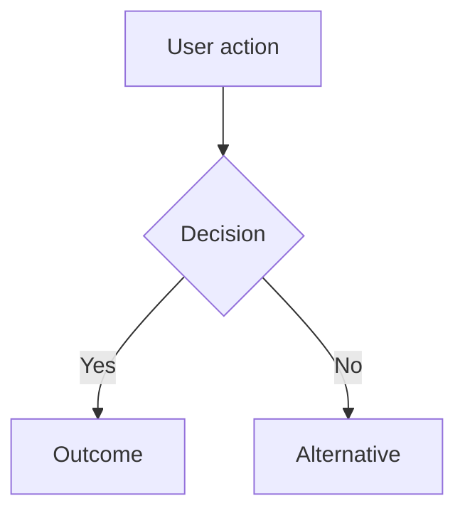

# pm:groom

## Purpose

Orchestrate the full product discovery lifecycle: from raw idea to structured, research-backed issues ready for the sprint.

Research gates grooming. Strategy gates scoping. Neither is optional.

## Interaction Pacing

Ask ONE question at a time. Wait for the user's answer before asking the next. Do not bundle multiple questions in a single message. When you have follow-ups, ask the most important one first — the answer often makes the others unnecessary.

## Output Formatting

Read `${CLAUDE_PLUGIN_ROOT}/references/writing.md` before generating any output. All groom output must follow those shared rules.

For groom-specific examples (scope review tables, team review collapse): read `${CLAUDE_PLUGIN_ROOT}/skills/groom/references/style-guide.md`.

---

## Mode Routing

**If the argument is `ideate`** (e.g., `/pm:groom ideate`):
- Skip the normal groom lifecycle. Follow `${CLAUDE_PLUGIN_ROOT}/skills/groom/phases/ideate.md` instead.
- Ideate mines the knowledge base and generates ranked feature ideas as `status: idea` backlog items.

**Otherwise**, proceed with the normal groom lifecycle below.

---

## Tier Classification

Grooming depth scales with issue complexity. Not every issue needs the full ceremony.

### Tier selection (Phase 1, step 2.5)

After capturing the idea, suggest a tier with a one-line reason and let the user confirm or override. Always ask — never silently auto-detect.

**Detection signals for the suggestion:**

| Signal | Suggested tier |
|--------|---------------|
| `/dev` passed `groom_tier: quick` | **Quick** |
| `/dev` passed `groom_tier: standard` | **Standard** |
| `/dev` passed `groom_tier: full` | **Full** |
| User says "quick groom" or "light groom" | **Quick** |
| Bug fix, typo, config tweak, single-concern gap | **Quick** |
| Touches multiple concerns but has clear direction | **Standard** |
| New capability area, ambiguous direction, multi-domain | **Full** |

If `/dev` passed a `dev_size`, use as secondary signal: XS/S → Quick, M → Standard, L/XL → Full.

**Format:**
> "I'd suggest **{tier}** — {reason}. Quick, Standard, or Full?"

**User's choice is final.** If the user says "full groom" on a bug fix, respect it.

### Tier → Phase mapping

| Phase | Quick | Standard | Full |
|-------|-------|----------|------|
| 1. Intake | Yes | Yes | Yes |
| 2. Strategy Check | Skip | Yes | Yes |
| 3. Research | Skip | Yes (quick mode) | Yes (full mode) |
| 3.5. Design | Skip | If UI feature | Yes |
| 4. Scope | Yes (lightweight) | Yes | Yes |
| 4.5. Scope Review | Skip | Yes (PM + EM only, 2 agents) | Yes (3 agents) |
| 5. Groom | Yes (draft issues) | Yes | Yes |
| 5.5. Team Review | Skip | Skip | Yes (3-4 agents) |
| 5.7. Bar Raiser | Skip | Skip | Yes |
| 5.8. Present | Skip | Skip | Yes |
| 6. Link | Yes | Yes | Yes |

**Quick tier scope (Phase 4)** is lightweight: confirm in-scope / out-of-scope with the user in a single exchange. Skip the 10x filter, scope grid, and codebase reality check. The goal is a clear boundary, not a strategic evaluation.

**Standard tier research (Phase 3)** uses `pm:research quick` mode — fast inline answers, no full landscape or competitor deep-dive. Enough to ground the scope in market context without the full research ceremony.

**Standard tier scope review (Phase 4.5)** dispatches 2 agents (PM + EM). Competitive strategist is skipped — the quick research already covers competitive basics.

Store the tier in the groom session state file:

```yaml
tier: quick | standard | full
```

After storing the tier, emit the groom started event:
```bash
bash "${CLAUDE_PLUGIN_ROOT}/scripts/emit-event.sh" "groom_started" "${SLUG:-groom-$$}" "{\"topic\":\"${TOPIC}\",\"tier\":\"${TIER}\"}"
```

### Bar raiser verdict by tier

Quick and standard tiers skip bar raiser, so the groom session ends without a `bar_raiser.verdict`. For downstream consumers (like `/dev` groom detection):

| Tier | Equivalent verdict for groom detection |
|------|---------------------------------------|
| Quick | `"ready"` (implicit — no review gates to fail) |
| Standard | `"ready"` if scope review passes, `"send-back"` if scope review fails |
| Full | Actual bar raiser verdict |

Store in state:

```yaml
effective_verdict: ready | ready-if | send-back | pause
```

---

## Resume Check

Before doing anything else, scan `.pm/groom-sessions/` for any `.md` files.

**If a slug argument was provided** (e.g., `/pm:groom bulk-editing`):
- Check if `.pm/groom-sessions/{slug}.md` exists.
- If it does, read it and say:
  > "Found an in-progress grooming session for '{topic}' (last updated: {updated}, current phase: {phase}).
  > Resume from {phase}, or start fresh?"
- If it doesn't, start Phase 1 for the given topic.

**If no argument was provided:**
- If one or more session files exist, list them:
  > "You have {N} in-progress grooming session(s):
  > 1. {topic} — Phase: {phase}, started {started}
  > 2. {topic} — Phase: {phase}, started {started}
  >
  > Resume one (pick a number), or start a new topic?"
- If no sessions exist, start Phase 1.

Wait for the user's answer. If resuming: read the selected session file, skip completed phases. If starting fresh on an existing slug: delete that session file, then begin Phase 1.

---

## Lifecycle

Phases run based on the tier determined during Tier Classification:

- **Quick:** intake → scope (lightweight) → groom → link
- **Standard:** intake → strategy check → research (quick) → scope → scope review (2 agents) → design (if UI) → groom → link
- **Full:** intake → strategy check → research → scope → scope review → design → groom → team review → bar raiser → present → link

---


## Custom Instructions

Before starting work, check for user instructions:

1. If `pm/instructions.md` exists, read it — these are shared team instructions (terminology, writing style, output format, competitors to track).
2. If `pm/instructions.local.md` exists, read it — these are personal overrides that take precedence over shared instructions on conflict.
3. If neither file exists, proceed normally.

**Override hierarchy:** `pm/strategy.md` wins for strategic decisions (ICP, priorities, non-goals). Instructions win for format preferences (terminology, writing style, output structure). Instructions never override skill hard gates.

Before starting any phase, read `${CLAUDE_PLUGIN_ROOT}/references/writing.md` for shared output rules and `${CLAUDE_PLUGIN_ROOT}/skills/groom/references/style-guide.md` for groom-specific examples.

---

## Codebase Detection

At the start of a grooming session (before Phase 1), determine whether the project has an accessible codebase:

1. List the top-level project directory. Look for source code indicators: `src/`, `lib/`, `app/`, `packages/`, `*.py`, `*.ts`, `*.go`, `*.rs`, `*.java`, `package.json`, `Cargo.toml`, `go.mod`, `pyproject.toml`, or similar.
2. If source code exists, set `codebase_available: true` in groom state. Note the primary language and entry points.
3. If the project is purely a product knowledge base (only `pm/`, `.pm/`, docs), set `codebase_available: false`.

When `codebase_available: true`, multiple phases will incorporate codebase analysis — checking existing implementation, UI patterns, and overlapping code. Each phase file specifies what to check and when.

---

## Phases

When entering a phase, read its detailed instructions from the phase file. Each phase file contains the full instructions, HARD-GATEs, agent prompts, and state update schemas.

| Phase | File | Tiers | Summary |
|-------|------|-------|---------|
| 1. Intake | `phases/phase-1-intake.md` | All | Capture the idea, tier selection, problem statement |
| 2. Strategy Check | `phases/phase-2-strategy.md` | Standard, Full | Validate against priorities, non-goals, ICP |
| 3. Research | `phases/phase-3-research.md` | Standard (quick), Full | Invoke pm:research for competitive and market intelligence |
| 4. Scope | `phases/phase-4-scope.md` | All (Quick = lightweight) | Define in-scope / out-of-scope, apply 10x filter |
| 4.5. Scope Review | `phases/phase-4.5-scope-review.md` | Standard (2 agents), Full (3 agents) | Parallel agents (PM, Competitive, EM) challenge the scope |
| 5. Design | `phases/phase-3.5-design.md` | Standard (if UI), Full | User flows, wireframes, design exploration |
| 6. Issue Drafting | `phases/phase-5-groom.md` | All | Decompose, INVEST validate, draft issues |
| 7. Team Review | `phases/phase-5.5-team-review.md` | Full only | 3-4 parallel agents review drafted issues for quality (max 3 iterations) |
| 8. Bar Raiser | `phases/phase-5.7-bar-raiser.md` | Full only | Product Director holistic review with fresh eyes (max 2 iterations) |
| 9. Present | `phases/phase-5.8-present.md` | Full only | Generate HTML proposal, open in browser, get user approval |
| 10. Link | `phases/phase-6-link.md` | All | Create issues in Linear or local backlog, validate, retro prompt |

**How to use:** At the start of each phase, check the tier in `.pm/groom-sessions/{slug}.md`. If the phase is not included for the current tier (see Tier → Phase mapping above), skip it and proceed to the next applicable phase. When entering an applicable phase, read the corresponding file with `Read ${CLAUDE_PLUGIN_ROOT}/skills/groom/phases/{filename}` and follow its instructions exactly.

---

## Context Preservation

Grooming sessions span many phases and can exceed context limits. To prevent state loss:

1. **Re-read critical files at each phase boundary.** At the start of each phase, re-read `.pm/groom-sessions/{slug}.md` (the current session's state file) and `pm/strategy.md` §6-7 (priorities and non-goals). Do not rely on earlier conversation context for these — it may have been compressed.
2. **State file is the source of truth.** What has been completed, what verdicts were given, and what blocking issues were fixed — all of this lives in the state file, not in conversation history.
3. **Graceful context exhaustion.** If a phase file cannot be fully loaded or you notice missing context from earlier phases, stop and tell the user: "Context is getting full. The state file preserves your progress. Continue in a new session by running `/pm:groom` — it will detect the state file and offer to resume from {current phase}."

---

## State File Schema (.pm/groom-sessions/{slug}.md)

Each grooming session has its own state file at `.pm/groom-sessions/{slug}.md`, where `{slug}` is the topic slug derived in Phase 1. Multiple sessions can coexist.

```yaml
---
topic: "{topic name}"
tier: quick | standard | full
phase: intake | strategy-check | research | scope | scope-review | groom | team-review | bar-raiser | present | link
started: YYYY-MM-DD
updated: YYYY-MM-DD
effective_verdict: ready | ready-if | send-back | pause | null
outcome: "{one-sentence: what changes for the user when this ships}"
trigger: "{what prompted this — user request, competitor move, pain point, etc.}"
codebase_available: true | false
codebase_context: "{brief summary of related existing code, or 'greenfield'}"

strategy_check:
  status: passed | failed | override | skipped
  checked_against: pm/strategy.md | null
  conflicts:
    - "{conflicting non-goal text}"
  supporting_priority: "{priority text}" | null

research_location: pm/research/{topic-slug}/ | null

scope:
  in_scope:
    - "{item}"
  out_of_scope:
    - "{item}: {reason}"
  filter_result: 10x | parity | gap-fill | null

scope_review:
  pm_verdict: ship-it | ship-if | rethink-scope | wrong-priority | null
  competitive_verdict: strengthens | strengthens-if | neutral | weakens | null
  em_verdict: feasible | feasible-with-caveats | needs-rearchitecting | null
  blocking_issues_fixed: 0
  iterations: 1

team_review:
  pm_verdict: ready | ready-if | needs-revision | significant-gaps | null
  competitive_verdict: sharp | sharp-if | adequate | undifferentiated | null
  em_verdict: ready | ready-if | needs-restructuring | missing-prerequisites | null
  design_verdict: complete | complete-if | gaps | inconsistencies | null
  conditions:
    - "{reviewer}: {condition text}"
  blocking_issues_fixed: 0
  iterations: 1

bar_raiser:
  verdict: ready | ready-if | send-back | pause | null
  conditions:
    - "{condition text}"
  iterations: 1
  blocking_issues_fixed: 0

issues:
  - slug: "{issue-slug}"
    title: "{title}"
    status: drafted | created | linked
    linear_id: "{Linear ID}" | null
---
```

---

## Error Handling

**Corrupted state file** (unparseable YAML, missing required fields):
> "The state file at .pm/groom-sessions/{slug}.md appears corrupted. Options:
> (a) Show me the file so I can fix it manually
> (b) Start fresh (deletes the state file)"

**Missing research refs** (phase advances but research files not found):
Warn the user. Offer to re-run Phase 3 before continuing. Do not silently proceed with empty research context.

**Strategy drift** (pm/strategy.md modified since strategy_check was recorded):
On every phase after strategy-check, compare the file's `updated:` date against the state's `strategy_check.checked_against`. If newer, flag:
> "pm/strategy.md was updated after the strategy check. Re-run the check before scoping?"

---

## Backlog Issue Format (when no Linear)

Write to `pm/backlog/{issue-slug}.md`.

**ID assignment:** Each backlog issue gets a sequential `id` in the format `PM-{NNN}`. Before creating a new issue, scan all existing `pm/backlog/*.md` files for the highest `id` value and increment by 1. The first issue is `PM-001`. IDs are zero-padded to 3 digits. The dashboard displays IDs on kanban cards and detail pages, and shows parent references (e.g., `↑ PM-001`) on child issue cards.

```markdown
---
type: backlog-issue
id: "PM-{NNN}"
title: "{Issue Title}"
outcome: "{One-sentence: what changes for the user when this ships}"
status: idea | drafted | approved | in-progress | done
parent: "{parent-issue-slug}" | null
children:
  - "{child-issue-slug}"
labels:
  - "{label}"
priority: critical | high | medium | low
research_refs:
  - pm/research/{topic-slug}/findings.md
created: YYYY-MM-DD
updated: YYYY-MM-DD
---

## Outcome

{Expand on the outcome statement. What does the user experience after this ships?
What were they unable to do before?}

## Acceptance Criteria

1. {Specific, testable condition.}
2. {Specific, testable condition.}
3. {Edge cases handled: ...}

## User Flows

{Mermaid diagrams showing primary user flow(s) for this feature.
Include the main happy path. Add alternate/error paths for complex features.
Each diagram should have a `%% Source:` comment citing the signal that shaped it.}



## Wireframes

{For UI features: link to the HTML wireframe file generated during grooming.
For non-UI features: "N/A — no user-facing workflow for this feature type."}

[Wireframe preview](pm/backlog/wireframes/{issue-slug}.html)

## Competitor Context

{How do competitors handle this? Where do they fall short?
Reference specific profiles from pm/competitors/ if applicable.}

## Technical Feasibility

{Engineering Manager assessment of build-on vs build-new, risks, and sequencing.
Include verdict: feasible | feasible-with-caveats | needs-rearchitecting.}

## Research Links

- [{Finding title}](pm/research/{topic-slug}/findings.md)

## Notes

{Open questions, implementation constraints, or deferred scope items.}
```
