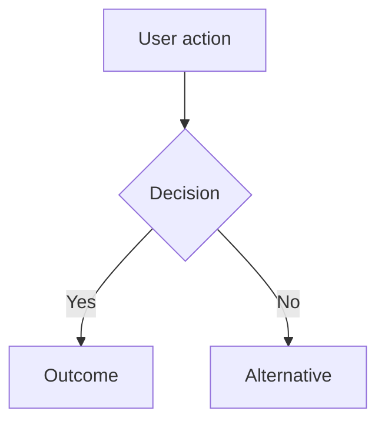

# pm:groom

## Purpose

Orchestrate the full product discovery lifecycle: from raw idea to structured, research-backed issues ready for the sprint.

Research gates grooming. Strategy gates scoping. Neither is optional.

## Interaction Pacing

Ask ONE question at a time. Wait for the user's answer before asking the next. Do not bundle multiple questions in a single message. When you have follow-ups, ask the most important one first — the answer often makes the others unnecessary.

---

## Resume Check

Before doing anything else, check if `.pm/.groom-state.md` exists.

If it does, read it and say:

> "Found an in-progress grooming session for '{topic}' (last updated: {updated}, current phase: {phase}).
> Resume from {phase}, or start fresh?"

Wait for the user's answer. If resuming: skip completed phases. If starting fresh: delete the state file, then begin Phase 1.

---

## Lifecycle: intake -> strategy check -> research -> scope -> product & competitive review -> groom -> link

---


## Custom Instructions

Before starting work, check for user instructions:

1. If `pm/instructions.md` exists, read it — these are shared team instructions (terminology, writing style, output format, competitors to track).
2. If `pm/instructions.local.md` exists, read it — these are personal overrides that take precedence over shared instructions on conflict.
3. If neither file exists, proceed normally.

**Override hierarchy:** `pm/strategy.md` wins for strategic decisions (ICP, priorities, non-goals). Instructions win for format preferences (terminology, writing style, output structure). Instructions never override skill hard gates.

---

### Phase 1: Intake

**If grooming an existing idea from backlog:** Check if `pm/backlog/{slug}.md` exists with `status: idea`. If so, read it and pre-fill intake from its outcome, signal sources, and competitor context. Confirm with the user:
> "Grooming idea '{title}' from backlog. Here's what we know: {one-liner}. Anything to add or change before we proceed?"

Skip to step 3 after confirmation.

**Otherwise:**

1. Ask: "What's the idea?"
   One question. Wait for the full answer.

2. Clarify if needed — ask ONE follow-up at a time, only if the answer didn't already cover it:
   - "Is this a user pain you've observed, or a proposed solution?" (problem vs. solution)
   - "Is this a small UX improvement or a new capability area?" (scope signal)
   - "What triggered this — a competitor move, user request, or something else?" (why now)
   Skip any question the user's initial answer already addressed.

3. Check `pm/research/` for existing context on this topic. If relevant findings exist, note them:
   > "Found related research at {path}. I'll use it in Phase 3."

4. Derive a topic slug from the idea (kebab-case, max 4 words).

5. Write initial state to `.pm/.groom-state.md`:

```yaml
topic: "{topic}"
phase: intake
started: YYYY-MM-DD
updated: YYYY-MM-DD
```

---

### Phase 2: Strategy Check

<HARD-GATE>
Strategy misalignment must be flagged explicitly. Do NOT silently proceed.
If pm/strategy.md is missing, do NOT skip this phase — offer to create it first.
</HARD-GATE>

1. Check if `pm/strategy.md` exists.

   If it does NOT exist:
   > "No strategy doc found. Strategy check requires one. Options:
   > (a) Run $pm-strategy now to create it, then continue grooming
   > (b) Skip strategy check and proceed at your own risk"
   Wait for selection. If (a): invoke pm:strategy, then return here when complete.

2. Read `pm/strategy.md`. Check the idea against:

   **Current priorities** (Section 6): Does this advance the stated top 3 priorities? Or does it pull focus away from them?

   **Explicit non-goals** (Section 7): Does this idea touch anything on the non-goals list?

   **ICP fit** (Section 2): Does the target user match the ICP? Or is this serving a secondary segment?

3. Determine alignment:

   - **Aligned:** Proceed. Note which priority this supports.
   - **Misaligned with non-goal:** STOP. Say:
     > "This conflicts with the explicit non-goal: '{non-goal}'.
     > Proceeding would undermine a deliberate product decision. Proceed anyway?"
     Wait for explicit yes/no. Do not soft-pedal this.
   - **Off-priority but not a non-goal:** Flag it:
     > "This doesn't map to any current top-3 priority. It's not a non-goal, but it
     > competes for focus. Proceed anyway?"

4. Update state:

```yaml
strategy_check:
  status: passed | failed | override | skipped
  checked_against: pm/strategy.md | null
  conflicts: [] | ["{non-goal text}"]
  supporting_priority: "{priority text}" | null
```

---

### Phase 3: Research

1. Invoke `pm:research {topic-slug}` for targeted investigation.
   Brief it on the grooming context: what problem, what user, what's already known.

2. Key questions to answer:
   - How do competitors handle this? (UI patterns, feature depth, limitations)
   - What do users expect based on reviews and community signals?
   - What does internal customer evidence in `pm/research/` say, if `$pm-ingest` has been used?
   - Is there a market signal validating this is a real problem?

3. Wait for research to complete. Do not proceed to Phase 4 until findings are written.

4. Update state:

```yaml
phase: research
research_location: pm/research/{topic-slug}/
```

---

### Phase 4: Scope

Follow the full methodology in `scope-validation.md`.

1. Present the scope definition template. Fill it collaboratively with the user:
   - What is explicitly IN scope for this initiative?
   - What is explicitly OUT of scope? (with reasons — prevents scope creep)

2. Apply the 10x filter (from `scope-validation.md`):
   > "Is this meaningfully better than what competitors offer — or incremental parity?"
   Document the filter result explicitly: `10x` | `parity` | `gap-fill`.

3. If the result is `parity`: flag it.
   > "This appears to be feature parity with {competitor}. Parity is a valid reason
   > to build, but not a differentiation story. Note the strategic intent before proceeding."

4. If `visual_companion: true` in `.pm/config.json`: offer the scope grid (impact/effort).
   > "Want a scope grid? I'll plot proposed scope items on impact vs. effort axes."

5. Update state:

```yaml
phase: scope
scope:
  in_scope: []
  out_of_scope: []
  filter_result: 10x | parity | gap-fill
```

---

### Phase 4.5: Product & Competitive Review

After scope is confirmed, dispatch **3 parallel subagents** to challenge the scoped initiative before drafting issues. This catches strategic misalignment, competitive blind spots, and technical risks that the strategy check (Phase 2) is too coarse to find.

Dispatch all three in parallel (subagent_type: general-purpose, model: sonnet):

**Agent 1: Product Manager**

```
You are a product manager reviewing a scoped feature initiative.

**Read before reviewing:**
- pm/strategy.md — extract the product identity, ICP, value prop, current priorities (Section 6), and non-goals (Section 7). Use these as your evaluation framework.
- pm/landscape.md — market context
- pm/competitors/index.md — competitive landscape
**Groom state:** .pm/.groom-state.md (contains topic, scope, strategy check result, research location)
**Research:** Read all files in the research location from groom state

You are opinionated. You care about whether this moves the needle for the business, not whether the scope is well-formatted.

Review from these angles:

1. **JTBD clarity.** What job is the customer hiring this feature to do? Can you state it in one sentence? If not, the scope is too vague to draft issues from.
2. **ICP fit.** Does this solve a problem the ICP (from pm/strategy.md Section 2) actually has, or is it a feature we think is cool?
3. **Prioritization.** Given the current priorities (from pm/strategy.md Section 6), does this belong now or is it a distraction? Be harsh.
4. **Scope right-sizing.** Is the scope trying to do too much? Would cutting 30% still deliver the core value? Are any in-scope items actually out-of-scope in disguise?
5. **Success criteria.** How would we know this worked in 90 days? If there's no measurable outcome defined, that's a gap.

**Output:**
## Product Review
**Verdict:** Ship it | Rethink scope | Wrong priority
**Blocking issues:** (must fix before drafting issues)
- [issue] - [why this matters for the business]
**Pushback:** (challenges to consider, non-blocking)
- [concern] - [what to watch for]
```

**Agent 2: Competitive Strategist**

```
You are a competitive strategist reviewing a scoped feature initiative.

**Read before reviewing:**
- pm/strategy.md — extract the competitive positioning (Section 4), value prop (Section 3), and non-goals (Section 7). These define how the product competes.
- pm/landscape.md — market context and positioning map
- pm/competitors/ (all profile.md and features.md files) — competitor capabilities and weaknesses
**Groom state:** .pm/.groom-state.md (contains topic, scope, 10x filter result, research location)
**Research:** Read all files in the research location from groom state

Review from these angles:

1. **Differentiation.** Does this make the product more different from incumbents, or more similar? "Table stakes" features are fine if required for switching, but label them as such.
2. **Switching motivation.** Would this contribute to a customer's decision to switch from competitors (identified in pm/competitors/)? Or is it "nice to have" post-switch?
3. **Competitive response.** How easily can incumbents copy this? If trivially, it needs to be wrapped in something defensible.
4. **Non-goal violations.** Does any in-scope item creep toward the explicit non-goals listed in pm/strategy.md Section 7?
5. **Differentiation opportunity.** Is there a unique angle (AI, automation, workflow depth) that the scope is missing? Check what competitors lack in their feature profiles.

**Output:**
## Competitive Review
**Verdict:** Strengthens position | Neutral | Weakens focus
**Blocking issues:** (strategic misalignment that should stop issue drafting)
- [issue] - [competitive risk]
**Opportunities:** (ways to sharpen competitive edge, non-blocking)
- [opportunity] - [why it matters]
```

**Agent 3: Engineering Manager**

```
You are an engineering manager reviewing a scoped feature initiative by scanning the actual codebase for technical feasibility.

**Read before reviewing:** pm/strategy.md (for non-goals boundary)
**Groom state:** .pm/.groom-state.md (contains topic, scope, research location)
**Codebase:** Explore the project's source code structure to understand current implementation. Start with the top-level directory listing, then read files relevant to the scoped feature.

You are practical and observational. Your job is to ground the product scope in implementation reality. You tell the team what the code says, not what to do about it.

Review from these angles:

1. **Build-on.** What existing code, patterns, or infrastructure supports this feature? Name specific files and patterns.
2. **Build-new.** What doesn't exist yet and would need to be created? Be specific about what's missing.
3. **Risk.** What makes this harder than it looks? Missing dependencies, architectural constraints, performance concerns, format ambiguities.
4. **Sequencing advice.** What should be built first? Are there natural implementation milestones?

**Important boundaries:**
- Stay observational: "the codebase currently has X" — not prescriptive: "you should implement it with Y"
- Reference specific file paths to make findings verifiable
- If the codebase is not available or the feature is for a greenfield project, note "No codebase context available" and fall back to research-based feasibility signals

**Output:**
## Engineering Manager Review
**Verdict:** Feasible as scoped | Feasible with caveats | Needs rearchitecting
**Build-on:** (existing infrastructure that supports this)
- [file/pattern] - [how it helps]
**Build-new:** (what needs to be created)
- [component] - [what it does]
**Risks:** (things that make this harder than it looks)
- [risk] - [why it matters]
**Sequencing:** (recommended build order)
1. [step] - [rationale]
```

After the EM agent completes, present its findings conversationally to the user. The EM review is interactive — invite the user to ask follow-up questions or push back on the assessment before proceeding.

> "The EM reviewed the codebase. Here are the findings: {summary}. Any questions or concerns before we proceed to drafting issues?"

Wait for user confirmation. Capture the EM's key findings for inclusion in the `## Technical Feasibility` section of groomed issues.

**Handling findings:**

1. Merge all three agent outputs. Deduplicate.
2. Fix all **Blocking issues** by adjusting scope (move items to out-of-scope, refine in-scope definitions). **Pushback** and **Opportunities** are advisory.
3. If blocking issues were fixed, re-dispatch reviewers (max 3 iterations).
4. If iteration 3 still has blocking issues, present to user for decision.
5. Update state:

```yaml
phase: product-review
product_review:
  pm_verdict: ship-it | rethink-scope | wrong-priority
  competitive_verdict: strengthens | neutral | weakens
  em_verdict: feasible | feasible-with-caveats | needs-rearchitecting
  blocking_issues_fixed: 0
  iterations: 1
```

---

### Phase 5: Groom

#### Step 1: Feature-type detection

Before drafting issues, classify the feature type to determine which visual artifacts to generate:

- **UI feature:** Has user-facing screens, workflows, or interactions → generate user flow diagram + HTML wireframe
- **Workflow feature:** Has multi-step processes, decision points, or state transitions → generate user flow diagram only
- **API feature:** Exposes or consumes APIs → no visual artifacts (API contracts are engineering's domain)
- **Data feature:** Introduces new data structures or storage → no visual artifacts (data models are engineering's domain)
- **Infrastructure feature:** Config, tooling, or plumbing → no visual artifacts

Confirm with the user:
> "This looks like a [UI/workflow/API/data/infrastructure] feature. I'll generate [user flow diagram + HTML wireframe / user flow diagram / no visual artifacts]. Sound right?"

Wait for confirmation before proceeding.

#### Step 2a: Generate Mermaid user flow diagram (if applicable)

If the feature type is UI or workflow:

1. Generate a Mermaid flowchart showing:
   - Primary happy path from user intent to completion
   - Key decision points as diamond nodes
   - Error states and edge cases as branching paths
   - Start and end states clearly labeled

2. Include citation trails — at least one `%% Source:` comment per diagram referencing the research finding or competitor gap that informed a design decision:
   ```
   %% Source: pm/research/{topic}/findings.md — Finding N: {description}
   %% Source: pm/competitors/{slug}/features.md — {gap or pattern}
   ```

3. Keep diagrams readable — max ~15 nodes. If the flow is more complex, split into sub-flows.

#### Step 2b: Generate HTML wireframe (UI features only)

If the feature type is UI, generate a standalone HTML wireframe file:

1. **Create the wireframes directory** if it doesn't exist: `pm/backlog/wireframes/`

2. **Write a self-contained HTML file** to `pm/backlog/wireframes/{parent-issue-slug}.html` with:
   - A `<style>` block — no external dependencies. Use lo-fi wireframe CSS: gray boxes, borders, labels, placeholder areas.
   - Component vocabulary: `.wireframe-screen`, `.wireframe-header`, `.wireframe-nav`, `.wireframe-sidebar`, `.wireframe-content`, `.wireframe-form`, `.wireframe-button`, `.wireframe-input`, `.wireframe-table`, `.wireframe-card`, `.wireframe-placeholder`
   - Layout using CSS flexbox/grid — simple, reliable, LLM-friendly
   - A title bar showing the feature name and "Lo-fi Wireframe"
   - Labeled components matching the feature scope (e.g., form fields with real labels from the spec, nav items matching the user flow, table columns matching the data model)

3. **Ground the wireframe in scope and research:**
   - Component labels should match the terminology from the scope definition
   - Screen layout should reflect the user flow from Step 2a
   - Add HTML comments citing sources: `<!-- Source: pm/research/{topic}/findings.md -->`

4. **Keep it lo-fi.** The wireframe communicates layout and component placement, not visual design:
   - Gray backgrounds, black borders, system fonts
   - No colors, icons, or images (use text placeholders: `[Icon]`, `[Image]`)
   - No interactivity (static HTML only)
   - Max 2-3 screens per wireframe file (use sections or scroll)

5. **Reference the wireframe** in the parent issue's `## Wireframes` section:
   ```
   [Wireframe preview](pm/backlog/wireframes/{issue-slug}.html)
   ```

The HTML wireframe file also works standalone — users can open it directly in any browser. The PM dashboard embeds it via iframe on the backlog detail page.

#### Step 3: Draft issues

Draft a structured issue set: one parent issue + child issues for discrete work.

Each issue must contain:
   - **Outcome statement:** What changes for the user when this ships? (not a task description)
   - **Acceptance criteria:** Numbered list. Testable, specific.
   - **Research links:** Paths to relevant findings in `pm/research/`.
   - **Customer evidence:** Include internal evidence count, affected segment, or source theme when available.
   - **Competitor context:** How competitors handle this, with specific references from Phase 3.
   - **Scope note:** Which in-scope items this issue covers.
   - **User Flows:** Mermaid flowchart (if generated in Step 2a), or "N/A — no user-facing workflow for this feature type"
   - **Wireframes:** Link to the HTML wireframe file (if generated in Step 2b), or "N/A — no user-facing workflow for this feature type"
   - **Technical Feasibility:** Key findings from the EM review in Phase 4.5, referencing specific file paths. If no EM review was conducted, note "No codebase context available."

#### Step 4: Present and confirm

Present the full draft set to the user before creating anything:
> "Here are the proposed issues. Review them — are any missing, redundant, or
> incorrectly scoped? I'll create them once you approve."

If `visual_companion: true`: render issue preview cards (title, outcome, AC count, labels).

Wait for explicit approval. Accept edits inline.

4. Update state:

```yaml
phase: groom
issues:
  - slug: "{issue-slug}"
    title: "{title}"
    status: drafted
```

---

### Phase 6: Link (optional)

1. Check if Linear is configured (`.pm/config.json` has `linear: true` or Linear MCP is available).

2. **If Linear configured:**
   - Create parent issue first. Capture the Linear ID.
   - Create child issues, linking each to the parent.
   - Add research artifact links as attachments or description links.
   - Say: "Issues created in Linear. Parent: {ID}. Children: {IDs}."

3. **If no Linear:**
   - Write each issue to `pm/backlog/{issue-slug}.md` (see Backlog Issue Format below).
   - Link child issues to parent via `parent:` frontmatter field.

4. **Validate written artifacts.** Run:
   ```bash
   node ${CLAUDE_PLUGIN_ROOT}/scripts/validate.js --dir "${CLAUDE_PROJECT_DIR:-$PWD}/pm"
   ```
   If validation fails, fix the frontmatter errors before proceeding. Do not surface the validation step to the user — just fix silently and move on.

5. Update state, then clean up:

```yaml
issues:
  - slug: "{issue-slug}"
    status: created | linked
    linear_id: "{ID}" | null
```

Delete `.pm/.groom-state.md` after successful link. Grooming is complete.

Say:
> "Grooming complete for '{topic}'. {N} issues created.
> Recommended next: $pm-ideate for more ideas, $pm-groom {next-idea}, or update priorities in pm/strategy.md."

---

## State File Schema (.pm/.groom-state.md)

Only one state file at a time. If one exists when starting fresh, overwrite it.

```yaml
---
topic: "{topic name}"
phase: intake | strategy-check | research | scope | product-review | groom | link
started: YYYY-MM-DD
updated: YYYY-MM-DD

strategy_check:
  status: passed | failed | override | skipped
  checked_against: pm/strategy.md | null
  conflicts:
    - "{conflicting non-goal text}"
  supporting_priority: "{priority text}" | null

research_location: pm/research/{topic-slug}/ | null

scope:
  in_scope:
    - "{item}"
  out_of_scope:
    - "{item}: {reason}"
  filter_result: 10x | parity | gap-fill | null

product_review:
  pm_verdict: ship-it | rethink-scope | wrong-priority | null
  competitive_verdict: strengthens | neutral | weakens | null
  em_verdict: feasible | feasible-with-caveats | needs-rearchitecting | null
  blocking_issues_fixed: 0
  iterations: 1

issues:
  - slug: "{issue-slug}"
    title: "{title}"
    status: drafted | created | linked
    linear_id: "{Linear ID}" | null
---
```

---

## Error Handling

**Corrupted state file** (unparseable YAML, missing required fields):
> "The state file at .pm/.groom-state.md appears corrupted. Options:
> (a) Show me the file so I can fix it manually
> (b) Start fresh (deletes the state file)"

**Missing research refs** (phase advances but research files not found):
Warn the user. Offer to re-run Phase 3 before continuing. Do not silently proceed with empty research context.

**Strategy drift** (pm/strategy.md modified since strategy_check was recorded):
On every phase after strategy-check, compare the file's `updated:` date against the state's `strategy_check.checked_against`. If newer, flag:
> "pm/strategy.md was updated after the strategy check. Re-run the check before scoping?"

**Parallel sessions** (state file already exists when starting):
Never silently overwrite an existing state file. Always ask resume vs. fresh. Starting fresh requires explicit user confirmation before deleting.

---

## Backlog Issue Format (when no Linear)

Write to `pm/backlog/{issue-slug}.md`.

**ID assignment:** Each backlog issue gets a sequential `id` in the format `PM-{NNN}`. Before creating a new issue, scan all existing `pm/backlog/*.md` files for the highest `id` value and increment by 1. The first issue is `PM-001`. IDs are zero-padded to 3 digits. The dashboard displays IDs on kanban cards and detail pages, and shows parent references (e.g., `↑ PM-001`) on child issue cards.

```markdown
---
type: backlog-issue
id: "PM-{NNN}"
title: "{Issue Title}"
outcome: "{One-sentence: what changes for the user when this ships}"
status: idea | drafted | approved | in-progress | done
parent: "{parent-issue-slug}" | null
children:
  - "{child-issue-slug}"
labels:
  - "{label}"
priority: critical | high | medium | low
research_refs:
  - pm/research/{topic-slug}/findings.md
created: YYYY-MM-DD
updated: YYYY-MM-DD
---

## Outcome

{Expand on the outcome statement. What does the user experience after this ships?
What were they unable to do before?}

## Acceptance Criteria

1. {Specific, testable condition.}
2. {Specific, testable condition.}
3. {Edge cases handled: ...}

## User Flows

{Mermaid diagrams showing primary user flow(s) for this feature.
Include the main happy path. Add alternate/error paths for complex features.
Each diagram should have a `%% Source:` comment citing the signal that shaped it.}



## Wireframes

{For UI features: link to the HTML wireframe file generated during grooming.
For non-UI features: "N/A — no user-facing workflow for this feature type."}

[Wireframe preview](pm/backlog/wireframes/{issue-slug}.html)

## Competitor Context

{How do competitors handle this? Where do they fall short?
Reference specific profiles from pm/competitors/ if applicable.}

## Technical Feasibility

{Engineering Manager assessment of build-on vs build-new, risks, and sequencing.
Include verdict: feasible | feasible-with-caveats | needs-rearchitecting.}

## Research Links

- [{Finding title}](pm/research/{topic-slug}/findings.md)

## Notes

{Open questions, implementation constraints, or deferred scope items.}
```
