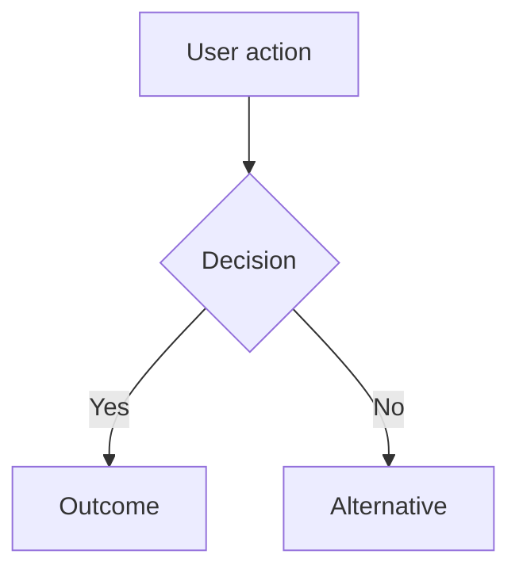

# pm:groom

## Purpose

Orchestrate the full product discovery lifecycle: from raw idea to structured, research-backed issues ready for the sprint.

Research gates grooming. Strategy gates scoping. Neither is optional.

## Telemetry (opt-in)

If analytics are enabled, read `${CLAUDE_PLUGIN_ROOT}/references/telemetry.md`.

Read `${CLAUDE_PLUGIN_ROOT}/references/capability-gates.md` for shared capability classification.

`pm:groom` is stateful. Mirror these fields into the groom session state file:
- `runtime`
- `groom_tier`
- `run_id`
- `started_at`
- `completed_at`
- `phase_started_at`

Minimum step coverage:
- `intake`
- `strategy-check`
- `research`
- `scope`
- `scope-review`
- `groom`
- `team-review`
- `bar-raiser`
- `present`
- `link`

## Interaction Pacing

Ask ONE question at a time. Wait for the user's answer before asking the next. Do not bundle multiple questions in a single message. When you have follow-ups, ask the most important one first — the answer often makes the others unnecessary.

---

## Runtime

Record the current runtime in the groom session state:

```yaml
runtime: claude | codex
```

The workflow stays the same across runtimes. Dispatch mechanics come from the current runtime and capability gates, not from the groom lifecycle itself.

---

## Groom Tiers

`pm:groom` supports three tiers:

| Tier | Intended use | Phases |
|------|--------------|--------|
| `quick` | Fill in missing structure fast, usually as a handoff to implementation or backlog capture | `intake -> strategy-check -> research -> scope -> groom -> link` |
| `standard` | Produce solid implementation-ready issues without the full executive review stack | `intake -> strategy-check -> research -> scope -> scope-review -> groom -> link` |
| `full` | Full PM ceremony with review stack and presentation | `intake -> strategy-check -> research -> scope -> scope-review -> groom -> team-review -> bar-raiser -> present -> link` |

### Tier selection

Use this priority:

1. Explicit tier from the caller or user request
2. Tier requested by `pm:dev`
3. Default to `full` for direct `pm:groom` invocations

Write the selected tier to the state file:

```yaml
groom_tier: quick | standard | full
```

### Phase loading rules

Only run phases that are active for the current tier.

- `quick` skips `scope-review`, `team-review`, `bar-raiser`, and `present`
- `standard` skips `team-review`, `bar-raiser`, and `present`
- `full` runs every phase

### Research by tier

Research is still required at all tiers.

- `quick`: perform a focused inline research pass or reuse existing relevant research; do not force the full multi-stage review stack
- `standard`: run the normal research phase
- `full`: run the normal research phase

When `quick` reuses existing research without writing new files, `research_location` may remain `null`. Log the sources used in the session notes.

---

## Resume Check

Before doing anything else, glob `.pm/groom-sessions/*.md`.

If exactly one session exists, read it and say:

> "Found an in-progress grooming session for '{topic}' (last updated: {updated}, current phase: {phase}).
> Resume from {phase}, or start fresh?"

If multiple sessions exist, list them with topic, phase, and updated timestamp. Ask which to resume.

Wait for the user's answer. If resuming: skip completed phases. If starting fresh: delete the selected state file, then begin Phase 1.

---

## Lifecycle: intake -> strategy check -> research -> scope -> scope review -> groom -> team review -> bar raiser -> present -> link

---


## Custom Instructions

Before starting work, check for user instructions:

1. If `pm/instructions.md` exists, read it — these are shared team instructions (terminology, writing style, output format, competitors to track).
2. If `pm/instructions.local.md` exists, read it — these are personal overrides that take precedence over shared instructions on conflict.
3. If neither file exists, proceed normally.

**Override hierarchy:** `pm/strategy.md` wins for strategic decisions (ICP, priorities, non-goals). Instructions win for format preferences (terminology, writing style, output structure). Instructions never override skill hard gates.

---

## Codebase Detection

At the start of a grooming session (before Phase 1), determine whether the project has an accessible codebase:

1. List the top-level project directory. Look for source code indicators: `src/`, `lib/`, `app/`, `packages/`, `*.py`, `*.ts`, `*.go`, `*.rs`, `*.java`, `package.json`, `Cargo.toml`, `go.mod`, `pyproject.toml`, or similar.
2. If source code exists, set `codebase_available: true` in groom state. Note the primary language and entry points.
3. If the project is purely a product knowledge base (only `pm/`, `.pm/`, docs), set `codebase_available: false`.

When `codebase_available: true`, multiple phases will incorporate codebase analysis — checking existing implementation, UI patterns, and overlapping code. Each phase file specifies what to check and when.

---

## Phases

When entering a phase, read its detailed instructions from the phase file. Each phase file contains the full instructions, HARD-GATEs, agent prompts, and state update schemas.

| Phase | File | Summary |
|-------|------|---------|
| 1. Intake | `phases/phase-1-intake.md` | Capture the idea, clarify, derive slug, write initial state |
| 2. Strategy Check | `phases/phase-2-strategy.md` | Validate against priorities, non-goals, ICP |
| 3. Research | `phases/phase-3-research.md` | Invoke pm:research for competitive and market intelligence |
| 4. Scope | `phases/phase-4-scope.md` | Define in-scope / out-of-scope, apply 10x filter |
| 4.5. Scope Review | `phases/phase-4.5-scope-review.md` | 3 parallel agents (PM, Competitive, EM) challenge the scope |
| 5. Groom | `phases/phase-5-groom.md` | Detect feature type, generate flows/wireframes, draft issues |
| 5.5. Team Review | `phases/phase-5.5-team-review.md` | 3-4 parallel agents review drafted issues for quality (max 3 iterations) |
| 5.7. Bar Raiser | `phases/phase-5.7-bar-raiser.md` | Product Director holistic review with fresh eyes (max 2 iterations) |
| 5.8. Present | `phases/phase-5.8-present.md` | Generate HTML proposal, open in browser, get user approval |
| 6. Link | `phases/phase-6-link.md` | Create issues in Linear or local backlog, validate, clean up |

**How to use:** At the start of each phase, read the corresponding file with `Read ${CLAUDE_PLUGIN_ROOT}/skills/groom/phases/{filename}` and follow its instructions exactly.

---

## State File Schema (.pm/groom-sessions/{topic-slug}.md)

Each grooming session has its own state file under `.pm/groom-sessions/`.

```yaml
---
topic: "{topic name}"
runtime: claude | codex
groom_tier: quick | standard | full
phase: intake | strategy-check | research | scope | scope-review | groom | team-review | bar-raiser | present | link
started: YYYY-MM-DD
updated: YYYY-MM-DD
run_id: "{PM_RUN_ID}"
started_at: YYYY-MM-DDTHH:MM:SSZ
phase_started_at: YYYY-MM-DDTHH:MM:SSZ
completed_at: null | YYYY-MM-DDTHH:MM:SSZ
effective_verdict: ready | ready-if | send-back | pause | null
codebase_available: true | false

strategy_check:
  status: passed | failed | override | skipped
  checked_against: pm/strategy.md | null
  conflicts:
    - "{conflicting non-goal text}"
  supporting_priority: "{priority text}" | null

research_location: pm/evidence/research/{topic-slug}.md | null

scope:
  in_scope:
    - "{item}"
  out_of_scope:
    - "{item}: {reason}"
  filter_result: 10x | parity | gap-fill | null

scope_review:
  pm_verdict: ship-it | rethink-scope | wrong-priority | null
  competitive_verdict: strengthens | neutral | weakens | null
  em_verdict: feasible | feasible-with-caveats | needs-rearchitecting | null
  blocking_issues_fixed: 0
  iterations: 1

team_review:
  pm_verdict: ready | needs-revision | significant-gaps | null
  competitive_verdict: sharp | adequate | undifferentiated | null
  em_verdict: ready | needs-restructuring | missing-prerequisites | null
  design_verdict: complete | gaps | inconsistencies | null
  blocking_issues_fixed: 0
  iterations: 1

bar_raiser:
  verdict: ready | send-back | pause | null
  iterations: 1
  blocking_issues_fixed: 0

issues:
  - slug: "{issue-slug}"
    title: "{title}"
    status: drafted | created | linked
    linear_id: "{Linear ID}" | null
---
```

---

## Error Handling

**Corrupted state file** (unparseable YAML, missing required fields):
> "The selected groom state file under .pm/groom-sessions/ appears corrupted. Options:
> (a) Show me the file so I can fix it manually
> (b) Start fresh (deletes the state file)"

**Missing research refs** (phase advances but research files not found):
Warn the user. Offer to re-run Phase 3 before continuing. Do not silently proceed with empty research context.

**Strategy drift** (pm/strategy.md modified since strategy_check was recorded):
On every phase after strategy-check, compare the file's `updated:` date against the state's `strategy_check.checked_against`. If newer, flag:
> "pm/strategy.md was updated after the strategy check. Re-run the check before scoping?"

**Parallel sessions** (state file already exists when starting):
Never silently overwrite an existing state file. Always ask resume vs. fresh. Starting fresh requires explicit user confirmation before deleting.

---

## Backlog Issue Format (when no Linear)

Write to `pm/backlog/{issue-slug}.md`.

**ID assignment:** Each backlog issue gets a sequential `id` in the format `PM-{NNN}`. Before creating a new issue, scan all existing `pm/backlog/*.md` files for the highest `id` value and increment by 1. The first issue is `PM-001`. IDs are zero-padded to 3 digits. The dashboard displays IDs on kanban cards and detail pages, and shows parent references (e.g., `↑ PM-001`) on child issue cards.

```markdown
---
type: backlog-issue
id: "PM-{NNN}"
title: "{Issue Title}"
outcome: "{One-sentence: what changes for the user when this ships}"
status: idea | drafted | approved | in-progress | done
parent: "{parent-issue-slug}" | null
children:
  - "{child-issue-slug}"
labels:
  - "{label}"
priority: critical | high | medium | low
research_refs:
  - pm/evidence/research/{topic-slug}.md
created: YYYY-MM-DD
updated: YYYY-MM-DD
---

## Outcome

{Expand on the outcome statement. What does the user experience after this ships?
What were they unable to do before?}

## Acceptance Criteria

1. {Specific, testable condition.}
2. {Specific, testable condition.}
3. {Edge cases handled: ...}

## User Flows

{Mermaid diagrams showing primary user flow(s) for this feature.
Include the main happy path. Add alternate/error paths for complex features.
Each diagram should have a `%% Source:` comment citing the signal that shaped it.}



## Wireframes

{For UI features: link to the HTML wireframe file generated during grooming.
For non-UI features: "N/A — no user-facing workflow for this feature type."}

[Wireframe preview](pm/backlog/wireframes/{issue-slug}.html)

## Competitor Context

{How do competitors handle this? Where do they fall short?
Reference specific profiles from pm/insights/competitors/ if applicable.}

## Technical Feasibility

{Engineering Manager assessment of build-on vs build-new, risks, and sequencing.
Include verdict: feasible | feasible-with-caveats | needs-rearchitecting.}

## Research Links

- [{Finding title}](pm/evidence/research/{topic-slug}.md)

## Notes

{Open questions, implementation constraints, or deferred scope items.}
```
