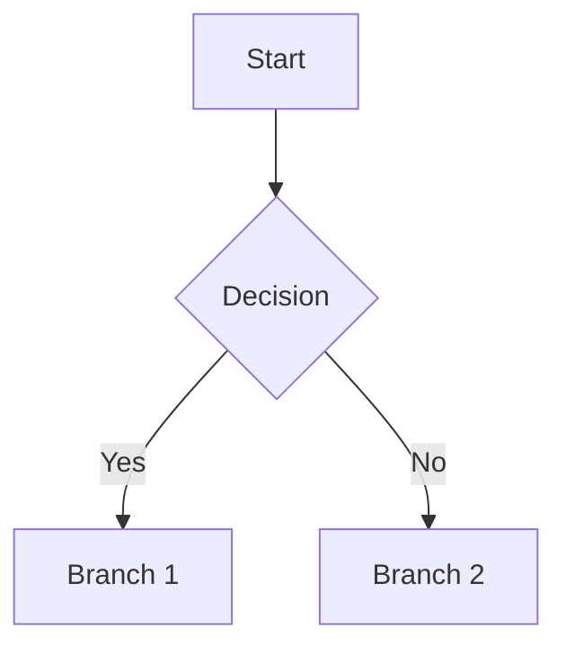

# Proposal Format (Backlog Entry)

## Contract

The final output is a single `type: backlog` document at `{pm_dir}/backlog/{topic-slug}.md`, plus a styled HTML render at `{pm_dir}/backlog/proposals/{topic-slug}.html`.

- **Schema authority:** `${CLAUDE_PLUGIN_ROOT}/references/frontmatter-schemas.md` defines all allowed frontmatter fields and enum values. No step may redefine status values, required fields, or section names.
- **Visual reference:** `${CLAUDE_PLUGIN_ROOT}/references/templates/proposal-reference.html` is the canonical HTML render. The section order, patterns, and component names below MUST match it.
- **This file** provides the markdown body template and worked example.

No other step may contradict the schema or the reference template. If a conflict is found, the schema wins for frontmatter; the reference template wins for HTML structure.

## ID Assignment

When an issue tracker is available (Linear) and a Linear issue is created or already exists for this proposal, use the Linear identifier as the local `id` (e.g., `PM-123`). Do NOT generate a separate local sequence — the Linear ID is the single source of truth. Only fall back to the local `PM-{NNN}` sequence (scan `{pm_dir}/backlog/*.md` for highest `id`, increment by 1, zero-pad to 3 digits, first entry `PM-001`) when no issue tracker is configured.

## Document shape

A finished proposal has three layers stacked top-to-bottom:

1. **Header block** — frontmatter (machine), title + lede (the outcome restated as one sentence), optional hero prototype figure, TL;DR (For / What / Why now), table of contents.
2. **Twelve numbered sections** (I–XII) — the body. Order is fixed. Roman numerals in the rendered HTML; H2 headings in the markdown.
3. **Closing** — status pipeline and next-step command.

The markdown body need not visually mimic the HTML — it just needs to carry the same information, organized under the same section headings, so the HTML renderer can produce the reference layout deterministically.

## Template

```markdown
---
type: backlog
id: "{linear_id or PM-NNN}"
title: "{Feature Title}"
outcome: "{One-sentence lede — what changes for the user when this ships. Becomes the paragraph under the H1.}"
status: drafted
priority: critical | high | medium | low
size: XS | S | M | L | XL
labels:
  - "{label}"
prd: null
rfc: null
linear_id: "{Linear ID}" | null
thinking: thinking/{topic-slug}.md | null
research_refs:
  - {pm_dir}/evidence/research/{topic-slug}.md
created: YYYY-MM-DD
updated: YYYY-MM-DD
---

## TL;DR

- **For** — {who feels the pain — primary audience, one short clause}
- **What** — {what ships — the smallest set of components needed to deliver the outcome}
- **Why now** — {the time-pressure or strategic reason this is the right quarter, not next}

{If a UI prototype exists, link it here for the markdown reader:
- Single-file: `[Prototype]({pm_dir}/backlog/wireframes/{slug}.html)`
- Multi-file (3+ screens): `[Prototype]({pm_dir}/backlog/wireframes/{slug}/index.html)`

The HTML renderer (Step 7) reads the wireframe's metadata per
`${CLAUDE_PLUGIN_ROOT}/skills/groom/references/prototype-format.md` §6 and
embeds it as a hero-prototype figure between the title block and TL;DR.
For non-visual features, omit the prototype link entirely.}

## I. Problem & Context

{Lede sentence — the pain in one line. Then 1–2 short paragraphs of evidence:
user signal, market data, strategic driver. End with a short evidence quote
in a blockquote when one exists (rendered as an `annotation` block in HTML).}

> "{Verbatim quote from research, sales evidence, or support transcript.}"
> — {source}, {date}

## II. Users & Job to be Done

**Primary JTBD.** When I {situation}, I want to {motivation}, so I can {outcome}.

**Primary persona — {short name}.** {1–2 sentence description: who they are, what they're trying to do, what hurts today.}

**Secondary persona — {short name}.** {Same shape — only include if a meaningfully different user is in scope.}

## III. Use Cases

Top 2–4 scenarios, ranked by frequency. For each:

### {NN}. {Short scenario title}
- **Trigger** — {what initiates this scenario}
- **Action** — {what the user does, what the system does}
- **Result** — {the observable outcome}

## IV. Scope

**In scope**
- {item}
- {item}

**Out of scope**
- {item} — {one-clause reason: scope creep, Phase 2, separate effort, etc.}
- {item} — {reason}

**10x filter result:** {10x | gap-fill | table-stakes | parity}

## V. Functional Requirements

What each in-scope item must support. Group by scope item (one H3 per item) and list requirements as bullets.

### 1. {Scope item name}
- {Requirement — observable behavior, not implementation detail.}
- {Requirement.}

### 2. {Scope item name}
- {Requirement.}

## VI. Edge Cases & Constraints

Boundary conditions and failure modes. Use a markdown table:

| Case | Expected handling |
|---|---|
| {Edge case} | {How the system behaves} |
| {Edge case} | {How the system behaves} |

## VII. User Flow

Mermaid flowchart in a fenced code block. Include at least one `%% Source:` citation pointing to the research finding or competitor gap that informed the flow.



For non-UI features: omit this section entirely.

## VIII. Competitive Context

Markdown comparison table — keep tight (3–5 rows):

| Tool | {Capability axis} | Approach |
|---|---|---|
| {Competitor} | {value} | {how they handle it} |
| {Competitor} | {value} | {how they handle it} |

**Handling decision.** Restate the 10x filter result from Scope and explain the rationale — why are we handling it this way given what competitors already do?
- `10x` → what makes our approach meaningfully better than theirs?
- `gap-fill` → what gap are we closing in their implementation?
- `table-stakes` → baseline expectation; no differentiation claim needed.
- `parity` → intentionally matching {competitor} — state the explicit strategic reason.

## IX. Technical Feasibility

**Verdict:** {feasible | feasible-with-caveats | needs-rearchitecting}.

**Build on:** {existing systems, libraries, or infrastructure we're extending}.

**Build new:** {what genuinely doesn't exist yet}.

**Top risks:** {2–4 short risk statements with one-clause mitigations}.

## X. Open Questions

Decisions not yet made. Each carries a recommended answer so reviewers can confirm or override quickly.

### 01. {Question}
**Recommendation:** {one or two sentences}. **Owner:** {role}. **By:** {milestone or date}.

### 02. {Question}
**Recommendation:** {…}. **Owner:** {…}. **By:** {…}.

<details>
<summary>Resolved questions ({N})</summary>

**{Question}** — {Answer, with evidence pointer if useful.}

**{Question}** — {Answer.}

</details>

## XI. Success Metrics

Leading indicators for 90-day success. Not lagging metrics like revenue.

| Metric | Baseline | Target | By |
|---|---|---|---|
| {metric} | {current} | {goal} | {timeframe} |

**Caveat.** {Optional — one short paragraph naming the assumption that, if violated, makes the metrics meaningless. E.g., "if conversion stays flat post-GA, the bottleneck is upstream — pricing or onboarding — not localization."}

## XII. Status & Next Steps

Pipeline of grooming steps completed (one row per step):

- **Intake** — {one-clause verdict}
- **Strategy check** — {one-clause verdict}
- **Research** — {one-clause verdict, with evidence file reference}
- **Scope** — {N in / M out · 10x filter result}
- **Scope review** — {PM verdict · EM verdict}
- **Team review** — {one-clause verdict, if `full` tier}
- **Bar raiser** — {verdict, if `full` tier}

Ready for engineering. Run `pm:rfc {slug}` to generate the technical RFC, then `pm:dev {slug}` to implement.

{If stale research exists, append a final note (omit otherwise):
**Freshness note.** '{name}' — {age_days} days old (threshold: {threshold_days}d for {type}). Run `pm:refresh` to update.}
```

## Section name discipline

The H2 headings in the markdown MUST be the twelve Roman-numeralled names below, in this exact order. The HTML renderer uses them as anchor IDs.

| # | Heading | HTML `id` |
|---|---|---|
| I | Problem & Context | `problem` |
| II | Users & Job to be Done | `jtbd` |
| III | Use Cases | `usecases` |
| IV | Scope | `scope` |
| V | Functional Requirements | `requirements` |
| VI | Edge Cases & Constraints | `edge` |
| VII | User Flow | `flow` |
| VIII | Competitive Context | `competitive` |
| IX | Technical Feasibility | `feasibility` |
| X | Open Questions | `open-q` |
| XI | Success Metrics | `metrics` |
| XII | Status & Next Steps | `status` |

The TL;DR block sits before Section I and has no Roman numeral — it is the document's elevator pitch, not a section.

## Status Lifecycle

| Status | Set by | Meaning |
|--------|--------|---------|
| `idea` | `pm:ideate` | Early-stage idea from KB mining, not yet groomed |
| `drafted` | `pm:groom` (draft-proposal) | Proposal assembled, under review |
| `proposed` | `pm:groom` (present/finalize) | Product-approved, awaiting engineering |
| `planned` | `pm:rfc` | RFC exists and approved, ready to build |
| `in-progress` | `pm:dev` | Implementation underway |
| `done` | `pm:dev` / `pm:ship` | All work shipped |

---

## Agent-tier source citations (PM-233)

Proposals produced by `groom_tier: agent` carry mandatory inline source citations on every derived decision. The citations live in three layers:

1. **State** — `source_citations:` block at session-state level (already in `state-schema.md`); also inline `source:` field on each scope item, persona, JTBD, edge case, risk in the synthesizer's output.
2. **Markdown proposal** — flattened to `[source: path#L42]` or `[source: path#F3]` notation, inline next to the cited claim. Example:
   ```markdown
   ## II. Users & Job to be Done

   **Primary JTBD.** When I groom a feature with KB-rich context, I want to
   skip questions about facts already documented [source: pm/strategy.md#L24],
   so I can review a complete proposal in one pass
   [source: pm/evidence/research/agent-mode-pm-tools.md#F2].
   ```
3. **HTML proposal** — small `<sup class="src">path#L42</sup>` superscript next to each cited claim, plus a collapsed `<details class="audit-block">` "Citation audit" block at the end of the proposal listing every citation in structured form.

### Citation field shape

Per RFC §5.2 (PM-233), citations are structured objects, not strings:

```yaml
source:
  file: "pm/evidence/research/agent-mode-pm-tools.md"
  line: 42                                # nullable
  finding_id: "F3"                        # nullable; for evidence files with finding markers
  excerpt: "Spark sells output, not process"   # nullable; reviewer-aid
```

State stores the structured object. Markdown render flattens to one of:
- `[source: path#L<line>]` if line is set
- `[source: path#<finding_id>]` if finding_id is set
- `[source: path]` if neither (file-level citation only)

HTML render emits the same string inside `<sup class="src">`. The audit `<details>` block at the end of the HTML lists the full structured form (file, line, finding_id, excerpt) for each citation. Audit block is collapsed by default; readers expand it to verify a specific claim.

### Citation count parity rule

The HTML proposal MUST contain at least as many `<sup class="src">` tags as the markdown contains `[source: ...]` tokens. Lower count = citation loss between layers (a real risk acknowledged in RFC §8 Risks). The 07-draft-proposal step's agent-tier subsection enforces parity by counting citations in the markdown source before HTML render and asserting the count is preserved.

### When this applies

Citations are **mandatory** for `groom_tier: agent`. Co-pilot tiers (quick / standard / full) MAY include citations but it is not required — the existing co-pilot 07-draft-proposal flow does not produce inline `[source: ...]` tokens. Step 07's "Agent-tier additions" subsection is the only place where citation rendering runs; co-pilot tiers skip it cleanly.
