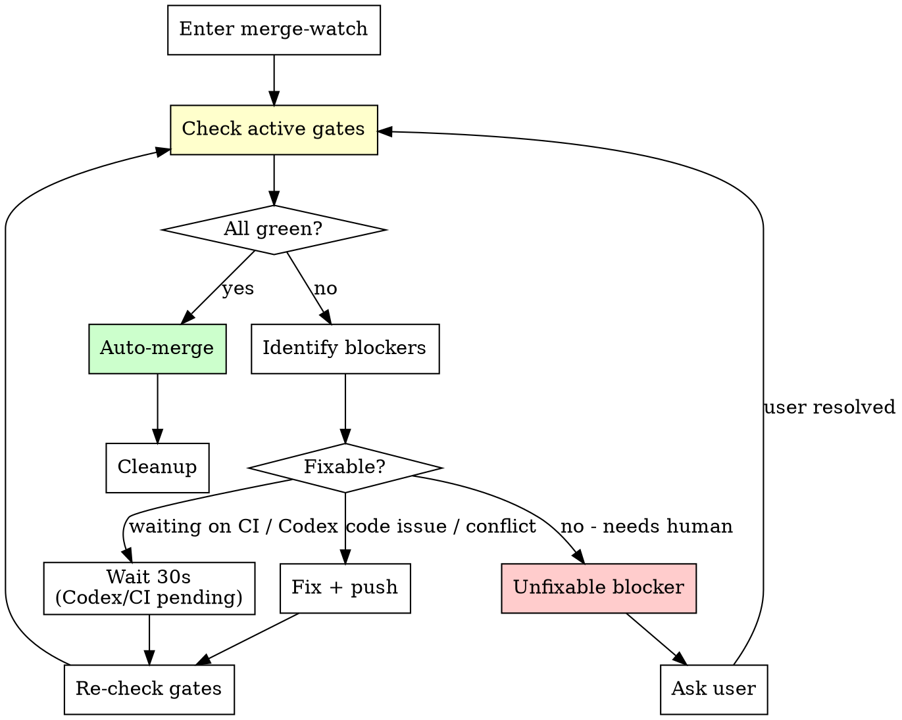

# /merge-watch [PR#]

**State file convention:** The session state file is `.pm/dev-sessions/{slug}.md` where `{slug}` comes from the current branch name (e.g., `feat/add-auth` → `.pm/dev-sessions/add-auth.md`). To find it: derive slug from `git branch --show-current`, stripping the `feat/`/`fix/`/`chore/` prefix. If no branch (detached HEAD), glob `.pm/dev-sessions/*.md` (+ legacy `.dev-state-*.md`) and use the most recently modified. References to `.dev-state.md` below mean `.pm/dev-sessions/{slug}.md`.

Continuously poll and fix a PR until all readiness gates pass, then auto-merge. **Do not stop and wait for the user.** Fix what you can, wait for external checks, and merge when ready.

## Input

If `$ARGUMENTS` contains a PR number, use that. Otherwise, read the state file for the PR number.

If neither source provides a PR number, STOP and ask the user.

For cold resume, read the state file's `## Resume Instructions` first. If present, execute that single next action before re-deriving full gate state.

---

## 5 Readiness Gates

All active gates must be true simultaneously before auto-merge:

| # | Gate | How to check | Fix action |
|---|------|-------------|------------|
| 1 | **CI passes** | `gh pr checks --json name,state,conclusion` - all conclusions are `SUCCESS` | If failures appear, diagnose and fix (max 3 rounds per cycle). |
| 2 | **Claude review done** | Verify `code-review:code-review` posted comments to PR | If not present, re-invoke `code-review:code-review`. |
| 3 | **Codex review done** | **Default: SKIP** unless `codex_review: true` in `dev/instructions.md`. When enabled: check for Codex bot comment (bot name configurable via `codex_bot_name` in instructions, default: `chatgpt-codex-connector[bot]`). 5-minute cooldown after @codex comment. | Poll both cooldown and bot response. After 15 min total, ask user: proceed without or keep waiting. |
| 4 | **No unresolved comments** | GraphQL `reviewThreads` check - zero unresolved threads | For each unresolved thread: read the comment, fix the code issue, reply explaining the fix, resolve the thread. Push fixes and re-trigger CI if code changed. |
| 5 | **No merge conflicts** | `gh pr view --json mergeStateStatus --jq .mergeStateStatus` - not `DIRTY` | Fetch and merge main: `git fetch origin main && git merge origin/main`. Resolve conflicts, run tests, commit, push. |

---

## Polling Loop



---

## Gate-check procedure

Run all active gate checks, then report status:

```
Merge-Watch Status:
  1. CI:                 [passed / running / failed]
  2. Claude review:      [posted / pending]
  3. Codex review:       [posted / pending / skipped (not configured)]
  4. Unresolved comments: [0 / N threads]
  5. Conflicts:          [clean / conflicted]

  Blocking: [list of failing gates]
  Action:   [what merge-watch will do next]
```

Update `.pm/dev-sessions/{slug}.md` with current merge-watch status at each check.

### CI Monitoring

When CI is running, use background watching instead of sleep-polling:

1. Get the current branch: `git branch --show-current`
2. Find the latest run: `gh run list --branch [branch] --limit 1 --json databaseId,status`
3. Watch in background: `gh run watch [run-id] --exit-status` (use `run_in_background: true`)
4. Continue with other gate checks while CI runs. You'll be notified when it completes.
5. When notified:
   - Exit code 0 = CI passed, update gate status
   - Non-zero = CI failed, diagnose and fix

---

## Resolving review comments (Gate 4)

1. Fetch all review comments (inline + issue-level + pending reviews)
2. For each unresolved thread:
   - **Skip** if from non-review bot (Linear, CI, dependabot) — NOT Codex
   - **Fix** if it's a concrete code finding (from Claude review, Codex, or human reviewers)
   - **Ask user** if it's a design decision, ambiguous, or you disagree with the finding
3. After fixing: reply to the comment, resolve the thread via GraphQL
4. Push fixes, which re-triggers CI (loop back to gate-check)

### Reply to inline review comments

```bash
gh api repos/{owner}/{repo}/pulls/$PR_NUMBER/comments/<comment-id>/replies \
  -X POST -f body="Fixed in <commit-sha>. <brief description>."
```

**IMPORTANT:** Do NOT use `-F in_reply_to_id=` on the top-level comments endpoint. Always use the `/replies` sub-endpoint.

### Resolve review threads via GraphQL

```bash
# 1. Get unresolved thread node IDs
gh api graphql -f query='
query {
  repository(owner: "{owner}", name: "{repo}") {
    pullRequest(number: '$PR_NUMBER') {
      reviewThreads(first: 100) {
        nodes { id isResolved }
      }
    }
  }
}' --jq '.data.repository.pullRequest.reviewThreads.nodes[] | select(.isResolved == false) | .id'

# 2. Resolve threads (batch in one mutation)
gh api graphql -f query='
mutation {
  t1: resolveReviewThread(input: {threadId: "<ID_1>"}) { thread { isResolved } }
  t2: resolveReviewThread(input: {threadId: "<ID_2>"}) { thread { isResolved } }
}'
```

---

## Auto-merge

When all active gates are green:

```bash
# 1. Final verification - re-check merge status
gh pr view --json mergeStateStatus --jq .mergeStateStatus
# Must be CLEAN or UNSTABLE (not DIRTY or BLOCKED)

# 2. Squash-merge and delete remote branch
gh pr merge --squash --delete-branch

# 3. If merge fails, report error and STOP - don't force through
```

---

## Cleanup (after successful merge)

```bash
# Detect environment
GIT_COMMON=$(git rev-parse --git-common-dir)
GIT_DIR=$(git rev-parse --git-dir)
FEATURE_BRANCH=$(git branch --show-current)

# If in worktree: switch to main repo first
if [ "$GIT_COMMON" != "$GIT_DIR" ]; then
  WORKTREE_PATH=$(pwd)
  MAIN_REPO=$(git worktree list | head -1 | awk '{print $1}')
  # Detach worktree HEAD to release branch lock
  cd "$WORKTREE_PATH" && git checkout --detach HEAD 2>/dev/null || true
  cd "$MAIN_REPO"
fi

# Update main (handle divergence from other sessions)
git fetch origin main
git checkout main
LOCAL_ONLY=$(git log --oneline origin/main..main)
if [ -n "$LOCAL_ONLY" ]; then
  echo "WARN: local main has commits not on origin/main:"
  echo "$LOCAL_ONLY"
  echo "Rebasing local main onto origin/main..."
  HAS_LOCAL_CHANGES=false
  if ! git diff --quiet || ! git diff --cached --quiet || [ -n "$(git ls-files --others --exclude-standard)" ]; then
    HAS_LOCAL_CHANGES=true
    git stash push --include-untracked -m "merge-watch-cleanup-$(date +%s)"
  fi
  if ! git rebase origin/main; then
    echo "Rebase conflict while syncing local main. Resolve conflicts manually, then rerun cleanup."
    exit 1
  fi
  if [ "$HAS_LOCAL_CHANGES" = true ] && ! git stash pop; then
    echo "Could not re-apply stashed changes cleanly. Resolve stash conflicts manually, then rerun cleanup."
    exit 1
  fi
else
  git merge --ff-only origin/main
fi

# Remove worktree if applicable
if [ -n "$WORKTREE_PATH" ]; then
  git worktree remove "$WORKTREE_PATH" 2>/dev/null || \
    git worktree remove "$WORKTREE_PATH" --force 2>/dev/null || \
    echo "WARN: Could not remove worktree at $WORKTREE_PATH. Manual cleanup needed."
fi

# Delete local feature branch
git branch -D "$FEATURE_BRANCH" 2>/dev/null || true

# Prune remote tracking refs
git fetch --prune
```

---

## Limits

| Limit | Value | On exceed |
|-------|-------|-----------|
| CI fix rounds per cycle | 3 | Stop, report failures with full context, ask user |
| Codex wait timeout | 15 min | Ask user: proceed without or keep waiting |
| Total merge-watch duration | 30 min | Report full gate status, ask user |
| Review comment fix rounds | 3 | Stop, report unresolved threads, ask user |

---

## State file during merge-watch

`.pm/dev-sessions/{slug}.md` must include:

```markdown
## Merge-Watch
- Stage: merge-watch
- PR: #N (URL)
- Gate 1 (CI): passed / running / failed (attempt N/3)
- Gate 2 (Claude review): posted
- Gate 3 (Codex review): posted / waiting / skipped (not configured)
- Gate 4 (Comments): 0 unresolved / N unresolved
- Gate 5 (Conflicts): clean / conflicted
- Fix commits: [list of fix commit SHAs]
- Elapsed: Xm

## Resume Instructions
- Next action: [single immediate step]
- Context: [PR #, gate status, unresolved thread id/file:line]
- Command: [exact command to run next]
```

---

## Critical Rules

- NEVER force-merge. If `gh pr merge` fails, STOP and report.
- NEVER skip Gate 4 (unresolved comments). Every comment from Claude review, Codex, or human reviewers must be addressed.
- After 3 CI fix attempts, ask user before continuing.
- Update `.pm/dev-sessions/{slug}.md` at every gate-check cycle.

---

---

# /merge [PR#]

Manual merge + cleanup. Use when you want to merge without the full merge-watch polling loop.

---

## Step 1: Pre-flight

### Verify branch

Run `git branch --show-current`. If on `main` or `master`:
- STOP. "You are on main. Switch to the feature branch to merge."

### Check for uncommitted changes

Run `git status --porcelain`. If dirty: STOP. "Uncommitted changes detected. Commit or stash first."

### Find the PR

Run: `gh pr view --json number,url,title,state,mergeStateStatus,statusCheckRollup`

If no PR exists: STOP. "No PR found for this branch."
If PR is not open: STOP. "PR #N is not open (state: [state])."
If `mergeStateStatus` is `BLOCKED`: Report the blocker and STOP.

---

## Step 2: Resolve PR review comments

Fetch all review comments. For each unresolved thread:
- **Skip** non-review bots (Linear, CI, dependabot)
- **Fix** concrete code findings (Claude review, Codex, human reviewers)
- **Ask user** for design decisions or ambiguous findings

Apply fixes, run tests, commit, push. Reply to each comment and resolve threads via GraphQL.

<HARD-GATE>
Do NOT proceed to merge until every review thread is resolved.
Zero unresolved threads before merge.
</HARD-GATE>

---

## Step 3: Merge the PR

```bash
gh pr merge --squash --delete-branch
```

If merge fails: Report the error and STOP.

---

## Step 4: Verify remote branch deletion

```bash
git ls-remote --heads origin "$FEATURE_BRANCH"
```

If still exists: `git push origin --delete "$FEATURE_BRANCH"`. If that fails too, report but continue.

---

## Step 5: Local cleanup

Same cleanup procedure as merge-watch (detect worktree, switch to main, pull, remove worktree, delete branch, prune).

---

## Step 6: Update issue tracker

If the PR title or branch name contains an issue identifier and an issue tracker is configured (Linear/Jira via MCP): mark the issue as Done.

---

## Final Report

```
## Merged

**PR:** #N — [title]
**Merged to:** main ([short sha])
**Remote branch:** [branch] — deleted / failed
**Local branch:** [branch] — deleted
**Worktree:** [removed at path / n/a]
**Issue tracker:** [issue] → Done / no issue linked
```

---

## Critical Rules

- NEVER merge with unresolved review threads
- NEVER force-remove a worktree without asking the user
- Always `cd` to main repo BEFORE removing a worktree
- Always verify the remote branch was actually deleted after merge
- Always pull main after merge
- Always prune remote tracking refs
- If merge fails, do NOT proceed to cleanup
