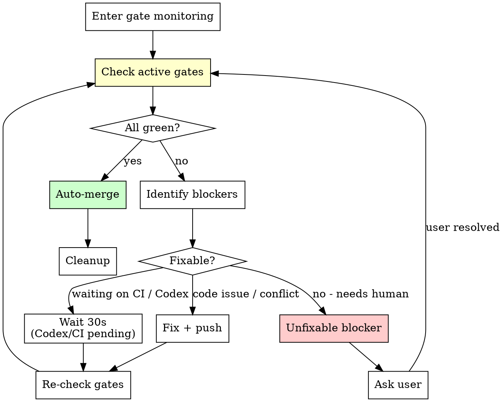

# /ship

**State file convention:** The session state file is `.pm/dev-sessions/{slug}.md` where `{slug}` comes from the current branch name (e.g., `feat/add-auth` → `.pm/dev-sessions/add-auth.md`). To find it: derive slug from `git branch --show-current`, stripping the `feat/`/`fix/`/`chore/` prefix. If not found, check legacy path `.dev-state-{slug}.md`. References to `.dev-state.md` below mean `.pm/dev-sessions/{slug}.md`.

Complete shipping lifecycle in one command: review, push, create PR, monitor CI, poll readiness gates, and auto-merge.

**Also handles existing PRs.** If a PR already exists for the current branch, ship skips creation and jumps straight to gate monitoring — resolving review comments, fixing CI failures, and iterating until the PR is mergeable. Use this when you need to babysit a PR to completion.

## Default Branch

Read `{DEFAULT_BRANCH}` from `.pm/dev-sessions/{slug}.md` if available. Otherwise detect:

```bash
DEFAULT_BRANCH=$(git symbolic-ref refs/remotes/origin/HEAD 2>/dev/null | sed 's@^refs/remotes/origin/@@')
[ -z "$DEFAULT_BRANCH" ] && DEFAULT_BRANCH=$(git remote show origin 2>/dev/null | grep 'HEAD branch' | awk '{print $NF}')
[ -z "$DEFAULT_BRANCH" ] && DEFAULT_BRANCH="main"  # fallback only
```

All git commands below use `{DEFAULT_BRANCH}` — never hardcode `main`.

---

# Phase 1: PR Preparation

## Step 1: Pre-flight

### Verify branch

Run `git branch --show-current`. If on `{DEFAULT_BRANCH}`:
- STOP. Report: "You are on {DEFAULT_BRANCH}. Create a feature branch first."

### Check for uncommitted changes

Run `git status --porcelain`.

If there are uncommitted changes:
1. Show the user what's changed: `git diff --stat`
2. Stage related files (NOT `git add -A` — be selective)
3. Commit with a descriptive message based on the changes

If working tree is clean, continue.

---

## Step 2: Check & Fix Conflicts

### Check if branch is behind {DEFAULT_BRANCH}

Run: `git fetch origin {DEFAULT_BRANCH} && git log HEAD..origin/{DEFAULT_BRANCH} --oneline`

**If no output:** Branch is up to date with {DEFAULT_BRANCH}. Continue to Step 3.

**If there are commits behind:**

1. Merge {DEFAULT_BRANCH} into the branch:
   ```bash
   git merge origin/{DEFAULT_BRANCH}
   ```

2. **If merge succeeds cleanly:** Continue to Step 3.

3. **If merge has conflicts:**
   - Run `git diff --name-only --diff-filter=U` to list conflicted files
   - **If a lockfile is conflicted** (`pnpm-lock.yaml`, `yarn.lock`, `Gemfile.lock`, `package-lock.json`): Accept either side, then regenerate with the project's install command (from AGENTS.md or convention detection). Do NOT manually resolve lockfile conflicts.
   - For each other conflicted file:
     - Read the file and understand both sides of the conflict
     - Resolve the conflict preserving the intent of both changes
     - Stage the resolved file: `git add [file]`
   - Commit the merge: `git commit -m "merge: resolve conflicts with {DEFAULT_BRANCH}"`
   - Run relevant verification commands for the resolved files (see AGENTS.md)
   - If tests fail after resolution, fix and amend the merge commit

---

## Step 3: Review

**Skip if already reviewed:** Check `.pm/dev-sessions/*.md` for the current branch. If the state file shows `Review gate: passed` and no new commits exist since that review (compare commit SHA), skip this step and proceed to push. Log: "Review gate already passed in dev session — skipping."

**Otherwise:** Run the `/review` command in branch mode (no PR number argument):

```
Invoke /review (no arguments — it will diff current branch against the default branch)
```

This runs review agents in parallel, auto-fixes all findings, and commits fixes.

Code review is skipped at this stage (no PR exists yet).

If `/review` reports "No changes to review", stop — there's nothing to push.

---

## Step 4: Push

### Pre-push hook preparation

Read AGENTS.md for any pre-push hook setup commands the project requires. Common patterns:
- API spec generation (e.g., OpenAPI/Swagger spec must be up to date)
- E2E environment (simulator/emulator must be running for mobile E2E hooks)
- Build artifacts (shared packages must be built in monorepos)

Run any documented setup commands before pushing.

### Attempt push

Run `git push`. If no upstream tracking branch exists, use `git push -u origin HEAD`.

### Handle result

**If push succeeds:** Continue to Step 5.

**If push fails due to hooks:**

Parse the hook error output generically — do NOT rely on hardcoded hook names. Diagnose from the error message.

**First: check if failures are pre-existing on {DEFAULT_BRANCH}.**

```bash
# Use a temporary worktree to check {DEFAULT_BRANCH} without stashing (avoids blind stash recovery)
git worktree add /tmp/check-default-$$ {DEFAULT_BRANCH} --quiet
cd /tmp/check-default-$$
# Run the same command that failed in the hook (test suite, lint, etc.)
# If it ALSO fails on {DEFAULT_BRANCH}: these are pre-existing failures, not caused by this branch
cd -
git worktree remove /tmp/check-default-$$ --force 2>/dev/null || true
```

**If failures are pre-existing (also fail on {DEFAULT_BRANCH}):**
1. Fix them in a separate commit with message: `fix: resolve pre-existing {test/lint/spec} failures`
2. This is not optional. Pre-existing failures still block the push and must be fixed.
3. Check AGENTS.md for common pre-push setup (e.g., `bin/sync-api --spec` for API spec generation, `pnpm build` for shared packages in monorepos). Run these first as they often resolve pre-existing issues.

**If failures are new (pass on {DEFAULT_BRANCH}, fail on branch):**
- Fix the issue (missing build artifact, failing test, lint error)
- Re-commit if needed: `git commit --amend` or new fix commit

**In both cases:** Retry push (max 3 attempts).

After 3 failed push attempts: stop, report the error details with actionable diagnosis, ask user for guidance.

NEVER use `--no-verify` to bypass hook failures. All failures must be fixed.

**If push fails for other reasons** (auth, network, etc.): Report the error and stop.

---

## Step 5: Create or Detect PR

### Check for existing PR

Run: `gh pr view --json number,url,title,state 2>/dev/null`

**If PR exists and is open:**
- Report: "PR #N already exists: [URL]"
- Continue to Step 6

**If no PR exists:**

1. Get context for PR description:
   - `git log {DEFAULT_BRANCH}..HEAD --oneline` for commit summary
   - `git diff {DEFAULT_BRANCH}...HEAD --stat` for files changed

2. Create the PR:
   ```
   gh pr create --title "[descriptive title]" --body "$(cat <<'EOF'
   ## Summary
   [2-3 bullet points from commit log]

   ## Test plan
   - [ ] Verify [key behavior 1]
   - [ ] Verify [key behavior 2]
   EOF
   )"
   ```

3. Report the PR URL

4. **Request Codex review (if configured):**
   Check `dev/instructions.md` for `codex_review: true`. If enabled:
   ```bash
   gh pr comment $PR_NUMBER --body "@codex review"
   ```
   Default: skip Codex review request unless explicitly enabled.

---

## Step 6: Code Review

Now that a PR exists, run the official code review skill:

```
Invoke the Skill tool: skill: "code-review:code-review", args: "[PR_NUMBER]"
```

This posts findings as GitHub PR comments. No auto-fix needed — the findings are for the reviewer to see.

---

## Step 7: Monitor CI + Auto-fix (Pre-Merge)

### Watch CI run

1. Get the current branch: `git branch --show-current`
2. Find the latest run: `gh run list --branch [branch] --limit 1 --json databaseId,status`
3. Watch in background: `gh run watch [run-id] --exit-status` (use `run_in_background: true`)
4. Continue with other work while CI runs. You'll be notified when it completes.
5. When notified:
   - Exit code 0 = success, proceed to Phase 2
   - Non-zero = failure, proceed to "Handle CI result" below

### Handle CI result

**If conclusion is "success":** Continue to Phase 2 (Gate Monitoring).

**If conclusion is "failure", "timed_out", or "cancelled":**

1. Get failed logs: `gh run view [run-id] --log-failed`
2. Categorize failures: test failures, lint errors, build errors, security issues
3. Fix each issue using project-appropriate tools (check AGENTS.md for lint/fix commands)
4. Commit fixes with descriptive message
5. Push: `git push`
6. Return to polling (Step 7, top)

### Retry limit

**Max 3 CI fix attempts.** After 3 rounds: stop, report failures with full context, ask user whether to continue or investigate manually.

---

# Phase 2: Gate Monitoring & Auto-Merge

Continuously poll and fix the PR until all readiness gates pass, then auto-merge. **Do not stop and wait for the user.** Fix what you can, wait for external checks, and merge when ready.

## 5 Readiness Gates

All active gates must be true simultaneously before auto-merge:

| # | Gate | How to check | Fix action |
|---|------|-------------|------------|
| 1 | **CI passes** | `gh pr checks --json name,state,conclusion` - all conclusions are `SUCCESS` | If failures appear, diagnose and fix (max 3 rounds per cycle). |
| 2 | **Claude review done** | Verify `code-review:code-review` posted comments to PR | If not present, re-invoke `code-review:code-review`. |
| 3 | **Codex review done** | **Default: SKIP** unless `codex_review: true` in `dev/instructions.md`. When enabled: check for Codex bot comment (bot name configurable via `codex_bot_name` in instructions, default: `chatgpt-codex-connector[bot]`). 5-minute cooldown after @codex comment. | Poll both cooldown and bot response. After 15 min total, ask user: proceed without or keep waiting. |
| 4 | **No unresolved comments** | GraphQL `reviewThreads` check - zero unresolved threads | For each unresolved thread: read the comment, fix the code issue, reply explaining the fix, resolve the thread. Push fixes and re-trigger CI if code changed. |
| 5 | **No merge conflicts** | `gh pr view --json mergeStateStatus --jq .mergeStateStatus` - not `DIRTY` | Fetch and merge {DEFAULT_BRANCH}: `git fetch origin {DEFAULT_BRANCH} && git merge origin/{DEFAULT_BRANCH}`. Resolve conflicts, run tests, commit, push. |

---

## Polling Loop



---

## Gate-check procedure

Run all active gate checks, then report status:

```
Ship Status:
  1. CI:                 [passed / running / failed]
  2. Claude review:      [posted / pending]
  3. Codex review:       [posted / pending / skipped (not configured)]
  4. Unresolved comments: [0 / N threads]
  5. Conflicts:          [clean / conflicted]

  Blocking: [list of failing gates]
  Action:   [what ship will do next]
```

Update `.pm/dev-sessions/{slug}.md` with current status at each check.

### CI Monitoring

When CI is running, use background watching instead of sleep-polling:

1. Get the current branch: `git branch --show-current`
2. Find the latest run: `gh run list --branch [branch] --limit 1 --json databaseId,status`
3. Watch in background: `gh run watch [run-id] --exit-status` (use `run_in_background: true`)
4. Continue with other gate checks while CI runs. You'll be notified when it completes.
5. When notified:
   - Exit code 0 = CI passed, update gate status
   - Non-zero = CI failed, diagnose and fix

---

## Resolving review comments (Gate 4)

1. Fetch all review comments (inline + issue-level + pending reviews)
2. For each unresolved thread:
   - **Skip** if from non-review bot (Linear, CI, dependabot) — NOT Codex
   - **Fix** if it's a concrete code finding (from Claude review, Codex, or human reviewers)
   - **Ask user** if it's a design decision, ambiguous, or you disagree with the finding
3. After fixing: reply to the comment, resolve the thread via GraphQL
4. Push fixes, which re-triggers CI (loop back to gate-check)

---

## Auto-merge

When all active gates are green:

```bash
# 1. Final verification - re-check merge status
gh pr view --json mergeStateStatus --jq .mergeStateStatus
# Must be CLEAN or UNSTABLE (not DIRTY or BLOCKED)

# 2. Squash-merge and delete remote branch
gh pr merge --squash --delete-branch

# 3. If merge fails, report error and STOP - don't force through
```

---

## Cleanup (after successful merge)

```bash
# Detect environment
GIT_COMMON=$(git rev-parse --git-common-dir)
GIT_DIR=$(git rev-parse --git-dir)
FEATURE_BRANCH=$(git branch --show-current)

# If in worktree: switch to main repo first
if [ "$GIT_COMMON" != "$GIT_DIR" ]; then
  WORKTREE_PATH=$(pwd)
  MAIN_REPO=$(git worktree list | head -1 | awk '{print $1}')
  # Detach worktree HEAD to release branch lock
  cd "$WORKTREE_PATH" && git checkout --detach HEAD 2>/dev/null || true
  cd "$MAIN_REPO"
fi

# Update {DEFAULT_BRANCH} (handle divergence from other sessions)
git fetch origin {DEFAULT_BRANCH}
git checkout {DEFAULT_BRANCH}
LOCAL_ONLY=$(git log --oneline origin/{DEFAULT_BRANCH}..{DEFAULT_BRANCH})
if [ -n "$LOCAL_ONLY" ]; then
  echo "WARN: local {DEFAULT_BRANCH} has commits not on origin/{DEFAULT_BRANCH}:"
  echo "$LOCAL_ONLY"
  echo "Rebasing local {DEFAULT_BRANCH} onto origin/{DEFAULT_BRANCH}..."
  HAS_WIP=false
  if ! git diff --quiet || ! git diff --cached --quiet || [ -n "$(git ls-files --others --exclude-standard)" ]; then
    HAS_WIP=true
    git add -A
    git commit -m "WIP: ship-cleanup temp commit"
  fi
  if ! git rebase origin/{DEFAULT_BRANCH}; then
    echo "Rebase conflict while syncing local {DEFAULT_BRANCH}. Resolve conflicts manually, then rerun cleanup."
    exit 1
  fi
  if [ "$HAS_WIP" = true ]; then
    git reset --soft HEAD~1
  fi
else
  git merge --ff-only origin/{DEFAULT_BRANCH}
fi

# Remove worktree if applicable
if [ -n "$WORKTREE_PATH" ]; then
  git worktree remove "$WORKTREE_PATH" 2>/dev/null || \
    git worktree remove "$WORKTREE_PATH" --force 2>/dev/null || \
    echo "WARN: Could not remove worktree at $WORKTREE_PATH. Manual cleanup needed."
fi

# Delete local feature branch
git branch -D "$FEATURE_BRANCH" 2>/dev/null || true

# Prune remote tracking refs
git fetch --prune
```

---

## State file during gate monitoring

`.pm/dev-sessions/{slug}.md` must include:

```markdown
## Ship
- Stage: gate-monitoring
- PR: #N (URL)
- Gate 1 (CI): passed / running / failed (attempt N/3)
- Gate 2 (Claude review): posted
- Gate 3 (Codex review): posted / waiting / skipped (not configured)
- Gate 4 (Comments): 0 unresolved / N unresolved
- Gate 5 (Conflicts): clean / conflicted
- Fix commits: [list of fix commit SHAs]
- Elapsed: Xm

## Resume Instructions
- Next action: [single immediate step]
- Context: [PR #, gate status, unresolved thread id/file:line]
- Command: [exact command to run next]
```

---

## Final Report

```
## Shipped

**PR:** #N — [title] ([URL])
**Branch:** [branch name]
**Review:** [N issues found and fixed by review agents]
**Code Review:** [posted to PR]
**CI:** [passed after N rounds]
**Merged to:** {DEFAULT_BRANCH} ([short sha])
**Remote branch:** [branch] — deleted
**Local branch:** [branch] — deleted
**Worktree:** [removed at path / n/a]
```

---

## GitHub Review Comment API Reference

### Reply to inline review comments

Use the `/replies` sub-endpoint on the specific comment ID:

```bash
gh api repos/{owner}/{repo}/pulls/$PR_NUMBER/comments/<comment-id>/replies \
  -X POST -f body="Fixed in <commit-sha>. <brief description>."
```

**IMPORTANT:** Do NOT use `-F in_reply_to_id=` on the top-level comments endpoint — it returns 422. Always use the `/replies` sub-endpoint.

### Resolve review threads via GraphQL

```bash
# 1. Get unresolved thread node IDs
gh api graphql -f query='
query {
  repository(owner: "{owner}", name: "{repo}") {
    pullRequest(number: '$PR_NUMBER') {
      reviewThreads(first: 100) {
        nodes { id isResolved }
      }
    }
  }
}' --jq '.data.repository.pullRequest.reviewThreads.nodes[] | select(.isResolved == false) | .id'

# 2. Resolve threads (batch in one mutation)
gh api graphql -f query='
mutation {
  t1: resolveReviewThread(input: {threadId: "<ID_1>"}) { thread { isResolved } }
  t2: resolveReviewThread(input: {threadId: "<ID_2>"}) { thread { isResolved } }
}'
```

---

## Limits

| Limit | Value | On exceed |
|-------|-------|-----------|
| CI fix rounds per cycle | 3 | Stop, report failures with full context, ask user |
| Codex wait timeout | 15 min | Ask user: proceed without or keep waiting |
| Total gate monitoring duration | 30 min | Report full gate status, ask user |
| Review comment fix rounds | 3 | Stop, report unresolved threads, ask user |
| Push attempts | 3 | Stop, report error, ask user for guidance |

---

## Critical Rules

- NEVER use `--no-verify`. All hook failures must be fixed, no exceptions.
- NEVER commit to {DEFAULT_BRANCH} directly
- NEVER force-merge. If `gh pr merge` fails, STOP and report.
- NEVER merge while CI checks are in progress or failing. Wait for all checks to complete, investigate failures, and confirm they are pre-existing/unrelated before merging. Flag failures to the user.
- NEVER skip Gate 4 (unresolved comments). Every comment from Claude review, Codex, or human reviewers must be addressed.
- After 3 CI fix attempts, ask user before continuing.
- Update `.pm/dev-sessions/{slug}.md` at every gate-check cycle.
- If `/review` reports no changes, stop — there's nothing to ship.
- NEVER skip the review step — it catches issues before they hit CI.

---

---

# /merge [PR#]

Manual merge + cleanup. Use when you want to merge without the full gate monitoring loop.

---

## Step 1: Pre-flight

### Verify branch

Run `git branch --show-current`. If on `{DEFAULT_BRANCH}`:
- STOP. "You are on {DEFAULT_BRANCH}. Switch to the feature branch to merge."

### Check for uncommitted changes

Run `git status --porcelain`. If dirty: STOP. "Uncommitted changes detected. Commit or stash first."

### Find the PR

Run: `gh pr view --json number,url,title,state,mergeStateStatus,statusCheckRollup`

If no PR exists: STOP. "No PR found for this branch."
If PR is not open: STOP. "PR #N is not open (state: [state])."
If `mergeStateStatus` is `BLOCKED`: Report the blocker and STOP.

---

## Step 2: Resolve PR review comments

Fetch all review comments. For each unresolved thread:
- **Skip** non-review bots (Linear, CI, dependabot)
- **Fix** concrete code findings (Claude review, Codex, human reviewers)
- **Ask user** for design decisions or ambiguous findings

Apply fixes, run tests, commit, push. Reply to each comment and resolve threads via GraphQL.

<HARD-GATE>
Do NOT proceed to merge until every review thread is resolved.
Zero unresolved threads before merge.
</HARD-GATE>

---

## Step 3: Merge the PR

```bash
gh pr merge --squash --delete-branch
```

If merge fails: Report the error and STOP.

---

## Step 4: Verify remote branch deletion

```bash
git ls-remote --heads origin "$FEATURE_BRANCH"
```

If still exists: `git push origin --delete "$FEATURE_BRANCH"`. If that fails too, report but continue.

---

## Step 5: Local cleanup

Same cleanup procedure as Phase 2 (detect worktree, switch to {DEFAULT_BRANCH}, pull, remove worktree, delete branch, prune).

---

## Step 6: Update issue tracker

If the PR title or branch name contains an issue identifier and an issue tracker is configured (Linear/Jira via MCP): mark the issue as Done.

---

## Final Report

```
## Merged

**PR:** #N — [title]
**Merged to:** {DEFAULT_BRANCH} ([short sha])
**Remote branch:** [branch] — deleted / failed
**Local branch:** [branch] — deleted
**Worktree:** [removed at path / n/a]
**Issue tracker:** [issue] → Done / no issue linked
```

---

## Critical Rules

- NEVER merge with unresolved review threads
- NEVER force-remove a worktree without asking the user
- Always `cd` to main repo BEFORE removing a worktree
- Always verify the remote branch was actually deleted after merge
- Always pull {DEFAULT_BRANCH} after merge
- Always prune remote tracking refs
- If merge fails, do NOT proceed to cleanup
